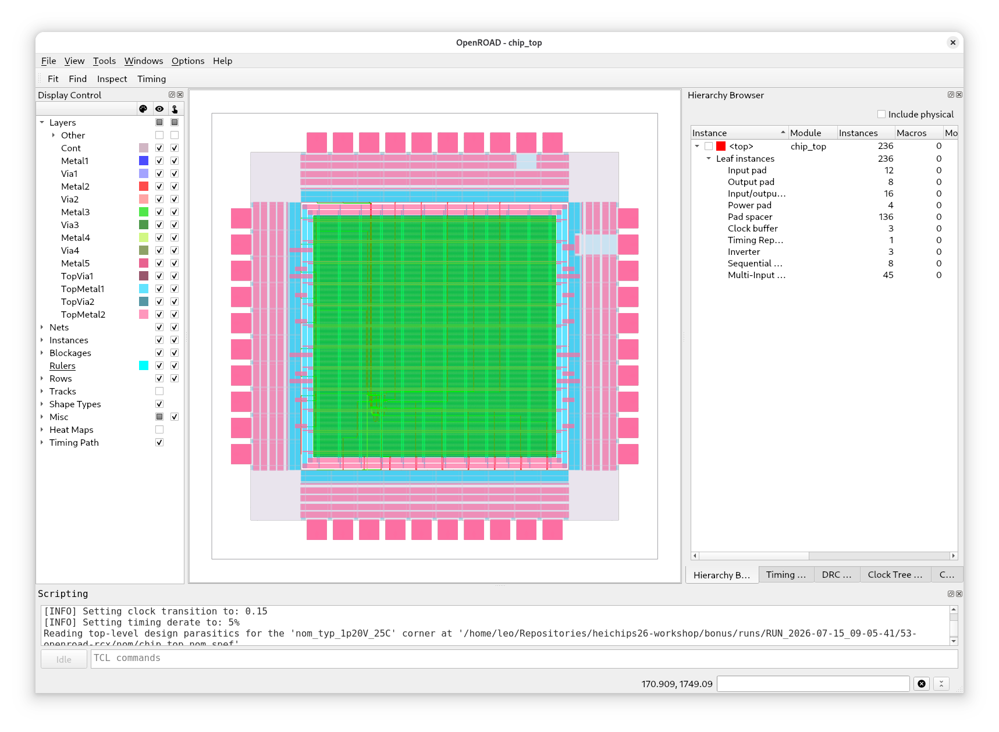
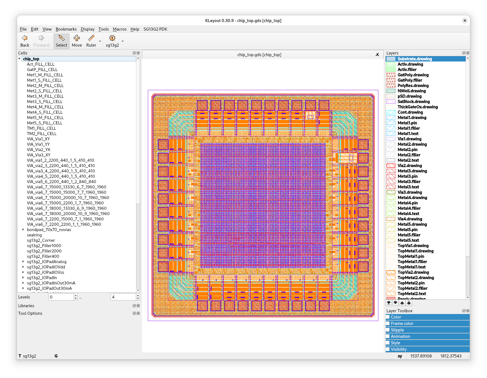

# Bonus Exercise - Full Chip Design

In order to create a full chip design we need to perform a number of additional steps.

- [OpenROAD.PadRing](https://librelane.readthedocs.io/en/stable/reference/step_config_vars.html#step-openroad-padring): Generates the pad ring itself using OpenROAD.
- [KLayout.SealRing](https://librelane.readthedocs.io/en/stable/reference/step_config_vars.html#step-klayout-sealring): Generates a seal ring around the chip for supported PDKs.
- [KLayout.Filler](https://librelane.readthedocs.io/en/stable/reference/step_config_vars.html#filler-generation): Generates the filler cells using KLayout for supported PDKs.
- [Magic.Filler](https://librelane.readthedocs.io/en/stable/reference/step_config_vars.html#step-magic-filler): Generates the filler cells using magic for supported PDKs.
- [KLayout.Density](https://librelane.readthedocs.io/en/stable/reference/step_config_vars.html#step-klayout-density): Performs a density check on the final GDSII for supported PDKs.

These steps are part of the LibreLane [Chip](https://librelane.readthedocs.io/en/stable/reference/flows.html#chip) flow.

The selected flow is specified at the top of the LibreLane configuration file (`config.yaml`).

## Running the Flow

Now just run the flow:

```
librelane config.yaml --pdk ihp-sg13g2
```

You should see the antenna checks and LVS passing. DRC is skipped for now.

## Viewing in OpenROAD GUI

Open the design in OpenROAD GUI:

```
librelane --pdk ihp-sg13g2 config.yaml --last-run --flow OpenInOpenROAD
```

The result should be something like this:



## Viewing in KLayout

You can also view the chip layout in KLayout:

```
librelane --pdk ihp-sg13g2 config.yaml --last-run --flow OpenInKLayout
```

The result should be something like this:



## Conclusion

Congrats! 🎉
You have implemented a full chip design ready for tapeout.

Feel free to edit `src/chip_core.sv` to add your own design to the chip.
