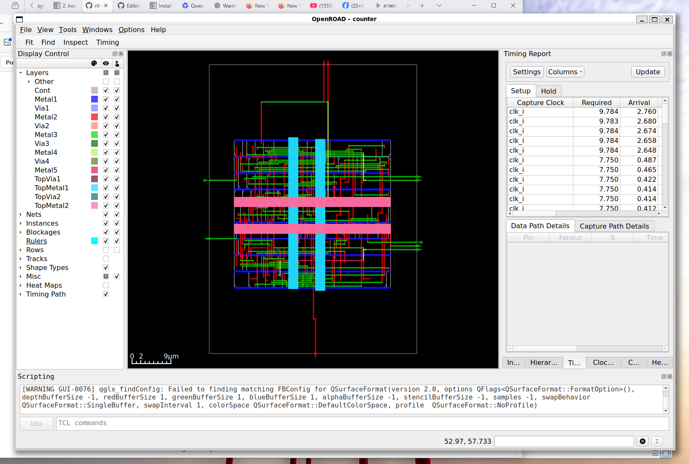
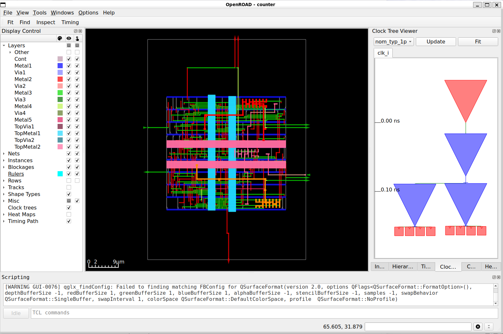
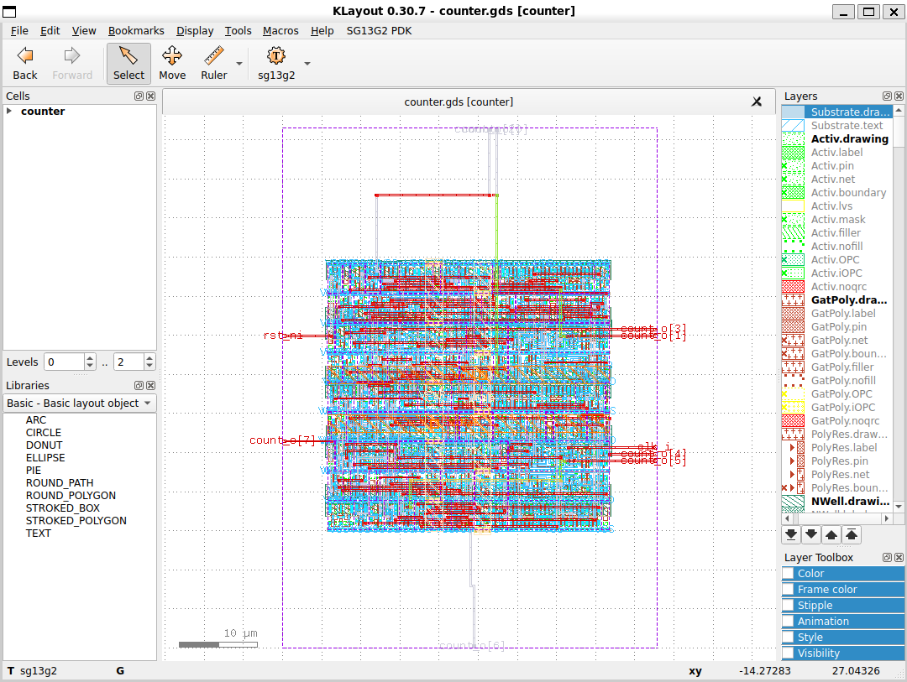

# Lab 3 First RTL-to-GDSII Implementation

## การนำวงจร Counter จาก SystemVerilog ไปเป็น GDSII ด้วย LibreLane และ IHP SG13G2

---

## 3.1 วัตถุประสงค์ของบทปฏิบัติการ

บทปฏิบัติการนี้เป็นการนำวงจรดิจิทัลที่เขียนด้วย SystemVerilog ผ่านกระบวนการออกแบบทางกายภาพแบบอัตโนมัติ หรือ **RTL-to-GDSII Flow** ด้วย LibreLane

เมื่อเสร็จสิ้นบทปฏิบัติการ ผู้เรียนควรสามารถ:

1. อธิบายลำดับขั้นตอนหลักของ RTL-to-GDSII flow ได้
2. ตรวจสอบความถูกต้องเบื้องต้นของ RTL ก่อนเริ่ม physical design
3. สร้างไฟล์กำหนดค่า `config.yaml` สำหรับ LibreLane
4. เลือกใช้ PDK `ihp-sg13g2`
5. รัน LibreLane Classic Flow ตั้งแต่ synthesis จนถึง signoff
6. ตรวจสอบ log, warning, error, metrics และผลลัพธ์ของแต่ละขั้นตอน
7. เปิดฐานข้อมูล physical design ด้วย OpenROAD GUI
8. เปิดไฟล์ GDSII ด้วย KLayout
9. ตรวจสอบผลการทำ DRC, LVS และ antenna checks
10. ระบุตำแหน่งของไฟล์ netlist, DEF, ODB, SDF, SPEF และ GDSII
11. วิเคราะห์ความสัมพันธ์ระหว่าง RTL, synthesized netlist และ physical layout
12. จัดทำรายงานผลการทดลอง RTL-to-GDSII เบื้องต้นได้

---

## 3.2 ผลลัพธ์ที่คาดหวัง

เมื่อจบ Lab นี้ ผู้เรียนจะได้ผลลัพธ์สำคัญดังต่อไปนี้

- RTL ของวงจร Counter ขนาด 8 บิต
- Gate-level netlist หลัง logic synthesis
- Floorplan ของวงจร
- Placement ของ standard cells
- Clock tree
- Routed layout
- Timing reports
- DRC reports
- LVS reports
- Antenna reports
- ไฟล์ DEF
- ไฟล์ OpenDB หรือ ODB
- ไฟล์ GDSII
- ไฟล์ Verilog netlist สำหรับ signoff
- ไฟล์ SDF และ SPEF สำหรับ timing analysis

---

## 3.3 ภาพรวม RTL-to-GDSII Flow

กระบวนการ RTL-to-GDSII เปลี่ยนคำอธิบายวงจรระดับ Register Transfer Level ให้เป็นข้อมูลรูปทรงเรขาคณิตของชั้นวัสดุต่าง ๆ ที่ใช้ผลิตวงจรรวม

ลำดับโดยสรุปคือ

.png)


LibreLane ทำหน้าที่เป็น flow controller โดยเรียกใช้เครื่องมือ open-source หลายรายการ เช่น

- Yosys สำหรับ logic synthesis
- ABC สำหรับ technology mapping และ logic optimization
- OpenROAD สำหรับ floorplanning, placement, CTS และ routing
- OpenSTA สำหรับ static timing analysis
- KLayout สำหรับจัดการ layout และ physical verification บางส่วน
- Magic สำหรับ layout verification
- Netgen สำหรับ LVS

ใน repository ตัวอย่าง LibreLane ใช้ Classic Flow ซึ่งประกอบด้วยขั้นตอนย่อย เช่น `Yosys.Synthesis`, `OpenROAD.Floorplan` และ `OpenROAD.GlobalPlacement` ก่อนดำเนินต่อไปจนถึง signoff  


---

## 3.4 วงจรที่ใช้ในบทปฏิบัติการ

วงจรที่ใช้คือ Counter ขนาด 8 บิต มีสัญญาณดังนี้

| Port | ทิศทาง | ขนาด | หน้าที่ |
|---|---:|---:|---|
| `clk_i` | Input | 1 บิต | Clock input |
| `rst_ni` | Input | 1 บิต | Active-low synchronous reset |
| `count_o` | Output | 8 บิต | ค่าปัจจุบันของ Counter |

พฤติกรรมของวงจรคือ

- เมื่อเกิดขอบขาขึ้นของ `clk_i`
- ถ้า `rst_ni = 0` ให้กำหนด `count_o = 0`
- ถ้า `rst_ni = 1` ให้เพิ่มค่า Counter ทีละหนึ่ง
- เมื่อ Counter มีค่า `8'hFF` และเพิ่มอีกหนึ่งครั้ง ค่าจะวนกลับเป็น `8'h00`

RTL ต้นฉบับใน repository ใช้ Counter 8 บิตและ synchronous active-low reset ตามโครงสร้างดังกล่าว  

---

# ส่วนที่ 1 การเตรียมสภาพแวดล้อม

## 3.5 เข้าไปยัง repository

เปิด Terminal แล้วตรวจสอบตำแหน่งปัจจุบัน

```bash
pwd
```

กรณียังไม่ได้ดาวน์โหลด repository ให้ใช้คำสั่ง

```bash
git clone https://github.com/chumnarn/heichips26-digital-workshop.git
```

เข้าไปยัง repository

```bash
cd heichips26-digital-workshop
```

ตรวจสอบไฟล์และโฟลเดอร์

```bash
ls -la
```

ควรเห็นโครงสร้างโดยประมาณดังนี้

```text
heichips26-digital-workshop/
├── bonus/
├── exercise_1/
├── exercise_2/
├── exercise_3/
├── exercise_4/
├── exercise_5/
├── flake.lock
├── flake.nix
├── shell.nix
└── README.md
```

repository ระบุให้เปิดสภาพแวดล้อมเครื่องมือด้วย `nix-shell` ที่ root directory และต้องทำใหม่เมื่อเปิด shell ใหม่  

---

## 3.6 เปิด Nix development environment

จาก root directory ของ repository ให้รัน

```bash
nix-shell
```

รอจน prompt ของ Terminal เปลี่ยนไป แสดงว่าเข้าสู่ environment ที่มีเครื่องมือแล้ว

ตรวจสอบ LibreLane

```bash
librelane --version
```

ตรวจสอบ OpenROAD

```bash
openroad -version
```

ตรวจสอบ Yosys

```bash
yosys -V
```

ตรวจสอบ KLayout

```bash
klayout -v
```

ตรวจสอบ Magic

```bash
magic --version
```

หมายเหตุ: คำสั่งแสดง version อาจแตกต่างกันเล็กน้อยตามรุ่นของเครื่องมือ หากคำสั่งใดไม่ทำงาน ให้ตรวจสอบว่าได้รัน `nix-shell` จาก root directory ของ repository แล้ว

---

## 3.7 เข้าไปยังไดเรกทอรีของการทดลอง

```bash
cd exercise_1
```

ตรวจสอบไฟล์

```bash
ls -la
```

ควรพบไฟล์หลัก

```text
README.md
config.yaml
counter.sv
img/
```

ตรวจสอบตำแหน่งปัจจุบัน

```bash
pwd
```

---

# ส่วนที่ 2 การตรวจสอบ RTL

## 3.8 เปิดไฟล์ `counter.sv`

ตรวจสอบเนื้อหาไฟล์

```bash
cat counter.sv
```

เนื้อหา RTL คือ

```systemverilog
// A simple 8-bit counter
module counter (
    input  logic       clk_i,
    input  logic       rst_ni,
    output logic [7:0] count_o
);

    always_ff @(posedge clk_i) begin
        if (!rst_ni) begin
            count_o <= '0;
        end else begin
            count_o <= count_o + 1;
        end
    end

endmodule
```

---

## 3.9 วิเคราะห์ RTL ทีละส่วน

### 3.9.1 การประกาศโมดูล

```systemverilog
module counter (
```

ชื่อ top-level module คือ `counter`

ชื่อดังกล่าวต้องตรงกับค่าของ `DESIGN_NAME` ใน `config.yaml` ทุกตัวอักษร รวมถึงตัวพิมพ์เล็กและตัวพิมพ์ใหญ่

---

### 3.9.2 Clock input

```systemverilog
input logic clk_i,
```

`clk_i` เป็นสัญญาณ clock หลักของวงจร

ชื่อ port นี้ต้องตรงกับค่าของ `CLOCK_PORT` ใน `config.yaml`

---

### 3.9.3 Reset input

```systemverilog
input logic rst_ni,
```

รูปแบบการตั้งชื่อสื่อความหมายว่า

- `_i` หมายถึง input
- `_n` หมายถึง active-low

อย่างไรก็ตาม reset ใน RTL นี้อยู่ภายใน

```systemverilog
always_ff @(posedge clk_i)
```

ไม่ได้อยู่ใน sensitivity list ดังนั้น reset นี้เป็น **synchronous reset** ไม่ใช่ asynchronous reset

ค่า reset จะถูกประเมินเฉพาะเมื่อเกิดขอบขาขึ้นของ clock เท่านั้น

---

### 3.9.4 Counter output

```systemverilog
output logic [7:0] count_o
```

เป็น output ขนาด 8 บิต มีช่วงค่าตั้งแต่

```text
0 ถึง 255
```

หรือ

```text
8'h00 ถึง 8'hFF
```

---

### 3.9.5 Sequential process

```systemverilog
always_ff @(posedge clk_i)
```

`always_ff` ระบุว่า block นี้เป็น sequential logic และทำงานที่ขอบขาขึ้นของ `clk_i`

เครื่องมือ synthesis จะตีความ `count_o` เป็น register หรือกลุ่มของ flip-flops จำนวน 8 บิต

---

### 3.9.6 Reset behavior

```systemverilog
if (!rst_ni) begin
    count_o <= '0;
end
```

เมื่อ `rst_ni` เป็นศูนย์ ณ ขอบขาขึ้นของ clock จะกำหนดทุกบิตของ `count_o` เป็นศูนย์

`'0` เป็น SystemVerilog unsized literal ซึ่งจะขยายขนาดให้เท่ากับตัวแปรปลายทางโดยอัตโนมัติ

ในกรณีนี้มีค่าเท่ากับ

```systemverilog
8'b0000_0000
```

---

### 3.9.7 Counter operation

```systemverilog
count_o <= count_o + 1;
```

เมื่อไม่ได้ reset วงจรจะเพิ่มค่า Counter หนึ่งหน่วยต่อหนึ่ง clock cycle

การใช้ nonblocking assignment `<=` เป็นรูปแบบที่เหมาะสมสำหรับ sequential logic

---

## 3.10 ตรวจสอบ RTL syntax ด้วย Verilator

แม้ LibreLane จะทำ synthesis และตรวจสอบ RTL ภายใน flow อยู่แล้ว แต่ควรตรวจสอบ RTL ก่อนเริ่ม physical implementation

รัน

```bash
verilator --lint-only --Wall --sv counter.sv
```

ถ้าไม่มี error คำสั่งอาจไม่แสดงข้อความใด ๆ และคืนค่า exit status เป็นศูนย์

ตรวจสอบ exit status

```bash
echo $?
```

ค่าที่คาดหวังคือ

```text
0
```

ถ้าพบ warning เกี่ยวกับ unused signal หรือ width ให้พิจารณาความรุนแรงก่อนเริ่ม implementation

---

## 3.11 ตรวจสอบ RTL ด้วย Yosys

สร้างคำสั่งตรวจสอบแบบรวดเร็ว

```bash
yosys -p "read_verilog -sv counter.sv; hierarchy -check -top counter; proc; check"
```

ความหมายของคำสั่งคือ

```text
read_verilog -sv counter.sv
```

อ่านไฟล์ SystemVerilog

```text
hierarchy -check -top counter
```

กำหนด `counter` เป็น top module และตรวจสอบ hierarchy

```text
proc
```

แปลง procedural blocks เช่น `always_ff` ให้เป็น representation ภายในของ Yosys

```text
check
```

ตรวจสอบปัญหา เช่น

- wire ไม่มี driver
- multiple drivers
- combinational loop
- port หรือ cell ที่เชื่อมต่อไม่สมบูรณ์

ผลลัพธ์ที่ต้องการคือไม่พบ error สำคัญ

---

# ส่วนที่ 3 การกำหนดค่า LibreLane

## 3.12 เปิดไฟล์ `config.yaml`

```bash
cat config.yaml
```

ไฟล์ต้นฉบับประกอบด้วยค่าหลักสี่รายการ  

```yaml
# LibreLane configuration file

DESIGN_NAME: counter

VERILOG_FILES: dir::counter.sv

CLOCK_PORT: clk_i

CLOCK_PERIOD: 10 # 10ns = 100MHz
```

---

## 3.13 วิเคราะห์ตัวแปรใน `config.yaml`

### 3.13.1 `DESIGN_NAME`

```yaml
DESIGN_NAME: counter
```

ระบุชื่อ top-level module

ต้องตรงกับ

```systemverilog
module counter
```

ข้อผิดพลาดที่พบบ่อยคือ

```yaml
DESIGN_NAME: Counter
```

แต่ RTL ใช้

```systemverilog
module counter
```

SystemVerilog แยกตัวพิมพ์เล็กและตัวพิมพ์ใหญ่ ดังนั้น `Counter` และ `counter` เป็นคนละชื่อกัน

---

### 3.13.2 `VERILOG_FILES`

```yaml
VERILOG_FILES: dir::counter.sv
```

ระบุไฟล์ RTL ที่ใช้ในการ synthesis

คำนำหน้า

```text
dir::
```

หมายถึงอ้างอิง path จาก directory ที่เก็บไฟล์ configuration

ดังนั้น LibreLane จะค้นหาไฟล์

```text
exercise_1/counter.sv
```

หากมีหลายไฟล์สามารถกำหนดเป็นรายการ เช่น

```yaml
VERILOG_FILES:
  - dir::rtl/counter.sv
  - dir::rtl/control.sv
  - dir::rtl/top.sv
```

หรือใช้ wildcard เช่น

```yaml
VERILOG_FILES:
  - dir::rtl/*.sv
```

สำหรับ design ขนาดใหญ่ ควรระวังลำดับการ compile โดยเฉพาะเมื่อมี package, interface หรือไฟล์ include

---

### 3.13.3 `CLOCK_PORT`

```yaml
CLOCK_PORT: clk_i
```

ระบุชื่อ clock port หลักของ design

LibreLane ใช้ข้อมูลนี้เพื่อ

- สร้าง default clock constraint
- ทำ static timing analysis
- ทำ clock tree synthesis
- ตรวจสอบ setup และ hold timing
- คำนวณ clock latency และ clock skew

ชื่อจะต้องตรงกับ port ใน RTL

```systemverilog
input logic clk_i
```

---

### 3.13.4 `CLOCK_PERIOD`

```yaml
CLOCK_PERIOD: 10
```

หน่วยเป็น nanosecond

ความถี่คำนวณได้จาก

```text
Frequency = 1 / Period
```

เมื่อ

```text
Period = 10 ns
```

จะได้

```text
Frequency = 1 / (10 × 10⁻⁹)
          = 100 × 10⁶ Hz
          = 100 MHz
```

ดังนั้น target frequency ของ design คือ 100 MHz

ค่า `CLOCK_PERIOD` ไม่ได้หมายความว่าหลัง implementation วงจรจะผ่าน timing เสมอ แต่เป็น constraint ที่เครื่องมือพยายามทำให้สำเร็จ

---

## 3.14 ตรวจสอบความสอดคล้องของ configuration

ใช้คำสั่งค้นหาชื่อ module

```bash
grep -n "module counter" counter.sv
```

ตรวจสอบ clock port

```bash
grep -n "clk_i" counter.sv
```

ตรวจสอบค่า configuration

```bash
grep -nE "DESIGN_NAME|VERILOG_FILES|CLOCK_PORT|CLOCK_PERIOD" config.yaml
```

ตรวจสอบว่าไฟล์ RTL มีอยู่จริง

```bash
test -f counter.sv && echo "RTL file found" || echo "RTL file missing"
```

ผลที่คาดหวัง

```text
RTL file found
```

---

# ส่วนที่ 4 การรัน RTL-to-GDSII Flow

## 3.15 เริ่ม LibreLane Classic Flow

จากไดเรกทอรี `exercise_1` ให้รัน

```bash
librelane --pdk ihp-sg13g2 config.yaml
```

คำสั่งนี้เป็นคำสั่งหลักของ Lab

repository ใช้คำสั่งเดียวกันเพื่อเรียก LibreLane พร้อม IHP SG13G2 PDK และไฟล์ `config.yaml`  

องค์ประกอบของคำสั่งคือ

```text
librelane
```

เรียก executable ของ LibreLane

```text
--pdk ihp-sg13g2
```

เลือก Process Design Kit ของ IHP SG13G2

```text
config.yaml
```

ระบุไฟล์ configuration ของ design

---

## 3.16 สิ่งที่เกิดขึ้นในการรันครั้งแรก

ในการรันครั้งแรก LibreLane อาจต้อง

1. ตรวจสอบ PDK version
2. ดาวน์โหลด PDK ที่เข้ากันได้
3. เตรียม standard-cell library
4. เตรียม technology files
5. เตรียม Liberty timing models
6. เตรียม LEF และ technology LEF
7. สร้าง run directory
8. อ่านและ validate configuration
9. สร้างลำดับขั้นตอนของ flow
10. เริ่ม synthesis และ physical implementation

LibreLane สามารถจัดการ PDK ผ่าน Ciel และโดยปริยายจัดเก็บ PDK ไว้ใต้ `~/.ciel` ตามคำอธิบายของ repository  

ตรวจสอบ PDK directory ได้ด้วย

```bash
ls -la ~/.ciel
```

---

## 3.17 ห้ามปิด Terminal ระหว่างรัน flow

ระหว่างทำงาน LibreLane จะแสดงข้อความจำนวนมาก เช่น

```text
Starting Yosys.Synthesis
Starting OpenROAD.Floorplan
Starting OpenROAD.IOPlacement
Starting OpenROAD.GlobalPlacement
...
```

ข้อความเหล่านี้แสดงสถานะของแต่ละ step

ไม่ควรหยุด flow เพียงเพราะพบคำว่า `WARNING` เนื่องจาก warning บางชนิดไม่ได้ทำให้ flow ล้มเหลว

สิ่งที่ต้องให้ความสำคัญเป็นพิเศษคือ

```text
ERROR
Exception
StepError
Flow failed
```

---

# ส่วนที่ 5 ทำความเข้าใจขั้นตอนของ Flow

## 3.18 Configuration validation

LibreLane จะอ่าน `config.yaml` และตรวจสอบว่า

- ตัวแปรถูกต้องตาม schema
- top module ถูกกำหนด
- RTL file มีอยู่จริง
- clock port ถูกกำหนด
- clock period เป็นค่าที่ใช้งานได้
- PDK รองรับ flow
- ไฟล์ technology และ library พร้อมใช้งาน

หาก `counter.sv` ไม่มีอยู่ อาจพบข้อความลักษณะ

```text
Verilog file not found
```

หาก `DESIGN_NAME` ไม่ตรงกับชื่อ module อาจพบ error ระหว่าง elaboration หรือ hierarchy check

---

## 3.19 RTL elaboration

ขั้นตอน elaboration จะ

- อ่าน SystemVerilog
- ประมวลผล parameter
- ประมวลผล generate block
- สร้าง module hierarchy
- ระบุ top-level design
- ตรวจสอบ port และ instance
- แปลง RTL เป็น representation ภายใน

สำหรับวงจรนี้ hierarchy มีเพียง

```text
counter
```

ไม่มี submodule

---

## 3.20 Logic synthesis

Yosys จะแปลง RTL ให้เป็น logic network

RTL เดิม

```systemverilog
count_o <= count_o + 1;
```

จะถูกแปลงเป็นวงจรที่ประกอบด้วย

- flip-flops จำนวน 8 บิต
- incrementer
- reset selection logic
- combinational carry logic
- buffer หรือ inverter ตามความจำเป็น

แนวคิดของผลลัพธ์คือ

```text
D Flip-Flops + Increment Logic + Reset Logic
```

---

## 3.21 Technology mapping

หลัง generic synthesis เครื่องมือจะ map logic ไปยัง standard cells ของ IHP SG13G2

ตัวอย่างประเภท cell ที่อาจถูกใช้คือ

- D flip-flop
- inverter
- buffer
- NAND
- NOR
- XOR
- multiplexer
- clock buffer

ชื่อ cell จริงขึ้นกับ standard-cell library และผล optimization

การ technology mapping ทำให้ netlist ไม่ได้ประกอบด้วย operator เช่น `+` อีกต่อไป แต่ประกอบด้วย instance ของ physical standard cells ที่มี

- logical function
- physical dimensions
- input capacitance
- delay model
- power model
- routing pin geometry

---

## 3.22 Static timing analysis ก่อน placement

หลัง synthesis เครื่องมือสามารถประมาณ timing จาก cell delays ก่อนมีข้อมูล routing จริง

เส้นทางที่สำคัญของ Counter อาจอยู่ในรูป

```text
Flip-Flop Q
   |
   v
Increment Logic
   |
   v
Flip-Flop D
```

Timing requirement สำหรับ register-to-register path คือ

```text
Tclk ≥ Tcq + Tcomb + Tsetup + Tuncertainty
```

โดย

- `Tclk` คือ clock period
- `Tcq` คือ clock-to-Q delay
- `Tcomb` คือ delay ของ combinational logic
- `Tsetup` คือ setup time
- `Tuncertainty` คือ clock uncertainty

ถ้าผลรวมด้านขวามากกว่า clock period จะเกิด setup violation

---

## 3.23 Floorplanning

Floorplanning กำหนดโครงสร้างพื้นฐานของ chip block เช่น

- die area
- core area
- utilization
- placement rows
- routing tracks
- pin boundary
- power distribution area

สำหรับ design ขนาดเล็ก LibreLane สามารถคำนวณพื้นที่โดยอัตโนมัติจากจำนวนและพื้นที่ของ standard cells

ความสัมพันธ์โดยประมาณคือ

```text
Core Utilization =
Total Standard-Cell Area / Available Core Area
```

ถ้า utilization สูงเกินไป อาจเกิด

- placement congestion
- routing congestion
- DRC violations
- timing degradation
- legalization failure

ถ้า utilization ต่ำเกินไป วงจรจะใช้พื้นที่มากเกินความจำเป็น

---

## 3.24 IO pin placement

LibreLane จะวาง pin ของ top-level ports บนขอบ core หรือ die

สำหรับ design นี้มี pin

```text
clk_i
rst_ni
count_o[0]
count_o[1]
count_o[2]
count_o[3]
count_o[4]
count_o[5]
count_o[6]
count_o[7]
```

รวมทั้งหมด 10 logical ports

หลัง pin placement ควรตรวจสอบว่า

- pin ไม่ซ้อนกัน
- pin อยู่บน routing layer ที่ถูกต้อง
- pin มีระยะห่างเหมาะสม
- clock pin เชื่อมต่อได้
- output bus เรียงลำดับเหมาะสม

---

## 3.25 Power Distribution Network

PDN ทำหน้าที่กระจายไฟเลี้ยงและ ground ไปยัง standard cells

องค์ประกอบที่อาจพบคือ

- power rails
- power stripes
- ground rails
- vias ระหว่าง metal layers
- connections ไปยัง standard-cell power pins

เป้าหมายของ PDN คือ

- ลด voltage drop
- ลด resistance ของเส้นทางจ่ายไฟ
- รองรับ switching current
- เชื่อม supply pins ของทุก cell
- ลดความเสี่ยงจาก electromigration

แม้ Counter จะเป็นวงจรขนาดเล็ก แต่ยังต้องมี power network ที่ถูกต้องก่อนผลิต

---

## 3.26 Global placement

Global placement กำหนดตำแหน่งโดยประมาณของ standard cells

เป้าหมายของ optimizer อาจประกอบด้วย

- ลด total wirelength
- ลด congestion
- ลด timing delay
- กระจาย cell density
- หลีกเลี่ยง blockage
- จัดตำแหน่ง sequential และ combinational cells ให้เหมาะสม

ในขั้นนี้ cells อาจยังไม่อยู่บนตำแหน่ง row ที่ถูกต้องทุก cell และอาจมีการ overlap เชิงคณิตศาสตร์บางส่วน

---

## 3.27 Detailed placement

Detailed placement หรือ legalization จะปรับตำแหน่ง cells ให้

- อยู่บน placement row
- ตรงกับ site grid
- ไม่ overlap กัน
- ไม่ออกนอก core
- ไม่ทับ blockage
- ผ่าน placement legality checks

หลังขั้นตอนนี้ standard cells ทุกตัวควรมีตำแหน่งทางกายภาพที่ถูกต้อง

---

## 3.28 Clock Tree Synthesis

ก่อน CTS clock net มักถูกมองเป็น ideal net

CTS จะสร้าง clock distribution network โดยเพิ่ม

- clock buffers
- clock inverters ตามข้อกำหนดของ library
- clock branches
- balanced paths

เป้าหมายคือ

- ลด clock skew
- ควบคุม clock latency
- จำกัด transition time
- จำกัด fanout
- ส่ง clock ไปยัง flip-flops ทุกตัว

สำหรับ Counter 8 บิต clock tree ต้องกระจาย clock ไปยัง flip-flops ที่เก็บ `count_o[7:0]`

Clock skew นิยามโดยประมาณได้ว่า

```text
Clock Skew =
Latest Clock Arrival - Earliest Clock Arrival
```

skew ที่สูงเกินไปอาจทำให้เกิด setup หรือ hold violation

---

## 3.29 Timing optimization หลัง CTS

หลัง CTS clock ไม่ได้เป็น ideal network อีกต่อไป แต่มี buffer และ routing delay

เครื่องมือจะวิเคราะห์ timing ใหม่และอาจแก้ไขด้วยวิธี เช่น

- resize cells
- insert buffers
- replace cells
- repair setup violations
- repair hold violations
- repair long wires
- repair excessive slew
- repair excessive capacitance
- repair fanout

---

## 3.30 Global routing

Global router แบ่งพื้นที่ออกเป็น routing grid และประมาณเส้นทางของ nets

ผลลัพธ์ยังไม่ใช่ geometry สุดท้าย แต่ใช้เพื่อ

- ประเมิน congestion
- กำหนด routing region
- เลือก metal layers
- ประมาณ wirelength
- ตรวจสอบความสามารถในการ route

หากพบ congestion สูง อาจต้องย้อนกลับไปปรับ

- core utilization
- die area
- placement padding
- pin placement
- routing layer constraints

---

## 3.31 Detailed routing

Detailed router สร้างเส้นโลหะจริงตาม design rules ของ PDK

ขั้นตอนนี้กำหนด

- segment ของ metal
- via
- track
- spacing
- width
- enclosure
- connection ไปยัง pins

ผลลัพธ์หลัง detailed routing ต้องมี connectivity ครบและลด DRC violations ให้เหลือน้อยที่สุดหรือเป็นศูนย์

---

## 3.32 Parasitic extraction

เส้นโลหะจริงมี resistance และ capacitance

หลัง routing เครื่องมือจะสกัด parasitic values เช่น

- wire resistance
- ground capacitance
- coupling capacitance
- via resistance

ข้อมูลอาจถูกบันทึกในรูปแบบ SPEF

```text
Standard Parasitic Exchange Format
```

ข้อมูล parasitic ทำให้ post-route timing analysis แม่นยำกว่า pre-layout timing analysis

---

## 3.33 Post-route static timing analysis

STA หลัง routing ใช้

- cell delay
- extracted wire parasitics
- clock tree delay
- clock uncertainty
- setup constraints
- hold constraints
- input/output constraints ถ้ามี

ค่าที่ควรตรวจสอบคือ

### Worst Negative Slack

```text
WNS = slack ที่แย่ที่สุด
```

ถ้า

```text
WNS >= 0
```

โดยทั่วไปหมายถึงไม่มี setup violation สำหรับ analysis view นั้น

### Total Negative Slack

```text
TNS = ผลรวมของ negative slack
```

ถ้า

```text
TNS = 0
```

หมายถึงไม่มี path ที่มี negative slack

ต้องตรวจสอบทั้ง setup และ hold ไม่ใช่เฉพาะ setup

---

## 3.34 Antenna checking

Antenna effect เกิดจากโลหะที่เชื่อมต่อกับ gate ของ transistor สะสมประจุในระหว่างกระบวนการผลิต

ประจุอาจทำลาย gate oxide ได้

วิธีแก้ไขอาจประกอบด้วย

- เพิ่ม antenna diode
- เปลี่ยน routing layer
- เพิ่ม via และกระโดดไปชั้นโลหะที่สูงขึ้น
- ปรับเส้นทาง routing

ผลสุดท้ายควรแสดงว่า antenna check ผ่าน หรือมีจำนวน violation เป็นศูนย์ตามเกณฑ์ของ flow

---

## 3.35 Design Rule Check

DRC ตรวจสอบ geometry ของ layout เทียบกับกฎของกระบวนการผลิต

ตัวอย่างกฎคือ

- minimum metal width
- minimum metal spacing
- minimum via enclosure
- minimum area
- notch rule
- end-of-line spacing
- density rule
- overlap rule

การผ่าน DRC หมายถึง layout สอดคล้องกับกฎที่ rule deck ตรวจสอบ ไม่ได้หมายความว่าวงจรทำงานถูกต้องเชิงตรรกะ

---

## 3.36 Layout Versus Schematic

LVS เปรียบเทียบวงจรที่สกัดจาก layout กับ netlist อ้างอิง

LVS ตรวจสอบว่า

- จำนวน devices ตรงกัน
- ชนิด devices ตรงกัน
- connectivity ตรงกัน
- ports ตรงกัน
- power nets ตรงกัน
- ไม่มี short
- ไม่มี open
- ไม่มี device ที่หายหรือเกิน

การผ่าน LVS หมายถึง layout มีโครงข่ายไฟฟ้าสอดคล้องกับ schematic หรือ netlist อ้างอิง

---

## 3.37 GDSII generation

ขั้นตอนท้ายสุดคือการสร้างไฟล์ GDSII

GDSII บรรจุข้อมูล เช่น

- cell hierarchy
- polygons
- paths
- text labels
- layer numbers
- datatype
- instance placement
- physical geometry ของ standard cells
- routing geometry
- vias
- pins
- boundaries

GDSII เป็นข้อมูลสำคัญที่ใช้ส่งต่อไปยังขั้นตอน tapeout และ foundry preparation

---

# ส่วนที่ 6 การตรวจสอบผลการรัน

## 3.38 ตรวจสอบสถานะท้าย flow

เมื่อ flow เสร็จสมบูรณ์ ควรพบ summary ของผลตรวจสอบ

```text
* Antenna
Passed ✅

* LVS
Passed ✅

* DRC
Passed ✅
```

repository ระบุผลที่คาดหวังจากตัวอย่าง Counter ว่า antenna, LVS และ DRC ผ่าน โดยอาจยังมี warning บางรายการที่ไม่เป็นปัญหาสำหรับการทดลองนี้  

อย่าตรวจเฉพาะข้อความสีเขียวท้ายหน้าจอ ควรตรวจ log และ metrics เพิ่มเติมด้วย

---

## 3.39 ตรวจสอบ run directory

หลังเริ่ม flow จะมีไดเรกทอรี

```text
runs/
```

หรือในบางรุ่น/รูปแบบอาจใช้

```text
run/
```

ตรวจสอบด้วย

```bash
find . -maxdepth 2 -type d | sort
```

หรือ

```bash
ls -la
```

repository อธิบายว่า run directory จะมี run tags ลักษณะเช่น `RUN_2025-07-31_13-49-44` และภายในมี flow log, warning, error และ directory ของแต่ละ step  

แสดง run ล่าสุด

```bash
ls -1dt runs/* 2>/dev/null | head -1
```

ถ้า repository ใช้ชื่อ `run`

```bash
ls -1dt run/* 2>/dev/null | head -1
```

กำหนดตัวแปรสำหรับ run ล่าสุด

```bash
LATEST_RUN=$(ls -1dt runs/* 2>/dev/null | head -1)
echo "$LATEST_RUN"
```

---

## 3.40 สำรวจไฟล์ภายใน run

```bash
find "$LATEST_RUN" -maxdepth 2 -type f | sort | less
```

ค้นหาไฟล์ log

```bash
find "$LATEST_RUN" -type f -iname "*.log" | sort
```

ค้นหา warning

```bash
find "$LATEST_RUN" -type f \
    \( -iname "*warning*" -o -iname "*warnings*" \) | sort
```

ค้นหา error

```bash
find "$LATEST_RUN" -type f \
    \( -iname "*error*" -o -iname "*errors*" \) | sort
```

ค้นหา report

```bash
find "$LATEST_RUN" -type f \
    \( -iname "*.rpt" -o -iname "*.report" -o -iname "*.txt" \) | sort
```

---

## 3.41 ค้นหา error จาก log

```bash
grep -RniE "error|exception|failed" "$LATEST_RUN" | less
```

ข้อควรระวัง:

ข้อความที่มีคำว่า `error` อาจเป็นชื่อ metric เช่น

```text
design__lvs_error__count
```

ดังนั้นต้องพิจารณาค่าและบริบท ไม่ควรสรุปว่า flow ล้มเหลวจากการค้นหาคำเพียงอย่างเดียว

---

## 3.42 ค้นหา warning

```bash
grep -Rni "warning" "$LATEST_RUN" | less
```

จำแนก warning เป็นกลุ่ม

1. Warning ที่ยอมรับได้สำหรับ Lab
2. Warning ที่ต้องบันทึกและติดตาม
3. Warning ที่กระทบ timing
4. Warning ที่กระทบ connectivity
5. Warning ที่เกี่ยวข้องกับ power
6. Warning ที่อาจทำให้ signoff ไม่สมบูรณ์

ตัวอย่าง warning ที่ควรตรวจสอบอย่างจริงจัง ได้แก่

- unconnected port
- undriven net
- multiple drivers
- clock not found
- unconstrained endpoint
- missing liberty cell
- missing LEF macro
- power pin not connected
- routing congestion
- slew violation
- capacitance violation
- max fanout violation

---

## 3.43 ค้นหาไฟล์ GDSII

```bash
find "$LATEST_RUN" -type f \
    \( -iname "*.gds" -o -iname "*.gdsii" \) | sort
```

ควรพบไฟล์ที่มีชื่อเกี่ยวข้องกับ

```text
counter.gds
```

ตำแหน่งจริงขึ้นกับ LibreLane version และโครงสร้างของ run directory

กำหนดตัวแปรไฟล์ GDS

```bash
GDS_FILE=$(find "$LATEST_RUN" -type f -iname "*.gds" | head -1)
echo "$GDS_FILE"
```

ตรวจสอบขนาดไฟล์

```bash
ls -lh "$GDS_FILE"
```

ตรวจสอบชนิดไฟล์

```bash
file "$GDS_FILE"
```

---

## 3.44 ค้นหาไฟล์ DEF

```bash
find "$LATEST_RUN" -type f -iname "*.def" | sort
```

DEF บรรจุข้อมูล physical implementation เช่น

- die area
- rows
- components
- placement
- pins
- nets
- routed segments
- vias

DEF เป็นรูปแบบข้อความ จึงสามารถตรวจสอบเบื้องต้นได้ด้วย

```bash
head -50 path/to/counter.def
```

---

## 3.45 ค้นหาไฟล์ ODB

```bash
find "$LATEST_RUN" -type f -iname "*.odb" | sort
```

ODB เป็นฐานข้อมูล OpenDB ที่ OpenROAD ใช้จัดเก็บ physical design

ข้อมูลภายในประกอบด้วย

- technology
- floorplan
- instances
- pins
- nets
- placement
- routing
- timing-related properties บางส่วน

ODB ไม่เหมาะกับการเปิดด้วย text editor แต่ควรเปิดผ่าน OpenROAD

---

## 3.46 ค้นหา gate-level netlist

```bash
find "$LATEST_RUN" -type f \
    \( -iname "*.v" -o -iname "*.sv" \) | sort
```

ค้นหา instance ของ standard cells

```bash
grep -Rni "sg13g2" "$LATEST_RUN" --include="*.v" | head
```

เปรียบเทียบ RTL เดิม

```systemverilog
count_o <= count_o + 1;
```

กับ gate-level netlist ซึ่งควรประกอบด้วย instance ของ standard cells แทน operator ระดับ RTL

---

## 3.47 ค้นหา SDC

```bash
find "$LATEST_RUN" -type f -iname "*.sdc" | sort
```

เปิดดู clock constraint

```bash
grep -Rni "create_clock" "$LATEST_RUN" --include="*.sdc"
```

ควรพบ constraint ที่สัมพันธ์กับ

```text
clk_i
```

และ period 10 ns

---

## 3.48 ค้นหา SPEF

```bash
find "$LATEST_RUN" -type f -iname "*.spef" | sort
```

SPEF ใช้เก็บ parasitic resistance และ capacitance ของ routed nets

ตรวจสอบส่วนต้นของไฟล์

```bash
head -40 path/to/counter.spef
```

ไม่ควรแก้ SPEF ด้วยตนเอง เนื่องจากเป็นไฟล์ที่สร้างจาก extraction tool

---

## 3.49 ค้นหา SDF

```bash
find "$LATEST_RUN" -type f -iname "*.sdf" | sort
```

SDF ใช้เก็บ delay information สำหรับ gate-level timing simulation

SDF อาจมี

- cell delays
- interconnect delays
- timing checks
- setup values
- hold values
- recovery/removal values

---

# ส่วนที่ 7 การเปิด Physical Design ด้วย OpenROAD

## 3.50 เปิด run ล่าสุดใน OpenROAD GUI

ใช้คำสั่ง

```bash
librelane --pdk ihp-sg13g2 config.yaml \
    --last-run \
    --flow OpenInOpenROAD
```



repository ระบุว่า `--last-run` ให้ LibreLane ใช้ run directory ล่าสุด และ `--flow OpenInOpenROAD` ใช้ flow สำหรับเปิดฐานข้อมูลใน OpenROAD GUI  

ความหมายของ option คือ

```text
--last-run
```

ไม่สร้าง implementation ใหม่ แต่เลือก state จาก run ล่าสุด

```text
--flow OpenInOpenROAD
```

เปลี่ยนจาก Classic Flow เป็น flow สำหรับเปิด design ด้วย OpenROAD

---

## 3.51 ส่วนประกอบของ OpenROAD GUI

หน้าต่างหลักมักประกอบด้วย

- Layout canvas ตรงกลาง
- Display Control
- Inspector
- Layer visibility
- Timing Report
- Clock Tree Viewer
- Heatmaps
- Scripting console

สิ่งที่ควรทดลองคือ

1. Zoom เข้าและออก
2. เปิดและปิด metal layers
3. เลือก standard cell
4. เลือก net
5. ตรวจสอบ pins
6. แสดง routing tracks
7. ตรวจสอบ clock net
8. เปิด congestion heatmap
9. เปิด placement density heatmap
10. เปิด timing report

---

## 3.52 ตรวจสอบ Floorplan

ใน layout canvas ให้ระบุ

- Die boundary
- Core boundary
- Standard-cell rows
- IO pins
- Power rails
- Standard cells
- Routing

บันทึกข้อมูลลงตาราง

| รายการ | สิ่งที่ตรวจพบ |
|---|---|
| Die shape | |
| Core shape | |
| จำนวน standard-cell rows | |
| ตำแหน่ง clock pin | |
| ตำแหน่ง reset pin | |
| ตำแหน่ง output pins | |
| Metal layers ที่มองเห็น | |

---

## 3.53 ตรวจสอบ Standard Cells

เลือก cell หนึ่งตัวใน layout

ตรวจสอบใน Inspector

- Instance name
- Master cell
- Location
- Orientation
- Width
- Height
- Connected nets
- Input pins
- Output pins
- Power pins

พยายามหา cell ประเภท

- flip-flop
- inverter
- buffer
- combinational gate
- clock buffer

บันทึกชื่อ master cell อย่างน้อย 3 ชนิด

---

## 3.54 ตรวจสอบ Clock Tree

เปิดเมนู

```text
Windows → Clock Tree Viewer
```

กด

```text
Update
```

Clock Tree Viewer ควรแสดง

- clock root
- clock buffers
- branch points
- sequential endpoints
- clock depth




สำหรับ Counter ขนาดเล็ก clock tree อาจมีโครงสร้างไม่ซับซ้อน repository อธิบายตัวอย่างว่า clock tree เชื่อมไปยัง flip-flops แปดตัวซึ่งสอดคล้องกับ Counter แปดบิต  

สิ่งที่ควรบันทึกคือ

| รายการ | ค่า |
|---|---:|
| จำนวน clock endpoints | |
| จำนวน clock buffers | |
| Maximum clock depth | |
| Clock skew | |
| Clock latency | |

---

## 3.55 ตรวจสอบ Timing Report

เปิดเมนู

```text
Windows → Timing Report
```

กด

```text
Update
```

เลือก timing path หนึ่งรายการ

ตรวจสอบ

- Startpoint
- Endpoint
- Path group
- Data arrival time
- Data required time
- Slack
- Number of logic levels
- Clock path
- Cell delay
- Net delay

ความหมายของ slack คือ

```text
Slack = Required Time - Arrival Time
```

ถ้า

```text
Slack > 0
```

path ผ่าน timing

ถ้า

```text
Slack = 0
```

path อยู่ที่ขอบ constraint

ถ้า

```text
Slack < 0
```

path ไม่ผ่าน timing

---

## 3.56 ตรวจสอบ Critical Path

สำหรับ Counter critical path มีแนวโน้มเป็นเส้นทางระหว่าง flip-flop ผ่าน increment logic

ตัวอย่างโครงสร้าง

```text
count_o register Q
        |
        v
carry/increment logic
        |
        v
count_o register D
```

บันทึก

- Startpoint register
- Endpoint register
- Logic cells บน path
- Cell delay รวม
- Net delay รวม
- Slack
- Clock period

---

## 3.57 ใช้ Scripting Console

ใน OpenROAD Scripting Console ทดลองคำสั่ง

```tcl
report_design_area
```

```tcl
report_wns
```

```tcl
report_tns
```

```tcl
report_checks
```

```tcl
report_clock_skew
```

คำสั่งที่รองรับอาจแตกต่างตาม OpenROAD version หากบางคำสั่งไม่พร้อมใช้งาน ให้ใช้ Timing Report GUI หรือดู report ที่ LibreLane สร้างไว้

---

## 3.58 บันทึกภาพ Layout

ใน Scripting Console สามารถทดลอง

```tcl
save_image counter_layout.png -width 4096
```

repository แนะนำให้เปลี่ยนพื้นหลังเป็นสีขาวผ่าน `Display Control → Misc → Background` และใช้ `save_image` สำหรับส่งออกภาพความละเอียดสูง  

สำหรับภาพ clock tree สามารถทดลอง

```tcl
save_clocktree_image
```

---

# ส่วนที่ 8 การเปิด GDSII ด้วย KLayout

## 3.59 เปิด KLayout ผ่าน LibreLane

รัน

```bash
librelane --pdk ihp-sg13g2 config.yaml \
    --last-run \
    --flow OpenInKLayout
```

repository ใช้คำสั่งนี้เพื่อเปิด GDS หรือ physical layout ของ run ล่าสุดด้วย KLayout  



---

## 3.60 ส่วนประกอบของ KLayout

หน้าต่าง KLayout มักประกอบด้วย

- Layout view
- Cell hierarchy
- Layer panel
- Object properties
- Ruler
- Selection tools
- Zoom controls

KLayout เปิดข้อมูล geometry ของ layout โดยตรง ต่างจาก OpenROAD ซึ่งใช้ฐานข้อมูล OpenDB สำหรับ implementation และ analysis

---

## 3.61 ตรวจสอบ Cell Hierarchy

ใน cell hierarchy ควรเห็น top cell

```text
counter
```

ใต้ top cell จะมี standard-cell instances หรือ references ไปยัง library cells

ตรวจสอบว่า

- top cell ถูกต้อง
- ไม่มี top cell ที่ไม่เกี่ยวข้อง
- hierarchy ไม่ว่าง
- standard-cell geometry ปรากฏ
- routing geometry ปรากฏ

---

## 3.62 ตรวจสอบ Layers

เปิดและปิด layer ทีละชั้น

สังเกตองค์ประกอบ เช่น

- diffusion
- polysilicon
- contacts
- local interconnect
- lower metal layers
- upper metal layers
- via layers
- boundary
- pin labels

ไม่ควรตีความสีใน KLayout ว่าเป็นสีจริงของวัสดุ สีเป็นเพียง display properties เพื่อช่วยแยก layers

---

## 3.63 ตรวจสอบ Routing

Zoom เข้าไปยัง standard cells และเส้นทางเชื่อมต่อ

สังเกตว่า

- routing วิ่งตามแนวนอนและแนวตั้ง
- แต่ละ metal layer อาจมี preferred direction
- vias เชื่อมระหว่าง metal layers
- signal nets เชื่อมจาก pin หนึ่งไปยังอีก pin
- clock net อาจมี routing structure ที่แตกแขนง
- power rails มีโครงสร้างต่างจาก signal nets

---

## 3.64 ใช้ Ruler วัดขนาด

เลือก Ruler Tool แล้ววัด

- Die width
- Die height
- Core width
- Core height
- Standard-cell height
- ระยะห่างระหว่าง routing tracks
- ความกว้างโดยประมาณของเส้นโลหะ

บันทึกผล

| รายการ | ค่าโดยประมาณ |
|---|---:|
| Die width | |
| Die height | |
| Core width | |
| Core height | |
| Standard-cell height | |

---

# ส่วนที่ 9 การตรวจสอบ Metrics

## 3.65 ค้นหา metrics file

```bash
find "$LATEST_RUN" -type f \
    \( -iname "*metrics*.csv" \
    -o -iname "*metrics*.json" \
    -o -iname "*metrics*.yaml" \) | sort
```

ชื่อและตำแหน่ง metrics file อาจเปลี่ยนตาม LibreLane version

เปิดไฟล์ JSON ด้วย

```bash
python -m json.tool path/to/metrics.json | less
```

หรือใช้ `jq`

```bash
jq . path/to/metrics.json | less
```

---

## 3.66 Metrics ด้านพื้นที่

ค้นหา metric ที่เกี่ยวข้องกับ

- die area
- core area
- cell area
- design area
- utilization
- number of cells
- number of sequential cells
- number of combinational cells

ตัวอย่างคำสั่ง

```bash
grep -RniE "area|utilization|cell.count" "$LATEST_RUN" | less
```

ตารางบันทึกผล

| Metric | ค่า |
|---|---:|
| Die area | |
| Core area | |
| Standard-cell area | |
| Core utilization | |
| Total cell count | |
| Sequential cell count | |
| Combinational cell count | |

---

## 3.67 Metrics ด้าน Timing

ค้นหา

```bash
grep -RniE "wns|tns|slack|setup|hold" "$LATEST_RUN" | less
```

บันทึก

| Metric | ค่า |
|---|---:|
| Setup WNS | |
| Setup TNS | |
| Hold WNS | |
| Hold TNS | |
| Clock period | 10 ns |
| Target frequency | 100 MHz |

เกณฑ์เบื้องต้นคือ

```text
Setup WNS >= 0
Setup TNS = 0
Hold WNS >= 0
Hold TNS = 0
```

อย่างไรก็ตามชื่อ metric และ sign convention ต้องตรวจสอบจาก report ของเครื่องมือ ไม่ควรพิจารณาจากชื่อเพียงอย่างเดียว

---

## 3.68 Metrics ด้าน Routing

ค้นหา

```bash
grep -RniE "wirelength|via|congestion|route" "$LATEST_RUN" | less
```

บันทึก

| Metric | ค่า |
|---|---:|
| Total wirelength | |
| Number of vias | |
| Unrouted nets | |
| Routing violations | |
| Peak congestion | |

จำนวน unrouted nets ที่คาดหวังคือศูนย์

---

## 3.69 Metrics ด้าน Physical Verification

ค้นหา

```bash
grep -RniE "drc|lvs|antenna" "$LATEST_RUN" | less
```

บันทึก

| Check | จำนวน violation/error | ผล |
|---|---:|---|
| DRC | | Pass/Fail |
| LVS | | Pass/Fail |
| Antenna | | Pass/Fail |

---

# ส่วนที่ 10 การตรวจสอบผลลัพธ์เชิงวิศวกรรม

## 3.70 ตรวจสอบความครบถ้วนของ Implementation

Physical implementation ที่สมบูรณ์ควรผ่านคำถามต่อไปนี้

### ด้าน RTL

- RTL อ่านได้โดย Yosys หรือไม่
- Top module ถูกต้องหรือไม่
- Clock port ถูกต้องหรือไม่
- มี multiple drivers หรือไม่
- มี undriven nets หรือไม่

### ด้าน Synthesis

- มี synthesized netlist หรือไม่
- มี flip-flops สำหรับ Counter ครบหรือไม่
- ไม่มี latch ที่ไม่ตั้งใจหรือไม่
- standard cells ถูก map กับ library หรือไม่

### ด้าน Floorplan

- Die และ core ถูกสร้างหรือไม่
- มี standard-cell rows หรือไม่
- pins อยู่ในตำแหน่งที่ route ได้หรือไม่
- utilization เหมาะสมหรือไม่

### ด้าน Placement

- Cells ถูกวางครบหรือไม่
- ไม่มี overlap หรือไม่
- placement legal หรือไม่
- congestion อยู่ในระดับที่ route ได้หรือไม่

### ด้าน CTS

- Clock เชื่อมไปยัง sequential cells ครบหรือไม่
- มี clock buffers หรือไม่
- skew อยู่ในเกณฑ์หรือไม่
- ไม่มี unclocked registers หรือไม่

### ด้าน Routing

- Nets ถูก route ครบหรือไม่
- Unrouted nets เท่ากับศูนย์หรือไม่
- ไม่มี short หรือ open หรือไม่
- vias และ metal geometry ถูกสร้างหรือไม่

### ด้าน Timing

- Setup timing ผ่านหรือไม่
- Hold timing ผ่านหรือไม่
- Slew ผ่านหรือไม่
- Capacitance ผ่านหรือไม่
- Fanout ผ่านหรือไม่

### ด้าน Signoff

- DRC ผ่านหรือไม่
- LVS ผ่านหรือไม่
- Antenna ผ่านหรือไม่
- GDSII ถูกสร้างหรือไม่

---

# ส่วนที่ 11 การทดลองเพิ่มเติม

## 3.71 ทดลองเปลี่ยน Clock Period

สำรองไฟล์เดิม

```bash
cp config.yaml config_10ns.yaml
```

เปลี่ยน period เป็น 5 ns

```yaml
CLOCK_PERIOD: 5
```

เทียบเท่ากับ

```text
200 MHz
```

รัน flow ใหม่

```bash
librelane --pdk ihp-sg13g2 config.yaml
```

เปรียบเทียบกับผล 10 ns

| Metric | 10 ns | 5 ns |
|---|---:|---:|
| Target frequency | 100 MHz | 200 MHz |
| Cell count | | |
| Buffer count | | |
| Area | | |
| Setup WNS | | |
| Hold WNS | | |
| Total wirelength | | |
| Runtime | | |

ประเด็นวิเคราะห์:

1. เครื่องมือเพิ่ม buffer หรือไม่
2. เครื่องมือเลือก cell ที่มี drive strength สูงขึ้นหรือไม่
3. Area เพิ่มขึ้นหรือไม่
4. Timing แย่ลงหรือดีขึ้นอย่างไร
5. Flow ยังผ่านหรือไม่
6. DRC และ LVS ยังผ่านหรือไม่

หลังทดลองให้คืนไฟล์เดิม

```bash
cp config_10ns.yaml config.yaml
```

---

## 3.72 ทดลองเปลี่ยน Counter เป็น 16 บิต

แก้ RTL

```systemverilog
output logic [15:0] count_o
```

ส่วน logic อื่นสามารถคงเดิมได้ เพราะ `'0` จะขยายขนาดตาม output และ `count_o + 1` จะทำงานตามความกว้างใหม่

ตรวจ lint

```bash
verilator --lint-only --Wall --sv counter.sv
```

รัน flow ใหม่

```bash
librelane --pdk ihp-sg13g2 config.yaml
```

เปรียบเทียบ

| Metric | 8-bit | 16-bit |
|---|---:|---:|
| Flip-flop count | | |
| Total cell count | | |
| Area | | |
| Critical-path delay | | |
| Setup WNS | | |
| Wirelength | | |
| Clock endpoints | | |

คำถามอภิปราย:

- จำนวน flip-flops เพิ่มขึ้นกี่เท่า
- Increment logic มีขนาดเพิ่มขึ้นอย่างไร
- Critical path ยาวขึ้นหรือไม่
- Clock tree มี endpoints เพิ่มขึ้นเท่าใด
- Area เพิ่มขึ้นเป็นสองเท่าพอดีหรือไม่ เพราะเหตุใด

---

## 3.73 ทดลองใช้ Asynchronous Reset

เปลี่ยน

```systemverilog
always_ff @(posedge clk_i)
```

เป็น

```systemverilog
always_ff @(posedge clk_i or negedge rst_ni)
```

วงจรใหม่คือ

```systemverilog
always_ff @(posedge clk_i or negedge rst_ni) begin
    if (!rst_ni) begin
        count_o <= '0;
    end else begin
        count_o <= count_o + 1;
    end
end
```

วิเคราะห์ผล

- Standard-cell library มี flip-flop แบบ asynchronous reset หรือไม่
- ชนิดของ sequential cells เปลี่ยนหรือไม่
- Area เปลี่ยนหรือไม่
- Reset routing เปลี่ยนหรือไม่
- Timing arcs ของ reset เพิ่มขึ้นหรือไม่
- มี recovery/removal checks หรือไม่

---

# ส่วนที่ 12 การแก้ไขปัญหาที่พบบ่อย

## 3.74 ไม่พบคำสั่ง `librelane`

อาการ

```text
librelane: command not found
```

สาเหตุที่เป็นไปได้

- ยังไม่ได้เข้า Nix shell
- รัน `nix-shell` ผิด directory
- environment initialization ล้มเหลว

แนวทางแก้ไข

```bash
cd heichips26-digital-workshop
nix-shell
librelane --version
```

---

## 3.75 ไม่พบไฟล์ `counter.sv`

อาการอาจอยู่ในรูป

```text
File not found
```

ตรวจสอบ

```bash
pwd
ls -la
cat config.yaml
```

ตรวจสอบไฟล์

```bash
test -f counter.sv && echo OK || echo MISSING
```

ตรวจสอบ path ใน configuration

```yaml
VERILOG_FILES: dir::counter.sv
```

---

## 3.76 ไม่พบ Top Module

อาการอาจเป็น

```text
Module counter not found
```

ตรวจสอบชื่อใน RTL

```bash
grep -n "^module" counter.sv
```

ตรวจสอบ configuration

```bash
grep -n "DESIGN_NAME" config.yaml
```

ค่าทั้งสองต้องตรงกัน

```text
module counter
DESIGN_NAME: counter
```

---

## 3.77 ไม่พบ Clock Port

อาการอาจเกี่ยวข้องกับ

```text
Clock port not found
```

ตรวจสอบ RTL

```bash
grep -n "clk_i" counter.sv
```

ตรวจสอบ configuration

```bash
grep -n "CLOCK_PORT" config.yaml
```

ต้องเป็น

```yaml
CLOCK_PORT: clk_i
```

---

## 3.78 YAML syntax error

YAML ใช้ indentation เป็นส่วนหนึ่งของโครงสร้าง

ตัวอย่างที่ถูกต้อง

```yaml
DESIGN_NAME: counter
VERILOG_FILES: dir::counter.sv
CLOCK_PORT: clk_i
CLOCK_PERIOD: 10
```

ข้อควรระวัง

- หลีกเลี่ยง Tab
- ใช้ space
- ต้องมี `:` หลัง key
- string ที่ซับซ้อนอาจต้องใส่ quotation marks
- list ต้องมี indentation ที่สม่ำเสมอ

ตรวจไฟล์ด้วย Python

```bash
python - <<'PY'
import yaml

with open("config.yaml", "r", encoding="utf-8") as file:
    data = yaml.safe_load(file)

print(data)
PY
```

---

## 3.79 Flow หยุดที่ Synthesis

ตรวจสอบ log ของ synthesis

```bash
find "$LATEST_RUN" -type f \
    -iname "*synthesis*" -o -iname "*yosys*" | sort
```

ค้นหา error

```bash
grep -RniE "error|syntax|module.*not found|multiple drivers" \
    "$LATEST_RUN" | less
```

ตรวจ RTL แยกจาก flow

```bash
verilator --lint-only --Wall --sv counter.sv
```

```bash
yosys -p \
"read_verilog -sv counter.sv; hierarchy -check -top counter; proc; check"
```

---

## 3.80 Flow หยุดที่ Placement

ตรวจสอบ

- Core utilization
- Cell overlap
- Placement rows
- Cell legalization
- PDN obstruction
- Pin congestion

สำหรับ design ขนาดเล็ก ปัญหานี้มักเกิดจาก configuration ที่กำหนดพื้นที่แคบเกินไป หรือจาก PDK/library mismatch มากกว่าขนาดของ logic

---

## 3.81 Flow หยุดที่ Routing

ตรวจสอบ

- Routing congestion
- Unrouted nets
- Routing layer limits
- Pin accessibility
- PDN obstruction
- DRC violations
- Clock routing
- Cell placement density

ค้นหา

```bash
grep -RniE "unrouted|congestion|routing failed|short|violation" \
    "$LATEST_RUN" | less
```

---

## 3.82 Timing ไม่ผ่าน

ถ้า setup slack เป็นลบ แนวทางปรับปรุง ได้แก่

- เพิ่ม clock period
- ลด target frequency
- ปรับ RTL เพื่อลด logic depth
- เพิ่ม pipeline stage
- ใช้ cell ที่เร็วขึ้น
- ลด fanout
- ลด wirelength
- ปรับ placement
- ปรับ CTS
- ปรับ timing constraints

สำหรับ Counter แบบ ripple increment logic ความกว้างของ Counter ที่มากขึ้นอาจทำให้ carry path ยาวขึ้น

---

## 3.83 LVS ไม่ผ่าน

สาเหตุที่เป็นไปได้

- Net open
- Net short
- Power connection ไม่ครบ
- Port name ไม่ตรง
- Extracted netlist ไม่ตรงกับ reference netlist
- Missing device
- Extra device
- Cell หรือ macro model ไม่ครบ

ค้นหา LVS reports

```bash
find "$LATEST_RUN" -type f -iname "*lvs*" | sort
```

เปิดรายงานที่เกี่ยวข้อง

```bash
less path/to/lvs_report
```

---

## 3.84 DRC ไม่ผ่าน

ค้นหา DRC reports

```bash
find "$LATEST_RUN" -type f -iname "*drc*" | sort
```

ตรวจประเภท violation เช่น

- spacing
- width
- enclosure
- minimum area
- via
- notch
- density

สำหรับ violation ที่มี marker ควรเปิด layout ใน KLayout หรือ Magic แล้วไปยังตำแหน่ง marker

---

## 3.85 KLayout ไม่เปิดหน้าต่าง

ตรวจสอบว่าใช้ graphical desktop environment และตัวแปร display ถูกกำหนด

```bash
echo "$DISPLAY"
```

ถ้าใช้ WSL ต้องมี WSLg หรือ X server ที่รองรับ

ตรวจสอบ KLayout

```bash
klayout -v
```

ตรวจหา GDS และเปิดโดยตรง

```bash
klayout "$GDS_FILE"
```

การเปิดโดยตรงอาจไม่มี technology setup หรือ layer properties แบบเดียวกับการเปิดผ่าน LibreLane ดังนั้นวิธีที่แนะนำคือใช้ `OpenInKLayout`

---

# ส่วนที่ 13 Checklist ก่อนส่งผลการทดลอง

## 3.86 Pre-run checklist

```text
[ ] อยู่ใน Nix shell
[ ] librelane --version ทำงาน
[ ] อยู่ใน exercise_1
[ ] พบ counter.sv
[ ] พบ config.yaml
[ ] DESIGN_NAME ตรงกับ top module
[ ] CLOCK_PORT ตรงกับ RTL
[ ] CLOCK_PERIOD ถูกต้อง
[ ] Verilator lint ผ่าน
[ ] Yosys hierarchy/check ผ่าน
```

---

## 3.87 Post-run checklist

```text
[ ] LibreLane flow จบโดยไม่มี fatal error
[ ] พบ run directory
[ ] พบ synthesized netlist
[ ] พบ floorplan/placement data
[ ] พบ CTS result
[ ] พบ routed DEF หรือ ODB
[ ] พบ SPEF
[ ] พบ SDF
[ ] พบ GDSII
[ ] OpenROAD GUI เปิด design ได้
[ ] KLayout เปิด GDSII ได้
[ ] Setup timing ผ่าน
[ ] Hold timing ผ่าน
[ ] Unrouted nets เป็นศูนย์
[ ] DRC ผ่าน
[ ] LVS ผ่าน
[ ] Antenna check ผ่าน
```

---

# ส่วนที่ 14 คำถามท้ายบทปฏิบัติการ

## 3.88 คำถามทบทวน

1. RTL-to-GDSII หมายถึงอะไร
2. LibreLane ทำหน้าที่ใดใน flow
3. PDK ประกอบด้วยข้อมูลประเภทใดบ้าง
4. `DESIGN_NAME` ต้องสัมพันธ์กับส่วนใดของ RTL
5. `CLOCK_PORT` มีผลต่อขั้นตอนใดบ้าง
6. Clock period 10 ns เท่ากับความถี่กี่ MHz
7. Logic synthesis แตกต่างจาก physical synthesis อย่างไร
8. Technology mapping คืออะไร
9. Floorplan แตกต่างจาก placement อย่างไร
10. Global placement แตกต่างจาก detailed placement อย่างไร
11. เหตุใดต้องทำ CTS
12. Clock skew คืออะไร
13. Global routing แตกต่างจาก detailed routing อย่างไร
14. SPEF เก็บข้อมูลอะไร
15. SDF ใช้ทำอะไร
16. DEF แตกต่างจาก GDSII อย่างไร
17. ODB มีประโยชน์อย่างไร
18. WNS และ TNS คืออะไร
19. Setup violation แตกต่างจาก hold violation อย่างไร
20. DRC แตกต่างจาก LVS อย่างไร
21. Antenna effect เกิดขึ้นในช่วงใดของการผลิต
22. เหตุใด DRC ผ่านจึงไม่ได้รับประกันว่า logic ถูกต้อง
23. เหตุใด LVS ผ่านจึงไม่ได้รับประกันว่า timing ผ่าน
24. การลด clock period มีผลต่อ implementation อย่างไร
25. หากเพิ่ม Counter จาก 8 บิตเป็น 16 บิต area และ timing มีแนวโน้มเปลี่ยนอย่างไร

---

# ส่วนที่ 15 งานที่ต้องส่ง

## 3.89 Deliverables

ผู้เรียนต้องส่งไฟล์หรือหลักฐานดังต่อไปนี้

### 1. Source files

```text
counter.sv
config.yaml
```

### 2. Terminal output

ผลการรัน

```bash
verilator --lint-only --Wall --sv counter.sv
```

ผลการรัน

```bash
yosys -p \
"read_verilog -sv counter.sv; hierarchy -check -top counter; proc; check"
```

ผลการรัน

```bash
librelane --pdk ihp-sg13g2 config.yaml
```

### 3. ภาพหน้าจอ

- LibreLane completion summary
- OpenROAD floorplan
- OpenROAD routed layout
- Clock Tree Viewer
- Timing Report
- KLayout GDSII
- ภาพ zoom ของ standard cell และ routing

### 4. Metrics table

| รายการ | ผลการทดลอง |
|---|---:|
| Design name | counter |
| Counter width | 8 bits |
| Clock port | clk_i |
| Clock period | 10 ns |
| Target frequency | 100 MHz |
| Total cell count | |
| Sequential cell count | |
| Combinational cell count | |
| Core area | |
| Die area | |
| Core utilization | |
| Setup WNS | |
| Setup TNS | |
| Hold WNS | |
| Hold TNS | |
| Total wirelength | |
| Number of vias | |
| Unrouted nets | |
| DRC violations | |
| LVS errors | |
| Antenna violations | |

### 5. Analysis

อธิบายอย่างน้อยหัวข้อต่อไปนี้

1. RTL ถูกแปลงเป็น standard cells อย่างไร
2. ชนิดของ standard cells ที่พบ
3. โครงสร้าง clock tree
4. ลักษณะของ critical path
5. ผลของ routing parasitics ต่อ timing
6. ความหมายของ DRC, LVS และ antenna results
7. ความแตกต่างระหว่าง OpenROAD view และ KLayout view
8. ปัญหาหรือ warning ที่พบและวิธีวิเคราะห์

---

# ส่วนที่ 16 สรุปบทปฏิบัติการ

ใน Lab นี้ ผู้เรียนได้นำวงจร Counter ขนาด 8 บิตที่เขียนด้วย SystemVerilog ผ่าน RTL-to-GDSII flow โดยใช้ LibreLane และ IHP SG13G2 PDK

กระบวนการเริ่มจากการอ่านและตรวจสอบ RTL จากนั้นทำ logic synthesis และ technology mapping เพื่อเปลี่ยนพฤติกรรมระดับ RTL ให้เป็น standard-cell netlist หลังจากนั้นจึงสร้าง floorplan, power distribution network, placement, clock tree และ routing

เมื่อ routing เสร็จ เครื่องมือสกัด parasitic resistance และ capacitance เพื่อนำไปใช้ในการวิเคราะห์ timing หลัง layout ก่อนตรวจสอบความถูกต้องทางกายภาพด้วย DRC, LVS และ antenna checks

ผลลัพธ์สุดท้ายคือไฟล์ GDSII ซึ่งบรรจุ geometry ของ standard cells, interconnects, vias, pins และชั้นวัสดุต่าง ๆ ที่จำเป็นต่อกระบวนการผลิตวงจรรวม

บทปฏิบัติการนี้จึงเป็นจุดเชื่อมต่อสำคัญระหว่างการออกแบบวงจรดิจิทัลระดับ RTL กับการสร้าง physical layout ที่สามารถนำไปตรวจสอบและเตรียมเข้าสู่กระบวนการผลิตจริงได้
:::

โครงสร้างนี้สามารถใช้เป็นบท Lab 3 ต่อจาก Lab 2 Counter RTL Simulation and Verification ได้โดยตรง โดย Lab 2 ยืนยัน functional correctness ส่วน Lab 3 นำ RTL เดิมเข้าสู่ physical implementation และ signoff เบื้องต้น.
