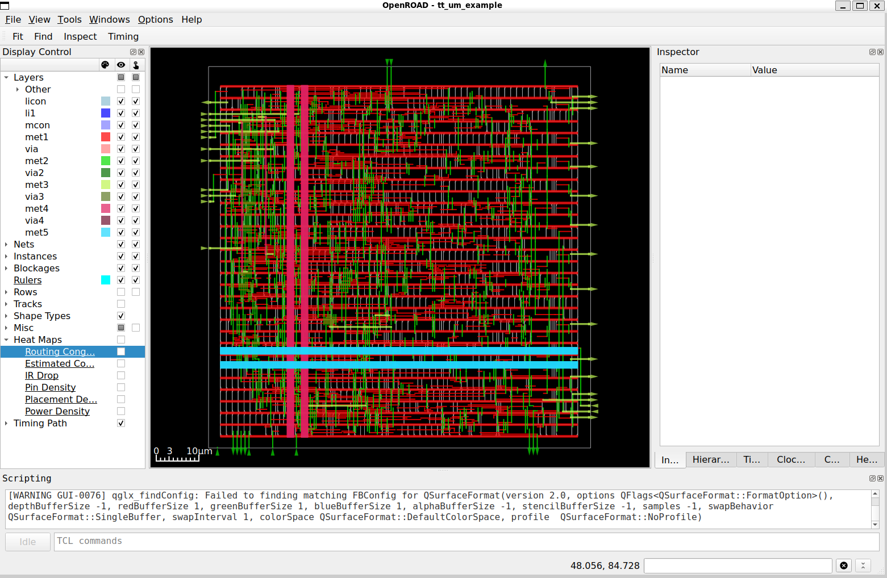

# Lab 4: LibreLane Configuration Variables

## 4.1 วัตถุประสงค์ของบทปฏิบัติการ

บทปฏิบัติการนี้มุ่งให้ผู้เรียนเข้าใจวิธีควบคุมกระบวนการ RTL-to-GDSII ของ LibreLane ผ่านไฟล์ Configuration โดยเฉพาะไฟล์ `config.yaml` ซึ่งเป็นจุดศูนย์กลางสำหรับกำหนดข้อมูลการออกแบบ ข้อกำหนดด้านเวลา ขนาดชิป ความหนาแน่นของ Placement ตำแหน่งขา I/O ตลอดจนตัวเลือกของแต่ละขั้นตอนใน Physical Design Flow

เมื่อจบบทปฏิบัติการ ผู้เรียนจะสามารถ:

1. อธิบายบทบาทของไฟล์ `config.yaml` ใน LibreLane ได้
2. แยกแยะ Design Configuration, Flow Configuration และ Step Configuration ได้
3. กำหนด RTL source files, top-level module และ clock constraint ได้
4. เปลี่ยน Floorplan จากการคำนวณอัตโนมัติเป็นการกำหนดขนาดตายตัวได้
5. วิเคราะห์ความสัมพันธ์ระหว่าง Die Area, Core Area, Core Utilization และ Placement Density ได้
6. กำหนดตำแหน่งขา I/O ด้วยไฟล์ `pins.cfg` ได้
7. ใช้ DEF template เพื่อบังคับขนาดและตำแหน่งขาของ Physical Design ได้
8. สร้าง Placement Obstruction และ Soft Placement Blockage ได้
9. ใช้ `dir::`, `ref::`, `refg::`, `expr::`, `pdk::` และ `scl::` ในไฟล์ Configuration ได้
10. ทดลองปรับ Configuration Variables และเปรียบเทียบผลด้านพื้นที่ Timing, Congestion, Routing และ Physical Verification ได้

---

## 4.2 ความรู้พื้นฐาน

### 4.2.1 LibreLane Configuration คืออะไร

LibreLane ประกอบด้วยขั้นตอนย่อยหลายขั้นตอน เช่น

- RTL elaboration
- Logic synthesis
- Static timing analysis
- Floorplanning
- I/O placement
- Power distribution network generation
- Global placement
- Detailed placement
- Clock tree synthesis
- Global routing
- Detailed routing
- Parasitic extraction
- Timing signoff
- DRC
- LVS
- GDSII generation

แต่ละขั้นตอนต้องการข้อมูลและพารามิเตอร์จำนวนมาก เช่น

- ชื่อ Top-level module
- รายชื่อไฟล์ RTL
- ชื่อ Clock port
- Clock period
- ขนาด Die
- เปอร์เซ็นต์พื้นที่ Core
- Placement density
- Routing layers
- Cell padding
- Clock buffer cells
- Timing corners
- DRC และ LVS options

LibreLane รวบรวมค่าควบคุมเหล่านี้ไว้ใน **Design Configuration File**

LibreLane รองรับ Configuration สามรูปแบบ ได้แก่:

- YAML
- JSON
- Tcl

สำหรับโครงการใหม่ แนะนำให้ใช้ YAML หรือ JSON เนื่องจากอ่านง่าย ตรวจสอบชนิดข้อมูลได้ และปลอดภัยกว่า Tcl ส่วน Tcl ยังคงรองรับเพื่อความเข้ากันได้กับโครงการเดิม แต่ไม่ใช่รูปแบบที่แนะนำสำหรับงานใหม่  

ใน Lab นี้จะใช้ YAML เพราะ:

- อ่านง่าย
- รองรับ Comment
- แสดง List และ Dictionary ได้ชัดเจน
- เหมาะสำหรับการเรียนการสอน
- ลดความซับซ้อนของ Tcl syntax

---

## 4.3 โครงสร้างไฟล์ของ Lab

เข้าสู่ Repository:

```bash
cd ~/heichips26-digital-workshop
```

ตรวจสอบโครงสร้างของ `exercise_2`:

```bash
tree exercise_2
```

โครงสร้างโดยทั่วไปควรมีลักษณะดังนี้:

```text
exercise_2/
├── config.yaml
├── README.md
├── pins.cfg
├── src/
│   └── project.sv
├── def/
│   ├── tt_block_1x1_pgvdd.def
│   └── ...
└── img/
```

ไฟล์สำคัญมีหน้าที่ดังนี้:

| ไฟล์หรือโฟลเดอร์ | หน้าที่ |
|---|---|
| `config.yaml` | กำหนดค่าหลักของ LibreLane |
| `src/project.sv` | RTL ของวงจร |
| `pins.cfg` | กำหนดลำดับและด้านของขา I/O |
| `def/` | เก็บ DEF templates |
| `runs/` | ผลการรันที่ LibreLane สร้างขึ้น |
| `README.md` | คำอธิบายโจทย์และขั้นตอนพื้นฐาน |

ใน LibreLane โฟลเดอร์ที่บรรจุ `config.yaml`, `config.json` หรือ `config.tcl` เรียกว่า **Design Directory** เส้นทางที่ขึ้นต้นด้วย `dir::` จะถูกตีความสัมพันธ์กับ Design Directory นี้  

---

## 4.4 เตรียมสภาพแวดล้อม

### ขั้นตอนที่ 1 ตรวจสอบตำแหน่ง Repository

```bash
cd ~/heichips26-digital-workshop/exercise_2
pwd
```

ผลลัพธ์ตัวอย่าง:

```text
/home/user/heichips26-digital-workshop/exercise_2
```

### ขั้นตอนที่ 2 ตรวจสอบ LibreLane

กรณีติดตั้งด้วย Nix:

```bash
librelane --version
```

กรณีต้องเข้าสู่ Nix shell ก่อน:

```bash
nix-shell
librelane --version
```

หรือหาก Repository มี Flake:

```bash
nix develop
librelane --version
```

### ขั้นตอนที่ 3 ตรวจสอบ PDK

ตัวอย่างสำหรับ SKY130:

```bash
librelane --pdk sky130A --help
```

ตัวอย่างสำหรับ IHP SG13G2:

```bash
librelane --pdk ihp-sg13g2 --help
```

ชื่อ PDK ต้องตรงกับชื่อที่ติดตั้งในระบบ หากใช้ชื่อผิด LibreLane จะไม่สามารถค้นหา Technology LEF, Liberty, Cell LEF, GDS และ Technology Rules ได้

### ขั้นตอนที่ 4 สำรอง Configuration เดิม

```bash
cp config.yaml config.yaml.original
```

เมื่อต้องการคืนค่า:

```bash
cp config.yaml.original config.yaml
```

การสำรองไฟล์ก่อนทดลองมีความสำคัญ เพราะใน Lab นี้จะมีการปรับ Configuration หลายรอบและเปรียบเทียบผลระหว่างแต่ละกรณี

---

# 4.5 ทำความเข้าใจไฟล์ `config.yaml`

แสดงเนื้อหาไฟล์:

```bash
cat config.yaml
```

หรือเปิดด้วย Text Editor:

```bash
nano config.yaml
```

ตัวอย่าง Configuration ขั้นต่ำ:

```yaml
DESIGN_NAME: project

VERILOG_FILES:
  - dir::src/project.sv

CLOCK_PORT: clk
CLOCK_PERIOD: 20.0
```

## 4.5.1 `DESIGN_NAME`

```yaml
DESIGN_NAME: project
```

กำหนดชื่อ Top-level module ที่ LibreLane จะใช้เป็นจุดเริ่มต้นของการ Elaborate และ Synthesis

ค่าของ `DESIGN_NAME` ต้องตรงกับชื่อ Module ใน RTL:

```systemverilog
module project (
    input  logic       clk,
    input  logic       rst_n,
    input  logic [7:0] ui_in,
    output logic [7:0] uo_out
);
```

หากเขียนผิด เช่น

```yaml
DESIGN_NAME: counter
```

แต่ใน RTL ไม่มี Module ชื่อ `counter` การสังเคราะห์จะล้มเหลว โดยมักพบข้อความเกี่ยวกับ Top module not found หรือ design hierarchy ว่าง

ตรวจสอบชื่อ Module:

```bash
grep -R "^module" src
```

---

## 4.5.2 `VERILOG_FILES`

```yaml
VERILOG_FILES:
  - dir::src/project.sv
```

ตัวแปรนี้บอก LibreLane ว่าต้องอ่านไฟล์ RTL ใดบ้าง

เมื่อมีหลายไฟล์ สามารถเขียนเป็น List:

```yaml
VERILOG_FILES:
  - dir::src/project.sv
  - dir::src/counter.sv
  - dir::src/decoder.sv
```

หรือใช้ Glob:

```yaml
VERILOG_FILES: dir::src/*.sv
```

`dir::` เป็นรูปแบบย่อสำหรับค้นหาไฟล์ภายใน Design Directory โดย LibreLane ระบุว่า `dir::` ทำหน้าที่เทียบเท่ากับการ Glob จาก `$DESIGN_DIR` 

### ข้อควรระวังเรื่องลำดับไฟล์

หาก RTL ใช้ Package หรือ Header ให้จัดลำดับไฟล์ให้ถูกต้อง:

```yaml
VERILOG_FILES:
  - dir::src/project_pkg.sv
  - dir::src/counter.sv
  - dir::src/project.sv
```

Package ต้องมาก่อน Module ที่ Import Package:

```systemverilog
import project_pkg::*;
```

สำหรับ Include directories สามารถใช้ตัวแปรที่เกี่ยวข้องกับ Verilog include path ตามเวอร์ชันของ Flow หรือหลีกเลี่ยงความซับซ้อนด้วยการใส่ไฟล์ทั้งหมดลงใน `VERILOG_FILES`

---

## 4.5.3 `CLOCK_PORT`

```yaml
CLOCK_PORT: clk
```

กำหนดชื่อพอร์ต Clock หลักของวงจร

ค่าต้องตรงกับพอร์ตใน Top-level module:

```systemverilog
input logic clk
```

หากวงจรไม่มี Clock เช่น Pure Combinational Design อาจไม่กำหนด `CLOCK_PORT` และต้องตรวจสอบข้อกำหนดของ Flow ที่ใช้

หากมี Clock หลายตัว การกำหนดเพียง `CLOCK_PORT` และ `CLOCK_PERIOD` อาจไม่เพียงพอ ควรสร้าง SDC file ที่ระบุ Clock แต่ละตัวอย่างชัดเจน

---

## 4.5.4 `CLOCK_PERIOD`

```yaml
CLOCK_PERIOD: 20.0
```

กำหนดคาบ Clock ในหน่วย Nanosecond

ความถี่คำนวณจาก:

$$f = \frac{1}{T}$$

เมื่อใช้หน่วย MHz และ ns:

$$f_{\text{MHz}} = \frac{1000}{T_{\text{ns}}}$$

ตัวอย่าง:

| Clock period | Frequency |
|---:|---:|
| 100 ns | 10 MHz |
| 40 ns | 25 MHz |
| 20 ns | 50 MHz |
| 10 ns | 100 MHz |
| 5 ns | 200 MHz |

ดังนั้น:

```yaml
CLOCK_PERIOD: 20.0
```

หมายถึงเป้าหมาย Clock ประมาณ:

```text
50 MHz
```

Clock period ที่เล็กลงทำให้ข้อกำหนด Timing เข้มงวดขึ้น โดยเครื่องมืออาจต้อง:

- ใช้ Standard Cell ที่เร็วขึ้น
- เพิ่ม Buffer
- เพิ่มขนาด Cell
- เปลี่ยนโครงสร้าง Logic
- ใช้พื้นที่มากขึ้น
- ใช้กำลังไฟมากขึ้น
- เพิ่มความหนาแน่นของ Routing

จึงไม่ควรตั้ง Clock period ต่ำกว่าความจำเป็นโดยไม่มีเป้าหมายด้านระบบรองรับ

---

# 4.6 การตรวจสอบ Configuration ขั้นต้น

ก่อนรัน Full Flow ควรตรวจสอบ Syntax ของ YAML

## ขั้นตอนที่ 1 ตรวจสอบ Indentation

YAML ใช้การเยื้องเพื่อกำหนดโครงสร้าง ควรใช้ Space และไม่ใช้ Tab

ตัวอย่างถูกต้อง:

```yaml
VERILOG_FILES:
  - dir::src/project.sv
```

ตัวอย่างที่อาจผิด:

```yaml
VERILOG_FILES:
- dir::src/project.sv
   - dir::src/counter.sv
```

## ขั้นตอนที่ 2 ตรวจสอบ YAML ด้วย Python

```bash
python3 - <<'PY'
import pathlib
import yaml

path = pathlib.Path("config.yaml")

with path.open("r", encoding="utf-8") as stream:
    config = yaml.safe_load(stream)

print("YAML syntax: PASS")
print(config)
PY
```

หากระบบไม่มี PyYAML คำสั่งนี้อาจใช้ไม่ได้ แต่ LibreLane จะตรวจสอบไฟล์อีกครั้งเมื่อเริ่มรัน

## ขั้นตอนที่ 3 รัน Baseline

```bash
librelane --pdk sky130A config.yaml
```

หรือ PDK ที่กำหนดใน Workshop:

```bash
librelane --pdk ihp-sg13g2 config.yaml
```

ผลการรันจะถูกสร้างในโฟลเดอร์ `runs/`

```bash
ls -lah runs
```

บันทึกชื่อ Run ล่าสุด:

```bash
RUN_DIR=$(find runs -mindepth 1 -maxdepth 1 -type d | sort | tail -1)
echo "$RUN_DIR"
```

### เปิด run ล่าสุดใน OpenROAD GUI

ใช้คำสั่ง

```bash
librelane --pdk sky130A config.yaml \
    --last-run \
    --flow OpenInOpenROAD
```




---

# 4.7 การทดลองที่ 1: Automatic Floorplan

## 4.7.1 Relative Sizing

โดยค่าเริ่มต้น LibreLane สามารถคำนวณขนาด Die จากพื้นที่ Standard Cells และค่า Core utilization ได้ โหมดนี้เรียกว่า Relative Sizing

```yaml
FP_SIZING: relative
FP_CORE_UTIL: 40
```

ความหมายโดยประมาณ:

- LibreLane ประเมินพื้นที่ Standard Cell จาก Netlist หลัง Synthesis
- กำหนดเป้าหมายให้ Standard Cells ใช้ประมาณ 40% ของ Core Area
- พื้นที่ที่เหลือใช้สำหรับ Routing, Buffers, CTS cells, Tie cells, Diodes และ Physical-only cells
- เครื่องมือคำนวณ Core Area และ Die Area ให้โดยอัตโนมัติ

ความสัมพันธ์เชิงแนวคิด:

$$\text{Core Utilization} = \frac{\text{Total Standard Cell Area}} {\text{Available Core Area}} \times 100$$

ดังนั้น:

$$\text{Core Area}\approx\frac{\text{Standard Cell Area}}{\text{Core Utilization}}$$

ถ้า Standard Cell Area เท่ากับ $$4,000\ \mu m^2$$ และกำหนด Core utilization เท่ากับ 40%:

$$\text{Core Area}\approx\frac{4,000}{0.40} = 10,000\ \mu m^2$$

พื้นที่ที่เหลือประมาณ 60% ไม่ได้หมายความว่าว่างโดยไม่มีประโยชน์ แต่ใช้เป็นช่องทางสำหรับ Interconnect และ Physical optimization

## 4.7.2 กำหนด Baseline Configuration

เพิ่มหรือแก้ไขใน `config.yaml`:

```yaml
FP_SIZING: relative
FP_CORE_UTIL: 40
PL_TARGET_DENSITY_PCT: 50
```

รัน:

```bash
librelane --pdk sky130A config.yaml
```

เก็บผลเป็น Baseline โดยใช้ Tag:

```bash
librelane --pdk sky130A --run-tag lab4_relative config.yaml
```

หาก LibreLane รุ่นที่ติดตั้งใช้รูปแบบ Option ต่างออกไป ให้ตรวจสอบด้วย:

```bash
librelane --help
```

## 4.7.3 ตรวจสอบผล

```bash
find runs/lab4_relative -maxdepth 3 -type f | head -50
```

ค้นหา Metrics:

```bash
find runs/lab4_relative -iname "*metrics*" -o -iname "*summary*"
```

ตัวแปรที่ควรบันทึก:

- Die width
- Die height
- Core area
- Standard cell area
- Utilization
- Number of cells
- Wire length
- Worst slack
- Total negative slack
- Routing congestion
- DRC violations

---

# 4.8 การทดลองที่ 2: Fixed Die Area

Repository Exercise 2 สาธิตการเปลี่ยนจาก Automatic Sizing เป็น Fixed Die Area ด้วย `FP_SIZING: absolute` และ `DIE_AREA`  

## 4.8.1 กำหนด Absolute Sizing

แก้ไข `config.yaml`:

```yaml
FP_SIZING: absolute
DIE_AREA: [0, 0, 150, 150]
PL_TARGET_DENSITY_PCT: 80
```

ความหมายของ `DIE_AREA`:

```text
[lower-left-x, lower-left-y, upper-right-x, upper-right-y]
```

ดังนั้น:

```yaml
DIE_AREA: [0, 0, 150, 150]
```

หมายถึง:

- จุดกำเนิด Die อยู่ที่ `(0, 0)`
- ขอบขวาอยู่ที่ `x = 150 µm`
- ขอบบนอยู่ที่ `y = 150 µm`
- Die width เท่ากับ 150 µm
- Die height เท่ากับ 150 µm
- Die area เท่ากับ 22,500 µm²

$$A_{\text{die}} = 150 \times 150 = 22,500\ \mu m^2$$

### ข้อควรระวัง

`DIE_AREA` ไม่ใช่ Core Area

ภายใน Die ยังมี:

- Core margin
- Routing tracks รอบ Core
- Power rings หากเปิดใช้งาน
- I/O pins
- Boundary cells หรือ Tap cells
- พื้นที่เผื่อ Physical verification

ดังนั้นพื้นที่ที่วาง Standard Cells ได้จริงจะน้อยกว่า Die Area

## 4.8.2 รัน Flow

```bash
librelane --pdk sky130A --run-tag lab4_fixed_150 config.yaml
```

## 4.8.3 เปิด Layout

เลือกไฟล์ ODB หรือ DEF จากขั้นตอนหลัง Placement หรือ Routing แล้วเปิดด้วย GUI ที่ LibreLane รองรับ

ตัวอย่างแนวทาง:

```bash
find runs/lab4_fixed_150 -type f \( -name "*.odb" -o -name "*.def" \) | tail
```

หากใช้ LibreLane Interactive Mode:

```bash
librelane --pdk sky130A --interactive
```

จากนั้นโหลด State หรือ ODB ตามคำสั่งของเวอร์ชันที่ติดตั้ง

สิ่งที่ควรสังเกต:

- Standard Cells กระจุกตัวอยู่บริเวณกลาง Core หรือไม่
- พื้นที่ว่างมีมากเกินไปหรือไม่
- Routing กระจายทั่ว Die หรือเฉพาะบางบริเวณ
- ขา I/O อยู่ด้านใด
- PDN ครอบคลุม Core หรือไม่

---

# 4.9 การทดลองที่ 3: Placement Density

## 4.9.1 ความหมายของ `PL_TARGET_DENSITY_PCT`

```yaml
PL_TARGET_DENSITY_PCT: 80
```

กำหนดเป้าหมายความหนาแน่นในการทำ Global Placement

ค่า 80 หมายถึงเครื่องมือพยายามจัดวางเซลล์โดยใช้ความหนาแน่นเป้าหมายประมาณ 80% ในบริเวณ Placement ที่ใช้งานได้

ต้องแยกระหว่าง:

### Core Utilization

เป็นความสัมพันธ์ระหว่างพื้นที่รวมของ Standard Cells กับพื้นที่ Core ทั้งหมด

### Placement Target Density

เป็นค่าควบคุม Algorithm ของ Global Placement ว่าในบริเวณที่ใช้งานได้ควรอัดแน่นเพียงใด

ค่าทั้งสองมีความสัมพันธ์กัน แต่ไม่ใช่ตัวแปรเดียวกัน

LibreLane Exercise 2 อธิบายว่าการใช้ Die ขนาดใหญ่ร่วมกับ Placement density สูงอาจทำให้ Standard Cells รวมตัวเป็นกลุ่มหนาแน่นตรงกลาง แม้ว่าพื้นที่ Die จะกว้างมากก็ตาม  

## 4.9.2 ทดลอง Density หลายค่า

สร้าง Configuration 3 ชุด

### กรณี A: Density 40%

```bash
cp config.yaml config_density40.yaml
```

แก้ไข:

```yaml
FP_SIZING: absolute
DIE_AREA: [0, 0, 150, 150]
PL_TARGET_DENSITY_PCT: 40
```

รัน:

```bash
librelane --pdk sky130A --run-tag lab4_density40 config_density40.yaml
```

### กรณี B: Density 60%

```bash
cp config_density40.yaml config_density60.yaml
sed -i 's/PL_TARGET_DENSITY_PCT: 40/PL_TARGET_DENSITY_PCT: 60/' \
    config_density60.yaml

librelane --pdk sky130A \
    --run-tag lab4_density60 \
    config_density60.yaml
```

### กรณี C: Density 80%

```bash
cp config_density40.yaml config_density80.yaml
sed -i 's/PL_TARGET_DENSITY_PCT: 40/PL_TARGET_DENSITY_PCT: 80/' \
    config_density80.yaml

librelane --pdk sky130A \
    --run-tag lab4_density80 \
    config_density80.yaml
```

## 4.9.3 ตารางบันทึกผล

| ตัวแปร | Density 40% | Density 60% | Density 80% |
|---|---:|---:|---:|
| Die area | | | |
| Core area | | | |
| Standard cell area | | | |
| Number of instances | | | |
| Total wire length | | | |
| Worst slack | | | |
| Total negative slack | | | |
| Global routing overflow | | | |
| Detailed routing DRC | | | |
| Antenna violations | | | |
| Flow completed | | | |

## 4.9.4 วิเคราะห์ผล

โดยทั่วไป:

- Density ต่ำเกินไปทำให้ Wire length ยาวขึ้น
- Density ต่ำอาจทำให้ Timing แย่ลงจากระยะทางระหว่าง Cell
- Density สูงช่วยลดระยะทางระหว่าง Logic Cells
- Density สูงเกินไปลดพื้นที่สำหรับ Routing
- Density สูงอาจเกิด Congestion และ DRC
- Buffer insertion และ Clock Tree อาจทำให้จำนวน Cell เพิ่มภายหลัง
- Density ที่ผ่าน Placement อาจยังล้มเหลวใน Routing ได้

จุดที่เหมาะสมจึงไม่ใช่ค่าที่สูงที่สุดเสมอ แต่เป็นค่าที่ให้สมดุลระหว่าง:

- Area
- Timing
- Routability
- Power
- DRC cleanliness

---

# 4.10 การทดลองที่ 4: ค้นหา Die Area ที่เล็กที่สุด

โจทย์คือหาขนาด Die ที่เล็กที่สุดซึ่งยังผ่าน Flow ได้โดยไม่มี Routing failure

## 4.10.1 เริ่มจากขนาด 150 × 150 µm

```yaml
FP_SIZING: absolute
DIE_AREA: [0, 0, 150, 150]
PL_TARGET_DENSITY_PCT: 60
```

## 4.10.2 ลดขนาดทีละขั้น

ทดลอง:

```yaml
DIE_AREA: [0, 0, 140, 140]
```

จากนั้น:

```yaml
DIE_AREA: [0, 0, 130, 130]
```

และ:

```yaml
DIE_AREA: [0, 0, 120, 120]
```

ตั้งชื่อ Run ให้สื่อความหมาย:

```bash
librelane --pdk sky130A --run-tag die_150 config.yaml
librelane --pdk sky130A --run-tag die_140 config.yaml
librelane --pdk sky130A --run-tag die_130 config.yaml
librelane --pdk sky130A --run-tag die_120 config.yaml
```

ต้องแก้ `DIE_AREA` ให้ตรงกับ Run แต่ละครั้ง

## 4.10.3 เกณฑ์การตัดสิน

ห้ามตัดสินจากการผ่าน Placement เพียงอย่างเดียว ต้องตรวจสอบอย่างน้อย:

1. Global placement ผ่าน
2. Detailed placement ผ่าน
3. CTS ผ่าน
4. Global routing ไม่มี Overflow ร้ายแรง
5. Detailed routing ผ่าน
6. DRC อยู่ในเกณฑ์ยอมรับ
7. Antenna repair สำเร็จ
8. Worst slack อยู่ในเกณฑ์
9. LVS ผ่าน
10. Flow สร้าง GDSII ได้

## 4.10.4 เทคนิค Binary Search

หากพบว่า:

- 120 × 120 µm ล้มเหลว
- 140 × 140 µm ผ่าน

ให้ทดลองค่ากลาง:

```text
130 × 130 µm
```

หาก 130 ผ่าน ให้ทดลอง 125

หาก 130 ล้มเหลว ให้ทดลอง 135

วิธีนี้ลดจำนวนรอบการค้นหาเมื่อเทียบกับการลดทีละ 1 µm

---

# 4.11 การทดลองที่ 5: Custom Pin Placement

## 4.11.1 เหตุผลที่ต้องควบคุมตำแหน่งขา

การวางขา I/O มีผลโดยตรงต่อ:

- ความยาวของ Net
- Routing congestion
- Timing
- การเชื่อมต่อกับ Block อื่น
- Hierarchical integration
- Macro orientation
- Bus ordering
- Top-level floorplanning

LibreLane Classic Flow โดยทั่วไปจะทำ Global Placement เบื้องต้น วาง I/O แล้วทำ Global Placement อีกครั้งเพื่อให้ Cell placement ปรับตามตำแหน่งขา แต่ในงานจริงตำแหน่งขามักถูกกำหนดโดยสถาปัตยกรรมระดับบน จึงต้องใช้ Custom I/O Placement  

## 4.11.2 ตรวจสอบพอร์ตของ RTL

```bash
sed -n '1,160p' src/project.sv
```

หรือ:

```bash
grep -nE "input|output|inout" src/project.sv
```

สมมติ Top module มีพอร์ต:

```systemverilog
module project (
    input  logic       clk,
    input  logic       rst_n,
    input  logic [7:0] ui_in,
    output logic [7:0] uo_out
);
```

เป้าหมาย:

- Inputs อยู่ด้านซ้าย
- Outputs อยู่ด้านขวา
- Clock และ Reset อยู่ด้านล่างหรือด้านซ้าย
- ลำดับ Bus เป็นระเบียบ

## 4.11.3 สร้างไฟล์ `pins.cfg`

```bash
nano pins.cfg
```

ตัวอย่าง:

```text
#N

#S
clk
rst_n

#E
uo_out\[0\]
uo_out\[1\]
uo_out\[2\]
uo_out\[3\]
uo_out\[4\]
uo_out\[5\]
uo_out\[6\]
uo_out\[7\]

#W
ui_in\[0\]
ui_in\[1\]
ui_in\[2\]
ui_in\[3\]
ui_in\[4\]
ui_in\[5\]
ui_in\[6\]
ui_in\[7\]
```

ความหมาย:

| Marker | ด้าน |
|---|---|
| `#N` | North |
| `#S` | South |
| `#E` | East |
| `#W` | West |

บางรูปแบบรองรับ Regular Expression จึงต้อง Escape วงเล็บเหลี่ยมของ Bus เช่น:

```text
ui_in\[0\]
```

แทนที่จะเขียน:

```text
ui_in[0]
```

## 4.11.4 เชื่อมไฟล์กับ `config.yaml`

เพิ่ม:

```yaml
FP_PIN_ORDER_CFG: dir::pins.cfg
```

Repository Exercise 2 ใช้ตัวแปร `FP_PIN_ORDER_CFG` เพื่อชี้ไปยัง Pin Placement Configuration File  

Configuration ตัวอย่าง:

```yaml
DESIGN_NAME: project

VERILOG_FILES:
  - dir::src/project.sv

CLOCK_PORT: clk
CLOCK_PERIOD: 20.0

FP_SIZING: absolute
DIE_AREA: [0, 0, 150, 150]
PL_TARGET_DENSITY_PCT: 60

FP_PIN_ORDER_CFG: dir::pins.cfg
```

## 4.11.5 รัน Flow

```bash
librelane --pdk sky130A \
    --run-tag lab4_custom_pins \
    config.yaml
```

## 4.11.6 ตรวจสอบผล

เปิด DEF หรือ ODB หลัง I/O placement และตรวจสอบ:

- Input pins อยู่ด้าน West
- Output pins อยู่ด้าน East
- Clock และ Reset อยู่ด้าน South
- Bus bits เรียงตามลำดับ
- ไม่มี Pin ซ้อนกัน
- ไม่มี Unmatched pin pattern
- Pin ไม่อยู่ใกล้มุมเกินไป
- Pin spacing เหมาะสมกับ Routing tracks

## 4.11.7 ข้อผิดพลาดที่พบบ่อย

### Pin name ไม่ตรงกับ RTL

ตัวอย่าง RTL:

```systemverilog
input logic [7:0] ui_in;
```

แต่เขียนใน `pins.cfg`:

```text
input_data\[0\]
```

LibreLane จะไม่พบ Pin ดังกล่าว

### ไม่ Escape Bus Index

เขียน:

```text
ui_in[0]
```

อาจถูกตีความเป็น Regular Expression character class

ควรเขียน:

```text
ui_in\[0\]
```

### มีพอร์ตตกหล่น

ถ้า Pin ไม่ได้อยู่ในไฟล์ อาจถูกวางอัตโนมัติหรือ Flow อาจแจ้งข้อผิดพลาด ขึ้นกับ Step และ Configuration

### พอร์ตซ้ำหลายด้าน

ไม่ควรกำหนด Pin เดียวกันทั้ง East และ West

---

# 4.12 การทดลองที่ 6: ใช้ Regular Expression จัดกลุ่มขา

สำหรับวงจรที่มี Bus ขนาดใหญ่ การเขียน Pin ทีละ Bit ทำให้ไฟล์ยาวและเกิดข้อผิดพลาดง่าย

ตัวอย่างแนวคิด:

```text
#E
uo_out.*

#W
ui_in.*
```

หรือใช้ Naming Convention:

```text
#E
.*_o
.*_o\[[0-9]+\]

#W
.*_i
.*_i\[[0-9]+\]
```

ต้องตรวจสอบ Syntax ที่ Pin Placement Step รองรับใน LibreLane รุ่นที่ใช้งาน และทดลองดู Log ว่า Pattern จับคู่กับ Pin ใดบ้าง

หลักการตั้งชื่อพอร์ตที่ช่วย Physical Design:

- Input ลงท้าย `_i`
- Output ลงท้าย `_o`
- Bidirectional ลงท้าย `_io`
- Clock ใช้ `clk_i`
- Reset ใช้ `rst_ni`
- Bus ใช้ชื่อสม่ำเสมอ

ตัวอย่าง:

```systemverilog
input  logic       clk_i;
input  logic       rst_ni;
input  logic [7:0] data_i;
output logic [7:0] data_o;
```

ทำให้กำหนด Pin groups ได้ง่าย:

```text
#W
.*_i.*
.*_ni.*

#E
.*_o.*
```

---

# 4.13 การทดลองที่ 7: ใช้ DEF Template

## 4.13.1 DEF Template คืออะไร

DEF หรือ Design Exchange Format ใช้อธิบายข้อมูล Physical Design เช่น:

- Die area
- Core area
- Rows
- Tracks
- Components
- Pins
- Special nets
- Routing
- Blockages

DEF Template ใช้เมื่อ Design ต้องมี:

- ขนาด Die คงที่
- ตำแหน่ง Pin คงที่
- Track structure คงที่
- Interface ตรงกับระบบระดับบน
- รูปแบบเดียวกับ Tile หรือ Submission template

กรณีตัวอย่างคือ Tiny Tapeout ซึ่งแต่ละ User Design ต้องตรงกับขนาด Tile และ Pin interface ที่กำหนด

## 4.13.2 ตรวจสอบ DEF Template

```bash
ls -lah def
```

เปิดส่วนต้นของ DEF:

```bash
head -80 def/tt_block_1x1_pgvdd.def
```

ค้นหา Die area:

```bash
grep -n "DIEAREA" def/tt_block_1x1_pgvdd.def
```

ตัวอย่าง:

```text
DIEAREA ( 0 0 ) ( 202080 154980 ) ;
```

ค่าภายใน DEF มักอยู่ใน Database Units ไม่ใช่ µm โดยตรง ค่า Scaling ต้องพิจารณาจาก:

```text
UNITS DISTANCE MICRONS ...
```

ค้นหา:

```bash
grep -n "UNITS DISTANCE MICRONS" \
    def/tt_block_1x1_pgvdd.def
```

## 4.13.3 กำหนด Configuration

```yaml
FP_SIZING: absolute
DIE_AREA: [0, 0, 202.08, 154.98]
FP_DEF_TEMPLATE: dir::def/tt_block_1x1_pgvdd.def
```

ค่าของ `DIE_AREA` ต้องตรงกับขนาดใน DEF Template มิฉะนั้น LibreLane อาจหยุด Flow เนื่องจาก Geometry ไม่สอดคล้องกัน Exercise 2 ใช้ขนาด 202.08 × 154.98 µm สำหรับ Template ตัวอย่างนี้  

Configuration แบบเต็ม:

```yaml
DESIGN_NAME: project

VERILOG_FILES:
  - dir::src/project.sv

CLOCK_PORT: clk
CLOCK_PERIOD: 20.0

FP_SIZING: absolute
DIE_AREA: [0, 0, 202.08, 154.98]
FP_DEF_TEMPLATE: dir::def/tt_block_1x1_pgvdd.def
```

เมื่อใช้ DEF Template ที่กำหนด Pin placement อยู่แล้ว ให้ตรวจสอบว่าจำเป็นต้องใช้ `FP_PIN_ORDER_CFG` ร่วมด้วยหรือไม่ การกำหนดทั้งสองชุดโดยขัดแย้งกันอาจทำให้ Flow ล้มเหลวหรือได้ผลไม่ตรงความตั้งใจ

## 4.13.4 รัน Flow

```bash
librelane --pdk sky130A \
    --run-tag lab4_def_template \
    config.yaml
```

## 4.13.5 ตรวจสอบผล

เปรียบเทียบกับ Template:

- Die area ตรงกัน
- Pin names ตรงกับ RTL
- Pin locations ไม่เปลี่ยน
- Pin directions ถูกต้อง
- Standard-cell rows อยู่ใน Core
- Power pins และ Ground pins ถูกต้อง
- Routing tracks สอดคล้องกับ PDK
- ไม่มี Cells อยู่นอก Die
- PDN ไม่ชนขอบหรือ Pins

---

# 4.14 การทดลองที่ 8: Placement Obstructions

## 4.14.1 Obstruction คืออะไร

Obstruction คือพื้นที่ที่ไม่ต้องการให้เครื่องมือวาง Standard Cells

กรณีใช้งานจริง:

- พื้นที่ใต้ Analog Macro
- พื้นที่ใต้ Routing channel
- พื้นที่สำหรับ Power switch
- บริเวณที่ต้องเว้นสำหรับ Clock spine
- พื้นที่รอบ SRAM หรือ Hard Macro
- Keep-out region
- พื้นที่สำหรับ future ECO
- บริเวณที่มี Routing congestion สูง

LibreLane Exercise 2 แยกพื้นที่กีดขวางออกเป็นสองแบบ  

### Firm Obstruction

```yaml
FP_OBSTRUCTIONS:
```

ป้องกันการสร้าง Placement Sites หรือ Rows ภายในพื้นที่ดังกล่าว เซลล์จึงไม่สามารถวางในบริเวณนั้นได้

### Soft Obstruction

```yaml
PL_SOFT_OBSTRUCTIONS:
```

ป้องกันการวางเซลล์ระหว่าง Initial Placement แต่ขั้นตอนภายหลัง เช่น Buffer insertion หรือ Antenna repair อาจวางเซลล์เพิ่มในพื้นที่นี้ได้

---

## 4.14.2 สร้าง Firm Obstructions

เพิ่มใน `config.yaml`:

```yaml
FP_OBSTRUCTIONS:
  - [30, 30, 40, 40]
  - [120, 100, 150, 115]
  - [100, 20, 180, 30]
```

แต่ละรายการมีรูปแบบ:

```text
[x_min, y_min, x_max, y_max]
```

ตัวอย่าง:

```yaml
- [30, 30, 40, 40]
```

หมายถึง Blockage ขนาด:

$$(40-30) \times (40-30) = 10 \times 10 = 100\ \mu m^2$$

## 4.14.3 ตรวจสอบขอบเขต

ค่าทุกค่าต้องอยู่ภายใน Die Area

หาก Die Area คือ:

```yaml
DIE_AREA: [0, 0, 150, 150]
```

แต่กำหนด:

```yaml
FP_OBSTRUCTIONS:
  - [100, 20, 180, 30]
```

ค่า `x_max = 180` อยู่ภายนอก Die และอาจเกิด Error หรือ Geometry ถูกตัด ขึ้นกับ Step

ดังนั้นถ้าใช้ Die 150 × 150 µm ควรแก้เป็น:

```yaml
FP_OBSTRUCTIONS:
  - [100, 20, 140, 30]
```

หรือใช้ DEF Template ที่มี Die width มากกว่า 180 µm ตามตัวอย่าง Exercise

## 4.14.4 รัน Flow

```bash
librelane --pdk sky130A \
    --run-tag lab4_obstructions \
    config.yaml
```

## 4.14.5 สิ่งที่ต้องวิเคราะห์

- Standard-cell rows ถูกตัดบริเวณ Firm Obstruction หรือไม่
- มี Cell เข้าไปอยู่ในพื้นที่ Firm Obstruction หรือไม่
- Routing สามารถผ่านพื้นที่ Obstruction ได้หรือไม่
- Obstruction นี้ห้ามเฉพาะ Placement หรือห้าม Routing ด้วย
- Congestion เพิ่มขึ้นบริเวณขอบ Obstruction หรือไม่
- Wire length เพิ่มขึ้นหรือไม่
- Timing เปลี่ยนแปลงอย่างไร

ข้อสำคัญคือ Placement Obstruction ไม่จำเป็นต้องเป็น Routing Obstruction เครื่องมืออาจยังลาก Metal ผ่านบริเวณดังกล่าวได้ หากต้องการห้าม Routing ต้องใช้ตัวแปรหรือ Geometry ของ Routing Obstruction ที่เหมาะกับ Step และ PDK

---

# 4.15 การทดลองที่ 9: Soft Placement Obstructions

เพิ่ม:

```yaml
PL_SOFT_OBSTRUCTIONS:
  - [45, 45, 65, 65]
  - [80, 80, 100, 100]
```

รัน:

```bash
librelane --pdk sky130A \
    --run-tag lab4_soft_obstructions \
    config.yaml
```

ตรวจสอบ Layout หลังขั้นตอนต่าง ๆ:

1. หลัง Global Placement
2. หลัง Detailed Placement
3. หลัง CTS
4. หลัง Timing Repair
5. หลัง Antenna Repair

คาดว่าจะพบว่า Initial Placement หลีกเลี่ยงพื้นที่ Soft Obstruction แต่ Physical-only cells หรือ Buffer ที่ถูกแทรกภายหลังอาจปรากฏในพื้นที่นั้นได้

ตารางเปรียบเทียบ:

| คุณสมบัติ | Firm Obstruction | Soft Obstruction |
|---|---|---|
| ห้ามสร้าง Placement sites | ใช่ | ไม่ใช่ |
| Initial placement หลีกเลี่ยง | ใช่ | ใช่ |
| Buffer insertion อาจเข้าได้ | โดยทั่วไปไม่ได้ | อาจได้ |
| Antenna cell อาจเข้าได้ | โดยทั่วไปไม่ได้ | อาจได้ |
| เหมาะกับ Hard Macro keep-out | ใช่ | บางกรณี |
| เหมาะกับการลด Density ชั่วคราว | ไม่เด่น | ใช่ |

---

# 4.16 YAML Data Types ที่ใช้ใน LibreLane

LibreLane Configuration รองรับ Scalar, List และ Dictionary และทำ Type validation กับตัวแปรที่แต่ละ Flow หรือ Step ประกาศไว้  

## 4.16.1 String

```yaml
DESIGN_NAME: project
CLOCK_PORT: clk
FP_SIZING: absolute
```

ใช้ Quote เมื่อข้อความอาจถูก YAML ตีความเป็นชนิดอื่น:

```yaml
DESIGN_NAME: "project"
```

## 4.16.2 Number

Integer:

```yaml
FP_CORE_UTIL: 40
```

Floating point:

```yaml
CLOCK_PERIOD: 20.0
```

## 4.16.3 Boolean

```yaml
GRT_ALLOW_CONGESTION: true
```

ควรใช้:

```text
true
false
```

หลีกเลี่ยง:

```text
yes
no
on
off
```

เนื่องจากการตีความอาจต่างกันระหว่าง YAML schema

## 4.16.4 Null

```yaml
SOME_OPTION: null
```

ใช้เมื่อ Configuration variable อนุญาตให้ไม่กำหนดค่า

## 4.16.5 List

```yaml
VERILOG_FILES:
  - dir::src/project.sv
  - dir::src/counter.sv
```

List แบบบรรทัดเดียว:

```yaml
DIE_AREA: [0, 0, 150, 150]
```

## 4.16.6 Dictionary

```yaml
pdk::sky130A:
  FP_CORE_UTIL: 40
  PL_TARGET_DENSITY_PCT: 55
```

---

# 4.17 การอ้างอิง Path ด้วย `dir::`

ตัวอย่าง:

```yaml
VERILOG_FILES: dir::src/*.sv
FP_PIN_ORDER_CFG: dir::pins.cfg
FP_DEF_TEMPLATE: dir::def/template.def
```

ข้อดี:

- ไม่ต้องใช้ Absolute path
- ย้าย Repository ไปเครื่องอื่นได้
- ใช้ร่วมกับ Git ได้
- ลดปัญหาชื่อ Home directory ต่างกัน
- Configuration อ่านง่าย

หลีกเลี่ยง:

```yaml
VERILOG_FILES:
  - /home/student/workshop/exercise_2/src/project.sv
```

เพราะจะทำงานเฉพาะเครื่องที่มี Path เดียวกัน

LibreLane ระบุว่า `dir::` เป็นรูปแบบย่อสำหรับ Glob ภายใต้ Design Directory  

---

# 4.18 การใช้ `ref::` และ `refg::`

## 4.18.1 `ref::`

ใช้สำหรับอ้างอิงค่าของตัวแปรที่ประกาศก่อนหน้า

ตัวอย่างเชิงแนวคิด:

```yaml
BASE_PERIOD: 20.0
CLOCK_PERIOD: expr::$BASE_PERIOD
```

หรือสำหรับ String:

```yaml
BASE_NAME: project
OTHER_NAME: ref::$BASE_NAME
```

ข้อสำคัญคือตัวแปรที่ถูกอ้างอิงต้องประกาศก่อนตัวแปรที่ใช้อ้างอิง เพราะ LibreLane ประมวลผล Configuration ตามลำดับ  

ตัวอย่างผิด:

```yaml
CLOCK_PERIOD: expr::$BASE_PERIOD
BASE_PERIOD: 20.0
```

ตัวอย่างถูก:

```yaml
BASE_PERIOD: 20.0
CLOCK_PERIOD: expr::$BASE_PERIOD
```

## 4.18.2 `refg::`

ใช้ Glob เพื่อค้นหาหลายไฟล์

```yaml
VERILOG_FILES: refg::$DESIGN_DIR/src/*.sv
```

`refg::` คืนค่าเป็น List เสมอ แม้ค้นพบเพียงไฟล์เดียว หากไม่พบไฟล์ ค่าของ Glob อาจถูกคืนกลับเป็นรายการแทนที่จะกลายเป็น List ว่าง จึงต้องตรวจสอบ Log ว่าพบไฟล์จริงหรือไม่  

รูปแบบย่อ:

```yaml
VERILOG_FILES: dir::src/*.sv
```

---

# 4.19 การใช้ `expr::`

`expr::` ใช้คำนวณค่าตัวเลขจาก Configuration variable ที่ประกาศก่อนหน้า

ตัวอย่าง:

```yaml
FP_CORE_UTIL: 40
PL_TARGET_DENSITY_PCT: expr::($FP_CORE_UTIL + 10)
```

ผลที่ได้:

```text
PL_TARGET_DENSITY_PCT = 50
```

LibreLane Expression Engine รองรับตัวดำเนินการพื้นฐาน:

- `**`
- `*`
- `/`
- `+`
- `-`
- วงเล็บ `()`

และสามารถอ้างอิงตัวแปรตัวเลขที่ประกาศก่อนหน้าด้วย `$VARIABLE`  

ตัวอย่าง:

```yaml
BASE_UTIL: 35
DENSITY_MARGIN: 15
PL_TARGET_DENSITY_PCT: expr::($BASE_UTIL + $DENSITY_MARGIN)
```

ตัวอย่างคำนวณ Clock:

```yaml
BASE_PERIOD: 10.0
CLOCK_PERIOD: expr::($BASE_PERIOD * 2)
```

ผลคือ:

```text
CLOCK_PERIOD = 20.0
```

ข้อจำกัด:

- ต้องคืนค่าเพียงหนึ่งค่า
- ไม่ใช่ Python expression
- ไม่รองรับ Function ซับซ้อน
- ตัวแปรที่อ้างอิงต้องประกาศก่อน
- อย่าใช้ Expression ที่ทำให้ Configuration อ่านยากเกินไป

---

# 4.20 Conditional Configuration ด้วย `pdk::`

Configuration ของ Physical Design ไม่ควรใช้ค่าเดียวกันทุก PDK เพราะแต่ละ Technology มี:

- Cell dimensions ต่างกัน
- Routing pitch ต่างกัน
- Number of metal layers ต่างกัน
- Standard-cell architecture ต่างกัน
- Timing และ Power ต่างกัน
- DRC constraints ต่างกัน

LibreLane รองรับ Conditional Dictionary:

```yaml
FP_CORE_UTIL: 35
PL_TARGET_DENSITY_PCT: 45

pdk::sky130A:
  FP_CORE_UTIL: 40
  PL_TARGET_DENSITY_PCT: 55

pdk::ihp-sg13g2:
  FP_CORE_UTIL: 30
  PL_TARGET_DENSITY_PCT: 45
```

เมื่อเลือก:

```bash
librelane --pdk sky130A config.yaml
```

LibreLane จะใช้ค่าภายใต้:

```yaml
pdk::sky130A:
```

เมื่อเลือก:

```bash
librelane --pdk ihp-sg13g2 config.yaml
```

จะใช้ค่าภายใต้:

```yaml
pdk::ihp-sg13g2:
```

Conditional matching รองรับ Wildcard แบบ `fnmatch` เช่น:

```yaml
pdk::sky130*:
  FP_CORE_UTIL: 40
```

ซึ่งอาจจับคู่ทั้ง `sky130A` และ `sky130B`  

## ข้อควรระวังเรื่องลำดับ

ลำดับการประกาศมีผลต่อค่าที่ได้

ตัวอย่าง:

```yaml
pdk::sky130A:
  FP_CORE_UTIL: 40

FP_CORE_UTIL: 25
```

ค่าท้ายสุดอาจเป็น 25 เพราะค่าที่ประกาศภายหลังเขียนทับค่าจาก Conditional Block

รูปแบบที่เหมาะสม:

```yaml
FP_CORE_UTIL: 25

pdk::sky130A:
  FP_CORE_UTIL: 40
```

LibreLane จะเริ่มจากค่า Default 25 แล้ว Override เป็น 40 เมื่อ PDK ตรงกับ `sky130A`  

---

# 4.21 Conditional Configuration ด้วย `scl::`

SCL หมายถึง Standard Cell Library

ตัวอย่าง SKY130 อาจมี Library เช่น:

- High density
- High speed
- Low leakage
- Low power

สามารถกำหนดค่าเฉพาะ Library:

```yaml
CLOCK_PERIOD: 20.0

pdk::sky130A:
  FP_CORE_UTIL: 40

  scl::sky130_fd_sc_hd:
    CLOCK_PERIOD: 15.0
    PL_TARGET_DENSITY_PCT: 55
```

ความหมาย:

- Default clock period = 20 ns
- เมื่อใช้ PDK `sky130A` ให้ Core utilization = 40%
- ถ้า Standard Cell Library เป็น `sky130_fd_sc_hd` ให้ Clock period = 15 ns และ Density = 55%

Conditional Block สามารถซ้อน `pdk::` และ `scl::` เพื่อกำหนดค่าที่เหมาะกับแต่ละ Technology/Library combination ได้  

---

# 4.22 Configuration Variables ตามกลุ่มของ Flow

## 4.22.1 Design Input

ตัวแปรที่พบบ่อย:

```yaml
DESIGN_NAME: project

VERILOG_FILES:
  - dir::src/project.sv
```

หน้าที่:

- เลือก Top-level module
- ระบุ RTL source files
- ระบุ Include files และ Defines หากจำเป็น
- กำหนด Parameter overrides ในกรณีที่ Flow รองรับ

---

## 4.22.2 Clock และ Timing

```yaml
CLOCK_PORT: clk
CLOCK_PERIOD: 20.0
```

ตัวแปร Timing อื่นอาจเกี่ยวข้องกับ:

- Clock uncertainty
- Clock transition
- Input delay
- Output delay
- Output load
- Timing derating
- PNR SDC
- Signoff SDC
- Timing corner

สำหรับ Design จริงควรใช้ SDC แทนการพึ่ง `CLOCK_PORT` และ `CLOCK_PERIOD` เพียงสองตัว โดยเฉพาะเมื่อมี:

- หลาย Clock
- Generated Clock
- Asynchronous Clock Groups
- Multicycle Paths
- False Paths
- Input/Output constraints
- CDC interfaces

---

## 4.22.3 Synthesis

ตัวอย่าง:

```yaml
SYNTH_STRATEGY: AREA 0
```

หรือ Strategy ตามที่ LibreLane version รองรับ

เป้าหมายของ Strategy อาจเน้น:

- Area
- Delay
- Balanced
- Logic sharing
- Buffering
- Technology mapping effort

Exercise 2 แนะนำให้ทดลอง `SYNTH_STRATEGY` เพื่อเปรียบเทียบ Strategy ที่เน้น Area หรือ Delay  

### ตัวแปร `VERILOG_DEFINES`

ใช้ส่ง Macro definition เข้า Synthesis:

```yaml
VERILOG_DEFINES:
  - SYNTHESIS
  - ASIC
```

RTL ตัวอย่าง:

```systemverilog
`ifdef ASIC
    // ASIC-specific implementation
`else
    // Simulation or FPGA implementation
`endif
```

ข้อควรระวัง:

- Simulation และ Synthesis ต้องใช้ Define ที่สอดคล้องกัน
- Define ที่ต่างกันอาจทำให้ Simulation–Synthesis mismatch
- หลีกเลี่ยง RTL ที่เปลี่ยน Functional behavior ระหว่าง Simulation และ Synthesis โดยไม่จำเป็น

---

## 4.22.4 Floorplan

ตัวแปรสำคัญ:

```yaml
FP_SIZING: relative
FP_CORE_UTIL: 40
```

หรือ:

```yaml
FP_SIZING: absolute
DIE_AREA: [0, 0, 150, 150]
```

ตัวแปรอื่น:

```yaml
FP_PIN_ORDER_CFG: dir::pins.cfg
FP_DEF_TEMPLATE: dir::def/template.def
FP_OBSTRUCTIONS:
  - [30, 30, 40, 40]
```

---

## 4.22.5 Placement

```yaml
PL_TARGET_DENSITY_PCT: 55
```

ตัวแปร Placement อาจเกี่ยวข้องกับ:

- Target density
- Cell padding
- Global placement effort
- Timing-driven placement
- Routability-driven placement
- Soft obstructions
- Macro halos
- Macro channels

---

## 4.22.6 Clock Tree Synthesis

ตัวแปร CTS อาจเกี่ยวข้องกับ:

- Clock buffer list
- Clock root buffer
- Maximum clock wire length
- Clock clustering
- Sink clustering size
- Clock uncertainty
- Clock transition
- Clock tree repair

อย่ากำหนด Clock Buffer cell เองโดยไม่ตรวจสอบว่า Cell มีอยู่ใน Standard Cell Library จริง มิฉะนั้นจะเกิด Error เช่น Missing master หรือ Clock buffer not found

---

## 4.22.7 Global Routing

Exercise 2 กล่าวถึง:

```yaml
GRT_ALLOW_CONGESTION: true
```

ตัวแปรนี้อนุญาตให้ Flow ดำเนินต่อแม้ Global Router รายงาน Congestion อย่างไรก็ตาม Detailed Routing อาจยังล้มเหลวได้  

ใช้เพื่อ:

- Debug
- สำรวจว่าความแออัดเกิดที่ใด
- ดูว่า Detailed Router สามารถแก้ปัญหาได้หรือไม่

ไม่ควรใช้เพื่อซ่อนปัญหา Routability ใน Signoff Flow

ตัวแปรอีกตัว:

```yaml
GRT_ANTENNA_ITERS: 4
```

ใช้เพิ่มจำนวนรอบการซ่อม Antenna ตามรูปแบบที่ LibreLane version รองรับ

---

## 4.22.8 Resizer

ตัวอย่าง:

```yaml
RSZ_DONT_TOUCH_RX: "critical_instance.*"
```

ใช้กำหนด Regular Expression ของ Net หรือ Instance ที่ไม่ต้องการให้ Resizer แก้ไข Exercise 2 ระบุ `RSZ_DONT_TOUCH_RX` เป็นหนึ่งในตัวแปรที่มีประโยชน์  

กรณีใช้งาน:

- Preserve synchronizer cells
- Preserve hand-instantiated clock cells
- Preserve special delay chains
- Preserve custom logic structures
- ป้องกัน Macro interface buffer บางตัว

การใช้ `dont_touch` มากเกินไปอาจทำให้ Timing repair หรือ Design repair ทำงานไม่ได้

---

# 4.23 สร้าง Configuration แบบมีโครงสร้าง

ตัวอย่าง Configuration สำหรับ Lab:

```yaml
# ============================================================
# Lab 4: LibreLane Configuration Variables
# ============================================================

# ------------------------------------------------------------
# Design inputs
# ------------------------------------------------------------

DESIGN_NAME: project

VERILOG_FILES:
  - dir::src/project.sv

# ------------------------------------------------------------
# Clock constraints
# ------------------------------------------------------------

CLOCK_PORT: clk
CLOCK_PERIOD: 20.0

# ------------------------------------------------------------
# Floorplan
# ------------------------------------------------------------

FP_SIZING: absolute
DIE_AREA: [0, 0, 150, 150]

FP_PIN_ORDER_CFG: dir::pins.cfg

# ------------------------------------------------------------
# Placement
# ------------------------------------------------------------

PL_TARGET_DENSITY_PCT: 60

# ------------------------------------------------------------
# Placement blockages
# ------------------------------------------------------------

FP_OBSTRUCTIONS:
  - [30, 30, 40, 40]
  - [100, 20, 140, 30]

PL_SOFT_OBSTRUCTIONS:
  - [50, 50, 70, 70]

# ------------------------------------------------------------
# Routing experiments
# ------------------------------------------------------------

GRT_ALLOW_CONGESTION: false

# ------------------------------------------------------------
# PDK-specific settings
# ------------------------------------------------------------

pdk::sky130A:
  FP_CORE_UTIL: 40
  PL_TARGET_DENSITY_PCT: 55

pdk::ihp-sg13g2:
  FP_CORE_UTIL: 30
  PL_TARGET_DENSITY_PCT: 45
```

ข้อเสนอแนะ:

- แยกตัวแปรเป็นกลุ่ม
- เขียน Comment บอกเหตุผล ไม่ใช่เพียงบอกชื่อตัวแปร
- เก็บค่าทดลองในไฟล์แยก
- อย่าเปลี่ยนหลายตัวแปรพร้อมกันในรอบแรก
- ใช้ Git Commit บันทึกค่าที่ผ่าน
- ระบุ LibreLane version และ PDK version ไว้ใน Lab report

---

# 4.24 การ Override ค่าจาก Command Line

LibreLane บางรุ่นรองรับการ Override Configuration จาก Command Line หรือผ่าน API รูปแบบที่แน่นอนควรตรวจสอบจาก:

```bash
librelane --help
```

หลักการที่แนะนำสำหรับ Workshop คือสร้างไฟล์ Configuration แยกตาม Experiment:

```text
config_baseline.yaml
config_density40.yaml
config_density60.yaml
config_density80.yaml
config_def_template.yaml
config_obstruction.yaml
```

ข้อดี:

- ทำซ้ำได้
- ตรวจสอบความแตกต่างได้
- เก็บเข้า Git ได้
- ลดความผิดพลาดจากการแก้ไฟล์เดิมซ้ำ
- ใช้สร้าง Regression test ได้

เปรียบเทียบไฟล์:

```bash
diff -u config_density40.yaml config_density80.yaml
```

หรือ:

```bash
git diff -- config.yaml
```

---

# 4.25 การตรวจสอบ Resolved Configuration

ค่าที่ LibreLane ใช้จริงอาจมาจากหลายแหล่ง:

1. Default ของ Flow
2. Default ของ Step
3. PDK configuration
4. Standard Cell Library configuration
5. Design configuration
6. `pdk::` conditional block
7. `scl::` conditional block
8. Command-line override
9. Python API override

ดังนั้นค่าที่เขียนใน `config.yaml` ไม่จำเป็นต้องเป็นภาพรวมทั้งหมดของค่าที่เครื่องมือใช้

หลังรัน ให้ค้นหาไฟล์ Configuration ที่ผ่านการ Resolve แล้ว:

```bash
find runs -type f \( \
    -iname "*config*.json" -o \
    -iname "*config*.yaml" -o \
    -iname "*resolved*" \
\) | sort
```

ค้นหาค่าตัวแปร:

```bash
grep -R "\"FP_CORE_UTIL\"" runs/lab4_relative 2>/dev/null
grep -R "\"PL_TARGET_DENSITY_PCT\"" runs/lab4_relative 2>/dev/null
grep -R "\"CLOCK_PERIOD\"" runs/lab4_relative 2>/dev/null
```

เป้าหมายคือยืนยันว่า:

- ค่า Conditional ถูกเลือกถูก PDK
- Expression ถูกคำนวณแล้ว
- Path ถูก Resolve เป็นไฟล์จริง
- Default ไม่ได้ Override ค่าที่ต้องการ
- ชนิดข้อมูลถูกต้อง

---

# 4.26 การอ่าน Log อย่างเป็นระบบ

## 4.26.1 ค้นหา Error

```bash
grep -RniE "error|fatal|traceback" runs/lab4_fixed_150 \
    | head -100
```

## 4.26.2 ค้นหา Warning

```bash
grep -Rni "warning" runs/lab4_fixed_150 \
    | head -100
```

## 4.26.3 ค้นหา Congestion

```bash
grep -RniE "congestion|overflow" runs/lab4_fixed_150 \
    | head -100
```

## 4.26.4 ค้นหา Timing

```bash
grep -RniE "worst slack|tns|wns|slack" runs/lab4_fixed_150 \
    | head -100
```

## 4.26.5 ค้นหา DRC

```bash
grep -RniE "drc|violation" runs/lab4_fixed_150 \
    | head -100
```

## 4.26.6 ค้นหา Antenna

```bash
grep -Rni "antenna" runs/lab4_fixed_150 \
    | head -100
```

การพบคำว่า Warning ไม่ได้หมายความว่า Design ใช้งานไม่ได้เสมอ ต้องอ่านบริบทและจำแนก:

- Informational warning
- Recoverable warning
- Constraint warning
- Physical correctness warning
- Signoff-critical warning

---

# 4.27 แนวทางทดลองแบบ One Variable at a Time

เพื่อให้วิเคราะห์ผลได้ถูกต้อง ควรเปลี่ยนทีละหนึ่งตัวแปร

## รอบที่ 1 Baseline

```yaml
FP_SIZING: relative
FP_CORE_UTIL: 40
PL_TARGET_DENSITY_PCT: 50
```

## รอบที่ 2 เปลี่ยนเฉพาะ Density

```yaml
FP_SIZING: relative
FP_CORE_UTIL: 40
PL_TARGET_DENSITY_PCT: 70
```

## รอบที่ 3 เปลี่ยนเฉพาะ Core Utilization

```yaml
FP_SIZING: relative
FP_CORE_UTIL: 55
PL_TARGET_DENSITY_PCT: 70
```

## รอบที่ 4 เปลี่ยนเป็น Absolute Sizing

```yaml
FP_SIZING: absolute
DIE_AREA: [0, 0, 150, 150]
PL_TARGET_DENSITY_PCT: 70
```

หากเปลี่ยน Clock period, Area, Density, Synthesis strategy และ Routing option พร้อมกัน จะไม่สามารถระบุได้ว่าตัวแปรใดเป็นสาเหตุของผลที่เปลี่ยน

---

# 4.28 การสร้าง Experiment Matrix

ให้ทดลองอย่างน้อย 6 กรณี:

| Experiment | Sizing | Die/Core setting | Density | Pin mode | Obstruction |
|---|---|---|---:|---|---|
| E1 | Relative | Util 30% | 40% | Auto | None |
| E2 | Relative | Util 40% | 50% | Auto | None |
| E3 | Relative | Util 50% | 60% | Auto | None |
| E4 | Absolute | 150 × 150 | 40% | Custom | None |
| E5 | Absolute | 150 × 150 | 60% | Custom | None |
| E6 | Absolute | 150 × 150 | 60% | Custom | Firm + Soft |

บันทึกผล:

| Experiment | Area | WNS | TNS | Wire length | Congestion | DRC | Result |
|---|---:|---:|---:|---:|---:|---:|---|
| E1 | | | | | | | |
| E2 | | | | | | | |
| E3 | | | | | | | |
| E4 | | | | | | | |
| E5 | | | | | | | |
| E6 | | | | | | | |

---

# 4.29 ตัวอย่าง Script สำหรับรันหลาย Configuration

สร้างไฟล์:

```bash
nano run_experiments.sh
```

ใส่เนื้อหา:

```bash
#!/usr/bin/env bash

set -euo pipefail

PDK="${PDK:-sky130A}"

CONFIGS=(
    config_density40.yaml
    config_density60.yaml
    config_density80.yaml
)

for config in "${CONFIGS[@]}"; do
    if [[ ! -f "$config" ]]; then
        echo "ERROR: configuration file not found: $config" >&2
        exit 1
    fi

    tag="$(basename "$config" .yaml)"

    echo "============================================================"
    echo "Running configuration : $config"
    echo "PDK                   : $PDK"
    echo "Run tag               : $tag"
    echo "============================================================"

    librelane \
        --pdk "$PDK" \
        --run-tag "$tag" \
        "$config"
done

echo "All experiments completed."
```

กำหนด Permission:

```bash
chmod +x run_experiments.sh
```

รัน:

```bash
./run_experiments.sh
```

เปลี่ยน PDK:

```bash
PDK=ihp-sg13g2 ./run_experiments.sh
```

หมายเหตุ: หาก LibreLane รุ่นที่ใช้ไม่มี `--run-tag` ให้ปรับ Script ตาม Option ที่แสดงจาก `librelane --help`

---

# 4.30 การจัดการผลการทดลองด้วย Git

ตรวจสอบสถานะ:

```bash
git status
```

สร้าง Branch:

```bash
git switch -c lab4-configuration-experiments
```

เพิ่ม Configuration:

```bash
git add \
    config*.yaml \
    pins.cfg \
    run_experiments.sh
```

Commit:

```bash
git commit -m "Add Lab 4 LibreLane configuration experiments"
```

ไม่ควร Commit โฟลเดอร์ `runs/` ทั้งหมด เพราะมีขนาดใหญ่ ควรเก็บเฉพาะ:

- Configuration
- Scripts
- Summary metrics
- ภาพ Layout สำคัญ
- รายงานผล
- Log เฉพาะส่วนที่จำเป็น

เพิ่ม `.gitignore`:

```text
runs/
*.log
__pycache__/
```

---

# 4.31 Troubleshooting

## ปัญหา 1: LibreLane ไม่พบ RTL

อาการ:

```text
No Verilog files found
```

ตรวจสอบ:

```bash
ls -lah src
```

ตรวจสอบ Glob:

```bash
find src -maxdepth 1 -type f -name "*.sv"
```

แก้ไข:

```yaml
VERILOG_FILES:
  - dir::src/project.sv
```

---

## ปัญหา 2: Top Module ไม่ตรง

อาการ:

```text
Module project not found
```

ตรวจสอบ:

```bash
grep -R "^module" src
```

แก้:

```yaml
DESIGN_NAME: ชื่อ_module_ที่ถูกต้อง
```

---

## ปัญหา 3: Clock Port ไม่พบ

อาการอาจเกี่ยวข้องกับ Clock port หรือ SDC

ตรวจสอบ:

```bash
grep -R "input.*clk" src
```

แก้:

```yaml
CLOCK_PORT: clk_i
```

ให้ตรงกับ RTL

---

## ปัญหา 4: YAML Parsing Error

สาเหตุ:

- Indentation ผิด
- ใช้ Tab
- ลืม Colon
- List เยื้องผิด
- String มีอักขระพิเศษ

ตรวจสอบ Tab:

```bash
grep -nP '\t' config.yaml
```

แปลง Tab เป็น Space:

```bash
sed -i 's/\t/  /g' config.yaml
```

---

## ปัญหา 5: Die Area เล็กเกินไป

อาการ:

- Cell area exceeds available area
- Initial placement failed
- Utilization exceeds limit
- No legal placement
- Detailed placement failure

แนวทางแก้:

1. เพิ่ม Die width/height
2. ลด Core margin หากเหมาะสม
3. ลดจำนวน Logic Cells
4. ใช้ Synthesis strategy เน้น Area
5. ตรวจสอบว่ามี Debug logic หรือ unused logic มากเกินไปหรือไม่
6. อย่าแก้ด้วยการเพิ่ม Density อย่างเดียว เพราะอาจนำไปสู่ Routing failure

---

## ปัญหา 6: Density สูงเกินไป

อาการ:

- Global routing overflow
- Detailed routing failure
- Routing congestion
- Excessive DRC
- Timing repair ใส่ Buffer ไม่ได้
- Antenna repair ล้มเหลว

แนวทางแก้:

```yaml
PL_TARGET_DENSITY_PCT: 50
```

แทน:

```yaml
PL_TARGET_DENSITY_PCT: 80
```

หรือเพิ่ม Die/Core area

---

## ปัญหา 7: Pin Pattern ไม่ตรง

ตรวจสอบชื่อ Pin จาก Netlist หรือ RTL:

```bash
grep -nE "input|output|inout" src/project.sv
```

ตรวจสอบ Escape:

```text
data_i\[0\]
```

แทน:

```text
data_i[0]
```

---

## ปัญหา 8: DEF Template ไม่ตรงกับ Die Area

ตรวจสอบ:

```bash
grep -n "DIEAREA" def/template.def
grep -n "UNITS DISTANCE MICRONS" def/template.def
```

คำนวณ Database Units เป็น Micron แล้วแก้:

```yaml
DIE_AREA: [x0, y0, x1, y1]
```

ให้ตรงกับ Template

---

## ปัญหา 9: Obstruction อยู่นอก Die

ตรวจสอบว่า:

```text
die_xmin ≤ obs_xmin < obs_xmax ≤ die_xmax
die_ymin ≤ obs_ymin < obs_ymax ≤ die_ymax
```

ตัวอย่าง Die:

```yaml
DIE_AREA: [0, 0, 150, 150]
```

Obstruction ที่ถูกต้อง:

```yaml
FP_OBSTRUCTIONS:
  - [20, 20, 40, 40]
```

Obstruction ที่ผิด:

```yaml
FP_OBSTRUCTIONS:
  - [130, 20, 180, 40]
```

---

## ปัญหา 10: เปิด `GRT_ALLOW_CONGESTION` แล้ว Flow ยังล้มเหลว

```yaml
GRT_ALLOW_CONGESTION: true
```

เพียงอนุญาตให้ผ่านการตรวจ Congestion ของ Global Routing บางส่วน ไม่ได้การันตีว่า Detailed Router จะสามารถสร้างเส้นทางที่ถูกต้องได้

วิธีแก้จริงอาจเป็น:

- เพิ่ม Area
- ลด Density
- ปรับ Pin placement
- ลด Obstructions
- กระจาย Macro
- เพิ่ม Routing resources
- ปรับ PDN
- ลด Fanout
- แก้โครงสร้าง RTL

---

# 4.32 Configuration ที่แนะนำสำหรับการเริ่มต้น

## แบบที่ 1 Automatic Floorplan

```yaml
DESIGN_NAME: project

VERILOG_FILES:
  - dir::src/project.sv

CLOCK_PORT: clk
CLOCK_PERIOD: 20.0

FP_SIZING: relative
FP_CORE_UTIL: 40
PL_TARGET_DENSITY_PCT: 50
```

เหมาะสำหรับ:

- การทดลองครั้งแรก
- Design ที่ยังไม่ทราบขนาด
- การตรวจสอบว่า Flow ทำงานครบ
- Baseline ก่อน Optimization

---

## แบบที่ 2 Fixed Macro

```yaml
DESIGN_NAME: project

VERILOG_FILES:
  - dir::src/project.sv

CLOCK_PORT: clk
CLOCK_PERIOD: 20.0

FP_SIZING: absolute
DIE_AREA: [0, 0, 150, 150]

PL_TARGET_DENSITY_PCT: 55
FP_PIN_ORDER_CFG: dir::pins.cfg
```

เหมาะสำหรับ:

- Macro integration
- Hierarchical design
- กำหนดขนาด Block ล่วงหน้า
- เชื่อมกับ Top-level Floorplan

---

## แบบที่ 3 DEF Template

```yaml
DESIGN_NAME: project

VERILOG_FILES:
  - dir::src/project.sv

CLOCK_PORT: clk
CLOCK_PERIOD: 20.0

FP_SIZING: absolute
DIE_AREA: [0, 0, 202.08, 154.98]
FP_DEF_TEMPLATE: dir::def/tt_block_1x1_pgvdd.def
```

เหมาะสำหรับ:

- Fixed submission template
- Tiny Tapeout
- Tile-based design
- Predefined interface
- Repeated blocks

---

# 4.33 แบบฝึกหัดท้าย Lab

## แบบฝึกหัดที่ 1

อธิบายความแตกต่างระหว่าง:

```yaml
FP_SIZING: relative
```

และ:

```yaml
FP_SIZING: absolute
```

พร้อมยกตัวอย่างกรณีใช้งานของแต่ละแบบ

---

## แบบฝึกหัดที่ 2

ทดลองค่า:

```text
PL_TARGET_DENSITY_PCT = 40, 50, 60, 70, 80
```

แล้วสร้างกราฟหรือ Table แสดง:

- Wire length
- Worst slack
- Routing overflow
- DRC violations
- Runtime

อธิบายว่าค่าใดเหมาะสมที่สุดและเพราะเหตุใด

---

## แบบฝึกหัดที่ 3

ค้นหา Die Area ที่เล็กที่สุดซึ่งยังผ่าน:

- Placement
- CTS
- Routing
- DRC
- LVS

บันทึกขนาดสุดท้ายและขั้นตอนที่ล้มเหลวของขนาดที่เล็กกว่านั้น

---

## แบบฝึกหัดที่ 4

สร้าง `pins.cfg` โดยกำหนด:

- Clock และ Reset อยู่ด้าน South
- Input bus อยู่ด้าน West
- Output bus อยู่ด้าน East
- ด้าน North ไม่มี Signal pin

ตรวจสอบผลใน Layout Viewer

---

## แบบฝึกหัดที่ 5

สร้าง Firm Obstruction อย่างน้อยสามพื้นที่ และตอบคำถาม:

1. Standard-cell rows หายไปหรือไม่
2. Routing ผ่านพื้นที่ดังกล่าวหรือไม่
3. Congestion เกิดบริเวณใด
4. Wire length เปลี่ยนแปลงหรือไม่
5. Timing ดีขึ้นหรือแย่ลง

---

## แบบฝึกหัดที่ 6

เปลี่ยน Firm Obstruction เป็น Soft Obstruction แล้วเปรียบเทียบ Layout หลัง:

- Global placement
- CTS
- Timing repair
- Antenna repair

---

## แบบฝึกหัดที่ 7

เขียน Configuration ที่รองรับสอง PDK:

```yaml
pdk::sky130A:
```

และ:

```yaml
pdk::ihp-sg13g2:
```

กำหนด Core utilization และ Placement density ให้ต่างกัน พร้อมอธิบายเหตุผล

---

## แบบฝึกหัดที่ 8

ใช้ `expr::` กำหนด:

```text
PL_TARGET_DENSITY_PCT = FP_CORE_UTIL + 10
```

จากนั้นตรวจสอบค่าใน Resolved Configuration

---

# 4.34 คำถามทบทวน

1. Configuration file มีบทบาทอย่างไรใน LibreLane?
2. เหตุใด YAML จึงเหมาะกับ Design ใหม่มากกว่า Tcl?
3. `DESIGN_NAME` ต้องสัมพันธ์กับส่วนใดของ RTL?
4. `dir::` ทำหน้าที่อะไร?
5. `CLOCK_PERIOD: 20.0` มีความถี่เท่าใด?
6. Core utilization ต่างจาก Placement density อย่างไร?
7. เหตุใด Density 100% จึงใช้งานจริงไม่ได้?
8. `DIE_AREA` ใช้พิกัดในรูปแบบใด?
9. Die Area กับ Core Area ต่างกันอย่างไร?
10. `FP_PIN_ORDER_CFG` ใช้ทำอะไร?
11. DEF Template เหมาะกับ Design ประเภทใด?
12. Firm Obstruction และ Soft Obstruction ต่างกันอย่างไร?
13. `pdk::` และ `scl::` ใช้แก้ปัญหาอะไร?
14. เหตุใดลำดับของตัวแปรใน Configuration จึงสำคัญ?
15. `expr::` รองรับการคำนวณประเภทใด?
16. `GRT_ALLOW_CONGESTION` รับประกันว่า Detailed Routing จะผ่านหรือไม่?
17. เหตุใดควรเปลี่ยน Configuration ทีละหนึ่งตัวแปร?
18. เหตุใดต้องตรวจสอบ Resolved Configuration?
19. Metrics ใดควรใช้ตัดสิน Configuration ที่ดีที่สุด?
20. เหตุใด Configuration ที่ให้ Area เล็กที่สุดอาจไม่ใช่ Configuration ที่ดีที่สุด?

---

# 4.35 เกณฑ์การส่งงาน

ผู้เรียนต้องส่ง:

```text
lab4_submission/
├── config_baseline.yaml
├── config_best.yaml
├── config_def_template.yaml
├── pins.cfg
├── run_experiments.sh
├── results.csv
├── screenshots/
│   ├── baseline_floorplan.png
│   ├── custom_pins.png
│   ├── def_template.png
│   └── obstructions.png
└── report.md
```

## เนื้อหาใน `report.md`

1. วัตถุประสงค์
2. Environment และ LibreLane version
3. PDK และ Standard Cell Library
4. Baseline configuration
5. รายการ Configuration ที่ทดลอง
6. ตาราง Metrics
7. ภาพ Layout
8. ปัญหาที่พบ
9. วิธีแก้ไข
10. Configuration ที่เลือกเป็น Final
11. เหตุผลที่เลือก
12. สรุปผลการเรียนรู้

---

# 4.36 สรุป

ไฟล์ `config.yaml` เป็นส่วนสำคัญที่สุดส่วนหนึ่งของ LibreLane เพราะเป็นตัวเชื่อมระหว่าง RTL, Timing constraints, PDK และ Physical Design Flow

ตัวแปรเพียงไม่กี่ตัว เช่น:

```yaml
FP_CORE_UTIL
PL_TARGET_DENSITY_PCT
DIE_AREA
CLOCK_PERIOD
FP_PIN_ORDER_CFG
FP_DEF_TEMPLATE
```

สามารถเปลี่ยนผลลัพธ์ของวงจรอย่างมาก ทั้งด้าน:

- Area
- Timing
- Power
- Wire length
- Congestion
- Routability
- DRC
- LVS
- ความสามารถในการ Integrate กับระบบระดับบน

แนวทางที่ถูกต้องจึงไม่ใช่การสุ่มปรับค่าจน Flow ผ่าน แต่ต้อง:

1. สร้าง Baseline
2. เปลี่ยนทีละตัวแปร
3. ตั้งชื่อ Experiment ชัดเจน
4. เก็บ Metrics
5. เปรียบเทียบผล
6. ตรวจสอบ Layout
7. วิเคราะห์ Root cause
8. เลือก Configuration จากหลายเกณฑ์
9. เก็บไฟล์ที่ทำซ้ำได้
10. ยืนยันผลด้วย Signoff checks

Configuration ที่ดีต้องไม่เพียงทำให้ LibreLane สร้าง GDSII ได้ แต่ต้องให้ผลลัพธ์ที่มี Timing เหมาะสม Routing สมบูรณ์ Physical verification ผ่าน และสามารถนำไป Integrate หรือผลิตได้อย่างมีความน่าเชื่อถือ
:::

เอกสาร LibreLane ระบุว่า Configuration รองรับ YAML, JSON และ Tcl พร้อมระบบ Conditional, Variable Reference, Glob และ Expression Engine ส่วน `exercise_2` ของ Repository เน้นการทดลอง Die Area, Density, Custom Pin Placement, DEF Template และ Placement Obstructions โดยตรง  
