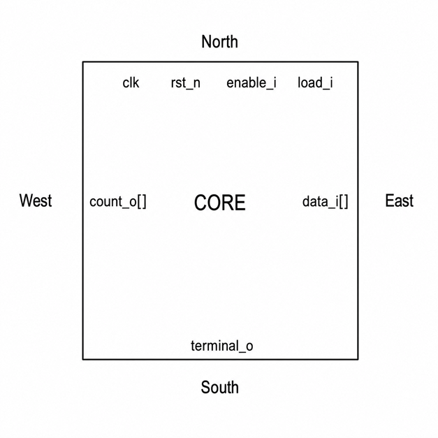

# Lab 5: Floorplan and Pin Placement

## 5.1 วัตถุประสงค์ของบทปฏิบัติการ

บทปฏิบัติการนี้ศึกษาการสร้าง Floorplan และการกำหนดตำแหน่งขาอินพุต/เอาต์พุตของวงจรดิจิทัลด้วย LibreLane โดยใช้ไฟล์ `config.yaml`

เมื่อจบบทปฏิบัติการ ผู้เรียนจะสามารถ:

1. อธิบายความแตกต่างระหว่าง Die Area และ Core Area
2. กำหนดขนาดชิปแบบ Absolute Floorplan
3. คำนวณขนาด Core, Core Margin และ Core Utilization
4. กำหนด Placement Density
5. กำหนดตำแหน่งขา I/O บนด้าน North, South, East และ West
6. ใช้ Regular Expression สำหรับจัดวางขาแบบ Bus
7. รัน LibreLane ถึงขั้น Custom I/O Placement
8. ตรวจสอบผลลัพธ์จากไฟล์ ODB, DEF และรายงานของ LibreLane
9. วิเคราะห์ปัญหาเกี่ยวกับขนาด Core, Placement Density และ Pin Placement

LibreLane รองรับไฟล์กำหนดค่าแบบ YAML ซึ่งประกอบด้วยคู่ key-value และรองรับค่าแบบ scalar, list, dictionary, PDK-specific configuration และ expression preprocessing. 

---

# 5.2 แนวคิดพื้นฐานของ Floorplanning

## 5.2.1 Floorplan คืออะไร

Floorplanning คือขั้นตอนกำหนดโครงสร้างทางกายภาพระดับต้นของวงจรรวม ก่อนเข้าสู่ขั้นตอน Standard-cell Placement

ข้อมูลสำคัญที่กำหนดในขั้นตอนนี้ ได้แก่:

- ขนาด Die
- ขนาด Core
- ขอบเขตสำหรับวาง Standard Cell
- ตำแหน่งของ I/O Pin
- Placement Row
- Routing Track
- Tap Cell และ End-cap Cell
- Power Distribution Network
- ตำแหน่งของ Hard Macro หากมี
- Routing Obstruction และ Placement Blockage

Floorplan ที่ดีช่วยลดปัญหา:

- Routing congestion
- Timing violation
- IR drop
- Pin-access failure
- Detailed placement failure
- Design-rule violation
- พื้นที่ชิปใหญ่เกินความจำเป็น

---

## 5.2.2 Die Area

Die Area คือพื้นที่ทางกายภาพทั้งหมดของบล็อกหรือชิป

กำหนดด้วยพิกัด:

```text
DIE_AREA = [x_lower_left, y_lower_left, x_upper_right, y_upper_right]
```

ตัวอย่าง:

```yaml
DIE_AREA: [0.0, 0.0, 300.0, 300.0]
```

หมายความว่า:

```text
จุดล่างซ้าย  = (0, 0)
จุดบนขวา    = (300, 300)
ความกว้าง Die = 300 µm
ความสูง Die   = 300 µm
พื้นที่ Die    = 90,000 µm²
```

---

## 5.2.3 Core Area

Core Area คือพื้นที่ภายใน Die ที่อนุญาตให้วาง Standard Cell และองค์ประกอบหลักของวงจร

ตัวอย่าง:

```yaml
CORE_AREA: [20.0, 20.0, 280.0, 280.0]
```

ดังนั้น:

```text
Core width  = 280 - 20 = 260 µm
Core height = 280 - 20 = 260 µm
Core area   = 260 × 260 = 67,600 µm²
```

Core Margin ในตัวอย่างนี้คือ:

```text
Left margin   = 20 µm
Right margin  = 300 - 280 = 20 µm
Bottom margin = 20 µm
Top margin    = 300 - 280 = 20 µm
```

พื้นที่ระหว่าง Die Boundary และ Core Boundary ใช้สำหรับ:

- I/O pin
- Power routing
- Core ring
- Routing channel
- Boundary cell
- Physical-only cell
- ระยะห่างจากขอบชิป

---

## 5.2.4 Absolute และ Relative Floorplan

LibreLane/OpenLane รองรับแนวคิดการกำหนด Floorplan สองรูปแบบหลัก

### Relative Floorplan

เครื่องมือคำนวณขนาด Die และ Core จาก:

- จำนวน Standard Cell
- Cell Area
- Core Utilization
- Aspect Ratio

ตัวอย่างแนวคิด:

```yaml
FP_SIZING: relative
FP_CORE_UTIL: 40
FP_ASPECT_RATIO: 1.0
```

### Absolute Floorplan

ผู้ใช้งานกำหนดพิกัด Die และ Core โดยตรง

```yaml
FP_SIZING: absolute
DIE_AREA: [0.0, 0.0, 300.0, 300.0]
CORE_AREA: [20.0, 20.0, 280.0, 280.0]
```

การกำหนด `FP_SIZING: absolute` ร่วมกับ `DIE_AREA` เป็นวิธีควบคุมขนาดทางกายภาพของบล็อกโดยตรง. 

ใน Lab นี้ใช้ Absolute Floorplan เพื่อให้ผู้เรียนเห็นความสัมพันธ์ระหว่าง:

- พิกัด
- ขนาด Die
- ขนาด Core
- Core Margin
- ตำแหน่ง I/O Pin

---

# 5.3 วงจรที่ใช้ในบทปฏิบัติการ

วงจรตัวอย่างคือ Counter ขนาด 8 บิต มีความสามารถ:

- Reset แบบ Active-low
- Load ค่าเริ่มต้น
- Enable การนับ
- ส่งค่าปัจจุบันออกทาง `count_o`
- ส่งสัญญาณ `terminal_o` เมื่อ Counter มีค่าทุกบิตเป็น 1

อินเทอร์เฟซของวงจรมีดังนี้:

| Signal | Direction | Width | Description |
|---|---:|---:|---|
| `clk` | Input | 1 | Clock |
| `rst_n` | Input | 1 | Active-low asynchronous reset |
| `enable_i` | Input | 1 | Count enable |
| `load_i` | Input | 1 | Parallel load control |
| `data_i` | Input | 8 | Parallel-load data |
| `count_o` | Output | 8 | Current counter value |
| `terminal_o` | Output | 1 | Terminal-count indicator |

การมีทั้งสัญญาณ Clock, Control และ Bus ทำให้สามารถทดลองแยกกลุ่มขาไปยังด้านต่าง ๆ ของ Floorplan ได้อย่างชัดเจน

---

# 5.4 โครงสร้างไดเรกทอรี

หลังแตกไฟล์ ZIP จะได้โครงสร้างดังนี้:

```text
lab5_floorplan_pin_placement/
├── config.yaml
├── Makefile
├── README.md
├── constraints/
│   └── pin_order.cfg
├── scripts/
│   └── check_pin_order.py
└── src/
    └── floorplan_demo.sv
```

หน้าที่ของแต่ละไฟล์:

| File | Description |
|---|---|
| `config.yaml` | กำหนดค่า LibreLane |
| `src/floorplan_demo.sv` | RTL ของวงจร |
| `constraints/pin_order.cfg` | กำหนดด้านและลำดับของ I/O pin |
| `scripts/check_pin_order.py` | ตรวจสอบว่า Pin Regex ครอบคลุมทุกพอร์ต |
| `Makefile` | รวมคำสั่ง Lint, Floorplan และ Full Flow |
| `README.md` | คู่มือย่อสำหรับใช้งานโครงการ |

---

# 5.5 ขั้นตอนที่ 1: เตรียมสภาพแวดล้อม

เข้าสู่ LibreLane environment ตามวิธีติดตั้งที่ใช้ใน Lab 1

ตรวจสอบคำสั่ง:

```bash
librelane --version
```

ตรวจสอบ Verilator:

```bash
verilator --version
```

ตรวจสอบ GNU Make:

```bash
make --version
```

ตรวจสอบว่า SKY130A PDK สามารถใช้งานได้:

```bash
librelane --pdk sky130A --help
```

จากนั้นเข้าสู่โฟลเดอร์ Lab:

```bash
cd lab5_floorplan_pin_placement
```

ตรวจสอบโครงสร้าง:

```bash
find . -maxdepth 3 -type f | sort
```

ผลที่คาดหวัง:

```text
./Makefile
./README.md
./config.yaml
./constraints/pin_order.cfg
./scripts/check_pin_order.py
./src/floorplan_demo.sv
```

---

# 5.6 ขั้นตอนที่ 2: สร้าง RTL

ไฟล์:

```text
src/floorplan_demo.sv
```

โค้ด:

```systemverilog
`default_nettype none

module floorplan_demo #(
    parameter int WIDTH = 8
) (
    input  logic             clk,
    input  logic             rst_n,
    input  logic             enable_i,
    input  logic             load_i,
    input  logic [WIDTH-1:0] data_i,
    output logic [WIDTH-1:0] count_o,
    output logic             terminal_o
);

    logic [WIDTH-1:0] count_q;
    logic [WIDTH-1:0] count_d;

    always_comb begin
        count_d = count_q;

        if (load_i) begin
            count_d = data_i;
        end else if (enable_i) begin
            count_d = count_q
                    + {{(WIDTH-1){1'b0}}, 1'b1};
        end
    end

    always_ff @(posedge clk or negedge rst_n) begin
        if (!rst_n) begin
            count_q <= '0;
        end else begin
            count_q <= count_d;
        end
    end

    assign count_o    = count_q;
    assign terminal_o = &count_q;

endmodule

`default_nettype wire
```

## 5.6.1 การทำงานของวงจร

ลำดับความสำคัญของวงจรคือ:

```text
Reset > Load > Enable > Hold
```

เมื่อ `rst_n = 0`:

```text
count_q = 0
```

เมื่อ `load_i = 1`:

```text
count_q = data_i
```

เมื่อ `enable_i = 1`:

```text
count_q = count_q + 1
```

เมื่อ `load_i = 0` และ `enable_i = 0`:

```text
count_q คงค่าเดิม
```

สัญญาณ Terminal Count:

```systemverilog
assign terminal_o = &count_q;
```

Reduction AND จะให้ค่า 1 เมื่อทุกบิตของ `count_q` เป็น 1:

```text
count_q = 8'b11111111
terminal_o = 1
```

---

# 5.7 ขั้นตอนที่ 3: ตรวจสอบ RTL ด้วย Verilator

รัน:

```bash
make lint
```

คำสั่งที่ Makefile เรียกใช้:

```bash
verilator --lint-only -Wall --timing \
    -Wno-fatal \
    --top-module floorplan_demo \
    src/floorplan_demo.sv
```

หาก RTL ถูกต้อง คำสั่งจะจบโดยไม่มี Error

ข้อผิดพลาดที่ควรแก้ก่อนรัน Physical Design ได้แก่:

- Undeclared signal
- Width mismatch
- Multiple driver
- Latch inference
- Combinational loop
- Syntax error
- Port mismatch
- Implicit net

---

# 5.8 ขั้นตอนที่ 4: สร้าง `config.yaml`

ไฟล์:

```text
config.yaml
```

โค้ด:

```yaml
DESIGN_NAME: floorplan_demo

VERILOG_FILES:
  - dir::src/floorplan_demo.sv

CLOCK_PORT: clk
CLOCK_PERIOD: 10.0

FP_SIZING: absolute
DIE_AREA: [0.0, 0.0, 300.0, 300.0]
CORE_AREA: [20.0, 20.0, 280.0, 280.0]

PL_TARGET_DENSITY_PCT: 45

IO_PIN_ORDER_CFG: dir::constraints/pin_order.cfg

RT_MIN_LAYER: met1
RT_MAX_LAYER: met5

FP_PDN_MULTILAYER: true

pdk::sky130A:
  STD_CELL_LIBRARY: sky130_fd_sc_hd
```

---

# 5.9 การอธิบายตัวแปรใน `config.yaml`

## 5.9.1 `DESIGN_NAME`

```yaml
DESIGN_NAME: floorplan_demo
```

กำหนดชื่อ Top-level module

ชื่อนี้ต้องตรงกับ:

```systemverilog
module floorplan_demo
```

หากชื่อไม่ตรง เครื่องมืออาจรายงานว่าไม่พบ Top Module

---

## 5.9.2 `VERILOG_FILES`

```yaml
VERILOG_FILES:
  - dir::src/floorplan_demo.sv
```

กำหนดรายการ RTL Source File

คำนำหน้า:

```text
dir::
```

หมายถึง path ที่อ้างอิงจากไดเรกทอรีที่เก็บ `config.yaml`

ข้อดีคือโครงการสามารถย้ายไปยังเครื่องอื่นได้โดยไม่ต้องแก้ Absolute Path

ตัวอย่างที่ไม่แนะนำ:

```yaml
VERILOG_FILES:
  - /home/user/project/src/floorplan_demo.sv
```

เพราะ path ดังกล่าวใช้ได้เฉพาะเครื่องเดิม

---

## 5.9.3 `CLOCK_PORT`

```yaml
CLOCK_PORT: clk
```

กำหนดชื่อพอร์ต Clock สำหรับ:

- Static Timing Analysis
- Clock constraint
- Clock Tree Synthesis
- Timing optimization

ชื่อต้องตรงกับพอร์ตใน RTL

---

## 5.9.4 `CLOCK_PERIOD`

```yaml
CLOCK_PERIOD: 10.0
```

หน่วยเป็นนาโนวินาที

ความถี่เป้าหมายคำนวณจาก:

```text
Frequency = 1 / Period
```

ดังนั้น:

```text
Period = 10 ns
Frequency = 1 / 10 ns
          = 100 MHz
```

---

## 5.9.5 `FP_SIZING`

```yaml
FP_SIZING: absolute
```

กำหนดให้ใช้ขนาด Die และ Core ตามพิกัดที่ระบุโดยผู้ใช้

เหมาะสำหรับ:

- การเรียนรู้ Floorplan
- Hard Macro
- Hierarchical Design
- การกำหนดขนาด Block ล่วงหน้า
- การสร้าง Block ที่ต้องเชื่อมต่อกับ Parent Design
- การทดลอง Pin Placement

---

## 5.9.6 `DIE_AREA`

```yaml
DIE_AREA: [0.0, 0.0, 300.0, 300.0]
```

รูปแบบ:

```text
[xmin, ymin, xmax, ymax]
```

คำนวณ:

```text
Die width  = xmax - xmin
           = 300 - 0
           = 300 µm

Die height = ymax - ymin
           = 300 - 0
           = 300 µm
```

---

## 5.9.7 `CORE_AREA`

```yaml
CORE_AREA: [20.0, 20.0, 280.0, 280.0]
```

คำนวณ:

```text
Core width  = 280 - 20 = 260 µm
Core height = 280 - 20 = 260 µm
```

Core ต้องอยู่ภายใน Die เสมอ:

```text
die_xmin ≤ core_xmin < core_xmax ≤ die_xmax
die_ymin ≤ core_ymin < core_ymax ≤ die_ymax
```

---

## 5.9.8 `PL_TARGET_DENSITY_PCT`

```yaml
PL_TARGET_DENSITY_PCT: 45
```

กำหนด Target Placement Density เป็นเปอร์เซ็นต์

ความหมายโดยประมาณ:

```text
Standard-cell area
------------------------ × 100
Placeable core area
```

ค่า 45 หมายถึงเครื่องมือพยายามกระจาย Standard Cell โดยใช้ความหนาแน่นประมาณ 45%

LibreLane/OpenLane 2 ใช้ตัวแปร `PL_TARGET_DENSITY_PCT` ในตัวอย่าง YAML configuration และรองรับการคำนวณค่าจากตัวแปรอื่นผ่าน expression. 

แนวทางเริ่มต้นทั่วไป:

| Density | ลักษณะ |
|---:|---|
| 30–40% | พื้นที่หลวม Routing ง่าย แต่ใช้พื้นที่มาก |
| 40–55% | เหมาะสำหรับ Lab และวงจรทั่วไป |
| 55–70% | พื้นที่กระชับ แต่ Congestion สูงขึ้น |
| มากกว่า 70% | ต้องวิเคราะห์ Routability อย่างระมัดระวัง |

ค่าเหล่านี้เป็นแนวทางเริ่มต้น ไม่ใช่ข้อกำหนดตายตัว เพราะผลจริงขึ้นกับ:

- จำนวน Net
- Fanout
- Cell Library
- Routing Layer
- Macro
- Clock Tree
- Pin Distribution
- PDN Structure

---

## 5.9.9 `IO_PIN_ORDER_CFG`

```yaml
IO_PIN_ORDER_CFG: dir::constraints/pin_order.cfg
```

กำหนดไฟล์สำหรับ Custom I/O Placement

LibreLane ใช้ไฟล์นี้ร่วมกับขั้นตอน `Odb.CustomIOPlacement` เพื่อจัดตำแหน่งขาตามด้านและลำดับที่ผู้ใช้งานกำหนด. 

---

## 5.9.10 Routing Layer

```yaml
RT_MIN_LAYER: met1
RT_MAX_LAYER: met5
```

กำหนดช่วงชั้นโลหะที่ Global และ Detailed Routing สามารถใช้งานได้

ใน Lab นี้กำหนด:

```text
Minimum routing layer = met1
Maximum routing layer = met5
```

การกำหนด Routing Layer มีผลต่อ:

- Routing capacity
- Congestion
- Via count
- Signal delay
- Power routing interaction
- Pin accessibility

---

## 5.9.11 PDK-specific Configuration

```yaml
pdk::sky130A:
  STD_CELL_LIBRARY: sky130_fd_sc_hd
```

บล็อกนี้จะถูกประมวลผลเมื่อเลือก PDK ที่ตรงกับ `sky130A`

ข้อดีคือไฟล์เดียวสามารถรองรับหลาย PDK ได้ เช่น:

```yaml
pdk::sky130A:
  STD_CELL_LIBRARY: sky130_fd_sc_hd

pdk::gf180mcuD:
  STD_CELL_LIBRARY: gf180mcu_fd_sc_mcu7t5v0
```

YAML configuration ของ LibreLane รองรับ PDK-specific และ SCL-specific blocks ผ่าน prefix `pdk::` และ `scl::`. 

---

# 5.10 ขั้นตอนที่ 5: กำหนดตำแหน่ง I/O Pin

ไฟล์:

```text
constraints/pin_order.cfg
```

โค้ด:

```text
@min_distance=2.0
@bus_major

#N
clk
rst_n
enable_i
load_i

#E
data_i\[\d+\]

#S
terminal_o

#W
count_o\[\d+\]
```

---

# 5.11 ความหมายของแต่ละส่วนใน `pin_order.cfg`

## 5.11.1 การกำหนดด้าน

ไฟล์ Pin Placement แบ่งเป็น 4 ด้าน:

```text
#N = North
#S = South
#E = East
#W = West
```

LibreLane กำหนด section สำหรับทั้งสี่ทิศโดยใช้ `#N`, `#S`, `#E` และ `#W`. 

สำหรับ Lab นี้กำหนด:

| Side | Pin group |
|---|---|
| North | Clock, reset และ control |
| East | Input data bus |
| South | Status output |
| West | Counter output bus |

ภาพเชิงแนวคิด:

```text
                 North
       clk rst_n enable_i load_i
       ┌──────────────────────┐
       │                      │
 West  │                      │  East
 count │        CORE          │ data_i
 _o[]  │                      │   []
       │                      │
       └──────────────────────┘
               terminal_o
                  South

```


---

## 5.11.2 Minimum Pin Distance

```text
@min_distance=2.0
```

กำหนดระยะห่างขั้นต่ำระหว่างขาเป็น 2 µm

เครื่องมืออาจเพิ่มระยะให้มากกว่านี้ หากค่าที่กำหนดต่ำกว่าระยะขั้นต่ำตามกฎของ Technology หรือ Routing Track. 

การเว้นระยะขาที่เหมาะสมช่วยลด:

- Pin-access congestion
- Short circuit
- Routing conflict
- DRC violation
- จำนวน Via บริเวณขอบ Core

---

## 5.11.3 Bus-major Sorting

```text
@bus_major
```

กำหนดให้เรียงผลการจับ Regular Expression ตามชื่อ Bus ก่อน แล้วจึงเรียงหมายเลขบิต

ตัวอย่าง:

```text
count_o[0]
count_o[1]
count_o[2]
...
count_o[7]
```

LibreLane รองรับทั้ง `@bus_major` และ `@bit_major` สำหรับควบคุมการเรียงพอร์ตที่ Regular Expression จับได้. 

---

## 5.11.4 Single-bit Pin

ตัวอย่าง:

```text
clk
rst_n
enable_i
load_i
```

แต่ละบรรทัดเป็น Regular Expression

สำหรับชื่อธรรมดาที่ไม่มีอักขระพิเศษ สามารถใช้ชื่อ Signal โดยตรงได้

---

## 5.11.5 Bus Pin และ Regular Expression

ตัวอย่าง:

```text
data_i\[\d+\]
```

ความหมาย:

```text
data_i     ตรงกับชื่อ Bus
\[         ตรงกับอักขระ [
\d+        ตรงกับเลขหนึ่งหลักขึ้นไป
\]         ตรงกับอักขระ ]
```

จึงสามารถจับชื่อ:

```text
data_i[0]
data_i[1]
...
data_i[7]
```

เช่นเดียวกับ:

```text
count_o\[\d+\]
```

จะจับ:

```text
count_o[0]
count_o[1]
...
count_o[7]
```

วงเล็บเหลี่ยมเป็นอักขระพิเศษของ Regular Expression จึงต้อง Escape ด้วย Backslash เอกสาร LibreLane เตือนว่า pattern เช่น `x[0]` ไม่ได้จับชื่อ `x[0]` ตามตัวอักษร และควรเขียนเป็น `x\[0\]`. 

---

# 5.12 ขั้นตอนที่ 6: ตรวจสอบ Pin Pattern

รัน:

```bash
make pins
```

Makefile จะเรียก:

```bash
python3 scripts/check_pin_order.py
```

ผลที่คาดหวัง:

```text
PASS: all 21 ports match pin-order patterns.
```

จำนวนพอร์ตทั้งหมด:

```text
5 scalar ports
+ 8 data_i pins
+ 8 count_o pins
= 21 pins
```

หากมีพอร์ตที่ไม่ตรงกับ Pattern จะได้ผลลัพธ์ลักษณะ:

```text
ERROR: unmatched ports:
  - data_i[0]
  - data_i[1]
```

กรณีนี้ให้ตรวจสอบ:

- การ Escape `[ ]`
- การสะกดชื่อพอร์ต
- จำนวนบิตของ Bus
- ชื่อพอร์ตใน RTL
- Pattern ใน `pin_order.cfg`

---

# 5.13 ขั้นตอนที่ 7: ศึกษา Makefile

ไฟล์ `Makefile` มี Target สำคัญดังนี้:

```makefile
SHELL := /bin/bash

PDK ?= sky130A
CONFIG ?= config.yaml
TAG ?= lab5
```

เครื่องหมาย `?=` หมายถึงกำหนดค่า Default หากผู้ใช้ยังไม่ได้กำหนดค่าจาก Command Line

ตัวอย่าง:

```bash
make floorplan PDK=sky130A TAG=test01
```

ค่าที่ใช้จะเป็น:

```text
PDK = sky130A
TAG = test01
```

---

## 5.13.1 Target `lint`

```makefile
lint:
	verilator --lint-only -Wall --timing \
		-Wno-fatal \
		--top-module floorplan_demo \
		src/floorplan_demo.sv
```

ใช้งาน:

```bash
make lint
```

---

## 5.13.2 Target `pins`

```makefile
pins:
	python3 scripts/check_pin_order.py
```

ใช้งาน:

```bash
make pins
```

---

## 5.13.3 Target `floorplan`

```makefile
floorplan:
	librelane --pdk $(PDK) \
		--run-tag $(TAG)_floorplan \
		--to Odb.CustomIOPlacement \
		$(CONFIG)
```

ใช้งาน:

```bash
make floorplan
```

คำสั่งนี้ให้ LibreLane รันตั้งแต่ต้น Flow จนถึงขั้น:

```text
Odb.CustomIOPlacement
```

จึงเหมาะสำหรับ Lab ที่ต้องการเน้น:

- Synthesis
- Initial floorplan
- Core rows
- Tap/end-cap insertion
- PDN generation
- Initial placement ที่จำเป็น
- Custom I/O placement

โดยไม่ต้องรอ Routing และ Signoff ทั้ง Flow

---

## 5.13.4 Target `run`

```makefile
run:
	librelane --pdk $(PDK) \
		--run-tag $(TAG)_full \
		$(CONFIG)
```

ใช้งาน:

```bash
make run
```

คำสั่งนี้รัน Classic Flow จนครบขั้นตอน RTL-to-GDSII

---

## 5.13.5 Target `list-runs`

```bash
make list-runs
```

ใช้แสดงรายการ Run Directory

ตัวอย่าง:

```text
lab5_floorplan
lab5_full
```

---

## 5.13.6 Target `latest`

```bash
make latest
```

ใช้ค้นหา Run ล่าสุดและแสดงไฟล์สำคัญ เช่น:

- DEF
- ODB
- LEF
- GDS
- Report
- Metrics

---

## 5.13.7 Target `clean`

```bash
make clean
```

ลบ:

```text
runs/
```

ควรระวัง เพราะจะลบผลการรันทั้งหมดของ Lab

---

# 5.14 ขั้นตอนที่ 8: รัน Floorplan และ Pin Placement

แนะนำให้รันตามลำดับ:

```bash
make lint
make pins
make floorplan
```

หรือรันต่อเนื่อง:

```bash
make lint && make pins && make floorplan
```

เครื่องหมาย `&&` หมายถึงรันคำสั่งถัดไปเมื่อคำสั่งก่อนหน้าสำเร็จเท่านั้น

---

# 5.15 การติดตามผลระหว่างรัน

ระหว่างการรันควรสังเกตขั้นตอนสำคัญ เช่น:

```text
Yosys synthesis
Static timing analysis
Floorplan initialization
IO row generation
Tap and end-cap insertion
Power distribution network generation
Custom IO placement
```

หาก Flow สำเร็จ จะปรากฏ Run Directory:

```text
runs/lab5_floorplan/
```

โครงสร้างภายในอาจแตกต่างเล็กน้อยตามรุ่นของ LibreLane แต่โดยทั่วไปประกอบด้วย:

```text
runs/lab5_floorplan/
├── config.*
├── resolved.json
├── state_out.json
├── final/
├── ...
└── ขั้นตอนย่อยของ Flow
```

---

# 5.16 ขั้นตอนที่ 9: ค้นหาไฟล์ผลลัพธ์

รัน:

```bash
make latest
```

หรือค้นหาไฟล์ด้วยตนเอง:

```bash
find runs -type f -name "*.def" | sort
```

ค้นหา ODB:

```bash
find runs -type f -name "*.odb" | sort
```

ค้นหา LEF:

```bash
find runs -type f -name "*.lef" | sort
```

ค้นหา Report:

```bash
find runs -type f -name "*.rpt" | sort
```

ค้นหา Metrics:

```bash
find runs -type f \
    \( -name "metrics.csv" -o -name "metrics.json" \) \
    | sort
```

---

# 5.17 ขั้นตอนที่ 10: เปิด Floorplan ด้วย GUI

## วิธีที่ 1: เปิด ODB ด้วย OpenROAD

ค้นหาไฟล์ ODB ล่าสุด:

```bash
find runs -type f -name "*.odb" | sort
```

สมมติพบ:

```text
runs/lab5_floorplan/.../floorplan_demo.odb
```

เปิด GUI:

```bash
openroad -gui
```

ใน OpenROAD Tcl Console:

```tcl
read_db runs/lab5_floorplan/.../floorplan_demo.odb
```

จากนั้นเลือก:

```text
View → Fit
```

หรือใช้คำสั่ง:

```tcl
gui::fit
```

ควรเห็น:

- Die boundary
- Core boundary
- Placement row
- Standard cell
- PDN
- I/O pin
- Routing track
- Tap cell
- End-cap cell

---

## วิธีที่ 2: เปิด DEF ด้วย OpenROAD

```bash
openroad -gui
```

ใน Tcl Console:

```tcl
read_lef <technology-lef>
read_lef <standard-cell-lef>
read_def <result.def>
```

การเปิด ODB มักสะดวกกว่า เพราะรวมข้อมูลฐานข้อมูลทางกายภาพไว้มากกว่า DEF เพียงอย่างเดียว

---

## วิธีที่ 3: เปิดด้วย KLayout

หากรัน Full Flow แล้ว:

```bash
make run
```

ค้นหา GDS:

```bash
find runs -type f -name "*.gds"
```

เปิด:

```bash
klayout <path-to-gds>
```

GDS เหมาะสำหรับตรวจผล Layout ขั้นสุดท้าย ส่วน ODB/DEF เหมาะสำหรับตรวจ Floorplan และ Placement ระหว่าง Flow

---

# 5.18 สิ่งที่ต้องตรวจสอบใน GUI

## 5.18.1 Die และ Core

ตรวจสอบว่า:

```text
Die size  ≈ 300 µm × 300 µm
Core size ≈ 260 µm × 260 µm
Core margin ≈ 20 µm ทุกด้าน
```

---

## 5.18.2 ตำแหน่ง Clock และ Control Pin

ตรวจสอบด้าน North:

```text
clk
rst_n
enable_i
load_i
```

ลำดับควรสัมพันธ์กับลำดับใน `pin_order.cfg`

---

## 5.18.3 Input Bus

ตรวจสอบด้าน East:

```text
data_i[0]
data_i[1]
...
data_i[7]
```

---

## 5.18.4 Output Bus

ตรวจสอบด้าน West:

```text
count_o[0]
count_o[1]
...
count_o[7]
```

---

## 5.18.5 Status Pin

ตรวจสอบด้าน South:

```text
terminal_o
```

---

## 5.18.6 Pin Spacing

ตรวจสอบว่าขาไม่ซ้อนกัน และมีระยะห่างอย่างน้อยตามที่ Legal Track อนุญาต

ค่า:

```text
@min_distance=2.0
```

เป็นคำขอขั้นต่ำ เครื่องมืออาจขยับขาให้ตรง Routing Track หรือ Design Rule

---

## 5.18.7 Standard-cell Placement

สำหรับวงจรขนาดเล็ก Cell จะใช้พื้นที่เพียงส่วนน้อยของ Core

ลักษณะนี้เป็นเจตนาของ Lab เพราะต้องการเน้น:

- Floorplan geometry
- Pin side
- Pin order
- Core margin

ไม่ใช่การบีบพื้นที่ให้เล็กที่สุด

---

# 5.19 ขั้นตอนที่ 11: ตรวจสอบพิกัดจาก DEF

ค้นหา DEF:

```bash
DEF_FILE=$(find runs -type f -name "*.def" | sort | tail -1)
echo "$DEF_FILE"
```

ตรวจสอบส่วน Die Area:

```bash
grep "DIEAREA" "$DEF_FILE"
```

อาจได้ผลลักษณะ:

```text
DIEAREA ( 0 0 ) ( 300000 300000 ) ;
```

ค่าใน DEF มักอยู่ใน Database Unit ไม่ใช่ไมโครเมตรโดยตรง

หาก:

```text
UNITS DISTANCE MICRONS 1000
```

จะได้:

```text
300000 database units / 1000
= 300 µm
```

ตรวจสอบ Unit:

```bash
grep "UNITS DISTANCE MICRONS" "$DEF_FILE"
```

ตรวจสอบ Pin Section:

```bash
grep -n "^PINS" "$DEF_FILE"
```

ดูรายละเอียด Pin:

```bash
sed -n '/^PINS/,/^END PINS/p' "$DEF_FILE"
```

ค้นหา Clock Pin:

```bash
grep -A8 -B2 -- "- clk" "$DEF_FILE"
```

ค้นหา Data Bus:

```bash
grep -A8 -B2 -- "- data_i" "$DEF_FILE"
```

---

# 5.20 ขั้นตอนที่ 12: รัน Full RTL-to-GDSII Flow

หลังตรวจสอบ Floorplan แล้ว ให้รัน:

```bash
make run
```

Flow จะดำเนินต่อไปยังขั้นตอน:

1. Logic synthesis
2. Floorplanning
3. Pin placement
4. Power distribution
5. Global placement
6. Detailed placement
7. Clock Tree Synthesis
8. Timing optimization
9. Global routing
10. Detailed routing
11. Parasitic extraction
12. Static timing analysis
13. DRC
14. LVS
15. GDS generation

ตรวจสอบ Run:

```bash
make list-runs
```

ตรวจสอบไฟล์สุดท้าย:

```bash
make latest
```

---

# 5.21 การทดลองที่ 1: เปลี่ยนตำแหน่ง Bus

แก้ไข `constraints/pin_order.cfg`

จากเดิม:

```text
#E
data_i\[\d+\]

#W
count_o\[\d+\]
```

เปลี่ยนเป็น:

```text
#E
count_o\[\d+\]

#W
data_i\[\d+\]
```

ลบ Run เดิมหรือเปลี่ยน Tag:

```bash
make floorplan TAG=swap_bus
```

เปรียบเทียบ:

- Pin location
- Net length โดยประมาณ
- Routing direction
- Congestion บริเวณขอบ Core

---

# 5.22 การทดลองที่ 2: เปลี่ยน Die Area

แก้ไข:

```yaml
DIE_AREA: [0.0, 0.0, 200.0, 200.0]
CORE_AREA: [20.0, 20.0, 180.0, 180.0]
```

รัน:

```bash
make floorplan TAG=die200
```

เปรียบเทียบกับ:

```yaml
DIE_AREA: [0.0, 0.0, 300.0, 300.0]
CORE_AREA: [20.0, 20.0, 280.0, 280.0]
```

ประเด็นวิเคราะห์:

- Pin spacing ลดลงหรือไม่
- PDN มีพื้นที่เพียงพอหรือไม่
- Core row ลดลงเท่าใด
- Routing congestion เปลี่ยนแปลงอย่างไร
- Full Flow ยังผ่านหรือไม่

สำหรับ SKY130 การใช้บล็อกที่เล็กเกินไปอาจทำให้ Power Grid จัดวางได้ยาก เอกสาร OpenLane รุ่นก่อนจึงแนะนำให้หลีกเลี่ยง Macro ขนาดเล็กมากหรือใช้ Die ที่ใหญ่กว่า 200 × 200 µm ในบางตัวอย่าง. 

---

# 5.23 การทดลองที่ 3: เปลี่ยน Core Margin

แก้ไข:

```yaml
DIE_AREA: [0.0, 0.0, 300.0, 300.0]
CORE_AREA: [10.0, 10.0, 290.0, 290.0]
```

Core Margin เหลือ:

```text
10 µm ทุกด้าน
```

รัน:

```bash
make floorplan TAG=margin10
```

เปรียบเทียบกับ Margin 20 µm:

```text
Core พื้นที่ใหญ่ขึ้น
ระยะระหว่าง Core และ Die ลดลง
พื้นที่สำหรับ Pin และ Power Routing ลดลง
```

คำถามที่ควรวิเคราะห์:

- Pin ยังเข้าถึงได้ง่ายหรือไม่
- Power stripe อยู่ใกล้ Pin เกินไปหรือไม่
- Routing channel ระหว่าง Pin และ Cell เหลือเพียงพอหรือไม่

---

# 5.24 การทดลองที่ 4: เปลี่ยน Placement Density

ทดลองสามค่า:

```yaml
PL_TARGET_DENSITY_PCT: 35
```

```yaml
PL_TARGET_DENSITY_PCT: 50
```

```yaml
PL_TARGET_DENSITY_PCT: 65
```

รัน:

```bash
make run TAG=density35
make run TAG=density50
make run TAG=density65
```

เปรียบเทียบ:

- Cell distribution
- Wirelength
- Congestion
- Timing
- Number of routing violations
- Detailed-placement legality
- Runtime

สำหรับวงจรตัวอย่างที่มีขนาดเล็กมาก ความแตกต่างอาจไม่ชัดเจน ควรเพิ่มขนาด RTL หรือใช้วงจรจาก Lab ก่อนหน้าเพื่อศึกษาผลของ Density อย่างจริงจัง

---

# 5.25 การทดลองที่ 5: ใช้ Virtual Pin

ไฟล์ Pin Placement รองรับ Virtual Pin ด้วยเครื่องหมาย `$`

ตัวอย่าง:

```text
#N
clk
$2
rst_n
enable_i
load_i
```

`$2` หมายถึงเว้นช่องเทียบเท่าขาเสมือนสองตำแหน่งระหว่าง `clk` และ `rst_n` ฟังก์ชัน Virtual Pin ใช้สำหรับสร้างช่องว่างโดยไม่ต้องมีพอร์ตจริง. 

ประโยชน์:

- แยก Clock ออกจาก Control Pin
- เตรียมพื้นที่สำหรับสัญญาณในอนาคต
- ลด Pin congestion
- จัดกลุ่ม Interface ให้ชัดเจน

---

# 5.26 ปัญหาที่พบบ่อยและแนวทางแก้ไข

## ปัญหา 1: ไม่พบ Top Module

อาการ:

```text
Module floorplan_demo not found
```

ตรวจสอบ:

```yaml
DESIGN_NAME: floorplan_demo
```

ต้องตรงกับ:

```systemverilog
module floorplan_demo
```

---

## ปัญหา 2: ไม่พบ RTL File

อาการ:

```text
No such file or directory:
src/floorplan_demo.sv
```

ตรวจสอบ:

```bash
pwd
ls -l src/floorplan_demo.sv
```

ตรวจสอบ `config.yaml`:

```yaml
VERILOG_FILES:
  - dir::src/floorplan_demo.sv
```

---

## ปัญหา 3: Pin Pattern ไม่จับ Bus

ตัวอย่างที่ผิด:

```text
data_i[0]
```

Regular Expression นี้ไม่ได้หมายถึงอักขระวงเล็บเหลี่ยมตามตัวอักษร

แก้เป็น:

```text
data_i\[0\]
```

หรือใช้ทั้ง Bus:

```text
data_i\[\d+\]
```

---

## ปัญหา 4: มี Pin ไม่ถูกจัดวาง

รัน:

```bash
make pins
```

จากนั้นเปรียบเทียบชื่อพอร์ต:

```bash
grep -E "input|output" src/floorplan_demo.sv
```

กับ:

```bash
cat constraints/pin_order.cfg
```

---

## ปัญหา 5: Core Area อยู่นอก Die Area

ตัวอย่างที่ผิด:

```yaml
DIE_AREA: [0.0, 0.0, 300.0, 300.0]
CORE_AREA: [20.0, 20.0, 320.0, 280.0]
```

เพราะ:

```text
core_xmax = 320
die_xmax  = 300
```

แก้ให้ Core อยู่ภายใน Die:

```yaml
CORE_AREA: [20.0, 20.0, 280.0, 280.0]
```

---

## ปัญหา 6: Detailed Placement Failed

อาการอาจมีข้อความ:

```text
DPL-0036 Detailed placement failed
```

สาเหตุที่เป็นไปได้:

- Core เล็กเกินไป
- Placement density สูงเกินไป
- Cell overlap
- Macro blockage
- Placement row ไม่เพียงพอ
- PDN กีดขวางพื้นที่วาง Cell

แนวทางแก้:

1. เพิ่ม Core Area
2. ลด `PL_TARGET_DENSITY_PCT`
3. เพิ่ม Die Area
4. ตรวจสอบ Macro Placement
5. ตรวจสอบ Placement Blockage
6. ตรวจสอบ PDN Obstruction

---

## ปัญหา 7: Global Placement แจ้ง Density ต่ำเกินไป

อาการ:

```text
Use a higher density or re-floorplan
with a larger core area
```

แนวทางพิจารณา:

- ปรับ Target Density ตามค่าที่เครื่องมือแนะนำ
- ตรวจสอบว่า Core Area ใหญ่เกินไปเมื่อเทียบกับจำนวน Cell หรือไม่
- ตรวจสอบการใช้หน่วยเปอร์เซ็นต์ของ `PL_TARGET_DENSITY_PCT`
- ทดลองค่า 40–55 ก่อน
- อย่าปรับ Density สูงมากโดยไม่ตรวจ Congestion

---

## ปัญหา 8: Pin Spacing ทำไม่ได้ตามที่กำหนด

หากกำหนด:

```text
@min_distance=0.1
```

แต่ Technology Rule ต้องการระยะมากกว่า เครื่องมือจะใช้ค่าขั้นต่ำที่ถูกกฎหมายแทน. 

แนวทางแก้:

- เพิ่ม Die หรือ Core edge length
- ลดจำนวน Pin ในด้านเดียว
- กระจาย Pin ไปหลายด้าน
- ใช้ Virtual Pin อย่างเหมาะสม
- ตรวจสอบ Routing Track และ Pin Layer

---

## ปัญหา 9: ไม่รู้ชื่อขั้นตอนสำหรับ `--to`

ตรวจสอบรายการขั้นตอนจาก LibreLane รุ่นที่ติดตั้ง:

```bash
librelane --help
```

หรือรัน Full Flow:

```bash
make run
```

ชื่อ Step อาจเปลี่ยนแปลงได้ระหว่าง LibreLane รุ่นต่าง ๆ หากรุ่นที่ใช้งานไม่มีชื่อ:

```text
Odb.CustomIOPlacement
```

ให้ตรวจสอบชื่อขั้นตอนจาก Log หรือ Documentation ของรุ่นที่ติดตั้ง แล้วแก้ Target `floorplan` ใน Makefile

---

# 5.27 เกณฑ์ตรวจรับผลการทดลอง

Lab ถือว่าผ่านเมื่อ:

- [ ] `make lint` ผ่าน
- [ ] `make pins` แสดงว่า Pin ครบ 21 ขา
- [ ] LibreLane อ่าน `config.yaml` ได้
- [ ] Synthesis ผ่าน
- [ ] Floorplan generation ผ่าน
- [ ] Die มีขนาดประมาณ 300 × 300 µm
- [ ] Core มีขนาดประมาณ 260 × 260 µm
- [ ] `clk`, `rst_n`, `enable_i`, `load_i` อยู่ด้าน North
- [ ] `data_i[7:0]` อยู่ด้าน East
- [ ] `terminal_o` อยู่ด้าน South
- [ ] `count_o[7:0]` อยู่ด้าน West
- [ ] ไม่มี Pin ซ้อนกัน
- [ ] สามารถเปิด ODB หรือ DEF เพื่อตรวจสอบได้
- [ ] สามารถอธิบายผลของ Density และ Core Margin ได้

---

# 5.28 แบบฝึกหัดท้ายบท

## แบบฝึกหัดที่ 1

คำนวณ Die Area และ Core Area จาก:

```yaml
DIE_AREA: [0.0, 0.0, 400.0, 300.0]
CORE_AREA: [25.0, 20.0, 375.0, 280.0]
```

ให้หา:

1. Die width
2. Die height
3. Die area
4. Core width
5. Core height
6. Core area
7. Margin ทั้งสี่ด้าน
8. Aspect ratio ของ Die
9. Aspect ratio ของ Core

---

## แบบฝึกหัดที่ 2

แก้ `pin_order.cfg` ให้ได้โครงสร้าง:

```text
North: clk, rst_n
East: data_i
South: enable_i, load_i, terminal_o
West: count_o
```

รัน Floorplan และแนบภาพ GUI

---

## แบบฝึกหัดที่ 3

เปรียบเทียบ:

```yaml
PL_TARGET_DENSITY_PCT: 35
```

กับ:

```yaml
PL_TARGET_DENSITY_PCT: 65
```

รายงาน:

- จำนวน Cell
- Core area
- Placement density
- Wirelength
- Congestion
- Timing slack
- Routing status

---

## แบบฝึกหัดที่ 4

เปลี่ยน Width ของ Counter เป็น 16 บิต:

```systemverilog
parameter int WIDTH = 16
```

ปรับ Script ตรวจสอบ Pin ให้รองรับ 16 บิต แล้วตรวจสอบว่า:

```text
data_i[0] ... data_i[15]
count_o[0] ... count_o[15]
```

ถูกจัดวางครบทุกขา

---

## แบบฝึกหัดที่ 5

สร้าง Pin Spacing สามกรณี:

```text
@min_distance=1.0
@min_distance=3.0
@min_distance=5.0
```

วัดและเปรียบเทียบระยะขาจาก DEF หรือ GUI

---

# 5.29 คำถามทบทวน

1. Die Area และ Core Area แตกต่างกันอย่างไร
2. เพราะเหตุใด Core Area ต้องอยู่ภายใน Die Area
3. Absolute Floorplan เหมาะกับงานประเภทใด
4. Placement Density สูงเกินไปส่งผลอย่างไร
5. Placement Density ต่ำเกินไปส่งผลอย่างไร
6. ทำไม Clock Pin ควรจัดวางอย่างมีแผน
7. Pin Placement มีผลต่อ Timing อย่างไร
8. Pin Placement มีผลต่อ Routing Congestion อย่างไร
9. เหตุใดวงเล็บเหลี่ยมของ Bus ต้อง Escape
10. `@bus_major` และ `@bit_major` แตกต่างกันอย่างไร
11. Virtual Pin มีประโยชน์อย่างไร
12. Core Margin มีผลต่อ PDN และ Routing อย่างไร
13. เหตุใด Floorplan ที่ผ่านขั้นตอนแรกอาจไม่ผ่าน Detailed Routing
14. เพราะเหตุใดควรทดลองหลาย Floorplan ก่อน Signoff
15. ODB, DEF, LEF และ GDS มีหน้าที่แตกต่างกันอย่างไร

---

# 5.30 สรุป

บทปฏิบัติการนี้แสดงกระบวนการสร้าง Floorplan และ Pin Placement ตั้งแต่ RTL จนถึงฐานข้อมูลทางกายภาพ โดยใช้ `config.yaml` เป็นศูนย์กลางการกำหนดค่า

ประเด็นสำคัญคือ:

```text
Floorplan ที่ดีไม่ได้หมายถึงเพียงมีพื้นที่วาง Cell เพียงพอ
แต่ต้องมีพื้นที่สำหรับ Pin Access, PDN, Clock Tree,
Signal Routing, Optimization และการแก้ Design Rule ด้วย
```

ไฟล์สำคัญของ Lab คือ:

```text
src/floorplan_demo.sv
config.yaml
constraints/pin_order.cfg
Makefile
scripts/check_pin_order.py
```

ลำดับคำสั่งหลัก:

```bash
make lint
make pins
make floorplan
make latest
```

และเมื่อตรวจสอบ Floorplan แล้ว:

```bash
make run
```

ผลจาก Lab นี้จะเป็นพื้นฐานสำหรับบทถัดไป ได้แก่:

- Standard-cell Placement
- Placement Optimization
- Clock Tree Synthesis
- Global Routing
- Detailed Routing
- Timing Closure
- Physical Verification
