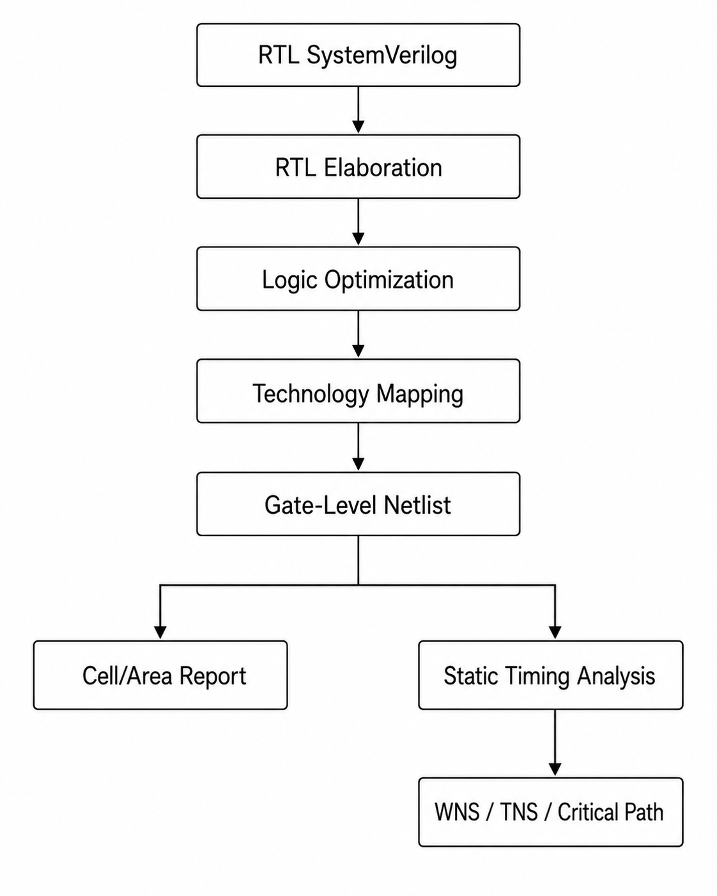

# Lab 6  
# Logic Synthesis and Static Timing Analysis ด้วย LibreLane

## 6.1 วัตถุประสงค์ของบทปฏิบัติการ

บทปฏิบัติการนี้มุ่งให้ผู้เรียนเข้าใจกระบวนการแปลงวงจรจากระดับ RTL ไปเป็นวงจรระดับเกตมาตรฐาน และตรวจสอบว่าวงจรที่สังเคราะห์แล้วสามารถทำงานได้ทันตามข้อกำหนดของระบบหรือไม่

หลังจบบทปฏิบัติการ ผู้เรียนจะสามารถ

1. อธิบายหน้าที่ของ Logic Synthesis และ Static Timing Analysis ได้
2. เตรียม RTL สำหรับการสังเคราะห์ด้วย LibreLane
3. กำหนดค่าโครงการผ่านไฟล์ `config.yaml`
4. เขียนข้อกำหนดด้านเวลาผ่านไฟล์ SDC
5. รันขั้นตอน Synthesis และ Pre-PnR STA
6. ตรวจสอบ synthesized netlist
7. อ่านรายงานจำนวนเซลล์ พื้นที่ และ critical path
8. วิเคราะห์ค่า setup slack, hold slack, WNS และ TNS
9. ทดลองปรับ clock period และสังเกตผลกระทบต่อ timing
10. แก้ไขปัญหาเบื้องต้นที่เกิดขึ้นระหว่าง Synthesis และ STA

---

## 6.2 ภาพรวมของ Lab

เส้นทางข้อมูลใน Lab นี้คือ



LibreLane เป็นโครงสร้างพื้นฐานสำหรับสร้าง ASIC implementation flow โดยกำหนดค่าการทำงานหลักผ่าน configuration file เพียงไฟล์เดียว และ default flow ที่ใช้ทั่วไปคือ `Classic` flow ส่วนการสังเคราะห์ RTL ภายใน flow ใช้ Yosys และการวิเคราะห์ timing ใช้ OpenROAD/OpenSTA. 

---

# 6.3 พื้นฐาน Logic Synthesis

## 6.3.1 Logic Synthesis คืออะไร

Logic Synthesis คือกระบวนการแปลงคำอธิบายวงจรระดับ RTL เช่น Verilog หรือ SystemVerilog ให้เป็นเครือข่ายของลอจิกเกตและเซลล์มาตรฐานจาก standard-cell library

ตัวอย่าง RTL:

```systemverilog
always_ff @(posedge clk_i) begin
    if (!rst_ni)
        count_q <= '0;
    else if (en_i)
        count_q <= count_q + 1'b1;
end
```

หลังการสังเคราะห์ วงจรนี้อาจถูกแปลงเป็น

```text
Flip-Flop bank
      +
Adder cells
      +
Multiplexer cells
      +
Inverter/Buffer cells
```

Yosys เป็นเครื่องมือสังเคราะห์ RTL ที่สามารถอ่าน Verilog ทำ elaboration, logic optimization และ map วงจรเข้ากับ ASIC standard-cell library ที่อธิบายด้วย Liberty format. 
---

## 6.3.2 ขั้นตอนสำคัญของ Synthesis

กระบวนการสังเคราะห์ประกอบด้วยขั้นตอนหลักดังนี้

### 1. RTL Parsing

เครื่องมืออ่าน syntax ของ Verilog/SystemVerilog และตรวจสอบว่า source code สามารถแปลความหมายได้หรือไม่

### 2. Elaboration

เครื่องมือสร้างโครงสร้างวงจรจาก module hierarchy โดยดำเนินการ เช่น

- กำหนด top-level module
- แทนค่าพารามิเตอร์
- ขยาย `generate` block
- เชื่อมต่อ instance
- คำนวณความกว้างของสัญญาณ
- ตรวจสอบ port และ net

### 3. RTL Optimization

เครื่องมือปรับวงจรให้ง่ายขึ้น เช่น

- constant propagation
- constant folding
- dead-code elimination
- redundant logic removal
- mux optimization
- arithmetic simplification

### 4. Technology-Independent Optimization

ลอจิกถูกปรับให้อยู่ในรูปแบบ Boolean network โดยยังไม่ผูกกับเซลล์ของ PDK

### 5. Technology Mapping

ลอจิกถูก map เข้ากับเซลล์ที่มีอยู่จริงใน standard-cell library เช่น

```text
AND2
OR2
NAND2
NOR2
XOR2
DFF
MUX2
INV
BUF
```

### 6. Gate-Level Netlist Generation

ผลลัพธ์สุดท้ายเป็น Verilog netlist ที่ประกอบด้วย instance ของ standard cells

---

# 6.4 พื้นฐาน Static Timing Analysis

## 6.4.1 Static Timing Analysis คืออะไร

Static Timing Analysis หรือ STA คือกระบวนการตรวจสอบ delay ของ timing path โดยไม่ต้องสร้าง simulation stimulus

STA วิเคราะห์ว่า

- ข้อมูลเดินทางจากต้นทางไปยังปลายทางใช้เวลาเท่าใด
- ข้อมูลมาถึงก่อนเวลาที่กำหนดหรือไม่
- ข้อมูลคงที่นานพอหลัง clock edge หรือไม่
- มี setup violation หรือ hold violation หรือไม่

ข้อกำหนด timing ของ LibreLane เขียนด้วยรูปแบบ SDC ซึ่งเป็นชุดคำสั่งบนพื้นฐาน Tcl สำหรับระบุ clock, input delay, output delay, uncertainty และ timing exceptions. 

---

## 6.4.2 ประเภทของ Timing Path

### Register-to-Register Path

```text
Launch Flip-Flop
      |
      v
Combinational Logic
      |
      v
Capture Flip-Flop
```

เป็นเส้นทางหลักสำหรับวิเคราะห์ setup และ hold timing

### Input-to-Register Path

```text
Input Port
    |
    v
Combinational Logic
    |
    v
Flip-Flop
```

ต้องกำหนด `set_input_delay`

### Register-to-Output Path

```text
Flip-Flop
    |
    v
Combinational Logic
    |
    v
Output Port
```

ต้องกำหนด `set_output_delay`

### Input-to-Output Path

```text
Input Port
    |
    v
Combinational Logic
    |
    v
Output Port
```

ใช้กับวงจร combinational หรือเส้นทาง combinational ภายใน block

---

## 6.4.3 Arrival Time

Arrival time คือเวลาที่ข้อมูลมาถึงปลายทาง

สำหรับ register-to-register path สามารถประมาณได้จาก

```text
Data Arrival Time
= Launch Clock Arrival
+ Clock-to-Q Delay
+ Combinational Delay
+ Routing Delay
```

ในขั้น Pre-PnR ยังไม่มีสายสัญญาณจริง ดังนั้น routing delay เป็นเพียงค่าประมาณหรือ wire-load estimate ผล STA ในขั้นนี้จึงเหมาะสำหรับค้นหาปัญหาเชิงโครงสร้างของ RTL แต่ยังไม่ใช่ผล signoff ขั้นสุดท้าย

---

## 6.4.4 Required Time

Required time คือเวลาช้าที่สุดที่ข้อมูลต้องมาถึง capture register

ตัวอย่างอย่างง่าย:

```text
Required Time
= Clock Period
- Setup Time
- Clock Uncertainty
```

ในงานจริงต้องพิจารณาเพิ่มเติม เช่น

- launch clock latency
- capture clock latency
- clock skew
- timing derate
- clock reconvergence pessimism
- generated clock
- multicycle constraint

---

## 6.4.5 Slack

Slack คำนวณจาก

```text
Slack = Required Time - Arrival Time
```

การแปลผล:

```text
Slack > 0    Timing ผ่าน
Slack = 0    อยู่ที่ขอบข้อกำหนด
Slack < 0    Timing violation
```

ตัวอย่าง:

```text
Required Time = 10.00 ns
Arrival Time  =  8.70 ns
Slack         =  1.30 ns
```

Timing path นี้ผ่านข้อกำหนด 1.30 ns

อีกตัวอย่าง:

```text
Required Time = 5.00 ns
Arrival Time  = 5.42 ns
Slack         = -0.42 ns
```

Timing path นี้มี setup violation 0.42 ns

---

## 6.4.6 WNS และ TNS

### Worst Negative Slack: WNS

WNS คือ slack ที่แย่ที่สุดของ timing path ทั้งหมด

ตัวอย่าง:

```text
Path 1 slack =  0.35 ns
Path 2 slack = -0.12 ns
Path 3 slack = -0.48 ns
Path 4 slack =  0.08 ns
```

ดังนั้น

```text
WNS = -0.48 ns
```

### Total Negative Slack: TNS

TNS คือผลรวมของ negative slack ของทุก violating endpoint

```text
TNS = -0.12 + -0.48
    = -0.60 ns
```

โดยทั่วไป timing ที่ผ่านควรมี

```text
WNS >= 0
TNS = 0
```

---

# 6.5 วงจรที่ใช้ในบทปฏิบัติการ

Lab นี้ใช้วงจรชื่อ `synth_sta_top` ประกอบด้วย

- input register
- arithmetic datapath
- accumulator
- output register
- synchronous data processing
- asynchronous active-low reset

โครงสร้าง datapath คือ

```text
a_i ---->[Input Reg]---+
                       |
                       +--->[Multiply/Add]--->[Accumulator]--->[Output Reg]
                       |
b_i ---->[Input Reg]---+
```

การใช้ arithmetic datapath ทำให้เห็นผลของ technology mapping และ critical path ชัดเจนกว่าวงจร counter ขนาดเล็ก

---

# 6.6 โครงสร้างโครงการ

สร้างโครงสร้างไดเรกทอรีดังนี้

```text
lab6_synthesis_sta/
├── config.yaml
├── Makefile
├── README.md
├── src/
│   └── synth_sta_top.sv
├── constraints/
│   └── synth_sta_top.sdc
└── runs/
```

สร้างโครงการด้วยคำสั่ง

```bash
mkdir -p lab6_synthesis_sta/{src,constraints,runs}
cd lab6_synthesis_sta
```

ตรวจสอบโครงสร้าง:

```bash
find . -maxdepth 2 -type d | sort
```

ผลที่คาดหวัง:

```text
.
./constraints
./runs
./src
```

---

# 6.7 การสร้าง RTL

สร้างไฟล์

```text
src/synth_sta_top.sv
```

ใส่เนื้อหาต่อไปนี้

```systemverilog
`default_nettype none

module synth_sta_top #(
    parameter int unsigned DATA_WIDTH = 8,
    parameter int unsigned ACC_WIDTH  = 24
) (
    input  logic                     clk_i,
    input  logic                     rst_ni,
    input  logic                     valid_i,
    input  logic [DATA_WIDTH-1:0]    a_i,
    input  logic [DATA_WIDTH-1:0]    b_i,
    output logic                     valid_o,
    output logic [ACC_WIDTH-1:0]     result_o
);

    localparam int unsigned PRODUCT_WIDTH = 2 * DATA_WIDTH;

    logic [DATA_WIDTH-1:0]    a_q;
    logic [DATA_WIDTH-1:0]    b_q;
    logic                     valid_q;

    logic [PRODUCT_WIDTH-1:0] product_comb;
    logic [ACC_WIDTH-1:0]     product_ext;
    logic [ACC_WIDTH-1:0]     accumulator_q;

    /*
     * Input pipeline registers
     */
    always_ff @(posedge clk_i or negedge rst_ni) begin
        if (!rst_ni) begin
            a_q     <= '0;
            b_q     <= '0;
            valid_q <= 1'b0;
        end else begin
            valid_q <= valid_i;

            if (valid_i) begin
                a_q <= a_i;
                b_q <= b_i;
            end
        end
    end

    /*
     * Combinational arithmetic datapath
     */
    always_comb begin
        product_comb = a_q * b_q;
        product_ext  = {{(ACC_WIDTH-PRODUCT_WIDTH){1'b0}},
                        product_comb};
    end

    /*
     * Accumulator and output registers
     */
    always_ff @(posedge clk_i or negedge rst_ni) begin
        if (!rst_ni) begin
            accumulator_q <= '0;
            result_o      <= '0;
            valid_o       <= 1'b0;
        end else begin
            valid_o <= valid_q;

            if (valid_q) begin
                accumulator_q <= accumulator_q + product_ext;
                result_o      <= accumulator_q + product_ext;
            end
        end
    end

endmodule

`default_nettype wire
```

---

## 6.7.1 การอธิบาย RTL

### Parameter

```systemverilog
parameter int unsigned DATA_WIDTH = 8,
parameter int unsigned ACC_WIDTH  = 24
```

`DATA_WIDTH` กำหนดขนาด operand ส่วน `ACC_WIDTH` กำหนดขนาด accumulator

เมื่อใช้ค่าเริ่มต้น

```text
a_i width       = 8 bits
b_i width       = 8 bits
product width   = 16 bits
accumulator     = 24 bits
```

### Input Pipeline Registers

```systemverilog
if (valid_i) begin
    a_q <= a_i;
    b_q <= b_i;
end
```

input ถูกเก็บใน register เมื่อ `valid_i` เป็นหนึ่ง

### Multiplication

```systemverilog
product_comb = a_q * b_q;
```

เครื่องมือ synthesis จะสร้าง multiplier network จาก standard cells เนื่องจาก standard-cell library ทั่วไปไม่มี multiplier macro สำหรับวงจรขนาดนี้

### Accumulation

```systemverilog
accumulator_q <= accumulator_q + product_ext;
```

เส้นทางนี้ประกอบด้วย multiplier และ adder จึงมีโอกาสเป็น critical path

---

## 6.7.2 ข้อควรระวังเรื่อง Parameter Width

นิพจน์

```systemverilog
{{(ACC_WIDTH-PRODUCT_WIDTH){1'b0}}, product_comb}
```

กำหนดให้

```text
ACC_WIDTH >= PRODUCT_WIDTH
```

สำหรับค่าปัจจุบัน:

```text
ACC_WIDTH     = 24
PRODUCT_WIDTH = 16
```

จึงสามารถ zero-extend ได้ 8 บิต

หากปรับ parameter ควรรักษาเงื่อนไขนี้ไว้เสมอ

---

# 6.8 การสร้าง SDC Constraint

สร้างไฟล์

```text
constraints/synth_sta_top.sdc
```

ใส่เนื้อหาต่อไปนี้

```tcl
# ============================================================
# Clock definition
# ============================================================

set clk_port [get_ports clk_i]

create_clock \
    -name core_clk \
    -period 10.000 \
    -waveform {0.000 5.000} \
    $clk_port

# ============================================================
# Clock quality assumptions
# ============================================================

set_clock_uncertainty 0.250 [get_clocks core_clk]
set_clock_transition  0.150 [get_clocks core_clk]

# ============================================================
# Input timing constraints
# ============================================================

set non_clock_inputs [remove_from_collection \
    [all_inputs] \
    [get_ports clk_i]]

set_input_delay 2.000 \
    -clock [get_clocks core_clk] \
    $non_clock_inputs

set_input_transition 0.150 $non_clock_inputs

# ============================================================
# Output timing constraints
# ============================================================

set_output_delay 4.000 \
    -clock [get_clocks core_clk] \
    [all_outputs]

# Representative output capacitive load
set_load 0.033442 [all_outputs]
```

---

## 6.8.1 ความหมายของ Clock Constraint

```tcl
create_clock \
    -name core_clk \
    -period 10.000 \
    -waveform {0.000 5.000} \
    [get_ports clk_i]
```

กำหนด clock ชื่อ `core_clk`

```text
Clock period = 10 ns
Frequency    = 1 / 10 ns
             = 100 MHz
```

รูปคลื่นคือ

```text
Rising edge  = 0 ns
Falling edge = 5 ns
Next rising  = 10 ns
```

ดังนั้น duty cycle เท่ากับ 50%

---

## 6.8.2 Clock Uncertainty

```tcl
set_clock_uncertainty 0.250 [get_clocks core_clk]
```

กำหนด timing margin 0.25 ns เพื่อแทนผลกระทบ เช่น

- clock jitter
- clock skew ที่คาดการณ์
- modeling uncertainty
- implementation variation

uncertainty ที่มากขึ้นจะลดเวลาที่ datapath สามารถใช้ได้

---

## 6.8.3 Clock Transition

```tcl
set_clock_transition 0.150 [get_clocks core_clk]
```

กำหนด transition time ที่คาดไว้ของ clock เท่ากับ 0.15 ns

transition time มีผลต่อ

- cell delay
- setup time
- hold time
- dynamic power
- buffer selection

---

## 6.8.4 Input Delay

```tcl
set_input_delay 2.000 \
    -clock [get_clocks core_clk] \
    $non_clock_inputs
```

หมายความว่าอุปกรณ์ภายนอกอาจส่งข้อมูลมาถึง input ของ block หลัง clock edge สูงสุด 2 ns

ดังนั้น input-to-register path จะเหลือเวลาภายใน block โดยประมาณ

```text
10.00 - 2.00 - uncertainty - setup
```

---

## 6.8.5 Output Delay

```tcl
set_output_delay 4.000 \
    -clock [get_clocks core_clk] \
    [all_outputs]
```

หมายความว่าระบบภายนอกต้องการเวลา 4 ns สำหรับรับข้อมูลหลังออกจาก block

เวลาที่วงจรภายในใช้ได้สำหรับ register-to-output path จะลดลงตามค่า output delay

---

## 6.8.6 Output Load

```tcl
set_load 0.033442 [all_outputs]
```

กำหนด capacitive load ของ output port

ค่า load มีผลต่อ

- output cell delay
- slew
- buffer sizing
- timing optimization

หน่วยของ load ขึ้นกับหน่วยที่ประกาศใน Liberty library ของ PDK

---

# 6.9 การสร้าง config.yaml

สร้างไฟล์

```text
config.yaml
```

ใส่เนื้อหาต่อไปนี้

```yaml
# ============================================================
# Lab 6: Synthesis and Static Timing Analysis
# ============================================================

DESIGN_NAME: synth_sta_top

VERILOG_FILES:
  - dir::src/synth_sta_top.sv

# ============================================================
# Clock configuration
# ============================================================

CLOCK_PORT: clk_i
CLOCK_PERIOD: 10.0

# ============================================================
# Timing constraint files
# ============================================================

PNR_SDC_FILE: dir::constraints/synth_sta_top.sdc
SIGNOFF_SDC_FILE: dir::constraints/synth_sta_top.sdc

# ============================================================
# Synthesis configuration
# ============================================================

SYNTH_STRATEGY: AREA 0
MAX_FANOUT_CONSTRAINT: 10

# ============================================================
# Floorplan defaults required by the later Classic-flow stages
# ============================================================

FP_SIZING: relative
FP_CORE_UTIL: 40
PL_TARGET_DENSITY_PCT: 45

# ============================================================
# Routing layer limits
# Values below are suitable for the common sky130 setup.
# Check the selected PDK if a different process is used.
# ============================================================

RT_MIN_LAYER: met1
RT_MAX_LAYER: met5
```

LibreLane รองรับ configuration file แบบ YAML และ JSON ส่วนตัวอย่างขั้นต่ำโดยทั่วไปประกอบด้วย `DESIGN_NAME`, `VERILOG_FILES`, `CLOCK_PORT`, `CLOCK_PERIOD` และ PDK ที่เลือกใช้. 

---

## 6.9.1 การอ้างตำแหน่งไฟล์ด้วย dir::

ตัวอย่าง:

```yaml
VERILOG_FILES:
  - dir::src/synth_sta_top.sv
```

`dir::` หมายถึง path ที่สัมพันธ์กับตำแหน่งของไฟล์ configuration

ข้อดีคือโครงการสามารถย้ายไปยัง directory อื่นได้โดยไม่ต้องแก้ absolute path

ควรใช้

```yaml
dir::src/synth_sta_top.sv
```

แทน

```yaml
/home/user/projects/lab6/src/synth_sta_top.sv
```

---

## 6.9.2 DESIGN_NAME

```yaml
DESIGN_NAME: synth_sta_top
```

ชื่อนี้ต้องตรงกับชื่อ top-level module:

```systemverilog
module synth_sta_top #(
```

หากชื่อไม่ตรง เครื่องมืออาจรายงานว่าไม่พบ top module หรือ design hierarchy ไม่ถูกต้อง

---

## 6.9.3 VERILOG_FILES

```yaml
VERILOG_FILES:
  - dir::src/synth_sta_top.sv
```

เมื่อมีหลายไฟล์สามารถเขียนได้ดังนี้

```yaml
VERILOG_FILES:
  - dir::src/package.sv
  - dir::src/alu.sv
  - dir::src/register_file.sv
  - dir::src/synth_sta_top.sv
```

ควรเรียงลำดับให้ package และไฟล์ dependency ปรากฏก่อน module ที่เรียกใช้งาน

---

## 6.9.4 CLOCK_PORT และ CLOCK_PERIOD

```yaml
CLOCK_PORT: clk_i
CLOCK_PERIOD: 10.0
```

ค่าทั้งสองต้องสอดคล้องกับไฟล์ SDC

ใน `config.yaml`:

```yaml
CLOCK_PERIOD: 10.0
```

ใน SDC:

```tcl
create_clock -period 10.000 ...
```

ไม่ควรตั้งค่าแตกต่างกัน เพราะอาจทำให้แต่ละขั้นตอนของ flow ใช้ constraint ไม่ตรงกัน

---

## 6.9.5 PNR_SDC_FILE

```yaml
PNR_SDC_FILE: dir::constraints/synth_sta_top.sdc
```

เป็น constraint สำหรับขั้นตอน implementation เช่น

- synthesis-related timing setup
- floorplanning
- placement
- clock tree synthesis
- routing
- in-flow timing analysis

---

## 6.9.6 SIGNOFF_SDC_FILE

```yaml
SIGNOFF_SDC_FILE: dir::constraints/synth_sta_top.sdc
```

เป็น constraint ที่ใช้ในขั้น signoff timing analysis

สำหรับ Lab นี้ใช้ SDC เดียวกันทั้ง PnR และ signoff เพื่อให้ผลการวิเคราะห์มีฐาน constraint เดียวกัน

ในโครงการขนาดใหญ่ อาจแยกเป็น

```text
constraints/pnr.sdc
constraints/signoff.sdc
```

เพื่อให้ signoff constraint มีรายละเอียดเพิ่มเติม เช่น

- timing exceptions
- propagated clock
- clock groups
- generated clocks
- derating
- mode-specific constraints

---

## 6.9.7 SYNTH_STRATEGY

```yaml
SYNTH_STRATEGY: AREA 0
```

กำหนดแนวทาง optimization ระหว่าง synthesis

แนวคิดทั่วไปคือ

```text
AREA-oriented strategy
    เน้นลดจำนวนเกตและพื้นที่

DELAY-oriented strategy
    เน้นลด critical-path delay
```

ค่า strategy ที่รองรับอาจขึ้นกับเวอร์ชัน LibreLane และ synthesis step ที่ติดตั้ง จึงควรตรวจสอบ configuration reference ของเวอร์ชันที่ใช้งานก่อนเปลี่ยนค่า

---

## 6.9.8 MAX_FANOUT_CONSTRAINT

```yaml
MAX_FANOUT_CONSTRAINT: 10
```

กำหนดจำนวน load โดยประมาณสูงสุดที่ net หนึ่งควรขับ

net ที่มี fanout สูงอาจก่อให้เกิด

- propagation delay สูง
- transition ช้า
- capacitance สูง
- routing congestion
- จำเป็นต้องแทรก buffer

---

# 6.10 การสร้าง Makefile

สร้างไฟล์

```text
Makefile
```

ใส่เนื้อหาต่อไปนี้

```makefile
SHELL := /bin/bash

CONFIG      := config.yaml
RUN_TAG     ?= lab6
FLOW        ?= Classic
PDK         ?= sky130A

.PHONY: help check lint run synthesis reports metrics find-netlist clean

help:
	@echo "Lab 6: Synthesis and Static Timing Analysis"
	@echo ""
	@echo "Targets:"
	@echo "  make check         Check installed tools and source files"
	@echo "  make lint          Run Verilator lint"
	@echo "  make run           Run the LibreLane Classic flow"
	@echo "  make synthesis     Run through the pre-PnR STA boundary"
	@echo "  make reports       List synthesis and STA reports"
	@echo "  make metrics       Find metrics files"
	@echo "  make find-netlist  Find synthesized netlists"
	@echo "  make clean         Remove generated runs"
	@echo ""
	@echo "Variables:"
	@echo "  PDK=sky130A"
	@echo "  RUN_TAG=lab6"
	@echo "  FLOW=Classic"

check:
	@command -v librelane >/dev/null || \
		(echo "ERROR: librelane was not found in PATH"; exit 1)
	@command -v verilator >/dev/null || \
		echo "WARNING: verilator was not found in PATH"
	@test -f $(CONFIG) || \
		(echo "ERROR: $(CONFIG) does not exist"; exit 1)
	@test -f src/synth_sta_top.sv || \
		(echo "ERROR: RTL source does not exist"; exit 1)
	@test -f constraints/synth_sta_top.sdc || \
		(echo "ERROR: SDC file does not exist"; exit 1)
	@echo "LibreLane:"
	@librelane --version
	@echo "Configuration and source files are present."

lint:
	verilator \
		--lint-only \
		--Wall \
		--Wno-fatal \
		--top-module synth_sta_top \
		src/synth_sta_top.sv

run:
	librelane \
		--flow $(FLOW) \
		--pdk $(PDK) \
		--run-tag $(RUN_TAG) \
		$(CONFIG)

synthesis:
	librelane \
		--flow $(FLOW) \
		--pdk $(PDK) \
		--run-tag $(RUN_TAG) \
		--to OpenROAD.STAPrePNR \
		$(CONFIG)

reports:
	@echo "Synthesis and STA report candidates:"
	@find runs -type f \
		\( -iname "*synth*.rpt" \
		-o -iname "*timing*.rpt" \
		-o -iname "*sta*.rpt" \
		-o -iname "*area*.rpt" \
		-o -iname "*check*.rpt" \
		-o -iname "*.log" \) \
		2>/dev/null | sort

metrics:
	@find runs -type f \
		\( -name "metrics.csv" \
		-o -name "metrics.json" \
		-o -name "*metrics*.json" \) \
		2>/dev/null | sort

find-netlist:
	@find runs -type f \
		\( -name "*.nl.v" \
		-o -name "*.v" \
		-o -name "*.sv" \) \
		2>/dev/null | sort

clean:
	rm -rf runs
```

---

## 6.10.1 หมายเหตุเรื่อง `--to OpenROAD.STAPrePNR`

LibreLane มีขั้นตอน STA ก่อน physical implementation ชื่อ `OpenROAD.STAPrePNR` ใน Classic flow. 

อย่างไรก็ตาม CLI และชื่อ step อาจมีการเปลี่ยนแปลงระหว่าง release ให้ตรวจสอบเวอร์ชันด้วย

```bash
librelane --version
librelane --help
```

หากเวอร์ชันที่ติดตั้งไม่ยอมรับตัวเลือก

```text
--to OpenROAD.STAPrePNR
```

ให้ใช้

```bash
make run
```

แล้ววิเคราะห์รายงาน synthesis และ STA ที่เกิดขึ้นระหว่าง full Classic flow

---

# 6.11 ตรวจสอบสภาพแวดล้อม

รัน

```bash
make check
```

ผลที่คาดหวังมีลักษณะดังนี้

```text
LibreLane:
librelane x.y.z
Configuration and source files are present.
```

ตรวจสอบเครื่องมือเพิ่มเติม:

```bash
command -v librelane
command -v yosys
command -v openroad
command -v verilator
```

ในบาง installation ผู้ใช้จะเรียก LibreLane จาก Nix shell หรือ container ทำให้ `yosys` และ `openroad` อาจไม่ปรากฏใน host PATH โดยตรง แต่ LibreLane ยังสามารถเรียกเครื่องมือจาก environment ที่จัดเตรียมไว้ได้

เอกสาร LibreLane แนะนำ Nix เป็นหนึ่งในแนวทางหลักสำหรับการติดตั้งและจัดการ dependency. 

---

# 6.12 ตรวจสอบ RTL ก่อน Synthesis

รัน lint:

```bash
make lint
```

หรือรันโดยตรง:

```bash
verilator \
    --lint-only \
    --Wall \
    --Wno-fatal \
    --top-module synth_sta_top \
    src/synth_sta_top.sv
```

หากไม่มี error คำสั่งจะจบด้วย return code ศูนย์

ตรวจสอบ return code:

```bash
echo $?
```

ผลที่คาดหวัง:

```text
0
```

---

## 6.12.1 Warning ที่ควรตรวจสอบ

ไม่ควรละเลย warning ต่อไปนี้

```text
WIDTH
LATCH
MULTIDRIVEN
UNDRIVEN
UNOPTFLAT
CASEINCOMPLETE
PINMISSING
PINCONNECTEMPTY
```

ตัวอย่างปัญหา width mismatch:

```systemverilog
logic [7:0]  a;
logic [15:0] y;

assign y = a + 16'h0100;
```

ควรตรวจสอบ signedness และ operand sizing ให้ชัดเจน ไม่ควรแก้ด้วยการปิด warning โดยไม่วิเคราะห์ต้นเหตุ

---

# 6.13 รัน Synthesis และ Pre-PnR STA

รัน

```bash
make synthesis
```

คำสั่งที่ถูกเรียกคือ

```bash
librelane \
    --flow Classic \
    --pdk sky130A \
    --run-tag lab6 \
    --to OpenROAD.STAPrePNR \
    config.yaml
```

LibreLane จะดำเนินการโดยทั่วไปดังนี้

```text
1. Load and validate config.yaml
2. Resolve PDK configuration
3. Read RTL
4. Elaborate top-level design
5. Perform synthesis
6. Map logic to standard cells
7. Generate gate-level netlist
8. Run design checks
9. Run pre-PnR timing analysis
10. Save step states and metrics
```

แนวคิดของ LibreLane คือแต่ละ step รับ state ก่อนหน้า ประมวลผล และสร้าง state ใหม่ ทำให้สามารถตรวจสอบผลลัพธ์ระหว่างขั้นได้อย่างเป็นระบบ

---

## 6.13.1 รัน Full Classic Flow

หากต้องการให้ flow ทำงานต่อไปจนถึง GDSII ใช้

```bash
make run
```

หรือ

```bash
librelane \
    --flow Classic \
    --pdk sky130A \
    --run-tag lab6 \
    config.yaml
```

คำสั่ง configuration เดียวสามารถใช้รัน flow อัตโนมัติจาก RTL ไปจนถึงผล implementation ได้. 

---

# 6.14 ตรวจสอบ Run Directory

หลังรันสำเร็จ ตรวจสอบ directory:

```bash
find runs -maxdepth 3 -type d | sort
```

LibreLane แต่ละเวอร์ชันอาจจัดชื่อ directory แตกต่างกัน แต่โดยทั่วไปจะพบข้อมูลประเภทต่อไปนี้

```text
runs/
└── lab6/
    ├── config.yaml
    ├── resolved.json
    ├── state_out.json
    ├── final/
    └── step directories
```

ค้นหาไฟล์ทั้งหมด:

```bash
find runs/lab6 -type f | sort | less
```

ค้นหา log:

```bash
find runs/lab6 -type f -name "*.log" | sort
```

ค้นหารายงาน:

```bash
find runs/lab6 -type f -name "*.rpt" | sort
```

---

# 6.15 ตรวจสอบ Synthesis Log

ค้นหา log ที่เกี่ยวกับ Yosys:

```bash
find runs/lab6 -type f \
    \( -iname "*yosys*.log" -o -iname "*synth*.log" \) \
    | sort
```

อ่าน log:

```bash
less <ชื่อไฟล์-log>
```

ค้นหาข้อความสำคัญ:

```bash
grep -RniE \
    "error|warning|latch|undriven|multiple driver|number of cells|chip area" \
    runs/lab6
```

---

## 6.15.1 สิ่งที่ควรค้นหาใน Synthesis Log

### Top-Level Module

ตรวจสอบว่าเครื่องมือใช้

```text
synth_sta_top
```

เป็น top module

### Inferred Registers

ควรพบ register สำหรับ

```text
a_q
b_q
valid_q
accumulator_q
result_o
valid_o
```

### Inferred Latches

ไม่ควรพบ latch

ข้อความที่ต้องระวัง:

```text
Latch inferred
```

หากพบ หมายถึง combinational process อาจกำหนดค่า output ไม่ครบทุกเส้นทาง

### Multiple Drivers

ไม่ควรพบ

```text
multiple conflicting drivers
```

### Undriven Nets

ไม่ควรมี functional net ที่ไม่มี driver

### Removed Logic

เครื่องมืออาจลบ logic ที่ไม่มีผลต่อ output ซึ่งเป็นพฤติกรรมปกติ แต่ควรตรวจสอบว่ามิได้เกิดจากการเชื่อมต่อสัญญาณผิด

---

# 6.16 ตรวจสอบ Cell Statistics

ค้นหา cell statistics:

```bash
grep -RniE \
    "number of cells|cell count|chip area|area for cell type" \
    runs/lab6
```

รายงานตัวอย่างเชิงแนวคิด:

```text
Number of wires:               420
Number of wire bits:           685
Number of public wires:         16
Number of public wire bits:    120
Number of cells:               312
```

หลัง technology mapping อาจพบเซลล์ประเภท เช่น

```text
sky130_fd_sc_hd__and2_1
sky130_fd_sc_hd__or2_1
sky130_fd_sc_hd__xor2_1
sky130_fd_sc_hd__mux2_1
sky130_fd_sc_hd__dfxtp_1
sky130_fd_sc_hd__inv_1
sky130_fd_sc_hd__buf_1
```

ชื่อเซลล์จริงขึ้นกับ PDK และ standard-cell library ที่เลือก

---

## 6.16.1 วิเคราะห์จำนวน Flip-Flop

ประมาณจำนวน register bit จาก RTL:

```text
a_q            =  8 bits
b_q            =  8 bits
valid_q        =  1 bit
accumulator_q  = 24 bits
result_o       = 24 bits
valid_o        =  1 bit
--------------------------------
รวมโดยประมาณ    = 66 flip-flops
```

จำนวน flip-flop จริงอาจต่างจากนี้หาก synthesis

- รวม register
- ลบ register ที่ไม่จำเป็น
- เปลี่ยนโครงสร้าง logic
- map reset structure ไปยัง cell variant ต่างกัน

ให้นักศึกษาบันทึกจำนวน DFF ที่พบจากรายงานแล้วเปรียบเทียบกับค่าที่คำนวณจาก RTL

---

# 6.17 ตรวจสอบ Synthesized Netlist

ค้นหา netlist:

```bash
make find-netlist
```

หรือ

```bash
find runs/lab6 -type f \
    \( -name "*.nl.v" -o -name "*synth*.v" \) \
    | sort
```

เปิดไฟล์:

```bash
less <ชื่อไฟล์-netlist>
```

---

## 6.17.1 สิ่งที่ควรเห็นใน Gate-Level Netlist

RTL ก่อน synthesis:

```systemverilog
product_comb = a_q * b_q;
```

netlist หลัง synthesis จะไม่มี operator ระดับสูงในรูปเดิม แต่จะกลายเป็น instance ของเซลล์ เช่น

```verilog
sky130_fd_sc_hd__and2_1 u_001 (...);
sky130_fd_sc_hd__xor2_1 u_002 (...);
sky130_fd_sc_hd__mux2_1 u_003 (...);
sky130_fd_sc_hd__dfxtp_1 u_004 (...);
```

หมายเหตุ: รูปแบบจริงแตกต่างตาม synthesis strategy, library และ optimizer

---

## 6.17.2 ตรวจสอบว่าไม่มี Behavioral Construct

ค้นหา:

```bash
grep -nE "always|initial|posedge|negedge|assign.*\*" \
    <ชื่อไฟล์-netlist>
```

gate-level netlist ควรประกอบด้วย cell instances และ net connection เป็นหลัก

อย่างไรก็ตาม netlist บางรูปแบบอาจยังมี `assign` สำหรับ

- constant connections
- port aliases
- simple wiring
- tie values

การมี `assign` จึงไม่ได้หมายความว่า synthesis ล้มเหลวเสมอไป

---

# 6.18 ตรวจสอบ Timing Report

ค้นหารายงาน STA:

```bash
find runs/lab6 -type f \
    \( -iname "*sta*.rpt" \
    -o -iname "*timing*.rpt" \
    -o -iname "*max*.rpt" \
    -o -iname "*min*.rpt" \) \
    | sort
```

ค้นหาข้อมูล timing โดยตรง:

```bash
grep -RniE \
    "slack|wns|tns|startpoint|endpoint|required time|arrival time" \
    runs/lab6
```

---

## 6.18.1 โครงสร้าง Timing Path Report

รายงานตัวอย่าง:

```text
Startpoint: accumulator_q[3]
            (rising edge-triggered flip-flop)

Endpoint: result_o[7]
          (rising edge-triggered flip-flop)

Path Group: core_clk
Path Type: max

Point                                      Incr       Path
---------------------------------------------------------
clock core_clk (rise edge)                 0.00       0.00
clock network delay                        0.00       0.00
accumulator_q[3]/CLK                       0.00       0.00
accumulator_q[3]/Q                         0.18       0.18
combinational cell                         0.22       0.40
combinational cell                         0.31       0.71
combinational cell                         0.44       1.15
result_o[7]/D                              0.12       1.27

data arrival time                                     1.27

clock core_clk (rise edge)                10.00      10.00
clock uncertainty                         -0.25       9.75
library setup time                        -0.10       9.65

data required time                                    9.65
data arrival time                                    -1.27
---------------------------------------------------------
slack (MET)                                           8.38
```

ตัวเลขข้างต้นเป็นเพียงตัวอย่าง วิธีอ่านรายงานจริงเหมือนกัน

---

## 6.18.2 Startpoint

```text
Startpoint: accumulator_q[3]
```

คือจุดที่ข้อมูลเริ่มเดินทาง เช่น

- output pin ของ flip-flop
- primary input
- clock-gating output
- memory output

---

## 6.18.3 Endpoint

```text
Endpoint: result_o[7]
```

คือจุดที่ข้อมูลต้องมาถึง เช่น

- D pin ของ flip-flop
- primary output
- memory input
- asynchronous control pin

---

## 6.18.4 Path Group

```text
Path Group: core_clk
```

หมายถึง timing path ถูกวิเคราะห์สัมพันธ์กับ clock `core_clk`

ในระบบหลาย clock domain ควรตรวจสอบแต่ละ path group แยกกัน

---

## 6.18.5 Path Type

```text
Path Type: max
```

`max` ใช้ตรวจสอบ setup timing

```text
Path Type: min
```

`min` ใช้ตรวจสอบ hold timing

---

## 6.18.6 Incremental Delay และ Accumulated Delay

```text
Point                         Incr      Path
cell_A/Y                      0.15      0.15
cell_B/Y                      0.23      0.38
cell_C/Y                      0.31      0.69
```

`Incr` คือ delay ที่เพิ่มจาก element ปัจจุบัน

`Path` คือ delay สะสมตั้งแต่ต้นทาง

---

# 6.19 Setup Timing Analysis

## 6.19.1 Setup Check

setup check ตรวจสอบว่าข้อมูลมาถึง D pin ก่อน capture clock edge เร็วพอ

เงื่อนไขอย่างง่าย:

```text
Tclk-q + Tcomb + Troute
<=
Tperiod - Tsetup - Tuncertainty
```

หากด้านซ้ายมากกว่าด้านขวา จะเกิด setup violation

---

## 6.19.2 วิธีแก้ Setup Violation

แนวทางที่เป็นไปได้ ได้แก่

1. เพิ่ม clock period
2. ลดระดับ logic depth
3. เพิ่ม pipeline stage
4. ลด bit width
5. เปลี่ยนอัลกอริทึม
6. ใช้ synthesis strategy ที่เน้น delay
7. ใช้เซลล์ drive strength สูงขึ้น
8. ลด fanout
9. เพิ่ม buffer
10. ปรับ floorplan และ placement
11. ลด routing congestion
12. ปรับ clock uncertainty ให้ตรงกับสมมติฐานจริง
13. ตรวจสอบ false path หรือ multicycle path ที่ขาดหาย

ไม่ควรแก้ violation ด้วยการลด constraint โดยไม่มีเหตุผลทางสถาปัตยกรรม

---

# 6.20 Hold Timing Analysis

## 6.20.1 Hold Check

hold check ตรวจสอบว่าข้อมูลเก่ายังคงอยู่ที่ capture register นานพอหลัง clock edge

เงื่อนไขอย่างง่าย:

```text
Minimum Data Path Delay
>=
Hold Requirement
```

hold violation มักเกิดเมื่อเส้นทางข้อมูลสั้นเกินไป

---

## 6.20.2 วิธีแก้ Hold Violation

แนวทางทั่วไป ได้แก่

- เพิ่ม delay buffer บน data path
- ใช้เซลล์ที่ช้าลง
- ปรับ placement
- ปรับ clock skew
- ใช้ hold-fix optimization
- ตรวจสอบ clock definition
- ตรวจสอบ min-delay constraint

การเพิ่ม clock periodมักไม่แก้ hold violation เพราะ hold check พิจารณาขอบ clock ที่อยู่ใกล้กัน ไม่ได้อาศัยเวลาเต็มคาบในลักษณะเดียวกับ setup check

---

## 6.20.3 ข้อจำกัดของ Pre-PnR Hold Analysis

ก่อน placement และ clock-tree synthesis

- ยังไม่มีตำแหน่งเซลล์จริง
- ยังไม่มี routed wire
- clock network ยังเป็น ideal หรือประมาณค่า
- parasitic ยังไม่แม่นยำ

ดังนั้น hold result ก่อน PnR เป็นเพียง early indicator

ผล hold ที่มีความหมายมากขึ้นควรตรวจสอบหลัง

```text
Placement
CTS
Global Routing
Detailed Routing
Parasitic Extraction
```

---

# 6.21 ตรวจสอบ Metrics

ค้นหา metrics:

```bash
make metrics
```

หรือ

```bash
find runs/lab6 -type f \
    \( -name "metrics.csv" \
    -o -name "metrics.json" \
    -o -name "*metrics*.json" \) \
    | sort
```

ค้นหา timing metric:

```bash
grep -RniE \
    "\".*wns|\".*tns|setup.*slack|hold.*slack|cell.*count|area" \
    runs/lab6
```

ชื่อ metric อาจต่างตามเวอร์ชัน แต่ควรค้นหากลุ่มข้อมูลดังนี้

```text
timing
├── setup WNS
├── setup TNS
├── hold WNS
├── hold TNS
└── violating endpoint count

synthesis
├── cell count
├── sequential cell count
├── combinational cell count
└── area
```

---

# 6.22 ตารางบันทึกผลการทดลอง

ให้นักศึกษาบันทึกผลจาก run แรก

| รายการ | ค่าที่ได้ |
|---|---:|
| PDK | |
| Standard-cell library | |
| Clock period | 10.000 ns |
| Target frequency | 100 MHz |
| จำนวนเซลล์ทั้งหมด | |
| จำนวน sequential cells | |
| จำนวน combinational cells | |
| Estimated area | |
| Setup WNS | |
| Setup TNS | |
| Hold WNS | |
| Hold TNS | |
| Critical path startpoint | |
| Critical path endpoint | |
| Critical path type | |
| จำนวน violating endpoints | |

---

# 6.23 Experiment 1: เปลี่ยน Clock Period

สร้างสำเนา configuration:

```bash
cp config.yaml config_5ns.yaml
```

แก้ไข

```yaml
CLOCK_PERIOD: 5.0
```

และสร้าง SDC ใหม่:

```bash
cp constraints/synth_sta_top.sdc \
   constraints/synth_sta_top_5ns.sdc
```

เปลี่ยนใน SDC:

```tcl
create_clock \
    -name core_clk \
    -period 5.000 \
    -waveform {0.000 2.500} \
    [get_ports clk_i]
```

แก้ `config_5ns.yaml`:

```yaml
PNR_SDC_FILE: dir::constraints/synth_sta_top_5ns.sdc
SIGNOFF_SDC_FILE: dir::constraints/synth_sta_top_5ns.sdc
```

รัน:

```bash
librelane \
    --flow Classic \
    --pdk sky130A \
    --run-tag lab6_5ns \
    --to OpenROAD.STAPrePNR \
    config_5ns.yaml
```

---

## 6.23.1 การวิเคราะห์ผล

Clock period 5 ns เท่ากับ

```text
Frequency = 1 / 5 ns
          = 200 MHz
```

เปรียบเทียบ:

| รายการ | 10 ns | 5 ns |
|---|---:|---:|
| Frequency | 100 MHz | 200 MHz |
| Cell count | | |
| Area | | |
| Setup WNS | | |
| Setup TNS | | |
| Violating endpoints | | |

คำถาม:

1. WNS ลดลงหรือไม่
2. มี setup violation เกิดขึ้นหรือไม่
3. critical path เปลี่ยนหรือไม่
4. เครื่องมือเพิ่ม buffer หรือใช้เซลล์ขนาดใหญ่ขึ้นหรือไม่
5. จำนวนเซลล์และพื้นที่เปลี่ยนหรือไม่

---

# 6.24 Experiment 2: เปรียบเทียบ Area และ Delay Strategy

สร้างไฟล์:

```bash
cp config.yaml config_area.yaml
cp config.yaml config_delay.yaml
```

ใน `config_area.yaml`:

```yaml
SYNTH_STRATEGY: AREA 0
```

ใน `config_delay.yaml`:

```yaml
SYNTH_STRATEGY: DELAY 0
```

รัน Area-oriented:

```bash
librelane \
    --flow Classic \
    --pdk sky130A \
    --run-tag lab6_area \
    --to OpenROAD.STAPrePNR \
    config_area.yaml
```

รัน Delay-oriented:

```bash
librelane \
    --flow Classic \
    --pdk sky130A \
    --run-tag lab6_delay \
    --to OpenROAD.STAPrePNR \
    config_delay.yaml
```

หมายเหตุ: ตรวจสอบค่าที่รองรับใน LibreLane version ที่ใช้งาน หาก strategy name ไม่รองรับให้ดูข้อความ validation error และ configuration reference ของ release นั้น

---

## 6.24.1 ตารางเปรียบเทียบ

| รายการ | AREA 0 | DELAY 0 |
|---|---:|---:|
| Cell count | | |
| Combinational cells | | |
| Sequential cells | | |
| Area | | |
| Setup WNS | | |
| Setup TNS | | |
| Critical-path delay | | |

อภิปราย:

- strategy ที่เน้น delay อาจใช้เซลล์มากขึ้น
- buffer count อาจเพิ่มขึ้น
- cell drive strength อาจสูงขึ้น
- area และ power อาจเพิ่ม
- WNS อาจดีขึ้น แต่ไม่ได้รับประกันว่าทุก design จะดีขึ้น

---

# 6.25 Experiment 3: เพิ่ม Pipeline Stage

critical path ปัจจุบันมีแนวโน้มเป็น

```text
Input registers
      |
      v
Multiplier
      |
      v
Adder
      |
      v
Accumulator register
```

ให้ปรับ RTL โดยเพิ่ม register ระหว่าง multiplier และ adder

แนวคิด:

```text
Input registers
      |
      v
Multiplier
      |
      v
Product register
      |
      v
Adder
      |
      v
Accumulator register
```

ตัวอย่างสัญญาณเพิ่มเติม:

```systemverilog
logic [ACC_WIDTH-1:0] product_q;
logic                 product_valid_q;
```

เพิ่ม sequential block:

```systemverilog
always_ff @(posedge clk_i or negedge rst_ni) begin
    if (!rst_ni) begin
        product_q       <= '0;
        product_valid_q <= 1'b0;
    end else begin
        product_valid_q <= valid_q;

        if (valid_q)
            product_q <= product_ext;
    end
end
```

เปลี่ยน accumulator:

```systemverilog
if (product_valid_q) begin
    accumulator_q <= accumulator_q + product_q;
    result_o      <= accumulator_q + product_q;
end
```

---

## 6.25.1 ผลที่คาดหวัง

การเพิ่ม pipeline stage มีแนวโน้มทำให้

```text
critical-path delay ลดลง
maximum frequency เพิ่มขึ้น
จำนวน flip-flop เพิ่มขึ้น
area เพิ่มขึ้น
latency เพิ่มหนึ่ง clock cycle
throughput อาจคงเดิม
```

นี่เป็นตัวอย่างสำคัญของการแลกเปลี่ยนระหว่าง

```text
Performance
Area
Power
Latency
```

---

# 6.26 Experiment 4: เพิ่มขนาด Datapath

เปลี่ยน parameter:

```systemverilog
parameter int unsigned DATA_WIDTH = 16,
parameter int unsigned ACC_WIDTH  = 40
```

จากนั้นรัน synthesis ใหม่

ผลที่คาดหวัง:

- multiplier ใหญ่ขึ้น
- adder ใหญ่ขึ้น
- logic depth หรือ carry propagation เพิ่มขึ้น
- cell count เพิ่มขึ้น
- area เพิ่มขึ้น
- critical-path delay อาจเพิ่มขึ้น
- setup slack อาจลดลง

ตารางเปรียบเทียบ:

| รายการ | 8-bit | 16-bit |
|---|---:|---:|
| Product width | 16 | 32 |
| Accumulator width | 24 | 40 |
| Cell count | | |
| Area | | |
| Setup WNS | | |
| Critical-path delay | | |

---

# 6.27 การประเมิน Maximum Frequency

หากรายงาน setup timing ที่ period 10 ns ให้ positive slack เท่ากับ 1.2 ns สามารถประมาณ critical delay ได้ว่า

```text
Estimated critical delay
≈ Clock period - slack
≈ 10.0 - 1.2
≈ 8.8 ns
```

ประมาณความถี่สูงสุด:

```text
Fmax ≈ 1 / 8.8 ns
     ≈ 113.6 MHz
```

นี่เป็นเพียงค่าประมาณ เพราะ timing relationship ยังรวม

- setup time
- clock uncertainty
- latency
- derating
- path-specific constraints

วิธีที่แม่นยำกว่าในระดับ lab คือทดลองลด clock period ทีละขั้นและรัน STA ใหม่

ตัวอย่าง:

```text
10.0 ns
8.0 ns
7.0 ns
6.5 ns
6.0 ns
```

หาค่าต่ำสุดที่ยังมี

```text
WNS >= 0
TNS = 0
```

---

# 6.28 Binary Search หา Clock Period

ใช้ขั้นตอนดังนี้

1. เริ่มจาก period ที่ผ่าน เช่น 10 ns
2. เลือก period ที่เร็วขึ้น เช่น 5 ns
3. หาก 5 ns ไม่ผ่าน ให้เลือกค่ากึ่งกลาง 7.5 ns
4. หาก 7.5 ns ผ่าน ให้ลอง 6.25 ns
5. ทำซ้ำจนได้ความละเอียดที่ต้องการ

ตัวอย่าง:

```text
10.00 ns  PASS
 5.00 ns  FAIL
 7.50 ns  PASS
 6.25 ns  FAIL
 6.88 ns  PASS
 6.56 ns  FAIL
 6.72 ns  PASS
```

ประมาณ minimum period:

```text
Tmin ≈ 6.72 ns
```

ดังนั้น

```text
Fmax ≈ 148.8 MHz
```

อย่าสรุป Fmax ขั้นสุดท้ายจาก Pre-PnR STA เพียงอย่างเดียว เพราะ delay หลัง placement, CTS, routing และ parasitic extraction อาจเปลี่ยนไปอย่างมีนัยสำคัญ

---

# 6.29 Troubleshooting

## 6.29.1 ไม่พบ Top Module

ข้อความตัวอย่าง:

```text
Module synth_sta_top not found
```

ตรวจสอบ

```yaml
DESIGN_NAME: synth_sta_top
```

ต้องตรงกับ

```systemverilog
module synth_sta_top
```

รวมทั้งตรวจสอบชื่อไฟล์ใน `VERILOG_FILES`

---

## 6.29.2 ไม่พบ RTL File

ข้อความตัวอย่าง:

```text
File not found: src/synth_sta_top.sv
```

ตรวจสอบ:

```bash
ls -l src/synth_sta_top.sv
```

และใช้

```yaml
VERILOG_FILES:
  - dir::src/synth_sta_top.sv
```

---

## 6.29.3 YAML Parsing Error

ตัวอย่างสาเหตุ:

- ใช้ tab แทน space
- indentation ไม่ถูกต้อง
- ลืม `:` หลัง key
- list indentation ผิด
- มีอักขระพิเศษใน string

ตัวอย่างผิด:

```yaml
VERILOG_FILES:
- dir::src/synth_sta_top.sv
 CLOCK_PORT: clk_i
```

ตัวอย่างถูก:

```yaml
VERILOG_FILES:
  - dir::src/synth_sta_top.sv

CLOCK_PORT: clk_i
```

---

## 6.29.4 SDC ไม่พบ Clock Port

ข้อความตัวอย่าง:

```text
get_ports clk_i returned no objects
```

ตรวจสอบชื่อ port ใน RTL:

```systemverilog
input logic clk_i
```

และ SDC:

```tcl
get_ports clk_i
```

ต้องตรงกันทุกตัวอักษร

---

## 6.29.5 No Clock Found

ตรวจสอบทั้งสองตำแหน่ง

`config.yaml`:

```yaml
CLOCK_PORT: clk_i
CLOCK_PERIOD: 10.0
```

SDC:

```tcl
create_clock -name core_clk -period 10.000 [get_ports clk_i]
```

ค้นหา clock report:

```bash
grep -RniE "clock.*core_clk|create_clock|no clock" runs/lab6
```

---

## 6.29.6 Unconstrained Endpoints

ข้อความตัวอย่าง:

```text
unconstrained endpoint
```

ตรวจสอบว่า

- มี `create_clock`
- input delay ครอบคลุม data input
- output delay ครอบคลุม output
- generated clock ถูกประกาศ
- asynchronous paths ถูกยกเว้นอย่างถูกต้อง
- clock domain crossing ถูกกำหนด constraint

ไม่ควรแก้ปัญหาด้วยการประกาศ false path ครอบคลุมทุกเส้นทาง

---

## 6.29.7 Combinational Loop

ข้อความตัวอย่าง:

```text
combinational loop
```

ตัวอย่าง RTL ที่ผิด:

```systemverilog
always_comb begin
    a = b;
    b = a;
end
```

หรือ

```systemverilog
assign ready = valid & ~stall;
assign stall = ready & busy;
```

ต้องปรับโครงสร้าง logic หรือเพิ่ม register เพื่อยุติ feedback loop

---

## 6.29.8 Inferred Latch

ตัวอย่างที่ผิด:

```systemverilog
always_comb begin
    if (enable_i)
        data_o = data_i;
end
```

เมื่อ `enable_i = 0` ไม่มีการกำหนด `data_o`

แก้เป็น

```systemverilog
always_comb begin
    data_o = '0;

    if (enable_i)
        data_o = data_i;
end
```

หรือ

```systemverilog
always_comb begin
    if (enable_i)
        data_o = data_i;
    else
        data_o = '0;
end
```

---

## 6.29.9 Multiple Drivers

ตัวอย่างที่ผิด:

```systemverilog
always_ff @(posedge clk_i)
    count_q <= count_q + 1'b1;

always_ff @(posedge clk_i)
    count_q <= '0;
```

register หนึ่งตัวควรถูกกำหนดค่าจาก sequential process เดียว

---

## 6.29.10 Width Mismatch

ตัวอย่าง:

```systemverilog
logic [7:0]  a;
logic [7:0]  b;
logic [7:0]  product;

assign product = a * b;
```

ผลคูณของ 8 บิตอาจต้องใช้ 16 บิต

แก้เป็น

```systemverilog
logic [15:0] product;

assign product = a * b;
```

width mismatch อาจไม่ทำให้ synthesis หยุด แต่สามารถทำให้วงจรผิดจากเจตนาได้

---

## 6.29.11 Setup Violation จำนวนมาก

ตรวจสอบตามลำดับ:

1. clock period เข้มเกินไปหรือไม่
2. input/output delay สมเหตุสมผลหรือไม่
3. clock uncertainty สูงเกินความจำเป็นหรือไม่
4. arithmetic path ยาวเกินไปหรือไม่
5. มี multiplier และ adder อยู่ใน cycle เดียวกันหรือไม่
6. มี high-fanout control signal หรือไม่
7. strategy เน้น area มากเกินไปหรือไม่
8. ควรเพิ่ม pipeline หรือไม่
9. มี unconstrained/generated clock หรือไม่
10. timing path เป็น functional path จริงหรือควรเป็น exception

---

## 6.29.12 Unsupported Routing Layer

หากใช้ PDK อื่นนอกเหนือจาก SKY130 ชื่อ layer ต่อไปนี้อาจไม่ถูกต้อง:

```yaml
RT_MIN_LAYER: met1
RT_MAX_LAYER: met5
```

ตัวอย่าง IHP SG13G2 หรือ GF180MCU ใช้ชื่อ routing layers และข้อจำกัด PDK แตกต่างกัน

สำหรับ Lab ที่เน้นเฉพาะ synthesis/STA สามารถนำสองบรรทัดนี้ออก แล้วใช้ค่า default ของ PDK ก่อน จากนั้นจึงกำหนดใหม่ใน Lab Routing

---

# 6.30 คำถามท้ายบทปฏิบัติการ

1. Logic synthesis แตกต่างจาก RTL simulation อย่างไร
2. Technology mapping คืออะไร
3. Liberty library มีบทบาทต่อ synthesis และ STA อย่างไร
4. เหตุใด `DESIGN_NAME` ต้องตรงกับชื่อ top-level module
5. เหตุใด `CLOCK_PERIOD` ใน YAML และ SDC ควรตรงกัน
6. Arrival time หมายถึงอะไร
7. Required time หมายถึงอะไร
8. Slack คำนวณอย่างไร
9. WNS และ TNS แตกต่างกันอย่างไร
10. ค่า WNS เป็นบวกหมายความว่าอย่างไร
11. เหตุใดการลด clock period จึงทำให้ setup timing ยากขึ้น
12. เหตุใดการเพิ่ม clock period จึงไม่ใช่วิธีแก้ hold violation โดยตรง
13. ทำไม Pre-PnR STA ยังไม่ใช่ signoff timing
14. การเพิ่ม pipeline stage ส่งผลต่อ timing, area และ latency อย่างไร
15. เหตุใด multiplier มักสร้าง critical path
16. input delay แทนพฤติกรรมส่วนใดของระบบ
17. output delay แทนพฤติกรรมส่วนใดของระบบ
18. clock uncertainty ใช้แทนผลกระทบใด
19. output load มีผลต่อ delay อย่างไร
20. เหตุใดจึงต้องตรวจสอบ unconstrained endpoint

---

# 6.31 งานที่ต้องส่ง

นักศึกษาต้องส่งไฟล์และผลลัพธ์ต่อไปนี้

```text
lab6_synthesis_sta/
├── config.yaml
├── config_5ns.yaml
├── Makefile
├── src/
│   └── synth_sta_top.sv
├── constraints/
│   ├── synth_sta_top.sdc
│   └── synth_sta_top_5ns.sdc
└── report/
    ├── synthesis_summary.md
    ├── timing_10ns.md
    ├── timing_5ns.md
    └── comparison.md
```

ในรายงานต้องประกอบด้วย

1. เวอร์ชัน LibreLane
2. PDK และ standard-cell library
3. RTL block diagram
4. จำนวน combinational cells
5. จำนวน sequential cells
6. estimated area
7. critical-path startpoint
8. critical-path endpoint
9. setup WNS และ TNS
10. hold WNS และ TNS
11. ผลเปรียบเทียบ clock period 10 ns และ 5 ns
12. คำอธิบายว่าทำไม timing ดีขึ้นหรือแย่ลง
13. แนวทางแก้ critical path
14. สรุปผลการทดลอง

---

# 6.32 Checklist ก่อนจบ Lab

## RTL

- [ ] top module ตรงกับ `DESIGN_NAME`
- [ ] ไม่มี inferred latch
- [ ] ไม่มี multiple drivers
- [ ] ไม่มี undriven functional net
- [ ] arithmetic width ถูกต้อง
- [ ] reset polarity ถูกต้อง
- [ ] lint ผ่าน

## Configuration

- [ ] `config.yaml` เป็น YAML ที่ถูกต้อง
- [ ] `VERILOG_FILES` ชี้ไปยังไฟล์จริง
- [ ] `CLOCK_PORT` ตรงกับ RTL
- [ ] `CLOCK_PERIOD` ตรงกับ SDC
- [ ] `PNR_SDC_FILE` ถูกต้อง
- [ ] `SIGNOFF_SDC_FILE` ถูกต้อง
- [ ] PDK routing layers ถูกต้องหรือใช้ค่า default

## Synthesis

- [ ] synthesis จบโดยไม่มี fatal error
- [ ] พบ gate-level netlist
- [ ] ตรวจสอบ cell statistics แล้ว
- [ ] ตรวจสอบจำนวน flip-flop แล้ว
- [ ] ตรวจสอบ warning แล้ว
- [ ] ไม่มี latch ที่ไม่ได้ตั้งใจ

## Timing

- [ ] clock ถูกสร้างสำเร็จ
- [ ] ไม่มี unconstrained endpoint ที่ไม่ได้ตั้งใจ
- [ ] อ่าน critical path ได้
- [ ] บันทึก setup WNS/TNS แล้ว
- [ ] บันทึก hold WNS/TNS แล้ว
- [ ] เปรียบเทียบ timing ที่ 10 ns และ 5 ns แล้ว
- [ ] เข้าใจว่า Pre-PnR timing ยังไม่ใช่ signoff

---

# 6.33 สรุป

ใน Lab นี้ ผู้เรียนได้ดำเนินการตั้งแต่ RTL จนถึง gate-level netlist และ early timing analysis โดยใช้ LibreLane เป็นตัวควบคุม flow ผ่านไฟล์ `config.yaml`

องค์ประกอบสำคัญของ flow คือ

```text
RTL
  |
  v
Yosys Synthesis
  |
  v
Technology-Mapped Netlist
  |
  v
OpenROAD/OpenSTA
  |
  v
Setup/Hold Timing Reports
```

ผลจาก synthesis ช่วยให้ทราบ

- จำนวนเซลล์
- ชนิดของเซลล์
- จำนวน register
- พื้นที่โดยประมาณ
- โครงสร้าง netlist หลัง technology mapping

ผลจาก STA ช่วยให้ทราบ

- critical path
- arrival time
- required time
- setup slack
- hold slack
- WNS
- TNS
- จำนวน timing violations

หลักสำคัญที่ต้องจดจำคือ

```text
Positive slack หมายถึง path ผ่าน constraint
Negative slack หมายถึงเกิด timing violation
WNS แสดง violation ที่แย่ที่สุด
TNS แสดงผลรวมความรุนแรงของ violating endpoints
```

อย่างไรก็ตาม timing หลัง synthesis เป็นเพียง early estimate การยืนยัน timing ขั้นสุดท้ายต้องดำเนินการหลัง placement, clock-tree synthesis, routing และ parasitic extraction ใน Lab ถัดไป
:::

ค่าบางตัวเลือก เช่น `SYNTH_STRATEGY` และชื่อ step อาจต่างกันระหว่าง LibreLane releases จึงควรเก็บผล `librelane --version` ไว้ในรายงานทุกครั้ง เพื่อให้การทดลองทำซ้ำได้อย่างถูกต้อง. 
