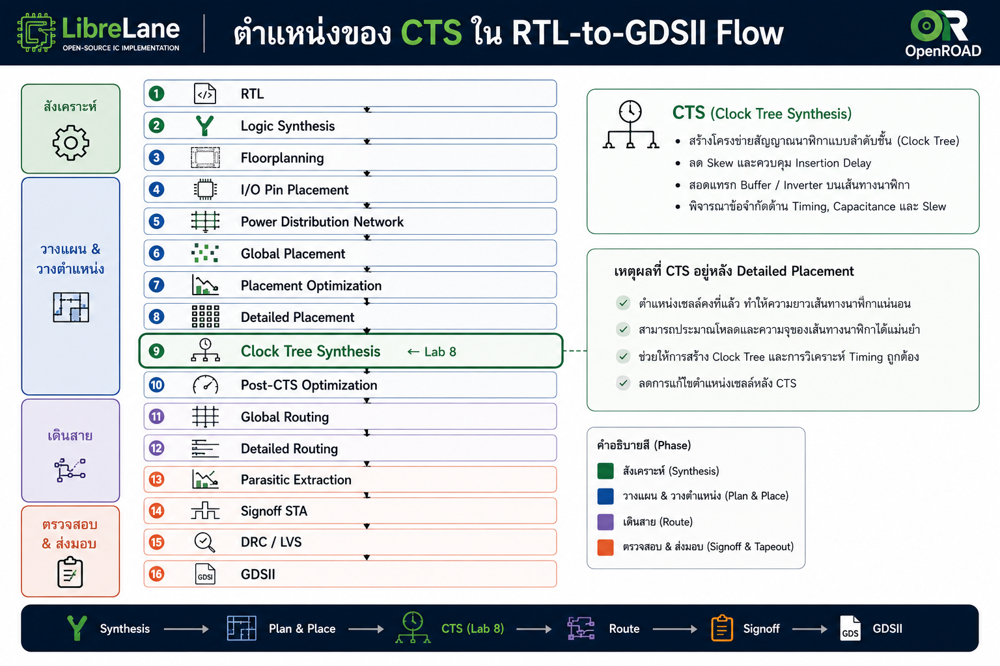
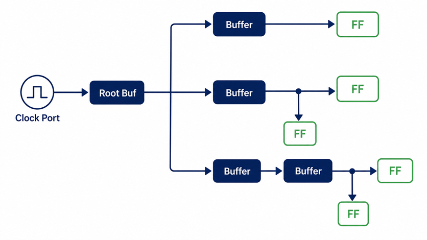
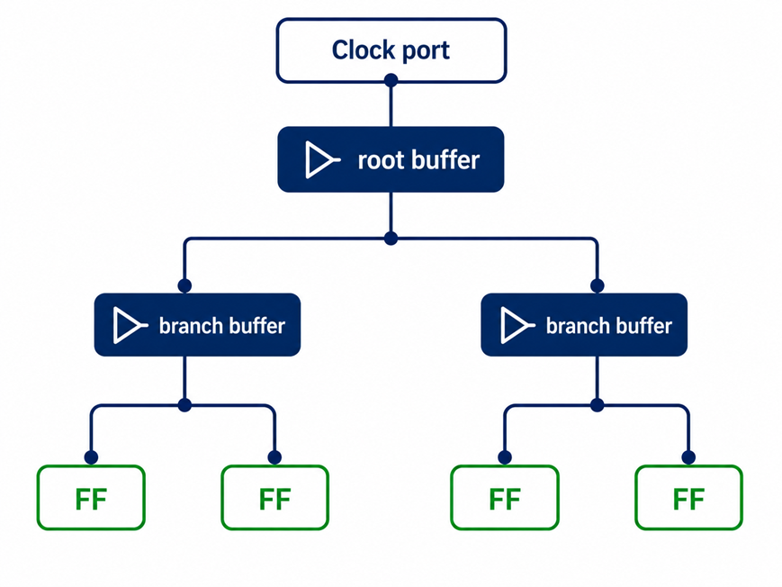
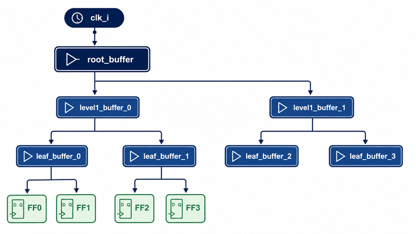

# Lab 8 Clock Tree Synthesis ด้วย LibreLane

## 8.1 วัตถุประสงค์ของบทปฏิบัติการ

หลังจากผ่านบทปฏิบัติการนี้ ผู้เรียนจะสามารถ

1. อธิบายหน้าที่ของ Clock Tree Synthesis หรือ CTS ในกระบวนการ Physical Design
2. อธิบายความหมายของ clock source, clock sink, clock latency, insertion delay และ clock skew
3. เตรียม RTL และ timing constraints สำหรับ CTS ได้อย่างถูกต้อง
4. กำหนดค่าการทำงานของ CTS ผ่านไฟล์ `config.yaml`
5. รัน LibreLane ตั้งแต่ RTL synthesis จนถึงขั้นตอน CTS
6. ตรวจสอบจำนวน clock sinks และ clock buffers ที่ถูกเพิ่มเข้ามา
7. วิเคราะห์ clock latency และ clock skew หลัง CTS
8. ตรวจสอบ setup, hold, transition และ capacitance violations หลัง CTS
9. เปิดดู clock tree ด้วย OpenROAD GUI
10. ปรับแต่ง CTS เพื่อแก้ปัญหา skew สูง, fanout สูง และ congestion
11. เปรียบเทียบผลก่อนและหลัง CTS อย่างเป็นระบบ
12. จัดทำรายงานสรุปคุณภาพของ clock tree สำหรับใช้ในขั้นตอน timing closure

---

# 8.2 ภาพรวมของ Clock Tree Synthesis

ในช่วง synthesis และ placement ระยะแรก clock มักถูกวิเคราะห์เป็น **ideal clock** กล่าวคือ เครื่องมือถือว่า clock edge เดินทางจาก clock source ไปถึงขา clock ของ flip-flop ทุกตัวโดยไม่มีความล่าช้าและไม่มีความแตกต่างของเวลาเดินทาง

สมมติว่า clock period เท่ากับ 10 ns เครื่องมืออาจวิเคราะห์เสมือนว่า clock edge มาถึง flip-flop ทุกตัวที่เวลาเดียวกันพอดี

ในวงจรจริง clock net มีองค์ประกอบทางกายภาพ เช่น

* ความต้านทานของโลหะ
* capacitance ของสาย
* capacitance ของ clock input pin
* ความยาวของสายที่แตกต่างกัน
* จำนวนโหลดที่แตกต่างกัน
* ตำแหน่งของ flip-flop ที่กระจายอยู่ทั่วพื้นที่ชิป
* macro และ routing blockage
* buffer delay
* process, voltage และ temperature variation

ดังนั้น clock จึงไม่สามารถขับ flip-flop จำนวนมากได้โดยตรงจาก input port เพียงจุดเดียว

Clock Tree Synthesis มีหน้าที่สร้างเครือข่าย clock distribution โดยเพิ่ม clock buffers หรือ inverters ลงใน clock path เพื่อ

* กระจาย clock ไปยัง sequential elements
* ลด clock skew
* ควบคุม clock latency
* ควบคุม transition time
* ลด fanout ต่อ buffer
* ลดผลกระทบจาก wire resistance และ capacitance
* ช่วยให้ setup และ hold timing สามารถปิดได้

OpenROAD ใช้ CTS engine ที่พัฒนาจาก TritonCTS 2.0 และทำ characterization ของ buffer ระหว่างการทำงานโดยอัตโนมัติ จึงไม่จำเป็นต้องสร้าง CTS characterization table แยกต่างหาก ([OpenROAD][1])

---

# 8.3 ตำแหน่งของ CTS ใน RTL-to-GDSII Flow

ลำดับโดยย่อของ Physical Design คือ




CTS ต้องทำหลัง placement เนื่องจากเครื่องมือต้องทราบตำแหน่งทางกายภาพของ clock sinks ก่อน จึงจะสามารถคำนวณ topology, buffer location และความยาวของ clock branches ได้อย่างเหมาะสม

หากทำ CTS ก่อน placement ตำแหน่งของ flip-flop ยังไม่แน่นอน เมื่อ placement เปลี่ยนแปลง clock tree ที่สร้างไว้ก็จะไม่สมดุลอีกต่อไป

---

# 8.4 คำศัพท์สำคัญ

## 8.4.1 Clock source

Clock source คือจุดเริ่มต้นของ clock ภายใน design เช่น

* top-level clock input port
* output ของ PLL
* output ของ clock divider
* output ของ clock multiplexer
* output ของ integrated clock-gating cell

สำหรับบทปฏิบัติการนี้ clock source คือ port ชื่อ `clk_i`

```systemverilog
input logic clk_i;
```

---

## 8.4.2 Clock sink

Clock sink คือขา clock ของ sequential element ที่ต้องได้รับ clock ตัวอย่างเช่น

* `CK` ของ flip-flop
* clock pin ของ register
* clock pin ของ latch
* clock pin ของ SRAM macro
* clock input ของ generated-clock block

หาก design มี register 32 ตัว ไม่ได้หมายความว่าจะมีเพียง 32 sinks เสมอไป เนื่องจาก register แบบหลายบิตใน RTL อาจถูก map เป็น flip-flop แบบ 1 บิตหลายตัว

ตัวอย่าง

```systemverilog
logic [31:0] counter_q;
```

อาจกลายเป็น flip-flop 32 ตัว และมี clock sinks 32 จุด

---

## 8.4.3 Clock tree

Clock tree คือเครือข่ายจาก clock source ผ่าน clock buffers หลายระดับไปยัง clock sinks



Clock tree ที่ดีควร

* มี branch ที่สมดุล
* ไม่มี buffer ตัวใดรับ fanout สูงเกินไป
* มี clock transition อยู่ใน limit
* มี latency ที่เหมาะสม
* มี skew ต่ำ
* ไม่สร้าง routing congestion มากเกินไป

---

## 8.4.4 Clock latency

Clock latency คือเวลาที่ clock edge ใช้เดินทางจาก clock source ไปยัง clock sink

```text
Clock source ───────────────► Clock sink
              Clock latency
```

หาก clock edge ออกจาก source ที่เวลา 0 ns และมาถึง flip-flop ที่เวลา 0.65 ns จะมี network latency เท่ากับ 0.65 ns

Clock latency อาจแบ่งเป็น

### Source latency

เวลาจาก clock generator ภายนอกหรือ PLL มาถึง clock input port ของ block

### Network latency

เวลาจาก clock input port ของ block ผ่าน clock tree ไปถึง clock sink

ในบทปฏิบัติการนี้ LibreLane สร้างและวิเคราะห์ network latency ภายใน block

---

## 8.4.5 Insertion delay

Insertion delay ในบริบท CTS มักหมายถึง delay ที่เกิดจาก clock distribution network จาก clock root ไปยัง sink

ในหลายรายงานคำว่า clock latency และ insertion delay อาจถูกใช้ในความหมายใกล้เคียงกัน แต่ควรตรวจสอบจุดอ้างอิงของรายงานเสมอ

---

## 8.4.6 Clock skew

Clock skew คือความแตกต่างของเวลาเดินทางของ clock ระหว่าง sinks

สมมติว่า

```text
Clock arrival at FF1 = 0.60 ns
Clock arrival at FF2 = 0.74 ns
```

ดังนั้น

```text
Clock skew = 0.74 - 0.60
           = 0.14 ns
           = 140 ps
```

สูตรทั่วไปคือ

$$T_{skew}=T_{latest}-T_{earliest}$$

โดย

* $$T_{latest}$$ คือ clock arrival time ที่ช้าที่สุด
* $$T_{earliest}$$ คือ clock arrival time ที่เร็วที่สุด

Clock skew เป็นปัจจัยสำคัญต่อ setup และ hold timing โดย LibreLane ระบุว่า hold violation จำนวนมากมีความสัมพันธ์กับ clock skew และแนะนำให้ตรวจสอบ clock skew report เมื่อพบ hold violation หลัง CTS ([LibreLane][2])

---

## 8.4.7 Positive skew และ negative skew

พิจารณาเส้นทางจาก launch flip-flop ไปยัง capture flip-flop

```text
Launch FF ── combinational logic ──► Capture FF
```

### Positive skew

clock มาถึง capture flip-flop ช้ากว่า launch flip-flop

```text
Tcapture > Tlaunch
```

Positive skew อาจช่วย setup timing แต่ทำให้ hold timing แย่ลง

### Negative skew

clock มาถึง capture flip-flopเร็วกว่า launch flip-flop

```text
Tcapture < Tlaunch
```

Negative skewอาจช่วย hold timing แต่ทำให้ setup timing แย่ลง

ดังนั้น CTS ไม่ได้พยายามลด latency เพียงอย่างเดียว แต่ต้องจัดสมดุลของ arrival time ระหว่าง launch และ capture registers ด้วย

---

# 8.5 ความแตกต่างระหว่าง Pre-CTS และ Post-CTS Timing

## 8.5.1 Pre-CTS

ก่อน CTS clock มักถูกวิเคราะห์เป็น ideal clock

```text
Clock port ───────── ideal connection ─────────► FF clock pins
```

คุณสมบัติทั่วไปคือ

* ยังไม่มี clock buffers จริง
* clock latency ภายใน network เป็นศูนย์หรือเป็นค่าประมาณ
* clock skew เป็นศูนย์หรือเกือบศูนย์
* hold violation จาก clock skew อาจยังไม่ปรากฏ
* setup analysis ใช้ clock period และ data-path delay เป็นหลัก

LibreLane ระบุว่า STA หลัง synthesis มักไม่รายงาน hold violation เพราะ clock ยังถูกถือเป็น ideal net และยังไม่มี clock skew จาก physical clock tree ([LibreLane][2])

## 8.5.2 Post-CTS

หลัง CTS clock กลายเป็น propagated clock ผ่าน network จริง




หลัง CTS จะเริ่มเห็น

* clock latency
* clock skew
* clock transition
* clock capacitance
* buffer delay
* hold violations ที่เกิดจาก skew
* setup timing ที่เปลี่ยนแปลงจาก clock arrival time

---

# 8.6 โครงสร้างโปรเจกต์

สร้างโครงสร้างดังนี้

```text
lab8_cts/
├── config.yaml
├── src/
│   └── cts_counter.sv
├── constraint/
│   ├── pnr.sdc
│   └── signoff.sdc
├── scripts/
│   ├── find_cts_reports.sh
│   └── summarize_cts.sh
└── README.md
```

สร้างโฟลเดอร์ด้วยคำสั่ง

```bash
mkdir -p lab8_cts/{src,constraint,scripts}
cd lab8_cts
```

ตรวจสอบโครงสร้าง

```bash
tree
```

ผลที่คาดหวัง

```text
.
├── constraint
├── scripts
└── src
```

---

# 8.7 การสร้าง RTL สำหรับทดลอง CTS

สร้างไฟล์

```text
src/cts_counter.sv
```

เนื้อหา

```systemverilog
module cts_counter #(
    parameter int unsigned WIDTH = 32
) (
    input  logic                 clk_i,
    input  logic                 rst_ni,
    input  logic                 enable_i,
    output logic [WIDTH-1:0]     count_o,
    output logic                 event_o
);

    logic [WIDTH-1:0] count_q;
    logic [WIDTH-1:0] shadow_q;
    logic [7:0]       cycle_q;

    always_ff @(posedge clk_i or negedge rst_ni) begin
        if (!rst_ni) begin
            count_q  <= '0;
            shadow_q <= '0;
            cycle_q  <= '0;
            event_o  <= 1'b0;
        end else begin
            event_o <= 1'b0;

            if (enable_i) begin
                count_q <= count_q + {{(WIDTH-1){1'b0}}, 1'b1};
                cycle_q <= cycle_q + 8'd1;

                if (cycle_q == 8'hff) begin
                    shadow_q <= count_q;
                    event_o  <= 1'b1;
                end
            end
        end
    end

    assign count_o = count_q ^ shadow_q;

endmodule
```

วงจรนี้มี sequential elements หลายกลุ่ม ได้แก่

* `count_q`
* `shadow_q`
* `cycle_q`
* `event_o`

เมื่อ synthesis แล้วจะเกิด clock sinks จำนวนมากพอสำหรับสังเกต clock tree

---

# 8.8 ตรวจสอบ RTL ก่อนทำ Physical Design

ตรวจสอบ syntax ด้วย Verilator

```bash
verilator \
  --lint-only \
  --Wall \
  -Wno-fatal \
  --top-module cts_counter \
  src/cts_counter.sv
```

หากไม่มี error คำสั่งจะจบโดยไม่แสดง fatal message

ตรวจสอบ synthesis เบื้องต้นด้วย Yosys

```bash
yosys -p '
  read_verilog -sv src/cts_counter.sv
  hierarchy -check -top cts_counter
  proc
  opt
  check
  stat
'
```

สิ่งที่ต้องตรวจสอบคือ

```text
ERROR: ไม่ควรปรากฏ
Warning: multiple drivers ไม่ควรปรากฏ
Warning: inferred latch ไม่ควรปรากฏ
```

---

# 8.9 การสร้าง PnR SDC

สร้างไฟล์

```text
constraint/pnr.sdc
```

เนื้อหา

```tcl
# ============================================================
# Lab 8: PnR Timing Constraints
# Design: cts_counter
# Clock period: 10 ns = 100 MHz
# ============================================================

create_clock \
    -name core_clk \
    -period 10.000 \
    -waveform {0.000 5.000} \
    [get_ports clk_i]

# Clock margin used during implementation
set_clock_uncertainty 0.250 [get_clocks core_clk]
set_clock_transition 0.150 [get_clocks core_clk]

# Input interface constraints
set_input_delay 2.000 \
    -clock [get_clocks core_clk] \
    [get_ports {enable_i}]

# rst_ni is asynchronous and is excluded from synchronous timing
set_false_path -from [get_ports rst_ni]

# Output interface constraints
set_output_delay 2.000 \
    -clock [get_clocks core_clk] \
    [get_ports {count_o[*] event_o}]

# Output capacitive load
set_load 0.033442 [get_ports {count_o[*] event_o}]

# Optional timing derating for implementation margin
set_timing_derate -early 0.95
set_timing_derate -late  1.05
```

## คำอธิบาย

### `create_clock`

```tcl
create_clock -period 10.000 [get_ports clk_i]
```

กำหนด clock period เท่ากับ 10 ns

$$f=\frac{1}{T}$$

ดังนั้น

$$f=\frac{1}{10\text{ ns}}=100\text{ MHz}$$

### `set_clock_uncertainty`

```tcl
set_clock_uncertainty 0.250 [get_clocks core_clk]
```

สำรอง margin 0.25 ns สำหรับปัจจัย เช่น

* jitter
* residual skew
* modeling uncertainty
* variation ที่ยังไม่ได้จำลองโดยตรง

### `set_clock_transition`

```tcl
set_clock_transition 0.150 [get_clocks core_clk]
```

กำหนด transition ของ ideal clock ที่ source สำหรับช่วงก่อนสร้าง propagated clock tree

### `set_false_path`

```tcl
set_false_path -from [get_ports rst_ni]
```

เนื่องจาก `rst_ni` เป็น asynchronous reset จึงไม่ควรถูกวิเคราะห์เป็น synchronous data path ปกติ

---

# 8.10 การสร้าง Signoff SDC

สร้างไฟล์

```text
constraint/signoff.sdc
```

เนื้อหา

```tcl
# ============================================================
# Lab 8: Signoff Timing Constraints
# ============================================================

create_clock \
    -name core_clk \
    -period 10.000 \
    -waveform {0.000 5.000} \
    [get_ports clk_i]

set_clock_uncertainty 0.250 [get_clocks core_clk]

set_input_delay 2.000 \
    -clock [get_clocks core_clk] \
    [get_ports {enable_i}]

set_false_path -from [get_ports rst_ni]

set_output_delay 2.000 \
    -clock [get_clocks core_clk] \
    [get_ports {count_o[*] event_o}]

set_load 0.033442 [get_ports {count_o[*] event_o}]

set_timing_derate -early 0.95
set_timing_derate -late  1.05
```

LibreLane รองรับการแยก constraints สำหรับ implementation และ signoff ผ่าน `PNR_SDC_FILE` และ `SIGNOFF_SDC_FILE` การแยกไฟล์ช่วยให้ PnR สามารถใช้ข้อกำหนดที่เคร่งกว่าหรือแตกต่างจาก final signoff ได้ ([LibreLane][2])

---

# 8.11 การสร้าง `config.yaml`

สร้างไฟล์

```text
config.yaml
```

ตัวอย่างต่อไปนี้ใช้ SKY130 และ Classic flow

```yaml
meta:
  version: 2
  flow: Classic

# ============================================================
# Design
# ============================================================

DESIGN_NAME: cts_counter

VERILOG_FILES:
  - dir::src/cts_counter.sv

# ============================================================
# Clock
# ============================================================

CLOCK_PORT: clk_i
CLOCK_PERIOD: 10.0

PNR_SDC_FILE: dir::constraint/pnr.sdc
SIGNOFF_SDC_FILE: dir::constraint/signoff.sdc

# ============================================================
# Floorplan
# ============================================================

FP_SIZING: relative
FP_CORE_UTIL: 40
FP_ASPECT_RATIO: 1.0

# Margin between die boundary and core
FP_BOTTOM_MARGIN_MULT: 4
FP_TOP_MARGIN_MULT: 4
FP_LEFT_MARGIN_MULT: 12
FP_RIGHT_MARGIN_MULT: 12

# ============================================================
# Placement
# ============================================================

PL_TARGET_DENSITY_PCT: 55

# Allow sufficient room for CTS and post-CTS buffers
PL_RESIZER_HOLD_SLACK_MARGIN: 0.20
PL_RESIZER_SETUP_SLACK_MARGIN: 0.10

# ============================================================
# Clock Tree Synthesis
# ============================================================

# CTS is part of the Classic flow.
# The following parameters tune sink clustering.

CTS_SINK_CLUSTERING_SIZE: 20
CTS_SINK_CLUSTERING_MAX_DIAMETER: 50

# Prefer obstruction-aware clock buffer placement
CTS_OBSTRUCTION_AWARE: true

# Balance tree levels across clock-related non-register cells
CTS_BALANCE_LEVELS: true

# Repair long clock nets when supported by the selected flow/tool version
CTS_REPAIR_CLOCK_NETS: true

# Apply a non-default routing rule to part of the clock tree
# Strategies supported by OpenROAD include:
# none, root_only, half, full
CTS_CLK_NDR: root_only

# ============================================================
# Post-CTS timing optimization
# ============================================================

RUN_POST_CTS_RESIZER_TIMING: true

# Prioritize hold fixing while allowing limited setup tradeoff
PL_RESIZER_ALLOW_SETUP_VIOS: false
GRT_RESIZER_ALLOW_SETUP_VIOS: false

# ============================================================
# Routing
# ============================================================

GRT_ALLOW_CONGESTION: false

# ============================================================
# Reports
# ============================================================

QUIT_ON_TIMING_VIOLATIONS: false
```

## ข้อควรระวังเกี่ยวกับตัวแปร CTS

ชื่อและ availability ของ configuration variables อาจแตกต่างกันระหว่าง LibreLane release หรือ PDK integration แต่ละรุ่น ก่อนใช้ตัวแปร tuning เพิ่มเติมควรตรวจสอบ configuration reference ของ LibreLane รุ่นที่ติดตั้ง

ตรวจสอบเวอร์ชันด้วย

```bash
librelane --version
```

ตรวจสอบ help

```bash
librelane --help
```

หาก LibreLane แจ้งว่า configuration variable ใดไม่รู้จัก ให้เริ่มจาก baseline configuration โดยลบ tuning variable ที่ไม่รองรับออก แล้วปล่อยให้ค่า PDK default เลือก clock buffers และ CTS parameters

Baseline ที่ควรใช้ได้เป็นหลักคือ

```yaml
DESIGN_NAME: cts_counter

VERILOG_FILES:
  - dir::src/cts_counter.sv

CLOCK_PORT: clk_i
CLOCK_PERIOD: 10.0

PNR_SDC_FILE: dir::constraint/pnr.sdc
SIGNOFF_SDC_FILE: dir::constraint/signoff.sdc

FP_CORE_UTIL: 40
PL_TARGET_DENSITY_PCT: 55
```

---

# 8.12 เหตุผลที่ไม่ควรกำหนดชื่อ Clock Buffer แบบตายตัวตั้งแต่ครั้งแรก

ตัวอย่างชื่อ clock buffer ของ SKY130 อาจมีลักษณะ เช่น

```text
sky130_fd_sc_hd__clkbuf_1
sky130_fd_sc_hd__clkbuf_2
sky130_fd_sc_hd__clkbuf_4
sky130_fd_sc_hd__clkbuf_8
sky130_fd_sc_hd__clkbuf_16
```

แต่ PDK อื่นจะใช้ชื่อแตกต่างกัน เช่น

* GF180MCU
* IHP SG13G2
* IHP SG13GE

หากระบุ cell ที่ไม่มีอยู่จริง LibreLane หรือ OpenROAD อาจหยุดด้วย error เช่น

```text
master cell not found
clock buffer not found
root buffer is invalid
```

ดังนั้นแนวทางที่ปลอดภัยคือ

1. รันด้วย PDK default ก่อน
2. ตรวจสอบว่าเครื่องมือเลือก buffer อะไร
3. ตรวจสอบ Liberty และ LEF ของ buffer
4. จึงค่อยจำกัด `CTS_CLK_BUFFERS` ในรอบ tuning

LibreLane แนะนำว่าการจำกัดขนาดของ clock buffers ผ่าน `CTS_CLK_BUFFERS` อาจช่วยให้ clock tree สมดุลขึ้นในบางกรณี ([LibreLane][2])

---

# 8.13 การตรวจสอบ configuration ก่อนรัน

ตรวจสอบ YAML syntax ด้วย Python

```bash
python3 - <<'PY'
import yaml

with open("config.yaml", "r", encoding="utf-8") as f:
    config = yaml.safe_load(f)

print("DESIGN_NAME :", config.get("DESIGN_NAME"))
print("CLOCK_PORT :", config.get("CLOCK_PORT"))
print("CLOCK_PERIOD:", config.get("CLOCK_PERIOD"))
print("Configuration YAML syntax: PASS")
PY
```

ผลที่คาดหวัง

```text
DESIGN_NAME : cts_counter
CLOCK_PORT : clk_i
CLOCK_PERIOD: 10.0
Configuration YAML syntax: PASS
```

หากไม่มี Python YAML module สามารถตรวจสอบผ่าน LibreLane โดยตรง

```bash
librelane config.yaml --help
```

หรือเริ่มรัน flow และตรวจสอบ validation message

---

# 8.14 การรัน LibreLane แบบเต็ม Flow

กำหนด PDK และรัน Classic flow

```bash
librelane \
  --pdk sky130A \
  --flow Classic \
  config.yaml
```

หาก `meta.flow` ถูกกำหนดไว้แล้ว สามารถใช้

```bash
librelane --pdk sky130A config.yaml
```

LibreLane จะสร้าง run directory เช่น

```text
runs/RUN_2026-07-20_13-30-00/
```

ภายในจะมี directory สำหรับ

* state
* logs
* reports
* results
* metrics

---

# 8.15 ขั้นตอนที่เกิดขึ้นก่อน CTS

ก่อนถึง CTS LibreLane ต้องทำขั้นตอนสำคัญหลายขั้น ได้แก่

## 8.15.1 RTL synthesis

Yosys แปลง RTL เป็น gate-level netlist

สิ่งที่ต้องเกิดขึ้นคือ

* register ถูก map เป็น standard-cell flip-flop
* arithmetic logic ถูก map เป็น combinational cells
* clock port ยังคงอยู่
* reset network ถูกสร้าง
* sequential cells มี clock pin ที่ระบุใน Liberty

## 8.15.2 Floorplanning

กำหนด

* die area
* core area
* utilization
* aspect ratio
* placement rows
* routing tracks

## 8.15.3 Placement

standard cells ถูกวางลงใน core

ตำแหน่งของ flip-flop ในขั้นตอนนี้มีผลโดยตรงต่อ

* clock branch length
* buffer count
* clock skew
* insertion delay
* routing congestion

## 8.15.4 Detailed placement

เครื่องมือ legalize ตำแหน่งของ cells ให้ตรงกับ placement rows และไม่ซ้อนทับกัน

CTS ต้องการ placement ที่ถูก legalize ก่อนเพิ่ม clock buffers

---

# 8.16 ขั้นตอนภายใน Clock Tree Synthesis

OpenROAD CTS ดำเนินการในลักษณะโดยสรุปดังนี้

## ขั้นตอนที่ 1: ระบุ clock roots

เครื่องมือค้นหา

* primary clock port
* generated clock root
* gated clock root
* clock nets ที่ต้องสร้าง tree

สำหรับ design นี้ clock root คือ

```text
clk_i
```

หาก `CLOCK_PORT` หรือ `create_clock` ผิด เครื่องมืออาจไม่พบ clock root

---

## ขั้นตอนที่ 2: ระบุ clock sinks

เครื่องมือตรวจสอบ clock pins ของ sequential cells

ตัวอย่าง

```text
count_q[0]/CLK
count_q[1]/CLK
...
shadow_q[0]/CLK
cycle_q[0]/CLK
event_o/CLK
```

จำนวน sinks จะขึ้นกับผล synthesis และ technology mapping

---

## ขั้นตอนที่ 3: จัดกลุ่ม sinks

Clock sinks ที่อยู่ใกล้กันจะถูกจัดเป็น cluster

ค่าที่เกี่ยวข้อง เช่น

```yaml
CTS_SINK_CLUSTERING_SIZE: 20
CTS_SINK_CLUSTERING_MAX_DIAMETER: 50
```

ความหมายโดยแนวคิดคือ

* cluster หนึ่งมี sinks ได้ไม่เกินจำนวนที่กำหนด
* sinks ภายใน cluster ต้องไม่กระจายห่างกันเกิน diameter ที่กำหนด

OpenROAD รองรับการกำหนดจำนวน sinks ต่อ cluster และ maximum cluster diameter โดยตรงใน CTS engine ([OpenROAD][1])

หาก cluster ใหญ่เกินไป

* fanout ต่อ leaf buffer สูง
* transition อาจช้า
* skew ภายใน cluster อาจสูง

หาก cluster เล็กเกินไป

* buffer count เพิ่ม
* area เพิ่ม
* clock power เพิ่ม
* routing congestion เพิ่ม

---

## ขั้นตอนที่ 4: เลือก clock buffers

เครื่องมือเลือก buffer จาก standard-cell library โดยพิจารณา

* input capacitance
* output drive strength
* maximum capacitance
* maximum transition
* delay
* area
* available physical cells ใน LEF
* Liberty timing model

OpenROAD สามารถรับ buffer list และ root buffer และหากไม่กำหนด root buffer จะเลือกจาก buffer list ตาม configuration ของ flow ([OpenROAD][1])

---

## ขั้นตอนที่ 5: สร้าง clock topology

CTS สร้าง tree จาก root ไปยัง clusters และ sinks

ตัวอย่างเชิงแนวคิด



จำนวนระดับของ tree ขึ้นกับ

* core size
* sink distribution
* clock load
* buffer characteristics
* obstruction
* target transition
* target skew

---

## ขั้นตอนที่ 6: วาง clock buffers

Clock buffers ถูกเพิ่มลงใน physical database และวางใกล้ตำแหน่งที่เหมาะสม

หากเปิด obstruction-aware mode เครื่องมือจะพยายามไม่วาง buffer ทับ

* hard macro
* blockage
* forbidden region

OpenROAD ระบุว่า obstruction-aware buffering สามารถลด displacement จาก legalizer และอาจช่วย latency, skew หรือ timing quality ได้ ([OpenROAD][1])

---

## ขั้นตอนที่ 7: ปรับสมดุล latency

เครื่องมือพยายามทำให้เวลาเดินทางจาก root ไปยังแต่ละ sink ใกล้เคียงกัน

ตัวอย่างก่อน balance

```text
Path A latency = 0.45 ns
Path B latency = 0.82 ns
Skew           = 0.37 ns
```

ตัวอย่างหลัง balance

```text
Path A latency = 0.71 ns
Path B latency = 0.76 ns
Skew           = 0.05 ns
```

สังเกตว่า latency ของ path A อาจเพิ่มขึ้น แต่ skew ลดลง

เป้าหมายหลักจึงไม่ใช่ทำให้ทุก path เร็วที่สุด แต่ทำให้ clock arrival มีความสมดุล

---

## ขั้นตอนที่ 8: Legalization

หลังเพิ่ม buffers อาจเกิด cell overlap เครื่องมือจึงต้อง legalize placement อีกครั้ง

หาก core utilization สูงเกินไป อาจเกิด

```text
cannot legalize clock buffers
insufficient whitespace
detailed placement failed
```

นี่เป็นเหตุผลที่ Lab นี้ใช้

```yaml
FP_CORE_UTIL: 40
PL_TARGET_DENSITY_PCT: 55
```

เพื่อสำรอง whitespace สำหรับ

* clock buffers
* post-CTS hold buffers
* routing optimization buffers
* antenna repair cells

---

## ขั้นตอนที่ 9: Post-CTS timing optimization

เมื่อ clock กลายเป็น propagated clock เครื่องมือจะตรวจ timing ใหม่

ขั้นตอนนี้อาจ

* resize data-path cells
* insert data buffers
* fix hold violations
* fix setup violations
* repair transition
* repair capacitance
* legalize cells อีกครั้ง

---

# 8.17 การติดตามสถานะระหว่างรัน

เปิด terminal ใหม่แล้วใช้

```bash
find runs -type f -name "*.log" | sort
```

ดู log ล่าสุด

```bash
find runs -type f -name "*.log" \
  -printf '%T@ %p\n' \
  | sort -nr \
  | head
```

ติดตาม log

```bash
tail -f "$(find runs -type f -name '*.log' \
  -printf '%T@ %p\n' | sort -nr | head -1 | cut -d' ' -f2-)"
```

ค้นหา CTS message

```bash
grep -RniE \
  "clock tree|clock_tree_synthesis|tritoncts|clock buffer|clock sink|skew" \
  runs/*/logs \
  | head -100
```

---

# 8.18 การหารายงาน CTS

สร้างไฟล์

```text
scripts/find_cts_reports.sh
```

เนื้อหา

```bash
#!/usr/bin/env bash
set -euo pipefail

RUN_DIR="${1:-}"

if [[ -z "${RUN_DIR}" ]]; then
    RUN_DIR="$(find runs -mindepth 1 -maxdepth 1 -type d \
        -printf '%T@ %p\n' 2>/dev/null \
        | sort -nr \
        | head -1 \
        | cut -d' ' -f2-)"
fi

if [[ -z "${RUN_DIR}" || ! -d "${RUN_DIR}" ]]; then
    echo "ERROR: LibreLane run directory was not found."
    exit 1
fi

echo "Run directory: ${RUN_DIR}"
echo
echo "CTS-related files"
echo "================="

find "${RUN_DIR}" -type f \
    \( -iname "*cts*" \
       -o -iname "*clock*" \
       -o -iname "*timing*" \
       -o -iname "*metrics*" \) \
    | sort
```

กำหนด permission

```bash
chmod +x scripts/find_cts_reports.sh
```

เรียกใช้

```bash
./scripts/find_cts_reports.sh
```

หรือระบุ run directory

```bash
./scripts/find_cts_reports.sh runs/RUN_2026-07-20_13-30-00
```

ชื่อ directory และ report อาจแตกต่างกันตาม LibreLane version ดังนั้นควรค้นหาจากเนื้อหาและนามสกุลไฟล์แทนการสมมติ path แบบตายตัว

---

# 8.19 การค้นหา Clock Tree Statistics

ใช้คำสั่ง

```bash
grep -RniE \
  "Number of Clock Roots|Number of Buffers Inserted|Number of Clock Subnets|Number of Sinks" \
  runs
```

OpenROAD `report_cts` สามารถรายงานข้อมูลหลัก ได้แก่

* number of clock roots
* number of buffers inserted
* number of clock subnets
* number of sinks ([OpenROAD][1])

ค้นหาข้อมูลเพิ่มเติม

```bash
grep -RniE \
  "clock roots|buffers inserted|clock subnets|clock sinks|sinks" \
  runs/*/{logs,reports} 2>/dev/null
```

ตัวอย่างผลเชิงแนวคิด

```text
Number of Clock Roots:       1
Number of Buffers Inserted:  8
Number of Clock Subnets:     9
Number of Sinks:             73
```

## การแปลผล

### Clock roots = 1

design มี clock domain หลักหนึ่งชุด

### Buffers inserted = 8

CTS เพิ่ม clock buffers 8 ตัว

### Clock subnets = 9

clock net เดิมถูกแบ่งเป็น subnets หลายส่วน

### Sinks = 73

มี sequential clock pins 73 จุด

---

# 8.20 การค้นหา Clock Skew Report

ใช้

```bash
grep -RniE \
  "clock skew|skew" \
  runs/*/{logs,reports} 2>/dev/null
```

หรือ

```bash
find runs -type f \
  \( -iname "*.rpt" -o -iname "*.log" -o -iname "*.txt" \) \
  -print0 \
  | xargs -0 grep -niE "clock skew|skew"
```

ตัวอย่าง

```text
Clock core_clk
  Maximum arrival time : 0.742 ns
  Minimum arrival time : 0.681 ns
  Clock skew           : 0.061 ns
```

คำนวณ

$$0.742-0.681=0.061\text{ ns}$$

หรือ

$$0.061\text{ ns}=61\text{ ps}$$

---

# 8.21 เกณฑ์ประเมิน Clock Skew สำหรับห้องปฏิบัติการ

เกณฑ์ต่อไปนี้เป็นแนวทางเชิงการเรียนรู้ ไม่ใช่ signoff requirement สากล

|                Clock skew | การประเมินเบื้องต้น            |
| ------------------------: | ------------------------------ |
|     ต่ำกว่า 5% ของ period | ดี                             |
|          5–10% ของ period | ควรตรวจสอบ                     |
|    มากกว่า 10% ของ period | สูง                            |
| มากกว่า clock uncertainty | มีความเสี่ยงต่อ timing closure |

สำหรับ clock period 10 ns

```text
5% of period  = 0.5 ns
10% of period = 1.0 ns
```

อย่างไรก็ตาม design ASIC โดยทั่วไปมักต้องการ skew ต่ำกว่านี้มาก โดยเฉพาะ design ความถี่สูง

เกณฑ์ที่เหมาะสมต้องพิจารณาร่วมกับ

* setup slack
* hold slack
* clock uncertainty
* PVT corner
* OCV model
* generated clocks
* macro interface timing

---

# 8.22 การตรวจสอบ Setup Timing หลัง CTS

ค้นหา setup violations

```bash
grep -RniE \
  "setup.*violat|setup violation|setup slack|worst slack|wns|tns" \
  runs/*/{logs,reports} 2>/dev/null
```

ความหมายของ metric

## WNS

Worst Negative Slack คือ slack ที่แย่ที่สุด

```text
WNS = -0.120 ns
```

หมายถึง path ที่แย่ที่สุดขาดเวลา 0.120 ns

## TNS

Total Negative Slack คือผลรวมของ negative slack ทุก violating endpoint

```text
TNS = -1.850 ns
```

หาก

```text
WNS >= 0
TNS = 0
```

แสดงว่าไม่มี setup violation ใน corner นั้น

---

# 8.23 การตรวจสอบ Hold Timing หลัง CTS

ค้นหา hold violations

```bash
grep -RniE \
  "hold.*violat|hold violation|hold slack|min slack" \
  runs/*/{logs,reports} 2>/dev/null
```

ตัวอย่าง

```text
Hold slack = -0.045 ns
```

หมายถึง data มาถึง capture flip-flop เร็วเกินไป 45 ps

Hold violations มีความสำคัญมาก เพราะไม่สามารถแก้ด้วยการลด clock frequency ได้โดยตรง

แนวทางแก้ hold เช่น

* insert delay buffer ใน data path
* resize cells ให้ช้าลง
* ปรับ clock tree
* ลด clock skew
* ปรับ placement
* เพิ่ม whitespace สำหรับ hold-fix buffers

---

# 8.24 การตรวจสอบ Clock Transition

ค้นหา transition violations

```bash
grep -RniE \
  "max transition|transition violation|slew violation" \
  runs/*/{logs,reports} 2>/dev/null
```

Clock transition ที่ช้าเกินไปอาจเกิดจาก

* clock buffer ขับโหลดมากเกินไป
* fanout สูง
* clock wire ยาว
* buffer drive strength ต่ำ
* cluster มี sinks มากเกินไป
* routing parasitic สูง

ผลกระทบได้แก่

* cell delay เพิ่ม
* short-circuit power เพิ่ม
* uncertainty ของ clock edge เพิ่ม
* timing model อาจออกนอก characterized range

---

# 8.25 การตรวจสอบ Maximum Capacitance

ค้นหา

```bash
grep -RniE \
  "max capacitance|capacitance violation|max cap" \
  runs/*/{logs,reports} 2>/dev/null
```

Capacitance สูงอาจบ่งชี้

* fanout สูง
* net ยาว
* sink input capacitance สูง
* buffer ไม่เหมาะสม

LibreLane ระบุว่า transition และ capacitance violations เป็นตัวชี้วัดปัญหาของ net แม้บางกรณี design อาจยังไม่มี setup หรือ hold violations ก็ตาม ([LibreLane][2])

---

# 8.26 การเปรียบเทียบ Cell Count ก่อนและหลัง CTS

ค้นหา metrics

```bash
find runs -type f \
  \( -iname "metrics*.json" \
     -o -iname "*metrics*.csv" \
     -o -iname "*metrics*.yaml" \) \
  -print
```

ค้นหาค่า cell count

```bash
grep -RniE \
  '"cell_count"|cell count|instance count|design area|utilization' \
  runs/* 2>/dev/null \
  | head -100
```

หลัง CTS ควรพบว่า

```text
Post-CTS cell count > Pre-CTS cell count
```

เนื่องจากมี

* clock buffers
* delay buffers
* hold-fix buffers
* resized cells
* legalization-related changes

---

# 8.27 สคริปต์สรุปผล CTS

สร้างไฟล์

```text
scripts/summarize_cts.sh
```

เนื้อหา

```bash
#!/usr/bin/env bash
set -euo pipefail

RUN_DIR="${1:-}"

if [[ -z "${RUN_DIR}" ]]; then
    RUN_DIR="$(find runs -mindepth 1 -maxdepth 1 -type d \
        -printf '%T@ %p\n' 2>/dev/null \
        | sort -nr \
        | head -1 \
        | cut -d' ' -f2-)"
fi

if [[ -z "${RUN_DIR}" || ! -d "${RUN_DIR}" ]]; then
    echo "ERROR: Run directory not found."
    exit 1
fi

search_group() {
    local title="$1"
    local pattern="$2"

    echo
    echo "${title}"
    printf '%*s\n' "${#title}" '' | tr ' ' '-'

    grep -RniE "${pattern}" \
        "${RUN_DIR}/logs" \
        "${RUN_DIR}/reports" \
        2>/dev/null \
        | head -30 || true
}

echo "============================================================"
echo "LibreLane CTS Summary"
echo "Run: ${RUN_DIR}"
echo "============================================================"

search_group \
    "CTS Statistics" \
    "clock roots|buffers inserted|clock subnets|clock sinks|number of sinks"

search_group \
    "Clock Skew and Latency" \
    "clock skew|skew|clock latency|insertion delay|arrival time"

search_group \
    "Setup Timing" \
    "setup violation|setup slack|worst.*slack|wns|tns"

search_group \
    "Hold Timing" \
    "hold violation|hold slack|min.*slack"

search_group \
    "Clock Electrical Checks" \
    "transition violation|max transition|slew violation|max capacitance|capacitance violation"

search_group \
    "CTS Warnings and Errors" \
    "warning|error|failed|unplaced|illegal|congestion"

echo
echo "============================================================"
echo "End of summary"
echo "============================================================"
```

กำหนด permission

```bash
chmod +x scripts/summarize_cts.sh
```

เรียกใช้

```bash
./scripts/summarize_cts.sh
```

บันทึกผล

```bash
./scripts/summarize_cts.sh | tee cts_summary.txt
```

---

# 8.28 การเปิดดู Clock Tree ด้วย OpenROAD GUI

LibreLane รองรับการเปิด intermediate state ผ่าน OpenROAD GUI โดยรูปแบบคำสั่งขึ้นกับ LibreLane version

เริ่มจากค้นหา state หลัง CTS

```bash
find runs -type f \
  \( -iname "*cts*.odb" \
     -o -iname "*cts*.def" \
     -o -iname "*.odb" \) \
  | sort
```

ตรวจสอบคำสั่ง GUI ที่รองรับ

```bash
librelane --help
```

ใน LibreLane รุ่นที่รองรับการเปิด state ผ่าน CLI ให้ระบุ state หรือ ODB ที่เกิดหลัง CTS แล้วเปิด OpenROAD GUI

เมื่อ GUI เปิดขึ้น ให้ตรวจสอบ

1. ตำแหน่ง clock input port
2. root clock buffer
3. clock buffer แต่ละระดับ
4. clock branches
5. clock sinks
6. buffer clustering
7. clock routes ที่ผ่านใกล้ macro หรือ blockage
8. บริเวณที่มี buffer หนาแน่น
9. displacement หลัง legalization
10. congestion รอบ clock tree

---

# 8.29 สิ่งที่ควรสังเกตใน GUI

## 8.29.1 ตำแหน่ง Clock Port

หาก clock port อยู่มุมหนึ่งของ die แต่ sinks กระจายทั่ว core อาจเกิด

* source latency สูง
* branch แรกยาว
* skew สูง
* buffer count เพิ่ม

สำหรับ block-level design ควรวาง clock input ในตำแหน่งที่เหมาะสมกับ physical integration

## 8.29.2 การกระจายของ Flip-Flops

หาก flip-flops ที่สัมพันธ์กันถูกวางกระจายไกลมาก CTS อาจต้องสร้าง branch ยาวและเพิ่ม buffers หลายตัว

## 8.29.3 Clock Buffer Hotspot

หาก buffers จำนวนมากถูกวางรวมในบริเวณเดียว อาจเกิด

* local congestion
* legalization displacement
* routing detour
* IR-drop hotspot
* clock power density สูง

## 8.29.4 Macro Obstruction

สำหรับ design ที่มี SRAM หรือ hard macro ต้องตรวจสอบว่า clock branches ไม่ต้องอ้อม macro มากเกินไป

---

# 8.30 การทดลองที่ 1: Baseline CTS

ใช้ configuration พื้นฐาน

```yaml
FP_CORE_UTIL: 40
PL_TARGET_DENSITY_PCT: 55

CTS_SINK_CLUSTERING_SIZE: 20
CTS_SINK_CLUSTERING_MAX_DIAMETER: 50
```

รัน

```bash
librelane --pdk sky130A config.yaml
```

บันทึก

```text
Run name:
Number of sinks:
Number of clock buffers:
Maximum clock latency:
Minimum clock latency:
Clock skew:
Setup WNS:
Hold WNS:
Cell count:
Core utilization:
```

---

# 8.31 การทดลองที่ 2: เพิ่มขนาด Sink Cluster

แก้ไข

```yaml
CTS_SINK_CLUSTERING_SIZE: 30
CTS_SINK_CLUSTERING_MAX_DIAMETER: 100
```

รันใหม่โดยกำหนด tag หรือ run name ตาม syntax ที่ LibreLane version รองรับ

```bash
librelane --pdk sky130A config.yaml
```

ผลที่อาจพบ

* buffer count ลดลง
* fanout ต่อ leaf buffer เพิ่ม
* area ลดลง
* clock transition อาจแย่ลง
* skew อาจเพิ่มขึ้น
* routing อาจง่ายขึ้นหรือยากขึ้นตาม sink distribution

บันทึกผลเปรียบเทียบ

| Metric          | Baseline | Large cluster |
| --------------- | -------: | ------------: |
| Clock sinks     |          |               |
| Clock buffers   |          |               |
| Clock skew      |          |               |
| Maximum latency |          |               |
| Setup WNS       |          |               |
| Hold WNS        |          |               |
| Cell area       |          |               |

---

# 8.32 การทดลองที่ 3: ลดขนาด Sink Cluster

แก้ไข

```yaml
CTS_SINK_CLUSTERING_SIZE: 10
CTS_SINK_CLUSTERING_MAX_DIAMETER: 30
```

ผลที่อาจพบ

* buffer count เพิ่ม
* fanout ต่อ buffer ลด
* clock transition ดีขึ้น
* skew อาจลดลง
* area เพิ่ม
* clock power เพิ่ม
* congestion เพิ่ม

เปรียบเทียบกับ baseline

| Metric                    | Baseline | Small cluster |
| ------------------------- | -------: | ------------: |
| Clock buffers             |          |               |
| Clock skew                |          |               |
| Max transition violations |          |               |
| Setup WNS                 |          |               |
| Hold WNS                  |          |               |
| Area                      |          |               |

---

# 8.33 การทดลองที่ 4: ผลของ Core Utilization

ทดลอง

```yaml
FP_CORE_UTIL: 60
PL_TARGET_DENSITY_PCT: 70
```

ผลที่อาจเกิด

* whitespace สำหรับ CTS ลดลง
* clock buffers วางยากขึ้น
* legalization displacement เพิ่ม
* hold-fix buffer insertion ยาก
* routing congestion เพิ่ม
* clock skew อาจสูงขึ้น

จากนั้นทดลองลดเป็น

```yaml
FP_CORE_UTIL: 30
PL_TARGET_DENSITY_PCT: 45
```

ผลที่อาจเกิด

* CTS มีพื้นที่มากขึ้น
* buffer placement ง่ายขึ้น
* congestion ลดลง
* die area เพิ่ม
* wire length บางเส้นอาจเพิ่มขึ้นจาก core ที่ใหญ่ขึ้น

ข้อสรุปคือ core utilization ต่ำไม่ได้รับประกันว่า skew จะต่ำเสมอไป แต่ช่วยเพิ่ม flexibility ให้ placement และ optimization

---

# 8.34 การทดลองที่ 5: จำกัด Clock Buffer List

ขั้นตอนนี้ทำเมื่อทราบแน่นอนว่า PDK มี cells ใด

ค้นหา clock buffer ใน PDK

```bash
find "${PDK_ROOT:-$HOME/.volare}" \
  -type f \
  \( -name "*.lib" -o -name "*.lef" \) \
  -print0 2>/dev/null \
  | xargs -0 grep -hE \
      "sky130_fd_sc_hd__clkbuf_[0-9]+|MACRO sky130_fd_sc_hd__clkbuf" \
  | sort -u \
  | head -50
```

ตัวอย่าง configuration เชิงทดลอง

```yaml
CTS_CLK_BUFFERS:
  - sky130_fd_sc_hd__clkbuf_2
  - sky130_fd_sc_hd__clkbuf_4
  - sky130_fd_sc_hd__clkbuf_8
```

ห้ามคัดลอกรายชื่อ cell โดยไม่ตรวจสอบ PDK เนื่องจาก

* cell อาจไม่มีใน Liberty
* cell อาจไม่มี physical LEF
* cell อาจถูกกำหนดเป็น `dont_use`
* naming convention อาจต่างกัน
* selected standard-cell library อาจไม่ใช่ `sky130_fd_sc_hd`

หลังจำกัด buffer list ให้เปรียบเทียบ

* skew
* latency
* buffer count
* transition violations
* area
* clock power
* routing congestion

---

# 8.35 การทดลองที่ 6: Clock NDR

OpenROAD รองรับการใช้ non-default routing rule แบบ 2× spacing กับ clock nets โดยเลือก strategy ได้แก่

```text
none
root_only
half
full
```

([OpenROAD][1])

แนวคิดของ NDR คือใช้ spacing ที่มากกว่าปกติสำหรับ clock nets เพื่อลด

* coupling capacitance
* crosstalk
* signal integrity risk

แต่มีผลเสียคือใช้ routing resources มากขึ้น

ทดลอง

```yaml
CTS_CLK_NDR: none
```

เปรียบเทียบกับ

```yaml
CTS_CLK_NDR: root_only
```

และหาก flow รองรับ

```yaml
CTS_CLK_NDR: full
```

ประเมิน

* routing congestion
* clock latency
* transition
* detailed routing completion
* DRC
* skew หลัง extraction

---

# 8.36 ปัญหาที่พบบ่อยและวิธีแก้ไข

## ปัญหา 1: ไม่พบ Clock

ข้อความอาจมีลักษณะ

```text
No clocks found
No clock roots found
Clock net not found
```

ตรวจสอบ

```yaml
CLOCK_PORT: clk_i
```

ให้ตรงกับ RTL

```systemverilog
input logic clk_i;
```

ตรวจสอบ SDC

```tcl
create_clock -name core_clk -period 10.0 [get_ports clk_i]
```

ค้นหา port หลัง synthesis

```bash
grep -Rni "clk_i" runs/*/results runs/*/reports | head
```

---

## ปัญหา 2: Clock Port ถูก Optimize หาย

สาเหตุที่เป็นไปได้

* register ทั้งหมดถูก optimize ออก
* output ไม่ขึ้นกับ sequential logic
* enable หรือ reset ทำให้ logic กลายเป็นค่าคงที่
* top module ผิด
* parameter ผิด

ตรวจสอบ synthesis report

```bash
grep -RniE \
  "Number of cells|flip-flop|dff|clock" \
  runs/*/reports \
  | head -100
```

ตรวจสอบ gate-level netlist ว่ามี flip-flops

```bash
grep -RniE \
  "__df|dff|flip" \
  runs/*/results \
  | head
```

---

## ปัญหา 3: Clock Buffer Cell Not Found

ข้อความ

```text
Clock buffer master not found
CTS root buffer does not exist
Invalid clock buffer
```

แนวทางแก้

1. ลบการกำหนด `CTS_CLK_BUFFERS`
2. ลบการกำหนด root buffer
3. ใช้ PDK default
4. ตรวจสอบ Liberty
5. ตรวจสอบ technology LEF และ cell LEF
6. ตรวจสอบว่า cell ไม่ถูก `dont_use`

---

## ปัญหา 4: Clock Skew สูง

สาเหตุที่เป็นไปได้

* sinks กระจายไม่สมดุล
* macro ขวางเส้นทาง
* cluster ใหญ่เกินไป
* clock port placement ไม่เหมาะสม
* buffer list มีเฉพาะ buffer ขนาดใหญ่
* placement density สูง
* legalization ย้าย buffer ไกล
* clock branch ยาวมาก

แนวทางแก้

```yaml
FP_CORE_UTIL: 35
PL_TARGET_DENSITY_PCT: 50

CTS_SINK_CLUSTERING_SIZE: 10
CTS_SINK_CLUSTERING_MAX_DIAMETER: 30

CTS_OBSTRUCTION_AWARE: true
CTS_BALANCE_LEVELS: true
```

จากนั้นตรวจสอบ GUI และรายงานใหม่

---

## ปัญหา 5: Clock Transition Violation

แนวทางแก้

* ลด sink clustering size
* เพิ่ม buffer drive strength ที่อนุญาต
* เพิ่ม buffer stages
* ลด fanout
* ลด maximum cluster diameter
* ตรวจสอบ long clock wires
* ใช้ clock routing layers ที่เหมาะสม
* เปิด clock-net repair หาก flow รองรับ

---

## ปัญหา 6: Hold Violations จำนวนมากหลัง CTS

สาเหตุหลักที่ควรตรวจสอบ

* skew สูง
* data path สั้นมาก
* launch clock มาช้าเกินไปเมื่อเทียบกับ capture clock
* placement ของ registers ใกล้กันมาก
* hold-fix optimization ไม่มีพื้นที่
* timing constraints ผิด
* false path ไม่ได้ประกาศ

แนวทางแก้

1. ตรวจสอบว่าเป็น true path
2. ตรวจสอบ clock skew
3. เปิด post-CTS timing optimization
4. ลด utilization
5. สำรอง whitespace
6. ตรวจสอบ hold-fix buffer availability
7. ปรับ CTS clustering
8. ตรวจสอบ asynchronous reset และ CDC paths

---

## ปัญหา 7: Setup Timing แย่ลงหลัง CTS

สาเหตุที่เป็นไปได้

* clock arrival ของ capture register เปลี่ยน
* clock insertion delay ไม่สมดุล
* data cells ถูกย้ายระหว่าง legalization
* congestion ทำให้ wire estimate แย่ลง
* post-CTS hold fixing เพิ่ม delay บนเส้นทางที่เกี่ยวข้อง
* clock uncertainty สูงเกินจริง

แนวทางแก้

* ตรวจสอบ path ก่อนและหลัง CTS
* ปรับ placement
* resize data-path cells
* ลด congestion
* ปรับ clock period หาก specification อนุญาต
* ตรวจสอบ SDC
* ตรวจสอบ false paths และ multicycle paths

---

## ปัญหา 8: Legalization Failed หลัง CTS

ข้อความอาจมีลักษณะ

```text
detailed placement failed
could not legalize instances
overlapping clock buffers
insufficient placement sites
```

แก้ไข

```yaml
FP_CORE_UTIL: 30
PL_TARGET_DENSITY_PCT: 45
```

หรือเพิ่ม die/core area

สำหรับ absolute floorplan

```yaml
FP_SIZING: absolute
DIE_AREA: [0, 0, 250, 250]
CORE_AREA: [15, 15, 235, 235]
```

ต้องตรวจสอบ syntax ที่ LibreLane release รองรับ

---

## ปัญหา 9: Routing Congestion หลัง CTS

Clock tree เพิ่ม

* buffers
* clock subnets
* routing demand
* local pin density

แนวทางแก้

* ลด placement density
* เพิ่ม core area
* ปรับ pin placement
* ลดการใช้ NDR แบบ `full`
* ใช้ `root_only`
* ลด buffer count อย่างระมัดระวัง
* ปรับ macro placement
* เพิ่ม routing resources ที่เหมาะสมกับ PDK

---

# 8.37 หลักการวิเคราะห์ Clock Tree อย่างเป็นระบบ

ไม่ควรดูเฉพาะ skew เพียงค่าเดียว แต่ควรวิเคราะห์ metrics ร่วมกัน

| Metric             | เป้าหมาย                          |
| ------------------ | --------------------------------- |
| Clock roots        | ตรงกับจำนวน clock domains         |
| Clock sinks        | ตรงกับ sequential elements        |
| Buffer count       | ไม่มากหรือน้อยผิดปกติ             |
| Clock levels       | สมดุลระหว่าง branches             |
| Maximum latency    | ไม่สูงเกินความจำเป็น              |
| Minimum latency    | ไม่ต่างจาก maximum มาก            |
| Clock skew         | ต่ำและสอดคล้องกับ timing margin   |
| Clock transition   | ไม่มี violation                   |
| Clock capacitance  | ไม่มี violation                   |
| Setup WNS          | ไม่ติดลบ                          |
| Hold WNS           | ไม่ติดลบ                          |
| Cell utilization   | มีพื้นที่สำหรับ optimization      |
| Routing congestion | route ได้                         |
| DRC                | ไม่มี violation จาก clock routing |

---

# 8.38 แบบฟอร์มบันทึกผลการทดลอง

## ข้อมูลการรัน

```text
LibreLane version:
OpenROAD version:
PDK:
Standard-cell library:
Design name:
Clock port:
Clock period:
Target frequency:
Run directory:
```

## CTS configuration

```text
FP_CORE_UTIL:
PL_TARGET_DENSITY_PCT:
CTS sink clustering size:
CTS clustering diameter:
Clock buffer list:
Root buffer:
Obstruction-aware:
Balance levels:
Clock NDR:
```

## ผล CTS

```text
Number of clock roots:
Number of clock sinks:
Number of clock buffers:
Number of clock subnets:
Clock tree depth:
Maximum clock latency:
Minimum clock latency:
Clock skew:
```

## Timing result

```text
Post-CTS setup WNS:
Post-CTS setup TNS:
Post-CTS hold WNS:
Post-CTS hold TNS:
Setup violating endpoints:
Hold violating endpoints:
```

## Electrical checks

```text
Maximum transition violations:
Maximum capacitance violations:
Maximum fanout violations:
```

## Physical result

```text
Cell count before CTS:
Cell count after CTS:
Core utilization before CTS:
Core utilization after CTS:
Unplaced cells:
Placement violations:
Routing congestion:
```

---

# 8.39 คำถามท้ายบทปฏิบัติการ

1. เหตุใด CTS จึงต้องทำหลัง placement?
2. Clock source และ clock sink แตกต่างกันอย่างไร?
3. Clock latency และ clock skew แตกต่างกันอย่างไร?
4. เหตุใด clock skew เท่ากับศูนย์จึงทำได้ยากในวงจรจริง?
5. Positive skew มีผลต่อ setup และ hold อย่างไร?
6. เหตุใด pre-CTS STA จึงมักไม่พบ hold violation จาก clock skew?
7. การลด sink clustering size มีผลต่อ buffer count อย่างไร?
8. เหตุใดการใช้ clock buffer ที่แรงที่สุดทุกจุดจึงไม่ใช่คำตอบที่ดีที่สุด?
9. เหตุใด core utilization สูงจึงทำให้ CTS ยากขึ้น?
10. Clock transition ที่ช้าเกินไปมีผลต่อ timing และ power อย่างไร?
11. เหตุใด hold violation จึงไม่สามารถแก้ได้ด้วยการลด clock frequency?
12. `PNR_SDC_FILE` และ `SIGNOFF_SDC_FILE` มีหน้าที่แตกต่างกันอย่างไร?
13. Clock NDR มีข้อดีและข้อเสียอย่างไร?
14. หาก CTS รายงานว่าไม่มี clock roots ควรตรวจสอบอะไรเป็นอันดับแรก?
15. หาก skew ต่ำแต่ hold timing ยัง fail ควรวิเคราะห์ส่วนใดเพิ่มเติม?

---

# 8.40 งานที่มอบหมาย

ให้ผู้เรียนรัน CTS อย่างน้อยสาม configuration

## Configuration A: Baseline

```yaml
FP_CORE_UTIL: 40
PL_TARGET_DENSITY_PCT: 55
CTS_SINK_CLUSTERING_SIZE: 20
CTS_SINK_CLUSTERING_MAX_DIAMETER: 50
```

## Configuration B: Small Clusters

```yaml
FP_CORE_UTIL: 40
PL_TARGET_DENSITY_PCT: 55
CTS_SINK_CLUSTERING_SIZE: 10
CTS_SINK_CLUSTERING_MAX_DIAMETER: 30
```

## Configuration C: High Density

```yaml
FP_CORE_UTIL: 60
PL_TARGET_DENSITY_PCT: 70
CTS_SINK_CLUSTERING_SIZE: 20
CTS_SINK_CLUSTERING_MAX_DIAMETER: 50
```

จัดทำตาราง

| Metric                 | Config A | Config B | Config C |
| ---------------------- | -------: | -------: | -------: |
| Clock sinks            |          |          |          |
| Clock buffers          |          |          |          |
| Clock subnets          |          |          |          |
| Maximum latency        |          |          |          |
| Minimum latency        |          |          |          |
| Clock skew             |          |          |          |
| Setup WNS              |          |          |          |
| Hold WNS               |          |          |          |
| Transition violations  |          |          |          |
| Capacitance violations |          |          |          |
| Cell area              |          |          |          |
| Core utilization       |          |          |          |
| Routing congestion     |          |          |          |

จากนั้นตอบคำถาม

1. Configuration ใดให้ skew ต่ำที่สุด?
2. Configuration ใดใช้ clock buffers มากที่สุด?
3. Configuration ใดมี hold timing ดีที่สุด?
4. Configuration ใดมี congestion สูงที่สุด?
5. ผลลัพธ์แสดง trade-off ระหว่าง power, performance และ area อย่างไร?
6. Configuration ใดเหมาะสมที่สุดสำหรับนำไปทำ routing และเพราะเหตุใด?

---

# 8.41 Checklist ก่อนผ่าน Lab 8

## RTL และ Constraints

* [ ] RTL ผ่าน syntax check
* [ ] RTL ไม่มี inferred latch
* [ ] Top module ถูกต้อง
* [ ] `CLOCK_PORT` ตรงกับ RTL
* [ ] `CLOCK_PERIOD` ตรงกับ specification
* [ ] `create_clock` ถูกต้อง
* [ ] asynchronous reset ถูกกำหนดเป็น false path อย่างเหมาะสม
* [ ] input delay ถูกกำหนด
* [ ] output delay ถูกกำหนด
* [ ] output load ถูกกำหนด
* [ ] PnR SDC ถูกโหลด
* [ ] Signoff SDC ถูกโหลด

## Placement ก่อน CTS

* [ ] placement สำเร็จ
* [ ] ไม่มี unplaced cells
* [ ] detailed placement สำเร็จ
* [ ] utilization ไม่สูงเกินไป
* [ ] มี whitespace สำหรับ CTS buffers
* [ ] ไม่มี placement overlap
* [ ] ไม่มี macro obstruction ที่ผิดปกติ

## CTS

* [ ] พบ clock root
* [ ] พบ clock sinks
* [ ] มี clock buffers ถูกเพิ่ม
* [ ] clock tree ถูกสร้างสำเร็จ
* [ ] buffers ถูก legalize
* [ ] ไม่มี invalid clock buffer
* [ ] ไม่มี unconnected clock sinks
* [ ] มี CTS statistics report

## Post-CTS Timing

* [ ] ตรวจสอบ setup WNS/TNS
* [ ] ตรวจสอบ hold WNS/TNS
* [ ] ตรวจสอบ clock skew
* [ ] ตรวจสอบ maximum latency
* [ ] ตรวจสอบ minimum latency
* [ ] ตรวจสอบ transition violations
* [ ] ตรวจสอบ capacitance violations
* [ ] ตรวจสอบ fanout violations
* [ ] ตรวจสอบ false paths
* [ ] ตรวจสอบ post-CTS optimization

## Physical Inspection

* [ ] เปิด OpenROAD GUI
* [ ] ตรวจสอบ root buffer
* [ ] ตรวจสอบ clock branches
* [ ] ตรวจสอบ sink clustering
* [ ] ตรวจสอบ buffer hotspots
* [ ] ตรวจสอบ macro obstruction
* [ ] ตรวจสอบ congestion
* [ ] บันทึกภาพก่อนและหลัง CTS

---

# 8.42 สรุป

Clock Tree Synthesis เป็นจุดเปลี่ยนสำคัญจากการวิเคราะห์ clock แบบ ideal ไปสู่ clock network ทางกายภาพจริง

ก่อน CTS เครื่องมืออาจถือว่า clock เดินทางไปถึง flip-flop ทุกตัวพร้อมกัน แต่หลัง CTS จะต้องคำนึงถึง

* buffer delay
* wire delay
* clock latency
* clock skew
* transition
* capacitance
* fanout
* placement
* routing obstruction
* process and timing constraints

Clock tree ที่ดีไม่จำเป็นต้องมี latency ต่ำที่สุดหรือใช้ buffer น้อยที่สุด แต่ต้องให้สมดุลที่เหมาะสมระหว่าง

```text
Low skew
+ Acceptable latency
+ Clean transition
+ No setup violations
+ No hold violations
+ Reasonable area
+ Manageable clock power
+ Routable physical layout
```

การวิเคราะห์ CTS จึงต้องดูทั้ง clock-tree statistics, STA reports, electrical violations และ physical layout ร่วมกัน ไม่ควรตัดสินคุณภาพจาก clock skew เพียงตัวเลขเดียว

ผลลัพธ์จาก Lab 8 จะเป็นฐานสำคัญสำหรับขั้นตอนต่อไป ได้แก่ Global Routing, Detailed Routing, parasitic extraction และ post-route timing closure

ค่าปรับแต่ง CTS บางรายการขึ้นกับรุ่น LibreLane และ PDK ที่ใช้ จึงควรเริ่มจาก baseline configuration แล้วเพิ่ม tuning variables ทีละรายการเพื่อให้ระบุผลกระทบของแต่ละค่าได้ชัดเจนที่สุดครับ

[1]: https://openroad.readthedocs.io/en/latest/main/src/cts/README.html "Clock Tree Synthesis — OpenROAD  documentation"
[2]: https://librelane.readthedocs.io/en/stable/usage/timing_closure/index.html "Achieving Timing Closure - LibreLane Documentation"
