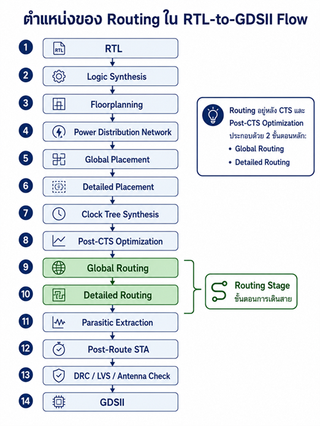
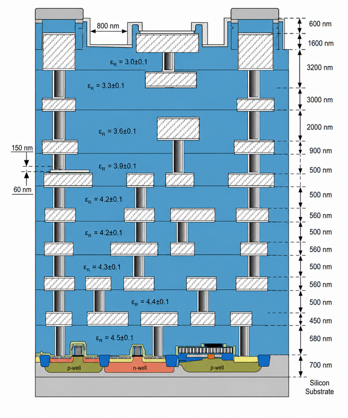

# Lab 9  
# Global and Detailed Routing ด้วย LibreLane

## 9.1 วัตถุประสงค์ของบทปฏิบัติการ

บทปฏิบัติการนี้ศึกษากระบวนการเชื่อมต่อสายสัญญาณทางกายภาพหลังจากผ่านขั้นตอน Placement และ Clock Tree Synthesis หรือ CTS แล้ว โดยใช้ OpenROAD ผ่าน LibreLane Classic Flow

เมื่อจบบทปฏิบัติการ ผู้เรียนจะสามารถ:

1. อธิบายความแตกต่างระหว่าง Global Routing และ Detailed Routing ได้
2. อธิบายแนวคิด Routing Track, GCell, Routing Capacity และ Congestion ได้
3. กำหนด Routing Layer และ Routing Capacity ผ่าน `config.yaml` ได้
4. รัน LibreLane จนถึง Global Routing และ Detailed Routing ได้
5. ตรวจสอบ congestion, routing overflow และ DRC violation ได้
6. เปิดผลลัพธ์ Routing ด้วย OpenROAD GUI และ KLayout ได้
7. วิเคราะห์สาเหตุของ Routing Failure ได้
8. ปรับ Floorplan, Placement Density และ Routing Configuration เพื่อแก้ congestion ได้
9. ตรวจสอบผลกระทบของ Routing ต่อ Timing, Wire Length และ Antenna Violation ได้
10. จัดทำ Routing Signoff Checklist เบื้องต้นได้

---

## 9.2 ตำแหน่งของ Routing ใน RTL-to-GDSII Flow

ลำดับโดยทั่วไปของกระบวนการ Physical Design คือ




ใน LibreLane ขั้นตอน Routing หลักประกอบด้วย:

```text
OpenROAD.GlobalRouting
OpenROAD.DetailedRouting
```

Global Routing สร้างเส้นทางเชิงนามธรรมสำหรับแต่ละ net ขณะที่ Detailed Routing แปลงเส้นทางดังกล่าวเป็นโลหะและ via จริงตาม design rule ของเทคโนโลยี หลัง Detailed Routing การย้ายหรือลบเซลล์ที่เชื่อมต่อกับสายแล้วจะต้องมีขั้นตอน rip-up และ reroute เพิ่มเติม เพราะ topology ทางกายภาพได้ถูกสร้างขึ้นแล้ว 

---

# 9.3 ทฤษฎีพื้นฐานของ Routing

## 9.3.1 Net คืออะไร

Net คือกลุ่มของขาอุปกรณ์ที่ต้องเชื่อมต่อถึงกันทางไฟฟ้า ตัวอย่างเช่น

```systemverilog
assign sum_o = a_i ^ b_i ^ carry_i;
```

หลัง Synthesis สมการดังกล่าวอาจถูกแปลงเป็น standard cells หลายตัว เช่น

```text
XOR2 → XOR2 → output buffer
```

ขา output ของ XOR ตัวแรกและขา input ของ XOR ตัวถัดไปอยู่ใน net เดียวกัน Router มีหน้าที่สร้างโลหะเชื่อมต่อขาเหล่านี้

Net อาจแบ่งตามหน้าที่ได้เป็น:

- Signal net
- Clock net
- Reset net
- Power net
- Ground net
- High-fanout control net

Power และ ground มักได้รับการสร้างโครงข่ายหลักในขั้นตอน PDN ก่อน Routing ส่วน signal, clock และ control net จะถูกเชื่อมต่อในขั้นตอน Routing

---

## 9.3.2 Routing Layer

กระบวนการผลิตวงจรรวมมีโลหะหลายชั้น ตัวอย่างเชิงแนวคิด:



แต่ละชั้นมักมี preferred routing direction เช่น

```text
Metal 1 : Horizontal
Metal 2 : Vertical
Metal 3 : Horizontal
Metal 4 : Vertical
Metal 5 : Horizontal
```

ทิศทางจริงขึ้นกับ PDK และ technology LEF

การสลับจากโลหะชั้นหนึ่งไปอีกชั้นหนึ่งต้องใช้ via:

```text
Metal 3 ─────────●
                 │ Via
                 │
                 └──────── Metal 4
```

Router ต้องเลือกทั้ง:

- ตำแหน่งสาย
- ชั้นโลหะ
- ความกว้างสาย
- ระยะห่างระหว่างสาย
- ชนิดของ via
- จำนวน via
- จุดเปลี่ยนชั้นโลหะ

---

## 9.3.3 Routing Track

Routing track คือแนวตำแหน่งที่อนุญาตให้วางสายโลหะได้

```text
Track 0  ─────────────────────────
Track 1  ─────────────────────────
Track 2  ─────────────────────────
Track 3  ─────────────────────────
Track 4  ─────────────────────────
```

ระยะห่างระหว่าง track เรียกว่า routing pitch

Router ไม่สามารถวางสายได้อย่างอิสระทุกตำแหน่ง แต่ต้องปฏิบัติตาม track grid และ design rule ที่กำหนดโดย PDK

---

## 9.3.4 GCell

Global Router ไม่ได้วางรูปร่างโลหะระดับละเอียดตั้งแต่เริ่มต้น แต่แบ่งพื้นที่ชิปออกเป็นช่องสี่เหลี่ยมขนาดใหญ่เรียกว่า Global Routing Cell หรือ GCell

```text
+-----+-----+-----+-----+
| G00 | G01 | G02 | G03 |
+-----+-----+-----+-----+
| G10 | G11 | G12 | G13 |
+-----+-----+-----+-----+
| G20 | G21 | G22 | G23 |
+-----+-----+-----+-----+
```

เส้นแบ่งระหว่าง GCell เรียกว่า routing edge

แต่ละ edge มี:

- Routing capacity
- Routing demand
- Routing usage
- Overflow

LibreLane ระบุว่า `GRT_MACRO_EXTENSION` ใช้ขยายขอบเขต blockage รอบ macro เป็นจำนวน GCell เพื่อเว้นพื้นที่ Routing รอบ macro โดยค่าเริ่มต้นเป็น `0` 

---

## 9.3.5 Routing Capacity

Routing capacity คือจำนวนสายโดยประมาณที่สามารถผ่าน routing edge หนึ่งได้

ตัวอย่าง:

```text
Routing capacity = 10 tracks
Routing demand   = 8 tracks
Overflow         = 0
```

กรณี congestion:

```text
Routing capacity = 10 tracks
Routing demand   = 14 tracks
Overflow         = 4 tracks
```

สามารถเขียนได้ว่า

\[
Overflow = \max(0, Demand-Capacity)
\]

ถ้า demand สูงกว่า capacity แสดงว่าพื้นที่บริเวณนั้นแน่นเกินไป

---

## 9.3.6 Congestion

Congestion คือภาวะที่ความต้องการใช้ routing resources สูงกว่าความจุของพื้นที่

สาเหตุที่พบบ่อย ได้แก่:

1. Core utilization สูงเกินไป
2. Standard cells อยู่ใกล้กันมากเกินไป
3. Pin density สูงในบริเวณใดบริเวณหนึ่ง
4. Macro วางใกล้กันจนไม่มี routing channel
5. Macro pin อยู่ด้านที่เข้าถึงยาก
6. PDN straps ใช้ routing resources จำนวนมาก
7. จำกัดจำนวน routing layer มากเกินไป
8. มี high-fanout net จำนวนมาก
9. Placement สร้าง net crossing จำนวนมาก
10. Clock tree ใช้ buffer และสายจำนวนมาก
11. Cell padding น้อยเกินไป
12. I/O pins กระจุกตัวอยู่ด้านเดียว

Congestion ไม่ควรถูกมองว่าเป็นปัญหาของ Router เพียงอย่างเดียว แต่มักสะท้อนปัญหาจาก Floorplan และ Placement

---

# 9.4 Global Routing

## 9.4.1 หน้าที่ของ Global Router

Global Router ทำหน้าที่วางแผนเส้นทางระดับสูง โดยยังไม่สร้างรูปร่างโลหะที่ผ่าน DRC อย่างสมบูรณ์

ตัวอย่างเส้นทางเชิงนามธรรม:

```text
Driver
  │
  ├──────── GCell 1
  │
  ├──────── GCell 2
  │              │
  │              └──────── Sink A
  │
  └─────────────────────── Sink B
```

ผลลัพธ์สำคัญของ Global Routing ได้แก่:

- เส้นทางโดยประมาณของแต่ละ net
- Routing layer ที่คาดว่าจะใช้
- จำนวน routing resources ที่ต้องใช้
- Congestion map
- Routing overflow
- Wire-length estimation
- จุดที่อาจเกิด antenna problem
- ข้อมูลสำหรับ post-global-route timing optimization

Global Router ของ OpenROAD คือ FastRoute

---

## 9.4.2 ขั้นตอนเชิงแนวคิดของ Global Routing

Global Routing สามารถอธิบายเป็นลำดับได้ดังนี้

### ขั้นที่ 1: สร้าง Global Routing Grid

พื้นที่ core ถูกแบ่งเป็น GCells

```text
Die/Core Area
     │
     ▼
Global Routing Grid
     │
     ├── GCell rows
     └── GCell columns
```

### ขั้นที่ 2: คำนวณ Routing Capacity

Router ตรวจสอบ:

- จำนวน track ในแต่ละ layer
- PDN blockage
- Macro blockage
- Cell blockage
- Routing obstruction
- Minimum spacing
- Layer adjustment

### ขั้นที่ 3: ประเมิน Net Topology

สำหรับ multi-pin net อาจสร้าง topology แบบ Steiner tree เพื่อลด wire length

```text
ไม่เหมาะสม:

A ───────────────── B
                     │
                     │
                     C

เหมาะสมกว่า:

A ─────────●──────── B
           │
           C
```

จุด `●` คือ Steiner point

### ขั้นที่ 4: Initial Routing

Router กำหนดเส้นทางเริ่มต้นโดยพิจารณา:

- Wire length
- Congestion
- Via cost
- Layer direction
- Timing criticality

### ขั้นที่ 5: Overflow Analysis

คำนวณ demand และ capacity ของทุก routing edge

### ขั้นที่ 6: Rip-up and Reroute

Net ที่ผ่านบริเวณ congestion อาจถูกถอดเส้นทางเดิมและสร้างใหม่

```text
Initial route
     │
     ▼
Detect congestion
     │
     ▼
Rip up selected nets
     │
     ▼
Route through alternative region
```

### ขั้นที่ 7: Antenna Repair

Router อาจแก้ antenna violation ด้วย:

- Metal jumper
- Antenna diode
- เปลี่ยน routing layer
- แยกส่วนโลหะที่ต่อกับ gate

### ขั้นที่ 8: บันทึก Global Route

Global route จะถูกส่งต่อให้ Detailed Router

---

# 9.5 Detailed Routing

## 9.5.1 หน้าที่ของ Detailed Router

Detailed Router สร้าง geometry จริงของ:

- Metal wires
- Vias
- Pin access
- Wire segment
- Jog
- Via stack

Detailed Routing ต้องตรวจสอบกฎทางกายภาพ เช่น:

- Minimum width
- Minimum spacing
- End-of-line spacing
- Parallel run length spacing
- Via enclosure
- Cut spacing
- Minimum area
- Pin accessibility
- Short circuit
- Open circuit

LibreLane อธิบายว่า Detailed Routing จะแปลง net เชิงนามธรรมจาก Global Routing ให้เป็นสายบน metal layers ที่ปฏิบัติตาม design rules หลีกเลี่ยง short และทำให้ทุก connection เชื่อมต่อครบถ้วน 

---

## 9.5.2 TritonRoute

OpenROAD ใช้ TritonRoute เป็น Detailed Router

กระบวนการโดยย่อคือ:

```text
Global Route Guide
       │
       ▼
Pin Access Analysis
       │
       ▼
Track Assignment
       │
       ▼
Initial Detailed Routing
       │
       ▼
DRC Detection
       │
       ▼
Rip-up and Reroute
       │
       ▼
Optimization Iterations
       │
       ▼
Final Routed DEF / ODB
```

---

## 9.5.3 Pin Access

ก่อนสร้างสาย Router ต้องหาจุดที่สามารถเชื่อมต่อเข้าสู่ pin ของ standard cell หรือ macro ได้

```text
        Metal track
────────────●──────────
            │
         Access point
      +-------------+
      | Cell pin    |
      +-------------+
```

Pin access อาจล้มเหลวเมื่อ:

- Pin มีขนาดเล็ก
- Pin ถูกบังด้วย obstruction
- Cell placement แน่นเกินไป
- Cell orientation ไม่เหมาะสม
- PDN strap ผ่านเหนือ pin
- Macro pin อยู่ชิดมุม
- ไม่มี track ที่ตรงกับตำแหน่ง pin
- Via enclosure ไม่เพียงพอ

---

## 9.5.4 Track Assignment

Detailed Router กำหนด routing segment ให้กับ track จริง

Global route อาจระบุเพียงว่า

```text
Net A ผ่าน GCell (1,1) → (1,2) → (2,2)
```

Detailed route ต้องระบุว่า

```text
Metal2:
    x = 31.20 µm
    y = 14.28–35.60 µm

Via2:
    x = 31.20 µm
    y = 35.60 µm

Metal3:
    x = 31.20–58.40 µm
    y = 35.60 µm
```

---

## 9.5.5 Search and Repair

ถ้า Detailed Router พบ DRC violation จะดำเนินการ:

1. ตรวจหาสายที่เกี่ยวข้อง
2. Rip-up สายบางส่วน
3. เลือก track ใหม่
4. เปลี่ยน routing layer
5. เพิ่ม jog
6. เปลี่ยนตำแหน่ง via
7. ตรวจ DRC ซ้ำ
8. ทำซ้ำจนถึงจำนวน iteration ที่กำหนด

ตัวแปร `DRT_OPT_ITERS` กำหนดจำนวน optimization iterations สูงสุดของ TritonRoute โดยค่าเริ่มต้นในเอกสาร LibreLane คือ `64` 

---

# 9.6 โครงสร้างโปรเจกต์

ใช้โครงสร้างต่อเนื่องจาก Lab 8:

```text
lab09_routing/
├── config.yaml
├── Makefile
├── README.md
├── src/
│   └── counter.sv
├── constraints/
│   ├── pnr.sdc
│   └── signoff.sdc
├── scripts/
│   ├── find_routing_steps.sh
│   ├── report_routing_metrics.py
│   └── clean.sh
└── runs/
```

สร้างโปรเจกต์:

```bash
mkdir -p lab09_routing/{src,constraints,scripts,runs}
cd lab09_routing
```

---

# 9.7 RTL สำหรับบทปฏิบัติการ

สร้างไฟล์:

```text
src/counter.sv
```

เนื้อหา:

```systemverilog
`default_nettype none

module counter #(
    parameter int WIDTH = 16
) (
    input  logic             clk,
    input  logic             rst_n,
    input  logic             enable,
    output logic [WIDTH-1:0] count
);

    always_ff @(posedge clk or negedge rst_n) begin
        if (!rst_n) begin
            count <= '0;
        end
        else if (enable) begin
            count <= count + {{(WIDTH-1){1'b0}}, 1'b1};
        end
    end

endmodule

`default_nettype wire
```

วงจรนี้มี:

- Register จำนวน 16 บิต
- Carry propagation ของ incrementer
- Clock net
- Active-low asynchronous reset
- Enable control net
- Output bus จำนวน 16 บิต

แม้ว่าวงจรมีขนาดเล็ก แต่เพียงพอสำหรับศึกษาลำดับ Routing และโครงสร้างผลลัพธ์ของ LibreLane

---

# 9.8 Timing Constraints

## 9.8.1 สร้าง `constraints/pnr.sdc`

```tcl
# Primary clock: 50 MHz
create_clock \
    -name core_clk \
    -period 20.000 \
    [get_ports clk]

# Clock quality assumptions
set_clock_uncertainty 0.250 [get_clocks core_clk]
set_clock_transition  0.150 [get_clocks core_clk]

# Input interface constraints
set_input_delay 2.000 \
    -clock [get_clocks core_clk] \
    [get_ports {enable rst_n}]

# Output interface constraints
set_output_delay 4.000 \
    -clock [get_clocks core_clk] \
    [get_ports count*]

# Output loading
set_load 0.033442 [get_ports count*]

# Reset is asynchronous and should not be timed as a data path
set_false_path -from [get_ports rst_n]
```

---

## 9.8.2 สร้าง `constraints/signoff.sdc`

```tcl
create_clock \
    -name core_clk \
    -period 20.000 \
    [get_ports clk]

set_clock_uncertainty 0.250 [get_clocks core_clk]
set_clock_transition  0.150 [get_clocks core_clk]

set_input_delay 2.000 \
    -clock [get_clocks core_clk] \
    [get_ports {enable rst_n}]

set_output_delay 4.000 \
    -clock [get_clocks core_clk] \
    [get_ports count*]

set_load 0.033442 [get_ports count*]

set_false_path -from [get_ports rst_n]
```

`PNR_SDC_FILE` ใช้ระบุ SDC สำหรับ implementation steps ส่วน `SIGNOFF_SDC_FILE` ใช้สำหรับการวิเคราะห์ timing หลัง PnR การแยกไฟล์ช่วยให้สามารถ over-constrain ระหว่าง implementation และใช้ข้อกำหนดจริงในขั้น signoff ได้ 

---

# 9.9 ไฟล์ `config.yaml`

สร้างไฟล์:

```text
config.yaml
```

เนื้อหา:

```yaml
meta:
  version: 2
  flow: Classic

# ============================================================
# Basic design configuration
# ============================================================

DESIGN_NAME: counter

VERILOG_FILES:
  - dir::src/counter.sv

CLOCK_PORT: clk
CLOCK_PERIOD: 20.0

PNR_SDC_FILE: dir::constraints/pnr.sdc
SIGNOFF_SDC_FILE: dir::constraints/signoff.sdc

# ============================================================
# Floorplan
# ============================================================

FP_SIZING: relative
FP_CORE_UTIL: 40
FP_ASPECT_RATIO: 1.0
FP_CORE_MARGIN: 5

# ============================================================
# Placement
# ============================================================

PL_TARGET_DENSITY_PCT: 50
PL_TIME_DRIVEN: true
PL_ROUTABILITY_DRIVEN: true

# ============================================================
# Clock Tree Synthesis
# ============================================================

CTS_CLK_MAX_WIRE_LENGTH: 0
CTS_SINK_CLUSTERING_ENABLE: true

# ============================================================
# Routing layers
#
# Layer names depend on the selected PDK.
# The following values are appropriate for sky130A.
# ============================================================

RT_MIN_LAYER: met1
RT_MAX_LAYER: met5

RT_CLOCK_MIN_LAYER: met2
RT_CLOCK_MAX_LAYER: met5

# ============================================================
# Global Routing
# ============================================================

# Reserve routing resources.
# Higher value means a larger reduction in reported capacity.
GRT_ADJUSTMENT: 0.30

# Do not permit unresolved global-route congestion.
GRT_ALLOW_CONGESTION: false

# Maximum overflow convergence iterations.
GRT_OVERFLOW_ITERS: 50

# Number of GCells reserved around hard macros.
# This example has no hard macro.
GRT_MACRO_EXTENSION: 0

# Antenna repair settings during/after global routing.
GRT_ANTENNA_REPAIR_ITERS: 3
GRT_ANTENNA_REPAIR_MARGIN: 10
GRT_ANTENNA_REPAIR_JUMPER_ONLY: false
GRT_ANTENNA_REPAIR_DIODE_ONLY: false

# ============================================================
# Detailed Routing
# ============================================================

# Use all available CPU threads when null.
DRT_THREADS: null

# Maximum detailed-routing optimization iterations.
DRT_OPT_ITERS: 64

# Save snapshots only when debugging.
DRT_SAVE_SNAPSHOTS: false
DRT_SAVE_DRC_REPORT_ITERS: null

# Antenna repair after detailed routing.
DRT_ANTENNA_REPAIR_ITERS: 3
DRT_ANTENNA_REPAIR_MARGIN: 10
DRT_ANTENNA_REPAIR_JUMPER_ONLY: false
DRT_ANTENNA_REPAIR_DIODE_ONLY: false

# ============================================================
# Routing checks
# ============================================================

ERROR_ON_TR_DRC: true
ERROR_ON_DISCONNECTED_PINS: true
ERROR_ON_LONG_WIRE: true

# ============================================================
# Timing optimization
# ============================================================

GRT_RESIZER_ALLOW_SETUP_VIOS: false
GRT_RESIZER_ALLOW_HOLD_VIOS: false

# ============================================================
# Reports and reproducibility
# ============================================================

DESIGN_REPAIR_BUFFER_INPUT_PORTS: true
DESIGN_REPAIR_BUFFER_OUTPUT_PORTS: true

RUN_MAGIC_DRC: true
RUN_KLAYOUT_DRC: true
RUN_LVS: true
RUN_ANTENNA_CHECK: true
```

> หมายเหตุ: ชื่อ metal layer ขึ้นกับ PDK ตัวอย่างนี้ใช้ `sky130A` ซึ่งมี routing layers `met1` ถึง `met5` หากใช้ `gf180mcuD` หรือ `ihp-sg13g2` ต้องตรวจสอบชื่อ layer จาก PDK configuration ก่อน LibreLane รองรับ YAML และทำ type validation กับ configuration variables โดยตรง 

---

# 9.10 คำอธิบาย Routing Configuration Variables

## 9.10.1 `RT_MIN_LAYER`

```yaml
RT_MIN_LAYER: met1
```

กำหนด routing layer ต่ำสุดสำหรับ signal net

ผลของการกำหนดสูงเกินไป:

- Pin access ยากขึ้น
- ต้องใช้ via ลงมาหา standard-cell pins มากขึ้น
- อาจเกิด routing failure

ผลของการกำหนดต่ำเกินไป:

- ใช้ชั้นโลหะล่างมาก
- อาจแย่ง routing resources ใกล้ standard cells
- อาจเพิ่ม local congestion

---

## 9.10.2 `RT_MAX_LAYER`

```yaml
RT_MAX_LAYER: met5
```

กำหนด routing layer สูงสุด

การลดค่าจาก `met5` เป็น `met4` ทำให้ Router มี routing capacity ลดลง ซึ่งอาจเพิ่ม congestion แต่บาง integration flow อาจต้องสงวน top metal ให้ top-level PDN หรือ routing ระดับ chip

---

## 9.10.3 `RT_CLOCK_MIN_LAYER` และ `RT_CLOCK_MAX_LAYER`

```yaml
RT_CLOCK_MIN_LAYER: met2
RT_CLOCK_MAX_LAYER: met5
```

กำหนดช่วงโลหะสำหรับ clock net

Clock มักใช้ชั้นโลหะที่:

- มีความต้านทานต่ำ
- รองรับสายยาว
- มีพื้นที่เพียงพอ
- ลด coupling กับ local signal
- ช่วยควบคุม insertion delay และ skew

LibreLane กำหนดตัวแปรทั้งสองเป็น optional variables หากไม่กำหนดจะใช้การตั้งค่าตาม flow และ PDK 

---

## 9.10.4 `GRT_ADJUSTMENT`

```yaml
GRT_ADJUSTMENT: 0.30
```

ใช้ลด routing capacity ที่ Global Router มองเห็น

ช่วงค่าคือ:

```text
0.0 = ไม่ลด capacity
1.0 = ลด capacity มากที่สุด
```

LibreLane ใช้ค่าเริ่มต้น `0.3` 

แนวคิด:

```text
Physical capacity      = 100 tracks
GRT_ADJUSTMENT         = 0.30
Effective capacity     ≈ 70 tracks
```

การลด capacity เชิงประมาณช่วยให้ Router ไม่ใช้งานทรัพยากรจนเต็มเกินไป และเหลือ margin สำหรับ:

- Detailed routing detour
- Via enclosure
- Design-rule spacing
- Pin access
- ECO routing
- Local routing complexity

ค่าเริ่มต้นที่แนะนำสำหรับการทดลอง:

```yaml
GRT_ADJUSTMENT: 0.30
```

กรณี congestion สูง สามารถทดลอง:

```yaml
GRT_ADJUSTMENT: 0.20
```

แต่การลด adjustment เพียงเพื่อให้ Global Routing ผ่านอาจซ่อนปัญหา routability และทำให้ Detailed Routing ล้มเหลวในภายหลัง

---

## 9.10.5 `GRT_LAYER_ADJUSTMENTS`

ตัวแปรนี้ใช้กำหนด capacity adjustment แยกตาม routing layer โดยค่ามาจาก PDK เป็นหลัก

แนวคิด:

```text
Layer   Capacity adjustment
met1    0.30
met2    0.20
met3    0.15
met4    0.10
met5    0.10
```

LibreLane ระบุว่าค่าของแต่ละชั้นอยู่ระหว่าง `0` ถึง `1` และใช้ลด capacity ของ global routing graph เฉพาะ layer 

โดยทั่วไปไม่ควร override ตัวแปรนี้โดยไม่มีความเข้าใจ PDK เนื่องจาก:

- จำนวน layer แตกต่างกัน
- Track pitch แตกต่างกัน
- Preferred direction แตกต่างกัน
- PDN usage แตกต่างกัน
- Local interconnect model แตกต่างกัน

---

## 9.10.6 `GRT_ALLOW_CONGESTION`

```yaml
GRT_ALLOW_CONGESTION: false
```

เมื่อเป็น `false` flow จะไม่ยอมรับ Global Routing ที่ยังมี congestion หรือ overflow ที่ร้ายแรง

เมื่อเป็น `true` flow อาจเดินหน้าต่อแม้ Global Router พบ congestion

ใช้ `true` เฉพาะกรณี:

- การทดลอง
- Debug
- ต้องการดูว่า Detailed Router จะแก้ได้หรือไม่
- ต้องการเก็บ intermediate results

ไม่ควรใช้ `true` เพื่อปิดบังปัญหา Floorplan หรือ Placement

ค่าเริ่มต้นตาม LibreLane คือ `false` 

---

## 9.10.7 `GRT_OVERFLOW_ITERS`

```yaml
GRT_OVERFLOW_ITERS: 50
```

กำหนดจำนวน iteration สูงสุดที่ Global Router รอให้ overflow ลดลงถึงเป้าหมาย

ค่าเริ่มต้นคือ `50` 

เพิ่มค่าเมื่อ:

- Design มีขนาดใหญ่
- Congestion ลดลงต่อเนื่องแต่ยังไม่ converge
- มี macro จำนวนมาก
- Runtime ยังยอมรับได้

ไม่ควรเพิ่ม iteration หาก overflow ไม่ลดเลย เพราะมักบ่งชี้ว่า:

- Core เล็กเกินไป
- Macro channel แคบเกินไป
- Pin placement ไม่เหมาะสม
- Routing layer ไม่พอ
- Placement density สูงเกินไป

---

## 9.10.8 `GRT_MACRO_EXTENSION`

```yaml
GRT_MACRO_EXTENSION: 0
```

กำหนดจำนวน GCell ที่ใช้ขยาย blockage รอบ macro

ตัวอย่าง:

```text
GRT_MACRO_EXTENSION = 0

+--------------+
|    Macro     |
+--------------+

GRT_MACRO_EXTENSION = 2

+--------------------------+
|    Routing keep-out      |
|   +--------------+       |
|   |    Macro     |       |
|   +--------------+       |
+--------------------------+
```

ค่าที่มากขึ้นช่วยลด congestion ชิดขอบ macro แต่:

- ลดพื้นที่ routing ที่ใช้ได้
- อาจทำให้ channel แคบลง
- อาจเพิ่ม wire detour

สำหรับ design ที่ไม่มี macro ใช้ `0`

---

## 9.10.9 `GRT_ANTENNA_REPAIR_ITERS`

```yaml
GRT_ANTENNA_REPAIR_ITERS: 3
```

กำหนดจำนวนรอบสูงสุดในการซ่อม antenna หลัง Global Routing ค่าเริ่มต้นคือ `3` 

---

## 9.10.10 `GRT_ANTENNA_REPAIR_MARGIN`

```yaml
GRT_ANTENNA_REPAIR_MARGIN: 10
```

กำหนด margin สำหรับการซ่อม antenna แบบเผื่อเพิ่มเติม ค่าเริ่มต้นคือ `10` 

---

## 9.10.11 Jumper-only และ Diode-only

```yaml
GRT_ANTENNA_REPAIR_JUMPER_ONLY: false
GRT_ANTENNA_REPAIR_DIODE_ONLY: false
```

Jumper repair:

```text
Gate ───── Metal 1 ── Via ── Metal 3 ── Via ── Metal 1
```

การย้ายสายบางส่วนไปโลหะชั้นสูงช่วยลดพื้นที่โลหะที่เชื่อมกับ gate ระหว่าง fabrication stage

Diode repair:

```text
Signal net ─────┬──── Gate
                │
             Antenna diode
```

ห้ามตั้ง jumper-only และ diode-only เป็น `true` พร้อมกัน LibreLane ระบุว่าตัวแปรทั้งคู่ใช้ร่วมกันไม่ได้ 

---

## 9.10.12 `DRT_THREADS`

```yaml
DRT_THREADS: null
```

ถ้าไม่กำหนด LibreLane จะใช้จำนวน thread ของเครื่องโดยอัตโนมัติ 

สามารถจำกัดได้ เช่น:

```yaml
DRT_THREADS: 8
```

มีประโยชน์เมื่อ:

- ใช้ shared server
- ต้องจำกัด RAM
- ต้องการผลการทดลองที่ควบคุม resource
- รันหลาย design พร้อมกัน

---

## 9.10.13 `DRT_OPT_ITERS`

```yaml
DRT_OPT_ITERS: 64
```

กำหนดจำนวน optimization iterations สูงสุดระหว่าง Detailed Routing ค่าเริ่มต้นคือ `64` 

เพิ่มค่าเมื่อ:

- DRC violation ลดลงต่อเนื่อง
- เหลือ violation เพียงเล็กน้อย
- Runtime ไม่เป็นข้อจำกัด

ไม่ควรเพิ่มอย่างเดียวเมื่อ violation คงที่ เพราะอาจต้องแก้:

- Placement
- Cell padding
- Macro spacing
- Pin access
- Routing layer
- PDN obstruction

---

## 9.10.14 `DRT_SAVE_SNAPSHOTS`

```yaml
DRT_SAVE_SNAPSHOTS: false
```

เมื่อเปิดใช้งาน Detailed Router จะบันทึก OpenDB snapshot ของแต่ละ iteration

```yaml
DRT_SAVE_SNAPSHOTS: true
```

เหมาะสำหรับ Debug แต่ใช้ disk space สูงมาก LibreLane จึงกำหนดค่าเริ่มต้นเป็น `false` 

---

## 9.10.15 `DRT_SAVE_DRC_REPORT_ITERS`

```yaml
DRT_SAVE_DRC_REPORT_ITERS: 5
```

บันทึก DRC report ทุก 5 iterations

เหมาะสำหรับวิเคราะห์ว่า:

- จำนวน DRC ลดลงหรือไม่
- Router converge หรือไม่
- violation ชนิดใดแก้ไม่ได้
- violation ย้ายตำแหน่งไปมา

ถ้าเปิด `DRT_SAVE_SNAPSHOTS` แต่ไม่ได้กำหนดค่านี้ LibreLane มี implicit default เท่ากับ 1 

---

## 9.10.16 `ERROR_ON_TR_DRC`

```yaml
ERROR_ON_TR_DRC: true
```

กำหนดให้ flow รายงาน error หากมี routing DRC หลัง Detailed Routing

Metric ที่เกี่ยวข้องคือ:

```text
route__drc_errors
```

LibreLane กำหนดค่าเริ่มต้นของ checker นี้เป็น `true` 

---

# 9.11 สร้าง Makefile

สร้างไฟล์:

```text
Makefile
```

เนื้อหา:

```makefile
DESIGN      ?= counter
CONFIG      ?= config.yaml
PDK         ?= sky130A
RUN_TAG     ?= lab09-routing
THREADS     ?= 8

.PHONY: all check run grt drt gui latest metrics log clean help

all: run

check:
	@echo "Checking LibreLane installation..."
	librelane --version
	@echo "Checking configuration..."
	test -f $(CONFIG)
	test -f src/counter.sv
	test -f constraints/pnr.sdc
	test -f constraints/signoff.sdc

run:
	librelane \
		--pdk $(PDK) \
		--run-tag $(RUN_TAG) \
		$(CONFIG)

grt:
	librelane \
		--pdk $(PDK) \
		--run-tag $(RUN_TAG)-grt \
		--to OpenROAD.GlobalRouting \
		$(CONFIG)

drt:
	librelane \
		--pdk $(PDK) \
		--run-tag $(RUN_TAG)-drt \
		--to OpenROAD.DetailedRouting \
		$(CONFIG)

gui:
	@RUN_DIR=$$(find runs -mindepth 1 -maxdepth 1 -type d | sort | tail -1); \
	echo "Opening latest run: $$RUN_DIR"; \
	librelane --last-run --flow OpenInOpenROAD $(CONFIG)

latest:
	@find runs -mindepth 1 -maxdepth 1 -type d | sort | tail -1

metrics:
	python3 scripts/report_routing_metrics.py

log:
	@RUN_DIR=$$(find runs -mindepth 1 -maxdepth 1 -type d | sort | tail -1); \
	echo "Latest run: $$RUN_DIR"; \
	find "$$RUN_DIR" -type f \
		\( -name "*.log" -o -name "*.rpt" -o -name "metrics.csv" \) \
		| sort

clean:
	rm -rf runs
	rm -rf __pycache__
	rm -f *.log

help:
	@echo "Available targets:"
	@echo "  make check    - verify files and LibreLane"
	@echo "  make run      - run complete Classic flow"
	@echo "  make grt      - run through Global Routing"
	@echo "  make drt      - run through Detailed Routing"
	@echo "  make gui      - open latest result in OpenROAD"
	@echo "  make latest   - print latest run directory"
	@echo "  make metrics  - summarize routing metrics"
	@echo "  make log      - list routing logs and reports"
	@echo "  make clean    - remove generated runs"
```

LibreLane Classic Flow รองรับการควบคุมช่วงการรันด้วยตัวเลือก เช่น `--from`, `--to`, `--skip` และ `--only` จึงสามารถหยุด flow ที่ Global Routing หรือ Detailed Routing เพื่อศึกษาผลลัพธ์เฉพาะขั้นตอนได้ 

---

# 9.12 ตรวจสอบ Environment

รัน:

```bash
make check
```

ผลลัพธ์ที่คาดหวัง:

```text
Checking LibreLane installation...
LibreLane version ...

Checking configuration...
```

ตรวจสอบ PDK:

```bash
librelane --pdk sky130A --version
```

หากยังไม่มี PDK LibreLane อาจดาวน์โหลด revision ที่รองรับผ่าน Ciel โดย PDK root เริ่มต้นมักอยู่ใน `.ciel` ภายใต้ home directory หากไม่ได้กำหนดผ่าน `--pdk-root` หรือ `PDK_ROOT` 

---

# 9.13 รัน Flow ถึง Global Routing

## 9.13.1 เริ่มต้น Global Routing

```bash
make grt
```

หรือรันโดยตรง:

```bash
librelane \
    --pdk sky130A \
    --run-tag lab09-grt \
    --to OpenROAD.GlobalRouting \
    config.yaml
```

---

## 9.13.2 สิ่งที่เกิดขึ้นก่อน Global Routing

แม้สั่ง `--to OpenROAD.GlobalRouting` LibreLane ยังต้องรันขั้นตอนก่อนหน้า เช่น:

```text
Yosys synthesis
Floorplanning
IO placement
PDN generation
Global placement
Detailed placement
CTS
Timing repair
Global routing
```

แต่จะหยุดก่อน Detailed Routing

---

## 9.13.3 ค้นหา Global Routing Step

```bash
find runs -type d -iname "*GlobalRouting*"
```

หรือ:

```bash
find runs -type d | grep -i routing
```

ตัวอย่างโครงสร้าง:

```text
runs/lab09-grt/
├── 01-verilator-lint/
├── 02-yosys-synthesis/
├── ...
├── 20-openroad-cts/
├── ...
└── 30-openroad-globalrouting/
```

หมายเลข step อาจต่างกันตาม LibreLane version และ configuration

---

## 9.13.4 ตรวจสอบไฟล์ใน Global Routing Step

```bash
GRT_DIR=$(find runs/lab09-grt -type d -iname "*globalrouting*" | head -1)

echo "$GRT_DIR"
find "$GRT_DIR" -maxdepth 2 -type f | sort
```

ไฟล์ที่อาจพบ:

```text
config.json
state_in.json
state_out.json
openroad-globalrouting.log
*.odb
*.def
*.sdc
*.nl.v
*.rpt
```

---

# 9.14 วิเคราะห์ Global Routing Log

เปิด log:

```bash
less "$GRT_DIR"/*.log
```

ค้นหาคำสำคัญ:

```bash
grep -Ei \
    "congestion|overflow|routing|wirelength|antenna|error|warning" \
    "$GRT_DIR"/*.log
```

สิ่งที่ควรตรวจสอบ:

```text
Total wire length
Total vias
Overflow
Congestion
Routing layer usage
Antenna violations
Unrouted nets
```

---

## 9.14.1 วิเคราะห์ Overflow

ตัวอย่างเชิงแนวคิด:

```text
Overflow iteration 1  : 120
Overflow iteration 5  : 48
Overflow iteration 10 : 12
Overflow iteration 20 : 0
```

แสดงว่า Global Router converge

กรณีผิดปกติ:

```text
Overflow iteration 1  : 250
Overflow iteration 10 : 249
Overflow iteration 20 : 251
Overflow iteration 50 : 248
```

แสดงว่าเพิ่ม iteration อย่างเดียวไม่น่าช่วย ต้องย้อนกลับไปปรับ Floorplan หรือ Placement

---

## 9.14.2 วิเคราะห์ Routing Layer Usage

ตัวอย่าง:

```text
Layer   Usage
met1    42%
met2    61%
met3    37%
met4    19%
met5     5%
```

ประเด็นที่ต้องวิเคราะห์:

- มี layer ใดใช้งานใกล้เต็มหรือไม่
- Lower metal congestion สูงหรือไม่
- Top metal แทบไม่ได้ใช้เพราะถูกจำกัดหรือไม่
- Clock routing ใช้ layer ใด
- PDN บัง routing resources มากเพียงใด

---

# 9.15 เปิด Global Route ด้วย OpenROAD GUI

ใช้:

```bash
make gui
```

หรือเปิด ODB โดยตรง หาก OpenROAD environment พร้อมใช้งาน:

```bash
openroad -gui
```

จาก Tcl console:

```tcl
read_db /path/to/global-routing-result.odb
```

สิ่งที่ควรเปิดใน GUI:

- Routing congestion
- Global route guides
- Nets
- Clock nets
- Instances
- Placement density
- Routing obstructions
- PDN
- Macros
- DRC markers

---

## 9.15.1 ตรวจสอบ Congestion Map

สีของ congestion map โดยทั่วไปตีความได้เชิงแนวคิดดังนี้:

```text
Low congestion      → พื้นที่มี routing capacity เหลือ
Medium congestion   → เริ่มมีการแข่งขันใช้ track
High congestion     → demand ใกล้หรือเกิน capacity
Overflow            → ต้องปรับ design
```

อย่าตัดสินจากสีเพียงอย่างเดียว ต้องดู metric และ overflow report ประกอบ

---

## 9.15.2 จุดที่ควรซูมตรวจสอบ

1. รอบ clock buffers
2. บริเวณ pin ของ standard cells
3. บริเวณใกล้ I/O pins
4. ทางแยกระหว่าง PDN straps
5. ช่องระหว่าง macro
6. บริเวณที่ cell density สูง
7. บริเวณที่ bus หลายบิตผ่านพร้อมกัน
8. มุมของ core
9. Clock trunk
10. High-fanout control nets

---

# 9.16 รัน Detailed Routing

รัน:

```bash
make drt
```

หรือ:

```bash
librelane \
    --pdk sky130A \
    --run-tag lab09-drt \
    --to OpenROAD.DetailedRouting \
    config.yaml
```

ขั้นตอนนี้อาจใช้เวลานานกว่า Global Routing อย่างมาก โดยเฉพาะ design ที่มี congestion หรือ DRC complexity สูง LibreLane ระบุว่า Detailed Routing เป็นหนึ่งในขั้นตอนที่ใช้เวลามากที่สุดของ flow และใน design ขนาดใหญ่อาจใช้เวลาหลายชั่วโมงหรือมากกว่านั้น 

---

# 9.17 ตรวจสอบผล Detailed Routing

ค้นหา directory:

```bash
DRT_DIR=$(find runs/lab09-drt -type d -iname "*detailedrouting*" | head -1)

echo "$DRT_DIR"
find "$DRT_DIR" -maxdepth 2 -type f | sort
```

ตรวจ log:

```bash
grep -Ei \
    "drc|violation|short|open|unrouted|antenna|error|warning" \
    "$DRT_DIR"/*.log
```

---

## 9.17.1 เกณฑ์ผลลัพธ์เบื้องต้น

ผลที่ต้องการ:

```text
Routing DRC violations      = 0
Unrouted nets               = 0
Disconnected pins           = 0
Short circuits              = 0
Open nets                   = 0
Fatal routing errors        = 0
```

นอกจากนี้ต้องตรวจ:

```text
Setup violations
Hold violations
Max slew violations
Max capacitance violations
Antenna violations
Wire-length threshold
```

Routing DRC เท่ากับศูนย์ยังไม่หมายความว่า design ผ่าน signoff เพราะต้องตรวจ DRC ด้วย signoff deck, LVS, antenna และ post-route STA เพิ่มเติม

---

# 9.18 ตรวจ Routed DEF

ค้นหาไฟล์ DEF:

```bash
find "$DRT_DIR" -type f -name "*.def"
```

ตรวจส่วนสำคัญ:

```bash
grep -n "^NETS" "$DRT_DIR"/*.def
grep -n "^SPECIALNETS" "$DRT_DIR"/*.def
grep -n "^VIAS" "$DRT_DIR"/*.def
```

ใน routed DEF จะเห็นข้อมูลลักษณะ:

```text
- net_name
  ( instance pin )
  + ROUTED met2
    ( x1 y1 )
    ( x2 y2 )
  NEW met3
    ( x2 y2 )
    ( x3 y3 )
;
```

`ROUTED` และ `NEW` แสดง segment ของ routing geometry

---

# 9.19 เปิด Detailed Route ใน OpenROAD GUI

ใช้:

```bash
make gui
```

ตรวจสอบ:

- สายโลหะจริง
- Via
- Clock routing
- Signal routing
- Pin access
- DRC markers
- Unrouted nets
- Routing detour
- Long nets
- Dense routing region

เลือก net ที่สนใจ เช่น `clk` แล้วใช้ highlight เพื่อตรวจ topology

---

# 9.20 เปิด Layout ด้วย KLayout

ค้นหา GDS ล่าสุด:

```bash
find runs/lab09-drt -type f -name "*.gds"
```

ถ้ารันเพียงถึง Detailed Routing อาจยังไม่มี GDS เพราะ StreamOut อยู่หลังจากนั้น สามารถรัน full flow:

```bash
make run
```

จากนั้น:

```bash
GDS_FILE=$(find runs/lab09-routing -type f -name "*.gds" | tail -1)
klayout "$GDS_FILE"
```

ใน KLayout ให้ตรวจ:

- Metal layers
- Via layers
- Standard cells
- Fill cells
- PDN
- Signal routes
- Clock routes
- I/O pins
- Die/core boundary

---

# 9.21 สคริปต์สรุป Routing Metrics

สร้างไฟล์:

```text
scripts/report_routing_metrics.py
```

เนื้อหา:

```python
#!/usr/bin/env python3

from __future__ import annotations

import csv
import json
import sys
from pathlib import Path
from typing import Any


ROUTING_KEYWORDS = (
    "route",
    "routing",
    "wirelength",
    "via",
    "drc",
    "antenna",
    "congestion",
    "disconnected",
    "short",
    "timing",
    "setup",
    "hold",
)


def latest_run(runs_dir: Path) -> Path:
    runs = sorted(
        (path for path in runs_dir.iterdir() if path.is_dir()),
        key=lambda path: path.stat().st_mtime,
    )

    if not runs:
        raise FileNotFoundError("No run directory was found.")

    return runs[-1]


def routing_metric(name: str) -> bool:
    lowered = name.lower()
    return any(keyword in lowered for keyword in ROUTING_KEYWORDS)


def print_json_metrics(path: Path) -> bool:
    try:
        data: Any = json.loads(path.read_text(encoding="utf-8"))
    except (OSError, json.JSONDecodeError):
        return False

    if not isinstance(data, dict):
        return False

    metrics = {
        str(key): value
        for key, value in data.items()
        if routing_metric(str(key))
    }

    if not metrics:
        return False

    print(f"\nMetrics from: {path}")

    for key in sorted(metrics):
        print(f"{key:55s} : {metrics[key]}")

    return True


def print_csv_metrics(path: Path) -> bool:
    try:
        with path.open(newline="", encoding="utf-8") as handle:
            rows = list(csv.DictReader(handle))
    except (OSError, csv.Error):
        return False

    if not rows:
        return False

    found = False
    print(f"\nMetrics from: {path}")

    for row in rows:
        for key, value in row.items():
            if key and routing_metric(key) and value not in (None, ""):
                print(f"{key:55s} : {value}")
                found = True

    return found


def main() -> int:
    runs_dir = Path("runs")

    if not runs_dir.exists():
        print("ERROR: runs/ directory does not exist.", file=sys.stderr)
        return 1

    try:
        run_dir = latest_run(runs_dir)
    except FileNotFoundError as error:
        print(f"ERROR: {error}", file=sys.stderr)
        return 1

    print(f"Latest run: {run_dir}")

    metric_files = sorted(
        list(run_dir.rglob("metrics.json"))
        + list(run_dir.rglob("metrics.csv"))
        + list(run_dir.rglob("*metrics*.json"))
    )

    metric_files = list(dict.fromkeys(metric_files))

    if not metric_files:
        print("No metrics files found.")
        return 1

    found = False

    for path in metric_files:
        if path.suffix == ".json":
            found = print_json_metrics(path) or found
        elif path.suffix == ".csv":
            found = print_csv_metrics(path) or found

    if not found:
        print("No routing-related metrics were found.")
        return 1

    return 0


if __name__ == "__main__":
    raise SystemExit(main())
```

กำหนด permission:

```bash
chmod +x scripts/report_routing_metrics.py
```

รัน:

```bash
make metrics
```

---

# 9.22 สคริปต์ค้นหา Routing Steps

สร้างไฟล์:

```text
scripts/find_routing_steps.sh
```

เนื้อหา:

```bash
#!/usr/bin/env bash

set -euo pipefail

RUNS_DIR="${1:-runs}"

if [[ ! -d "${RUNS_DIR}" ]]; then
    echo "ERROR: directory '${RUNS_DIR}' does not exist." >&2
    exit 1
fi

LATEST_RUN="$(
    find "${RUNS_DIR}" \
        -mindepth 1 \
        -maxdepth 1 \
        -type d \
        -printf '%T@ %p\n' \
    | sort -n \
    | tail -1 \
    | cut -d' ' -f2-
)"

if [[ -z "${LATEST_RUN}" ]]; then
    echo "ERROR: no run was found." >&2
    exit 1
fi

echo "Latest run: ${LATEST_RUN}"
echo
echo "Routing-related step directories:"

find "${LATEST_RUN}" \
    -type d \
    \( \
        -iname "*routing*" \
        -o -iname "*antenna*" \
        -o -iname "*spef*" \
        -o -iname "*sta*post*" \
    \) \
    | sort
```

กำหนด permission:

```bash
chmod +x scripts/find_routing_steps.sh
```

รัน:

```bash
./scripts/find_routing_steps.sh
```

---

# 9.23 การทดลองที่ 1: Baseline Routing

ใช้ค่า:

```yaml
FP_CORE_UTIL: 40
PL_TARGET_DENSITY_PCT: 50
GRT_ADJUSTMENT: 0.30
GRT_ALLOW_CONGESTION: false
DRT_OPT_ITERS: 64
```

รัน:

```bash
make clean
make drt
make metrics
```

บันทึก:

```text
Global routing overflow:
Routing DRC:
Wire length:
Via count:
Setup slack:
Hold slack:
Runtime:
```

ตารางผล:

| Parameter | Baseline |
|---|---:|
| FP_CORE_UTIL | 40 |
| PL_TARGET_DENSITY_PCT | 50 |
| GRT_ADJUSTMENT | 0.30 |
| DRT_OPT_ITERS | 64 |
| Global-route overflow | |
| Routing DRC | |
| Wire length | |
| Via count | |
| Setup WNS | |
| Hold WNS | |
| Runtime | |

---

# 9.24 การทดลองที่ 2: เพิ่ม Core Utilization

แก้:

```yaml
FP_CORE_UTIL: 65
PL_TARGET_DENSITY_PCT: 70
```

รัน:

```bash
librelane \
    --pdk sky130A \
    --run-tag lab09-high-util \
    --to OpenROAD.DetailedRouting \
    config.yaml
```

เปรียบเทียบ:

- Cell density
- Congestion
- Overflow
- Wire length
- Via count
- Routing DRC
- Runtime

ผลที่คาดในเชิงแนวโน้ม:

```text
Core utilization สูงขึ้น
        │
        ├── Die/core area ลดลง
        ├── Cells อยู่ใกล้กัน
        ├── Pin density สูงขึ้น
        ├── Routing tracks ต่อ area ลดลง
        └── Congestion มีแนวโน้มสูงขึ้น
```

แต่ wire length บางส่วนอาจลดลงเพราะ cells อยู่ใกล้กัน จึงต้องวิเคราะห์จากผลจริง ไม่ควรสรุปจาก utilization เพียงตัวเดียว

---

# 9.25 การทดลองที่ 3: ลดจำนวน Routing Layers

แก้:

```yaml
RT_MAX_LAYER: met4
RT_CLOCK_MAX_LAYER: met4
```

รัน:

```bash
librelane \
    --pdk sky130A \
    --run-tag lab09-met4-only \
    --to OpenROAD.DetailedRouting \
    config.yaml
```

เปรียบเทียบกับ baseline:

| Metric | met1–met5 | met1–met4 |
|---|---:|---:|
| Overflow | | |
| Routing DRC | | |
| Wire length | | |
| Via count | | |
| Runtime | | |
| Setup WNS | | |
| Hold WNS | | |

คำถามวิเคราะห์:

1. Congestion เพิ่มขึ้นหรือไม่
2. Metal layer ใดมี usage เพิ่มขึ้นมากที่สุด
3. Via count เพิ่มหรือลด
4. Timing เปลี่ยนแปลงอย่างไร
5. Detailed Router ใช้ iteration มากขึ้นหรือไม่

---

# 9.26 การทดลองที่ 4: ปรับ `GRT_ADJUSTMENT`

ทดลองสามค่า:

```yaml
GRT_ADJUSTMENT: 0.20
```

```yaml
GRT_ADJUSTMENT: 0.30
```

```yaml
GRT_ADJUSTMENT: 0.45
```

ความหมาย:

- `0.20`: Router มองว่ามี capacity มากขึ้น
- `0.30`: Baseline
- `0.45`: Router มองว่ามี capacity ลดลงและ conservative มากขึ้น

ตาราง:

| GRT_ADJUSTMENT | GRT overflow | DRT DRC | Wire length | Via count | Runtime |
|---:|---:|---:|---:|---:|---:|
| 0.20 | | | | | |
| 0.30 | | | | | |
| 0.45 | | | | | |

ข้อควรระวัง:

- ค่าต่ำอาจทำให้ Global Routing ดูผ่านง่าย แต่ Detailed Routing ยากขึ้น
- ค่าสูงอาจเพิ่ม detour และ wire length
- ค่าเหมาะสมขึ้นกับ PDK, utilization, PDN และ topology ของ design

---

# 9.27 การทดลองที่ 5: Debug Detailed Routing

ตั้งค่า:

```yaml
DRT_OPT_ITERS: 16
DRT_SAVE_SNAPSHOTS: true
DRT_SAVE_DRC_REPORT_ITERS: 1
```

รัน:

```bash
librelane \
    --pdk sky130A \
    --run-tag lab09-drt-debug \
    --to OpenROAD.DetailedRouting \
    config.yaml
```

ตรวจสอบ snapshot:

```bash
find runs/lab09-drt-debug \
    -type f \
    \( -name "*.odb" -o -name "*.rpt" \) \
    | sort
```

วิเคราะห์จำนวน DRC ตาม iteration:

```text
Iteration 1  : 120 violations
Iteration 2  : 45 violations
Iteration 3  : 18 violations
Iteration 4  : 7 violations
Iteration 5  : 2 violations
Iteration 6  : 0 violations
```

กรณีไม่ converge:

```text
Iteration 1  : 120
Iteration 2  : 95
Iteration 3  : 96
Iteration 4  : 94
Iteration 5  : 95
```

แสดงว่าอาจมี geometric conflict ที่ Router แก้ไม่ได้ภายใต้ placement ปัจจุบัน

เมื่อจบการ Debug ให้คืนค่า:

```yaml
DRT_SAVE_SNAPSHOTS: false
DRT_SAVE_DRC_REPORT_ITERS: null
DRT_OPT_ITERS: 64
```

---

# 9.28 Routing Failure และแนวทางแก้ไข

## 9.28.1 Global Routing Congestion

อาการ:

```text
Global routing congestion detected
Routing overflow remains
GRT did not converge
```

แนวทางแก้ตามลำดับ:

### วิธีที่ 1: ลด Placement Density

```yaml
PL_TARGET_DENSITY_PCT: 45
```

### วิธีที่ 2: ลด Core Utilization

```yaml
FP_CORE_UTIL: 35
```

### วิธีที่ 3: เพิ่ม Core Margin หรือ Die Area

```yaml
FP_CORE_MARGIN: 10
```

### วิธีที่ 4: เพิ่ม Cell Padding

ค่าตัวแปรขึ้นกับ PDK:

```yaml
GPL_CELL_PADDING: 2
DPL_CELL_PADDING: 2
```

ต้องตรวจว่าค่า padding ที่ PDK รองรับเป็นเท่าใด

### วิธีที่ 5: เพิ่ม Routing Layers

```yaml
RT_MAX_LAYER: met5
```

### วิธีที่ 6: ปรับ Pin Placement

กระจาย pins ไปหลายด้านเพื่อลด pin density

### วิธีที่ 7: ปรับ Macro Placement

- เพิ่ม channel
- หมุน macro
- เปลี่ยนด้านของ macro pins
- เพิ่ม halo
- ลด macro extension หากมากเกินไป

### วิธีที่ 8: ตรวจ PDN

PDN ที่หนาแน่นเกินไปอาจกิน routing resources

---

## 9.28.2 Detailed Routing DRC ไม่เป็นศูนย์

อาการ:

```text
Routing DRC violations: N
```

แนวทาง:

1. เปิด DRC markers ใน OpenROAD GUI
2. จำแนกชนิด violation
3. ดูว่ากระจุกในพื้นที่เดียวหรือไม่
4. เพิ่ม `DRT_OPT_ITERS` หาก violation ลดลงต่อเนื่อง
5. ลด placement density
6. เพิ่ม cell padding
7. เพิ่ม routing layers
8. แก้ macro channel
9. ตรวจ pin access
10. ตรวจ PDN obstruction
11. ตรวจว่า PDK technology files ถูกต้อง
12. หลีกเลี่ยงการปิด `ERROR_ON_TR_DRC`

---

## 9.28.3 Pin Access Failure

อาการ:

```text
No access point
Failed to route pin
Unrouted pin
```

แนวทาง:

- ลด density
- เพิ่ม cell padding
- เปิด placement mirroring optimization
- ตรวจ cell orientation
- ตรวจ macro pin geometry
- เพิ่ม routing layer
- เปลี่ยน macro placement
- หลีกเลี่ยง PDN strap ที่บัง macro pins

---

## 9.28.4 Unrouted Nets

ตรวจ:

```bash
grep -Rni "unrouted" runs/<run-tag>
```

สาเหตุ:

- Pin access ไม่ได้
- Routing resources ไม่พอ
- Obstruction ผิด
- Macro LEF ไม่สมบูรณ์
- Netlist กับ physical view ไม่สอดคล้อง
- Supply net เชื่อมไม่ครบ
- Layer constraints เข้มเกินไป

---

## 9.28.5 Long Wire

อาการ:

```text
route__wirelength__max exceeds threshold
```

แนวทาง:

- ปรับ placement
- ย้าย related cells ให้ใกล้กัน
- เพิ่ม buffer
- ปรับ high-fanout net synthesis
- ลด floorplan aspect-ratio distortion
- ตรวจ I/O pin placement
- ตรวจ macro placement

---

## 9.28.6 Routing ผ่านแต่ Timing แย่ลง

สาเหตุ:

- Wire RC สูงกว่าค่าประมาณก่อน Routing
- Via count สูง
- Detour มาก
- Clock route ยาว
- Crosstalk/capacitance เพิ่ม
- Buffer ไม่เพียงพอ
- Slew degradation

แนวทาง:

- ตรวจ post-route STA
- ตรวจ critical path geometry
- ลด congestion
- ปรับ placement
- เพิ่ม buffer หรือ resize cells
- ปรับ clock layer
- ปรับ timing constraints อย่างถูกต้อง
- ใช้ post-route ECO เมื่อจำเป็น

---

# 9.29 Antenna Effect

## 9.29.1 หลักการ

ระหว่าง fabrication โลหะบางส่วนอาจถูกสร้างก่อนที่ diffusion connection จะสมบูรณ์ โลหะขนาดใหญ่ที่ต่อกับ transistor gate สามารถสะสมประจุและทำลาย gate oxide ได้

Antenna ratio เชิงแนวคิด:

$$Antenna\ Ratio = \frac{Area\ or\ Perimeter\ of\ Connected\ Metal} {Gate\ Area}$$

ถ้าค่าสูงเกินข้อกำหนดของ PDK จะเกิด antenna violation

---

## 9.29.2 วิธีแก้

### Metal Jumper

```text
Gate ─── M1 ─── Via ─── M3 ─── Via ─── M1
```

### Antenna Diode

```text
Net ───────┬──────── Gate
           │
         Diode
```

### Route Restructuring

- เปลี่ยน layer
- ลดพื้นที่โลหะช่วงต้น
- เปลี่ยน via position
- แยก routing segment

LibreLane แทนที่ diode insertion strategy แบบเก่าด้วยตัวควบคุมที่ชัดเจนขึ้น เช่น global-route antenna repair และ heuristic diode insertion 

---

# 9.30 Routing และ Timing Closure

หลัง Routing ค่า delay ประกอบด้วย:

$$T_{path} = T_{cell} + T_{wire} + T_{via} + T_{coupling}$$

ก่อน Routing เครื่องมือใช้ estimated RC

หลัง Routing สามารถใช้ parasitic extraction จาก geometry จริง ทำให้ค่า timing น่าเชื่อถือขึ้น

ตรวจ:

```text
Setup WNS
Setup TNS
Hold WNS
Hold TNS
Max transition
Max capacitance
Clock skew
Clock latency
```

LibreLane แนะนำให้ให้ความสำคัญกับ hold violation เพราะ hold failure ไม่สามารถแก้ด้วยการลดความถี่ clock เพียงอย่างเดียว และ configuration ของ global-route resizer สามารถควบคุมลำดับความสำคัญในการแก้ setup/hold ได้ 

---

# 9.31 Routing Metrics ที่ควรบันทึก

| กลุ่ม | Metric |
|---|---|
| Global Routing | Overflow |
| Global Routing | Congestion |
| Global Routing | Layer usage |
| Detailed Routing | Routing DRC |
| Connectivity | Unrouted nets |
| Connectivity | Disconnected pins |
| Geometry | Wire length |
| Geometry | Via count |
| Antenna | Antenna violations |
| Timing | Setup WNS/TNS |
| Timing | Hold WNS/TNS |
| Electrical | Max slew violations |
| Electrical | Max capacitance violations |
| Runtime | Global-route runtime |
| Runtime | Detailed-route runtime |
| Resource | Peak memory |

ตัวอย่างสรุป:

```text
Global routing overflow        : 0
Routing DRC                    : 0
Unrouted nets                  : 0
Disconnected pins              : 0
Antenna violations             : 0
Maximum wire length            : ...
Total wire length              : ...
Via count                      : ...
Setup WNS                      : ...
Hold WNS                       : ...
```

---

# 9.32 Routing Acceptance Criteria

ผล Routing เบื้องต้นถือว่ายอมรับได้เมื่อ:

```text
[ ] Global routing overflow = 0
[ ] Detailed routing DRC = 0
[ ] Unrouted nets = 0
[ ] Disconnected pins = 0
[ ] Short circuits = 0
[ ] Open circuits = 0
[ ] Antenna violations = 0 หรือมีแผนซ่อมที่ตรวจสอบแล้ว
[ ] Setup timing ผ่านข้อกำหนด
[ ] Hold timing ผ่านข้อกำหนด
[ ] Max slew violations = 0
[ ] Max capacitance violations = 0
[ ] Clock routing สมเหตุสมผล
[ ] ไม่มี routing hotspot รุนแรง
[ ] Wire detour อยู่ในระดับยอมรับได้
[ ] Via count ไม่ผิดปกติ
[ ] Signoff DRC ผ่าน
[ ] LVS ผ่าน
```

---

# 9.33 คำถามท้ายบทปฏิบัติการ

1. Global Routing และ Detailed Routing แตกต่างกันอย่างไร
2. GCell คืออะไร
3. Routing capacity และ routing demand หมายถึงอะไร
4. Overflow เกิดขึ้นเมื่อใด
5. เหตุใด placement density จึงมีผลต่อ routability
6. `GRT_ADJUSTMENT` มีผลอย่างไร
7. เหตุใดไม่ควรตั้ง `GRT_ALLOW_CONGESTION: true` เพื่อให้ flow ผ่าน
8. `RT_MAX_LAYER` มีผลต่อ congestion อย่างไร
9. เหตุใด Detailed Routing จึงใช้เวลามากกว่า Global Routing
10. Pin access failure เกิดจากสาเหตุใด
11. การเพิ่ม `DRT_OPT_ITERS` ช่วยได้ในกรณีใด
12. Antenna jumper และ antenna diode ต่างกันอย่างไร
13. เหตุใด timing หลัง Routing จึงต่างจาก timing หลัง Synthesis
14. Routing DRC เท่ากับศูนย์เพียงพอสำหรับ tapeout หรือไม่
15. ถ้า Global Routing overflow ไม่ลดลงตาม iteration ควรแก้อะไรก่อน

---

# 9.34 แบบฝึกหัดเพิ่มเติม

## แบบฝึกหัด 9.1

เปรียบเทียบ:

```yaml
FP_CORE_UTIL: 30
```

กับ:

```yaml
FP_CORE_UTIL: 60
```

บันทึก congestion, wire length และ runtime

---

## แบบฝึกหัด 9.2

ทดลอง:

```yaml
RT_MAX_LAYER: met4
```

และ:

```yaml
RT_MAX_LAYER: met5
```

วิเคราะห์ layer usage

---

## แบบฝึกหัด 9.3

ทดลองค่า:

```yaml
GRT_ADJUSTMENT: 0.20
GRT_ADJUSTMENT: 0.30
GRT_ADJUSTMENT: 0.40
```

สร้างกราฟ:

```text
GRT_ADJUSTMENT vs Wire Length
GRT_ADJUSTMENT vs DRC Count
GRT_ADJUSTMENT vs Runtime
```

---

## แบบฝึกหัด 9.4

เปิด:

```yaml
DRT_SAVE_SNAPSHOTS: true
DRT_SAVE_DRC_REPORT_ITERS: 1
```

วิเคราะห์ DRC convergence ราย iteration

---

## แบบฝึกหัด 9.5

ปรับ placement density ให้สูงจน Global Routing เกิด congestion จากนั้นแก้ให้ Routing ผ่านโดยห้ามใช้:

```yaml
GRT_ALLOW_CONGESTION: true
```

---

# 9.35 สรุปผลการทดลอง

Routing เป็นขั้นตอนที่เปลี่ยน connectivity เชิงตรรกะให้เป็นสายโลหะทางกายภาพจริง

Global Routing:

- แบ่งพื้นที่เป็น GCells
- ประเมิน routing capacity
- วางแผน topology
- ตรวจ congestion
- ลด overflow
- ประเมิน wire length
- เตรียม route guide

Detailed Routing:

- หา pin access
- กำหนด track จริง
- สร้าง metal และ via
- ตรวจ design rules
- Rip-up และ reroute
- ลด DRC violation
- สร้าง routed DEF และ OpenDB

ประเด็นสำคัญที่สุดคือ Routing failure มักไม่ได้เกิดจาก Router เพียงอย่างเดียว แต่มีรากมาจาก:

- Floorplan
- Core utilization
- Placement density
- Pin placement
- Macro placement
- PDN
- Routing layer constraints
- Timing constraints

ดังนั้นการแก้ Routing ต้องใช้วงจรการปรับปรุงแบบย้อนกลับ:

```text
Routing failure
      │
      ▼
Classify violation
      │
      ├── Congestion
      ├── Pin access
      ├── DRC
      ├── Antenna
      ├── Timing
      └── Connectivity
      │
      ▼
Modify floorplan / placement / routing configuration
      │
      ▼
Re-run Global Routing
      │
      ▼
Re-run Detailed Routing
      │
      ▼
Check metrics and signoff
```

ผลลัพธ์ Routing ที่ดีต้องไม่เพียงแค่ “เครื่องมือรันจบ” แต่ต้องมี:

```text
Zero overflow
Zero routing DRC
Zero unrouted nets
Zero disconnected pins
Acceptable timing
Acceptable antenna result
Signoff-ready physical database
```
:::

ค่าบางรายการใน `config.yaml` เป็นค่า PDK-dependent โดยเฉพาะชื่อ routing layers และ cell padding จึงควรใช้ไฟล์นี้เป็น baseline แล้วปรับให้ตรงกับ `sky130A`, `gf180mcuD` หรือ `ihp-sg13g2` ที่ใช้ใน workshop จริง
