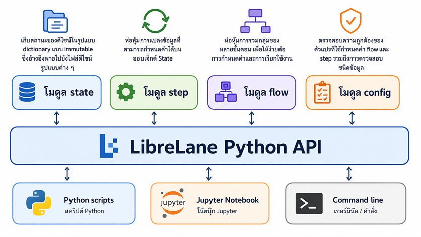

# Lab 14: การควบคุม LibreLane ด้วย Python API

LibreLane ไม่ได้เป็นเพียงคำสั่ง CLI สำหรับเรียก RTL-to-GDSII flow เท่านั้น แต่ถูกออกแบบเป็น **Python infrastructure library** ซึ่งผู้ใช้สามารถสร้าง เรียก ควบคุม ตรวจสอบ และปรับแต่ง ASIC implementation flow ได้จาก Python script หรือ Jupyter Notebook โดยตรง



สถาปัตยกรรมหลักประกอบด้วย 4 ส่วน:

$$\text{Configuration} + \text{Initial State}\rightarrow\text{Flow}\rightarrow\text{Steps}\rightarrow\text{Final State}$$

LibreLane กำหนดให้แต่ละ `Step` รับ `Configuration` และ `State` เป็นอินพุต แล้วส่งคืน `State` ใหม่ โดย State เก็บตำแหน่งไฟล์ design views เช่น netlist, DEF, GDS, SDF และชุด metrics ที่สะสมระหว่าง flow ส่วน `SequentialFlow` จะส่ง State จาก Step หนึ่งไปยัง Step ถัดไปตามลำดับ.  

## 14.1 วัตถุประสงค์ของบทปฏิบัติการ

เมื่อจบ Lab นี้ ผู้เรียนจะสามารถ:

1. อธิบายองค์ประกอบของ LibreLane Python API ได้
2. โหลด `config.yaml` ผ่าน Python API
3. เรียก Classic Flow จาก Python script
4. กำหนด run tag และ run directory
5. เข้าถึง resolved configuration
6. ตรวจสอบรายชื่อ Steps ภายใน Flow
7. อ่าน Final State และ Design Views
8. อ่าน metrics จาก State
9. รัน Flow เพียงบางช่วงด้วย `frm` และ `to`
10. ข้าม Step บางรายการด้วย `skip`
11. ทำ parameter sweep ด้วย Python
12. เปรียบเทียบผลลัพธ์หลาย implementation runs
13. สร้าง Sequential Flow แบบกำหนดเอง
14. จัดการข้อผิดพลาดจาก Flow อย่างเป็นระบบ

---

## 14.2 ความรู้พื้นฐานที่ต้องมี

ผู้เรียนควรผ่านหัวข้อต่อไปนี้มาก่อน:

- การเขียน RTL ด้วย Verilog หรือ SystemVerilog
- การใช้งาน LibreLane ผ่าน CLI
- Logic synthesis
- Floorplanning
- Placement
- Clock Tree Synthesis
- Routing
- Static Timing Analysis
- DRC และ LVS
- การใช้ไฟล์ `config.yaml`
- Python เบื้องต้น
- Dictionary, List, Class และ Exception ใน Python

---

## 14.3 เครื่องมือที่ใช้

Lab นี้ใช้เครื่องมือต่อไปนี้:

- LibreLane
- Python 3.10 หรือใหม่กว่า
- Yosys
- OpenROAD
- KLayout
- Magic
- Netgen
- SKY130 PDK
- Verilator
- Git
- GNU Make

LibreLane รองรับการเรียกใช้งานจาก Python script และ Jupyter Notebook โดยตรง นอกเหนือจาก command-line interface. 

---

## 14.4 สถาปัตยกรรม LibreLane Python API

LibreLane แบ่งองค์ประกอบหลักออกเป็นโมดูลดังนี้:

```text
librelane
├── config
├── flows
├── steps
├── state
└── common
```

หน้าที่ของแต่ละโมดูลคือ:

| โมดูล | หน้าที่ |
|---|---|
| `librelane.config` | โหลด ตรวจสอบ และแปลง configuration |
| `librelane.flows` | นิยามและควบคุมลำดับการทำงานของ flow |
| `librelane.steps` | นิยาม atomic execution units |
| `librelane.state` | จัดเก็บ design views และ metrics |
| `librelane.common` | ชนิดข้อมูลและ utility ที่ใช้ร่วมกัน |

LibreLane กำหนดให้ Configuration และ State เป็น immutable object กล่าวคือไม่ควรแก้ไข object เดิมระหว่างการทำงาน แต่ควรสร้าง object ใหม่เมื่อจำเป็น แนวทางนี้ช่วยให้ flow สามารถตรวจสอบย้อนกลับและทำซ้ำผลลัพธ์ได้ง่ายขึ้น. 

### 14.4.1 Configuration

Configuration คือชุดค่าควบคุม flow เช่น:

```yaml
DESIGN_NAME: counter
CLOCK_PORT: clk
CLOCK_PERIOD: 10
FP_CORE_UTIL: 40
PL_TARGET_DENSITY_PCT: 50
```

เมื่อนำไฟล์นี้เข้าสู่ Python API LibreLane จะ:

1. อ่าน YAML
2. ตรวจสอบชื่อตัวแปร
3. ตรวจสอบชนิดข้อมูล
4. แปลง path
5. เติมค่า default
6. เติมค่าจาก PDK
7. สร้าง immutable `Config` object

Configuration loader รองรับ Python dictionary รวมถึงไฟล์ YAML และ JSON ส่วน Tcl configuration ยังรองรับแต่ถูกระบุว่าเป็นรูปแบบที่เลิกแนะนำ.  

### 14.4.2 Step

Step คือหน่วยย่อยที่สุดของ flow เช่น:

```text
Verilator.Lint
Yosys.Synthesis
OpenROAD.Floorplan
OpenROAD.GlobalPlacement
OpenROAD.CTS
OpenROAD.GlobalRouting
OpenROAD.DetailedRouting
KLayout.StreamOut
Magic.DRC
Netgen.LVS
```

แต่ละ Step มีแนวคิดการทำงานดังนี้:

$$State_{out}=Step(Config,State_{in})$$

Step ไม่ควร:

- แก้ไขไฟล์อินพุตเดิม
- แก้ไข configuration object
- เขียนไฟล์ออกนอก step directory
- อ้างอิงไฟล์ภายนอกที่ไม่ได้ประกาศใน config หรือ state

ข้อกำหนดเหล่านี้มีเป้าหมายเพื่อให้ flow มี reproducibility และ traceability.  

### 14.4.3 State

State คือ snapshot ของ design views ณ จุดใดจุดหนึ่งของ flow เช่น:

```text
RTL
Netlist
ODB
DEF
GDS
SDF
SPEF
SPICE
Metrics
```

ตัวอย่างเส้นทางการเปลี่ยนแปลง State:

```text
Empty State
    │
    ▼
Synthesized Netlist
    │
    ▼
Floorplanned ODB/DEF
    │
    ▼
Placed ODB/DEF
    │
    ▼
CTS ODB/DEF
    │
    ▼
Routed ODB/DEF
    │
    ▼
GDS + SDF + SPEF + Metrics
```

State เก็บทั้ง path ของ design files และ metrics เช่น area, timing, congestion, DRC และ LVS results.  

### 14.4.4 Flow

Flow คือ controller ที่จัดลำดับการเรียก Steps

สำหรับ Sequential Flow:

$$State_i=Step_i(State_{i-1},Config)$$

Classic Flow ซึ่งเป็น flow เริ่มต้นของ LibreLane เป็น `SequentialFlow` ที่ดำเนิน Steps ตามลำดับตั้งแต่ lint และ synthesis ไปจนถึง signoff.  

---

## 14.5 โครงสร้างโปรเจกต์

สร้าง directory สำหรับ Lab:

```bash
mkdir -p lab14-librelane-python-api/{src,scripts,reports}
cd lab14-librelane-python-api
```

โครงสร้างที่ต้องการคือ:

```text
lab14-librelane-python-api/
├── config.yaml
├── Makefile
├── src/
│   └── counter.v
├── scripts/
│   ├── 01_check_api.py
│   ├── 02_show_flows.py
│   ├── 03_show_steps.py
│   ├── 04_validate_config.py
│   ├── 05_run_classic.py
│   ├── 06_inspect_state.py
│   ├── 07_partial_flow.py
│   ├── 08_parameter_sweep.py
│   ├── 09_compare_runs.py
│   └── 10_custom_flow.py
├── reports/
└── runs/
```

---

## 14.6 การสร้าง RTL Design

สร้างไฟล์:

```bash
nano src/counter.v
```

ใส่เนื้อหาดังนี้:

```verilog
`default_nettype none

module counter (
    input  wire       clk,
    input  wire       rst_n,
    input  wire       enable,
    output reg  [7:0] count
);

    always @(posedge clk or negedge rst_n) begin
        if (!rst_n)
            count <= 8'h00;
        else if (enable)
            count <= count + 8'h01;
    end

endmodule

`default_nettype wire
```

วงจรนี้ประกอบด้วย:

- Clock input ชื่อ `clk`
- Active-low asynchronous reset ชื่อ `rst_n`
- Clock enable ชื่อ `enable`
- Counter output ขนาด 8 บิต

---

## 14.7 การสร้าง `config.yaml`

สร้างไฟล์:

```bash
nano config.yaml
```

ใส่เนื้อหาดังนี้:

```yaml
meta:
  version: 2

DESIGN_NAME: counter

VERILOG_FILES:
  - dir::src/counter.v

CLOCK_PORT: clk
CLOCK_PERIOD: 10.0

FP_SIZING: absolute
DIE_AREA:
  - 0
  - 0
  - 100
  - 100

FP_CORE_UTIL: 35

PL_TARGET_DENSITY_PCT: 45

GRT_ADJUSTMENT: 0.3

RUN_HEURISTIC_DIODE_INSERTION: true

MAX_TRANSITION_CONSTRAINT: 1.0

SIGNOFF_DRC:
  - KLayout
  - Magic

SIGNOFF_LVS:
  - Netgen
```

### 14.7.1 ความหมายของค่าหลัก

#### `meta.version`

```yaml
meta:
  version: 2
```

ระบุ schema version ของ LibreLane configuration

#### `DESIGN_NAME`

```yaml
DESIGN_NAME: counter
```

ต้องตรงกับชื่อ top-level module ใน RTL

#### `VERILOG_FILES`

```yaml
VERILOG_FILES:
  - dir::src/counter.v
```

`dir::` หมายถึง path ที่อ้างอิงจาก directory ของ `config.yaml`

#### `CLOCK_PORT`

```yaml
CLOCK_PORT: clk
```

ระบุชื่อ clock port ของ top-level design

#### `CLOCK_PERIOD`

```yaml
CLOCK_PERIOD: 10.0
```

กำหนด clock period 10 ns:

$$f=\frac{1}{10\text{ ns}}=100\text{ MHz}$$

#### `DIE_AREA`

```yaml
DIE_AREA:
  - 0
  - 0
  - 100
  - 100
```

กำหนด die boundary:

$$(x_{min},y_{min},x_{max},y_{max})$$

จึงได้ die ขนาด:

$$100\ \mu m \times 100\ \mu m$$

#### `FP_CORE_UTIL`

```yaml
FP_CORE_UTIL: 35
```

กำหนดเป้าหมาย initial core utilization ประมาณ 35%

#### `PL_TARGET_DENSITY_PCT`

```yaml
PL_TARGET_DENSITY_PCT: 45
```

กำหนด target density สำหรับ global placement ประมาณ 45%

---

## 14.8 ตรวจสอบ Python Environment

สร้างไฟล์:

```bash
nano scripts/01_check_api.py
```

ใส่โค้ด:

```python
#!/usr/bin/env python3

import sys

try:
    import librelane
except ImportError as exc:
    print("ERROR: ไม่พบ LibreLane Python package")
    print("กรุณาเรียกสคริปต์ภายใน LibreLane/Nix environment")
    raise SystemExit(1) from exc


def main() -> None:
    print("Python executable :", sys.executable)
    print("Python version    :", sys.version.split()[0])
    print("LibreLane module  :", librelane.__file__)

    version = getattr(librelane, "__version__", "unknown")
    print("LibreLane version :", version)


if __name__ == "__main__":
    main()
```

กำหนด permission:

```bash
chmod +x scripts/01_check_api.py
```

รัน:

```bash
python3 scripts/01_check_api.py
```

ผลลัพธ์ตัวอย่าง:

```text
Python executable : /nix/store/.../bin/python3
Python version    : 3.11.x
LibreLane module  : .../site-packages/librelane/__init__.py
LibreLane version : 3.x.x
```

หากพบ:

```text
ModuleNotFoundError: No module named 'librelane'
```

แสดงว่ายังไม่ได้เข้า LibreLane environment

สำหรับ Nix-based installation ให้เข้า environment ก่อน:

```bash
nix-shell
```

หรือใช้คำสั่งตาม environment ของ repository ที่ติดตั้งไว้

---

## 14.9 ตรวจสอบ Built-in Flows

สร้างไฟล์:

```bash
nano scripts/02_show_flows.py
```

ใส่โค้ด:

```python
#!/usr/bin/env python3

from librelane.flows import Flow


def main() -> None:
    flow_names = Flow.factory.list()

    print("Registered LibreLane flows")
    print("=" * 60)

    for index, name in enumerate(flow_names, start=1):
        flow_class = Flow.factory.get(name)

        if flow_class is None:
            print(f"{index:2d}. {name:<30} <not resolved>")
            continue

        print(
            f"{index:2d}. "
            f"{name:<30} "
            f"{flow_class.__module__}.{flow_class.__name__}"
        )


if __name__ == "__main__":
    main()
```

รัน:

```bash
python3 scripts/02_show_flows.py
```

ผลลัพธ์ควรมี Flow อย่างน้อย:

```text
Classic
Chip
```

LibreLane มี Flow Factory สำหรับลงทะเบียนและค้นหา Flow จากชื่อ โดยใช้:

```python
Flow.factory.list()
Flow.factory.get("Classic")
```

Factory คืนค่าเป็น **Flow class** ไม่ใช่ Flow object ดังนั้นต้อง instantiate class ก่อนใช้งาน.  

---

## 14.10 ตรวจสอบ Built-in Steps

สร้างไฟล์:

```bash
nano scripts/03_show_steps.py
```

ใส่โค้ด:

```python
#!/usr/bin/env python3

from librelane.steps import Step


def main() -> None:
    step_names = Step.factory.list()

    print("Registered LibreLane steps")
    print("=" * 72)

    for index, name in enumerate(step_names, start=1):
        step_class = Step.factory.get(name)

        if step_class is None:
            print(f"{index:3d}. {name:<45} <not resolved>")
            continue

        print(
            f"{index:3d}. "
            f"{name:<45} "
            f"{step_class.__module__}.{step_class.__name__}"
        )


if __name__ == "__main__":
    main()
```

รัน:

```bash
python3 scripts/03_show_steps.py
```

ค้นหา Step เฉพาะกลุ่ม:

```bash
python3 scripts/03_show_steps.py | grep Yosys
python3 scripts/03_show_steps.py | grep OpenROAD
python3 scripts/03_show_steps.py | grep KLayout
python3 scripts/03_show_steps.py | grep Magic
python3 scripts/03_show_steps.py | grep Netgen
```

ตัวอย่างชื่อ Step ที่อาจพบ:

```text
Yosys.Synthesis
OpenROAD.Floorplan
OpenROAD.GlobalPlacement
OpenROAD.CTS
OpenROAD.GlobalRouting
OpenROAD.DetailedRouting
KLayout.StreamOut
Magic.DRC
Netgen.LVS
```

ชื่อ Step อาจแตกต่างตาม LibreLane release ดังนั้นการใช้ `Step.factory.list()` ก่อนเขียน custom flow จะปลอดภัยกว่าการเดาชื่อ class เอง

---

## 14.11 โหลดและตรวจสอบ `config.yaml`

สร้างไฟล์:

```bash
nano scripts/04_validate_config.py
```

ใส่โค้ด:

```python
#!/usr/bin/env python3

from pathlib import Path

from librelane.flows import Flow


CONFIG_FILE = Path("config.yaml")


def main() -> None:
    if not CONFIG_FILE.is_file():
        raise SystemExit(f"ERROR: ไม่พบ {CONFIG_FILE}")

    classic_class = Flow.factory.get("Classic")

    if classic_class is None:
        raise SystemExit("ERROR: ไม่พบ Classic Flow")

    flow = classic_class(
        str(CONFIG_FILE),
        pdk="sky130A",
    )

    print("Configuration loaded successfully")
    print("=" * 60)
    print("Flow class       :", flow.__class__.__name__)
    print("DESIGN_NAME      :", flow.config["DESIGN_NAME"])
    print("CLOCK_PORT       :", flow.config["CLOCK_PORT"])
    print("CLOCK_PERIOD     :", flow.config["CLOCK_PERIOD"])
    print("FP_CORE_UTIL     :", flow.config["FP_CORE_UTIL"])
    print(
        "PL_TARGET_DENSITY_PCT:",
        flow.config["PL_TARGET_DENSITY_PCT"],
    )


if __name__ == "__main__":
    main()
```

รัน:

```bash
python3 scripts/04_validate_config.py
```

การสร้าง Flow object จะทำให้ LibreLane โหลดและ validate configuration

```python
flow = classic_class(
    "config.yaml",
    pdk="sky130A",
)
```

Constructor ของ `Flow` สามารถรับ:

- path ของ configuration
- Python dictionary
- ลำดับของ configuration sources
- resolved `Config` object

รวมทั้ง override:

- `pdk`
- `pdk_root`
- `scl`
- `pad`
- `design_dir`
- `config_override_strings`

ตาม Flow API.  

### หมายเหตุเรื่อง PDK

ในบาง installation อาจต้องใช้:

```python
pdk="sky130A"
```

บาง environment อาจใช้:

```python
pdk="sky130"
```

ให้ตรวจสอบจากคำสั่ง CLI ที่ใช้งานได้ในระบบนั้น เช่น:

```bash
librelane --pdk sky130A config.yaml
```

ค่า Python API ควรตรงกับค่า `--pdk` ที่ใช้ผ่าน CLI

---

## 14.12 แสดง Configuration Variables ของ Classic Flow

สร้างไฟล์:

```bash
nano scripts/show_config_variables.py
```

ใส่โค้ด:

```python
#!/usr/bin/env python3

from librelane.flows import Flow


def main() -> None:
    classic_class = Flow.factory.get("Classic")

    if classic_class is None:
        raise SystemExit("Classic Flow is not registered")

    variables = classic_class.get_all_config_variables()

    print(f"Total variables: {len(variables)}")
    print("=" * 100)

    for variable in variables:
        default = getattr(variable, "default", None)
        units = getattr(variable, "units", None)
        description = getattr(variable, "description", "")

        print(f"Name        : {variable.name}")
        print(f"Default     : {default}")
        print(f"Units       : {units}")
        print(f"Description : {description}")
        print("-" * 100)


if __name__ == "__main__":
    main()
```

รัน:

```bash
python3 scripts/show_config_variables.py
```

บันทึกเป็นเอกสาร:

```bash
python3 scripts/show_config_variables.py \
    > reports/classic_config_variables.txt
```

LibreLane Flow API มี method:

```python
get_all_config_variables()
```

ซึ่งรวม:

- Universal configuration variables
- Flow-specific variables
- Step-specific variables

และมี:

```python
Classic.display_help()
Classic.get_help_md()
```

สำหรับสร้างเอกสาร configuration จาก Python โดยตรง.  

---

## 14.13 ตรวจสอบลำดับ Steps ของ Classic Flow

สร้างไฟล์:

```bash
nano scripts/show_classic_sequence.py
```

ใส่โค้ด:

```python
#!/usr/bin/env python3

from librelane.flows import Flow


def main() -> None:
    classic_class = Flow.factory.get("Classic")

    if classic_class is None:
        raise SystemExit("Classic Flow is not registered")

    print("Classic Flow step sequence")
    print("=" * 80)

    for ordinal, step_class in enumerate(classic_class.Steps, start=1):
        step_id = getattr(step_class, "id", step_class.__name__)

        print(
            f"{ordinal:3d}. "
            f"{step_id:<45} "
            f"{step_class.__module__}.{step_class.__name__}"
        )


if __name__ == "__main__":
    main()
```

รัน:

```bash
python3 scripts/show_classic_sequence.py
```

บันทึกลงไฟล์:

```bash
python3 scripts/show_classic_sequence.py \
    > reports/classic_step_sequence.txt
```

ประโยชน์ของรายการนี้คือใช้หา Step ID ที่ถูกต้องสำหรับ:

```python
frm="..."
to="..."
skip=["..."]
```

ห้ามเดาชื่อ Step ID จากชื่อ directory เพียงอย่างเดียว เพราะชื่ออาจเปลี่ยนระหว่าง LibreLane versions

---

## 14.14 รัน Classic Flow ด้วย Python API

สร้างไฟล์:

```bash
nano scripts/05_run_classic.py
```

ใส่โค้ด:

```python
#!/usr/bin/env python3

from pathlib import Path
import sys
import traceback

from librelane.flows import Flow, FlowError


CONFIG_FILE = Path("config.yaml")
RUN_TAG = "lab14_python_api"


def main() -> int:
    if not CONFIG_FILE.is_file():
        print(f"ERROR: configuration file not found: {CONFIG_FILE}")
        return 1

    classic_class = Flow.factory.get("Classic")

    if classic_class is None:
        print("ERROR: Classic Flow is not registered")
        return 1

    try:
        flow = classic_class(
            str(CONFIG_FILE),
            pdk="sky130A",
        )

        print("Starting LibreLane Classic Flow")
        print("=" * 72)
        print("Configuration :", CONFIG_FILE.resolve())
        print("Design        :", flow.config["DESIGN_NAME"])
        print("Clock port    :", flow.config["CLOCK_PORT"])
        print("Clock period  :", flow.config["CLOCK_PERIOD"])
        print("Run tag       :", RUN_TAG)

        final_state = flow.start(
            tag=RUN_TAG,
            overwrite=True,
        )

        print()
        print("Flow completed successfully")
        print("Run directory :", flow.run_dir)
        print("Resolved config:", flow.config_resolved_path)
        print("Executed steps:", len(flow.step_objects))
        print("Metric count  :", len(final_state.metrics))

        return 0

    except FlowError as exc:
        print(f"LibreLane flow failed: {exc}", file=sys.stderr)
        return 2

    except Exception as exc:
        print(f"Unexpected error: {exc}", file=sys.stderr)
        traceback.print_exc()
        return 3


if __name__ == "__main__":
    raise SystemExit(main())
```

กำหนด permission:

```bash
chmod +x scripts/05_run_classic.py
```

รัน:

```bash
python3 scripts/05_run_classic.py
```

Method หลักสำหรับเริ่ม Flow คือ:

```python
final_state = flow.start(...)
```

`Flow.start()` รองรับ argument สำคัญ เช่น:

```python
tag
last_run
with_initial_state
overwrite
```

สำหรับ Sequential Flow ยังส่ง argument ต่อไปยัง `run()` ได้ เช่น:

```python
frm
to
skip
reproducible
```

เมื่อไม่กำหนด tag LibreLane จะสร้าง tag จากวันที่และเวลา และสร้าง run directory ภายใต้ `runs/` ของ design directory.  

---

## 14.15 ตรวจสอบ Run Directory

หลัง Flow ทำงาน ให้ตรวจสอบ:

```bash
find runs/lab14_python_api -maxdepth 2 -type f | sort | head -100
```

โครงสร้างโดยทั่วไป:

```text
runs/lab14_python_api/
├── config.json
├── resolved.json
├── final/
├── 01-verilator-lint/
├── 02-yosys-synthesis/
├── ...
└── final_state.json
```

ชื่อและหมายเลข directory อาจแตกต่างกันตาม LibreLane version และ Steps ที่เปิดใช้งาน

ดูรายการ Step directories:

```bash
find runs/lab14_python_api \
    -mindepth 1 \
    -maxdepth 1 \
    -type d \
    | sort
```

ค้นหา State files:

```bash
find runs/lab14_python_api \
    -name "state_*.json" \
    -o -name "*state*.json"
```

ค้นหา metrics:

```bash
find runs/lab14_python_api \
    -iname "*metric*" \
    -o -iname "*report*"
```

---

## 14.16 ตรวจสอบ Final State

สร้างไฟล์:

```bash
nano scripts/06_inspect_state.py
```

ใส่โค้ด:

```python
#!/usr/bin/env python3

from pathlib import Path
from typing import Any

from librelane.flows import Flow
from librelane.state import DesignFormat


CONFIG_FILE = Path("config.yaml")
RUN_TAG = "lab14_inspect_state"


def format_value(value: Any) -> str:
    if value is None:
        return "<not generated>"

    if isinstance(value, dict):
        lines = []

        for key, item in value.items():
            lines.append(f"{key}: {item}")

        return "\n".join(lines)

    if isinstance(value, list):
        return "\n".join(str(item) for item in value)

    return str(value)


def main() -> None:
    classic_class = Flow.factory.get("Classic")

    if classic_class is None:
        raise SystemExit("Classic Flow is not registered")

    flow = classic_class(
        str(CONFIG_FILE),
        pdk="sky130A",
    )

    final_state = flow.start(
        tag=RUN_TAG,
        overwrite=True,
    )

    print()
    print("Final design views")
    print("=" * 80)

    for format_id in DesignFormat.factory.list():
        design_format = DesignFormat.factory.get(format_id)

        if design_format is None:
            continue

        value = final_state.get(design_format)

        if value is None:
            value = final_state.get(format_id)

        if value is None:
            continue

        print(f"[{format_id}]")
        print(format_value(value))
        print("-" * 80)

    print()
    print("Metrics")
    print("=" * 80)

    for metric_name in sorted(final_state.metrics):
        print(f"{metric_name} = {final_state.metrics[metric_name]}")


if __name__ == "__main__":
    main()
```

รัน:

```bash
python3 scripts/06_inspect_state.py \
    | tee reports/final_state.txt
```

### 14.16.1 DesignFormat Factory

LibreLane จัดการชนิด design views ผ่าน `DesignFormat`

ตัวอย่าง format IDs ที่อาจพบ:

```text
nl
pnl
def
odb
gds
lef
sdf
spef
spice
json_h
```

สามารถตรวจสอบรายการจริงได้ด้วย:

```python
DesignFormat.factory.list()
```

และค้นหา object ด้วย:

```python
DesignFormat.factory.get("gds")
```

State รองรับ mapping ระหว่าง `DesignFormat` และ path หรือ nested mapping ของ paths.  

---

## 14.17 อ่าน Design View แบบเฉพาะเจาะจง

ตัวอย่างสำหรับอ่าน GDS:

```python
from librelane.state import DesignFormat

gds_format = DesignFormat.factory.get("gds")

if gds_format is None:
    raise RuntimeError("GDS DesignFormat is not registered")

gds_view = final_state.get(gds_format)

if gds_view is None:
    gds_view = final_state.get("gds")

print("GDS:", gds_view)
```

อ่าน DEF:

```python
def_format = DesignFormat.factory.get("def")
def_view = final_state.get(def_format)

if def_view is None:
    def_view = final_state.get("def")

print("DEF:", def_view)
```

อ่าน netlist:

```python
nl_format = DesignFormat.factory.get("nl")
netlist_view = final_state.get(nl_format)

if netlist_view is None:
    netlist_view = final_state.get("nl")

print("Netlist:", netlist_view)
```

ใช้รูปแบบ fallback นี้เพื่อลดผลกระทบจากความแตกต่างของ API representation ระหว่าง LibreLane releases

---

## 14.18 Export State เป็น JSON

เพิ่มตัวอย่างสคริปต์:

```bash
nano scripts/export_state.py
```

ใส่โค้ด:

```python
#!/usr/bin/env python3

import json
from pathlib import Path

from librelane.flows import Flow


def json_default(value):
    return str(value)


def main() -> None:
    classic_class = Flow.factory.get("Classic")

    if classic_class is None:
        raise SystemExit("Classic Flow is not registered")

    flow = classic_class(
        "config.yaml",
        pdk="sky130A",
    )

    state = flow.start(
        tag="lab14_export_state",
        overwrite=True,
    )

    raw_state = state.to_raw_dict(metrics=True)

    output_path = Path("reports/final_state.json")
    output_path.parent.mkdir(parents=True, exist_ok=True)

    with output_path.open("w", encoding="utf-8") as output_file:
        json.dump(
            raw_state,
            output_file,
            indent=2,
            default=json_default,
        )

    print(f"State exported to {output_path}")


if __name__ == "__main__":
    main()
```

รัน:

```bash
python3 scripts/export_state.py
```

ตรวจสอบ:

```bash
python3 -m json.tool reports/final_state.json | less
```

State API มี `to_raw_dict(metrics=True)` สำหรับแปลง State กลับเป็น Python dictionary และสามารถเลือกว่าจะรวม metrics หรือไม่.  

---

## 14.19 รัน Flow ถึง Synthesis เท่านั้น

สร้างไฟล์:

```bash
nano scripts/07_partial_flow.py
```

ใส่โค้ด:

```python
#!/usr/bin/env python3

from librelane.flows import Flow


TARGET_STEP = "Yosys.Synthesis"


def main() -> None:
    classic_class = Flow.factory.get("Classic")

    if classic_class is None:
        raise SystemExit("Classic Flow is not registered")

    available_ids = {
        getattr(step_class, "id", step_class.__name__)
        for step_class in classic_class.Steps
    }

    if TARGET_STEP not in available_ids:
        print(f"ERROR: step '{TARGET_STEP}' is not in Classic Flow")
        print("Available step IDs:")

        for step_id in sorted(available_ids):
            print(f"  {step_id}")

        raise SystemExit(1)

    flow = classic_class(
        "config.yaml",
        pdk="sky130A",
    )

    state = flow.start(
        tag="lab14_synthesis_only",
        to=TARGET_STEP,
        overwrite=True,
    )

    print("Partial flow completed")
    print("Stopped at     :", TARGET_STEP)
    print("Run directory  :", flow.run_dir)
    print("Executed steps :", len(flow.step_objects))
    print("Metric count   :", len(state.metrics))


if __name__ == "__main__":
    main()
```

รัน:

```bash
python3 scripts/07_partial_flow.py
```

หลักการคือ:

```python
flow.start(
    to="Yosys.Synthesis",
)
```

Sequential Flow รองรับ `to` สำหรับหยุดหลัง Step ที่กำหนด. 

ตรวจสอบ netlist:

```bash
find runs/lab14_synthesis_only \
    -type f \
    \( -name "*.v" -o -name "*.nl.v" \) \
    | sort
```

---

## 14.20 รัน Flow เฉพาะช่วง

ตัวอย่าง:

```python
state = flow.start(
    tag="lab14_placement_segment",
    frm="OpenROAD.Floorplan",
    to="OpenROAD.GlobalPlacement",
)
```

ความหมาย:

- `frm` เริ่ม execution จาก Step ที่ระบุ
- `to` หยุดหลัง Step ที่ระบุ

อย่างไรก็ตาม Step เริ่มต้นต้องมี input State ที่เหมาะสม หากเริ่มจาก placement แต่ยังไม่มี synthesized netlist หรือ floorplan database Flow จะล้มเหลว

แนวทางที่ถูกต้องคือ:

1. รันช่วงก่อนหน้าให้เสร็จ
2. ใช้ run directory เดิม
3. Resume จาก State ที่ LibreLane บันทึกไว้
4. ระบุ `frm` และ `to` ให้สัมพันธ์กับ State ที่มีอยู่

ตัวอย่าง:

```python
flow = classic_class(
    "config.yaml",
    pdk="sky130A",
)

flow.start(
    tag="lab14_incremental",
    to="Yosys.Synthesis",
    overwrite=True,
)

flow.start(
    tag="lab14_incremental",
    frm="OpenROAD.Floorplan",
    to="OpenROAD.GlobalPlacement",
)
```

ชื่อ Step ที่แน่นอนต้องตรวจสอบจาก:

```bash
python3 scripts/show_classic_sequence.py
```

---

## 14.21 ข้าม Step ด้วย `skip`

ตัวอย่าง:

```python
state = flow.start(
    tag="lab14_skip_example",
    skip=[
        "Magic.DRC",
    ],
    overwrite=True,
)
```

หรือข้ามหลาย Step:

```python
state = flow.start(
    tag="lab14_skip_signoff",
    skip=[
        "Magic.DRC",
        "KLayout.DRC",
    ],
    overwrite=True,
)
```

ก่อนใช้งานต้องพิจารณา dependency:

- การข้าม report-only Step มักกระทบน้อย
- การข้าม synthesis ทำให้ floorplan ไม่มี netlist
- การข้าม floorplan ทำให้ placement ไม่มี database
- การข้าม CTS ทำให้ routing และ timing analysis ไม่ได้ clock tree
- การข้าม stream-out ทำให้ไม่มี GDS
- การข้าม DRC/LVS ทำให้ผลลัพธ์ไม่ครบ signoff

ดังนั้น `skip` ไม่ได้หมายความว่าทุก Step สามารถข้ามได้อย่างอิสระ

---

## 14.22 Configuration Override จาก Python

LibreLane Flow constructor รองรับ `config_override_strings`

ตัวอย่าง:

```python
flow = classic_class(
    "config.yaml",
    pdk="sky130A",
    config_override_strings=[
        "CLOCK_PERIOD=8.0",
        "FP_CORE_UTIL=40",
        "PL_TARGET_DENSITY_PCT=50",
    ],
)
```

จากนั้น:

```python
print(flow.config["CLOCK_PERIOD"])
print(flow.config["FP_CORE_UTIL"])
```

ประโยชน์ของ override:

- ทดลองหลาย clock periods
- ทดลองหลาย core utilizations
- ทดลอง placement densities
- ทำ design-space exploration
- ใช้ config หลักร่วมกันโดยไม่แก้ไฟล์
- สร้าง CI regression matrix

ข้อควรระวัง: syntax ของ override ควรตรวจสอบให้ตรงกับ LibreLane release ที่ใช้งาน หาก string override ไม่ผ่าน validation ให้ใช้ Python dictionary เป็น configuration overlay

---

## 14.23 ใช้ Python Dictionary เป็น Configuration Overlay

ตัวอย่าง:

```python
base_config = "config.yaml"

override_config = {
    "CLOCK_PERIOD": 8,
    "FP_CORE_UTIL": 40,
    "PL_TARGET_DENSITY_PCT": 50,
}

flow = classic_class(
    [
        base_config,
        override_config,
    ],
    pdk="sky130A",
)
```

แนวคิดคือโหลด configuration หลาย source ตามลำดับ:

```text
config.yaml
    │
    ▼
Python override dictionary
    │
    ▼
Validated Config object
```

ค่าจาก source ที่ตามหลังใช้ override ค่าก่อนหน้า

การส่ง Python dictionary เหมาะกับ:

- automated experiments
- CI/CD
- parameter sweep
- optimization algorithm
- notebook-based exploration

---

## 14.24 Parameter Sweep

สร้างไฟล์:

```bash
nano scripts/08_parameter_sweep.py
```

ใส่โค้ด:

```python
#!/usr/bin/env python3

import csv
from pathlib import Path
from typing import Any

from librelane.flows import Flow, FlowError


OUTPUT_CSV = Path("reports/parameter_sweep.csv")

EXPERIMENTS = [
    {
        "name": "util30_density40",
        "FP_CORE_UTIL": 30,
        "PL_TARGET_DENSITY_PCT": 40,
    },
    {
        "name": "util35_density45",
        "FP_CORE_UTIL": 35,
        "PL_TARGET_DENSITY_PCT": 45,
    },
    {
        "name": "util40_density50",
        "FP_CORE_UTIL": 40,
        "PL_TARGET_DENSITY_PCT": 50,
    },
]


def find_metric(metrics: Any, keywords: list[str]):
    for name, value in metrics.items():
        lowered = name.lower()

        if all(keyword.lower() in lowered for keyword in keywords):
            return value

    return None


def main() -> None:
    classic_class = Flow.factory.get("Classic")

    if classic_class is None:
        raise SystemExit("Classic Flow is not registered")

    OUTPUT_CSV.parent.mkdir(parents=True, exist_ok=True)

    rows = []

    for experiment in EXPERIMENTS:
        name = experiment["name"]

        overlay = {
            "FP_CORE_UTIL": experiment["FP_CORE_UTIL"],
            "PL_TARGET_DENSITY_PCT":
                experiment["PL_TARGET_DENSITY_PCT"],
        }

        print()
        print("=" * 80)
        print(f"Running experiment: {name}")
        print("=" * 80)

        try:
            flow = classic_class(
                [
                    "config.yaml",
                    overlay,
                ],
                pdk="sky130A",
            )

            state = flow.start(
                tag=f"lab14_{name}",
                overwrite=True,
            )

            metrics = state.metrics

            rows.append(
                {
                    "name": name,
                    "status": "PASS",
                    "core_util":
                        experiment["FP_CORE_UTIL"],
                    "placement_density":
                        experiment["PL_TARGET_DENSITY_PCT"],
                    "design_area":
                        find_metric(metrics, ["design", "area"]),
                    "setup_wns":
                        find_metric(metrics, ["setup", "wns"]),
                    "setup_tns":
                        find_metric(metrics, ["setup", "tns"]),
                    "drc":
                        find_metric(metrics, ["drc"]),
                    "run_dir": str(flow.run_dir),
                }
            )

        except FlowError as exc:
            rows.append(
                {
                    "name": name,
                    "status": "FAIL",
                    "core_util":
                        experiment["FP_CORE_UTIL"],
                    "placement_density":
                        experiment["PL_TARGET_DENSITY_PCT"],
                    "design_area": None,
                    "setup_wns": None,
                    "setup_tns": None,
                    "drc": None,
                    "run_dir": "",
                    "error": str(exc),
                }
            )

    fieldnames = sorted(
        {
            key
            for row in rows
            for key in row.keys()
        }
    )

    with OUTPUT_CSV.open(
        "w",
        newline="",
        encoding="utf-8",
    ) as csv_file:
        writer = csv.DictWriter(
            csv_file,
            fieldnames=fieldnames,
        )

        writer.writeheader()
        writer.writerows(rows)

    print()
    print(f"Results written to {OUTPUT_CSV}")


if __name__ == "__main__":
    main()
```

รัน:

```bash
python3 scripts/08_parameter_sweep.py
```

ดูผล:

```bash
column -s, -t reports/parameter_sweep.csv | less
```

### 14.24.1 เหตุผลที่ค้นหา Metric ด้วย Keyword

ชื่อ metrics อาจมี prefix, corner หรือรายละเอียดเพิ่มเติม เช่น:

```text
timing__setup__wns
timing__setup__tns
design__instance__area
route__drc_errors
```

และอาจมีการเปลี่ยนแปลงระหว่าง LibreLane versions

จึงไม่ควรเขียน:

```python
wns = metrics["wns"]
```

โดยไม่ตรวจสอบรายการจริงก่อน

ให้พิมพ์ metric names:

```python
for name in sorted(state.metrics):
    print(name)
```

จากนั้นแก้ script ให้เลือกชื่อที่แน่นอนสำหรับ environment ที่ใช้สอน

---

## 14.25 เปรียบเทียบ Metrics ระหว่าง Runs

สร้างไฟล์:

```bash
nano scripts/09_compare_runs.py
```

ใส่โค้ด:

```python
#!/usr/bin/env python3

import json
from pathlib import Path
from typing import Any


RUNS_DIRECTORY = Path("runs")


def find_final_state(run_directory: Path) -> Path | None:
    candidates = list(
        run_directory.rglob("*state*.json")
    )

    if not candidates:
        return None

    candidates.sort(
        key=lambda path: path.stat().st_mtime,
        reverse=True,
    )

    return candidates[0]


def load_json(path: Path) -> dict[str, Any]:
    with path.open("r", encoding="utf-8") as input_file:
        return json.load(input_file)


def extract_metrics(data: dict[str, Any]) -> dict[str, Any]:
    metrics = data.get("metrics")

    if isinstance(metrics, dict):
        return metrics

    return {}


def main() -> None:
    if not RUNS_DIRECTORY.is_dir():
        raise SystemExit("No runs directory found")

    for run_directory in sorted(RUNS_DIRECTORY.iterdir()):
        if not run_directory.is_dir():
            continue

        state_file = find_final_state(run_directory)

        if state_file is None:
            continue

        try:
            state_data = load_json(state_file)
        except (OSError, json.JSONDecodeError):
            continue

        metrics = extract_metrics(state_data)

        print()
        print(f"Run: {run_directory.name}")
        print(f"State file: {state_file}")
        print(f"Metric count: {len(metrics)}")

        interesting = [
            (name, value)
            for name, value in metrics.items()
            if any(
                keyword in name.lower()
                for keyword in (
                    "wns",
                    "tns",
                    "area",
                    "drc",
                    "lvs",
                    "wire",
                )
            )
        ]

        for name, value in sorted(interesting):
            print(f"  {name} = {value}")


if __name__ == "__main__":
    main()
```

รัน:

```bash
python3 scripts/09_compare_runs.py \
    | tee reports/run_comparison.txt
```

---

## 14.26 สร้าง Custom Sequential Flow

LibreLane รองรับการสร้าง Flow ใหม่โดยสืบทอดจาก `SequentialFlow` และกำหนด class variable ชื่อ `Steps`

สร้างไฟล์:

```bash
nano scripts/10_custom_flow.py
```

ใส่โค้ด:

```python
#!/usr/bin/env python3

from librelane.flows import SequentialFlow
from librelane.steps import Step


REQUIRED_STEP_IDS = [
    "Verilator.Lint",
    "Yosys.Synthesis",
]


def resolve_steps(step_ids: list[str]) -> list[type[Step]]:
    resolved_steps = []

    for step_id in step_ids:
        step_class = Step.factory.get(step_id)

        if step_class is None:
            available = "\n".join(
                f"  {name}"
                for name in Step.factory.list()
            )

            raise RuntimeError(
                f"Step '{step_id}' is not registered.\n"
                f"Available steps:\n{available}"
            )

        resolved_steps.append(step_class)

    return resolved_steps


class Lab14SynthesisFlow(SequentialFlow):
    name = "Lab14SynthesisFlow"
    Steps = resolve_steps(REQUIRED_STEP_IDS)


def main() -> None:
    flow = Lab14SynthesisFlow(
        "config.yaml",
        pdk="sky130A",
    )

    state = flow.start(
        tag="lab14_custom_synthesis",
        overwrite=True,
    )

    print("Custom flow completed")
    print("Run directory :", flow.run_dir)
    print("Executed steps:", len(flow.step_objects))
    print("Metric count  :", len(state.metrics))

    print()
    print("Executed Step objects")

    for index, step_object in enumerate(
        flow.step_objects,
        start=1,
    ):
        step_id = getattr(
            step_object,
            "id",
            step_object.__class__.__name__,
        )

        print(f"{index:2d}. {step_id}")


if __name__ == "__main__":
    main()
```

### ข้อสังเกต

ลำดับ:

```python
REQUIRED_STEP_IDS = [
    "Verilator.Lint",
    "Yosys.Synthesis",
]
```

อาจยังไม่เพียงพอใน LibreLane บาง release หาก `Yosys.Synthesis` ต้องการ State ที่สร้างจาก Step อื่น เช่น header extraction หรือ preprocessing

ให้ตรวจสอบ Classic Flow sequence:

```bash
python3 scripts/show_classic_sequence.py
```

แล้วนำ Steps ที่เกิดก่อน synthesis มาใส่ใน custom flow ตามลำดับจริง

ตัวอย่างเชิงแนวคิด:

```python
REQUIRED_STEP_IDS = [
    "Verilator.Lint",
    "Yosys.JsonHeader",
    "Yosys.Synthesis",
]
```

ชื่อจริงต้องยึดผลจาก `Step.factory.list()` และ `Classic.Steps`

`SequentialFlow` จะจัดการการเรียก Steps ตามลำดับ รวมถึงส่ง State ต่อเนื่องระหว่าง Steps ให้อัตโนมัติ.  

---

## 14.27 สร้าง Custom Flow จาก Steps ของ Classic โดยเลือกช่วงอัตโนมัติ

วิธีที่ทนต่อการเปลี่ยนแปลงของ LibreLane มากกว่าคือ เลือก Steps จาก Classic Flow จนถึง target Step

สร้างไฟล์:

```bash
nano scripts/custom_synthesis_from_classic.py
```

ใส่โค้ด:

```python
#!/usr/bin/env python3

from librelane.flows import Flow, SequentialFlow


TARGET_STEP_ID = "Yosys.Synthesis"


def collect_steps_to_target(
    flow_class,
    target_id: str,
):
    selected = []

    for step_class in flow_class.Steps:
        selected.append(step_class)

        step_id = getattr(
            step_class,
            "id",
            step_class.__name__,
        )

        if step_id == target_id:
            return selected

    raise RuntimeError(
        f"Target step '{target_id}' not found"
    )


def main() -> None:
    classic_class = Flow.factory.get("Classic")

    if classic_class is None:
        raise SystemExit("Classic Flow is not registered")

    selected_steps = collect_steps_to_target(
        classic_class,
        TARGET_STEP_ID,
    )

    class SynthesisOnlyFlow(SequentialFlow):
        name = "SynthesisOnlyFlow"
        Steps = selected_steps

    print("Selected Steps")
    print("=" * 72)

    for index, step_class in enumerate(
        selected_steps,
        start=1,
    ):
        print(
            f"{index:2d}. "
            f"{getattr(step_class, 'id', step_class.__name__)}"
        )

    flow = SynthesisOnlyFlow(
        "config.yaml",
        pdk="sky130A",
    )

    state = flow.start(
        tag="lab14_synthesis_from_classic",
        overwrite=True,
    )

    print()
    print("Flow completed")
    print("Run directory:", flow.run_dir)
    print("Metrics:", len(state.metrics))


if __name__ == "__main__":
    main()
```

แนวทางนี้มีข้อดีคือ:

- ไม่ต้องเดาว่ามี preprocessing Steps อะไรบ้าง
- รักษาลำดับเดียวกับ Classic Flow
- ปรับตาม LibreLane version ได้ง่ายกว่า
- เหมาะสำหรับสร้าง teaching flow แบบย่อ

---

## 14.28 ปรับ Classic Flow ด้วย Substitution

`SequentialFlow` รองรับการแทนที่ เพิ่ม ลบ หรือแทรก Steps ผ่าน substitution mechanism.  

ตัวอย่างลบ Step:

```python
from librelane.flows import Flow

classic_class = Flow.factory.get("Classic")

ModifiedClassic = classic_class.Substitute(
    {
        "Magic.DRC": None,
    }
)

flow = ModifiedClassic(
    "config.yaml",
    pdk="sky130A",
)

state = flow.start(
    tag="lab14_no_magic_drc",
    overwrite=True,
)
```

ตัวอย่างแทน Step:

```python
ModifiedClassic = classic_class.Substitute(
    {
        "Existing.Step.ID": ReplacementStepClass,
    }
)
```

ตัวอย่างแทรกก่อน Step:

```python
ModifiedClassic = classic_class.Substitute(
    {
        "-OpenROAD.DetailedRouting": CustomPreRouteStep,
    }
)
```

ตัวอย่างแทรกหลัง Step:

```python
ModifiedClassic = classic_class.Substitute(
    {
        "+OpenROAD.DetailedRouting": CustomPostRouteStep,
    }
)
```

ข้อควรระวัง:

1. Step ใหม่ต้องรับ State format ที่ Step ก่อนหน้าสร้าง
2. Step ใหม่ต้องสร้าง State format ที่ Step ถัดไปต้องการ
3. Configuration variables ของ Step ใหม่ต้องถูกประกาศ
4. ห้ามเขียนไฟล์ออกนอก step directory
5. ไม่ควรแก้ไข input state หรือ input config โดยตรง

---

## 14.29 ตรวจสอบ Step Objects หลัง Flow จบ

หลังจาก:

```python
state = flow.start(...)
```

สามารถอ่าน:

```python
flow.step_objects
```

ตัวอย่าง:

```python
for step_object in flow.step_objects:
    print(step_object)
```

หรือ:

```python
for index, step_object in enumerate(
    flow.step_objects,
    start=1,
):
    print(
        index,
        getattr(step_object, "id", None),
        step_object.__class__.__name__,
    )
```

`step_objects` คือรายการ Step instances จากการรันล่าสุด หากเรียก `start()` ใหม่ reference เดิมจะถูกแทนที่.  

---

## 14.30 Resolved Configuration

หลัง Flow เริ่มทำงาน LibreLane จะสร้าง resolved configuration ซึ่งรวม:

- ค่าจาก `config.yaml`
- default values
- PDK values
- standard-cell-library values
- command-line หรือ Python overrides
- paths ที่ resolve แล้ว

เข้าถึง path ได้จาก:

```python
print(flow.config_resolved_path)
```

คัดลอกเข้าสู่ reports:

```python
from pathlib import Path
import shutil

source = Path(flow.config_resolved_path)
destination = Path(
    "reports/resolved_config.json"
)

shutil.copy2(source, destination)
```

Resolved configuration มีประโยชน์มากสำหรับ:

- reproducibility
- debugging
- audit
- experiment comparison
- publication
- signoff record

---

## 14.31 สร้าง Manifest ของ Run

สร้างไฟล์:

```bash
nano scripts/create_manifest.py
```

ใส่โค้ด:

```python
#!/usr/bin/env python3

import hashlib
import json
from pathlib import Path
import platform
import shutil
import sys

import librelane
from librelane.flows import Flow


def sha256_file(path: Path) -> str:
    digest = hashlib.sha256()

    with path.open("rb") as input_file:
        for block in iter(
            lambda: input_file.read(1024 * 1024),
            b"",
        ):
            digest.update(block)

    return digest.hexdigest()


def main() -> None:
    classic_class = Flow.factory.get("Classic")

    if classic_class is None:
        raise SystemExit("Classic Flow is not registered")

    flow = classic_class(
        "config.yaml",
        pdk="sky130A",
    )

    final_state = flow.start(
        tag="lab14_manifest",
        overwrite=True,
    )

    config_path = Path("config.yaml")
    rtl_path = Path("src/counter.v")

    manifest = {
        "design_name":
            flow.config["DESIGN_NAME"],
        "run_directory":
            str(flow.run_dir),
        "python_version":
            sys.version,
        "platform":
            platform.platform(),
        "librelane_version":
            getattr(
                librelane,
                "__version__",
                "unknown",
            ),
        "config_sha256":
            sha256_file(config_path),
        "rtl_sha256":
            sha256_file(rtl_path),
        "step_count":
            len(flow.step_objects),
        "metric_count":
            len(final_state.metrics),
    }

    output = Path("reports/run_manifest.json")
    output.parent.mkdir(
        parents=True,
        exist_ok=True,
    )

    with output.open("w", encoding="utf-8") as file:
        json.dump(
            manifest,
            file,
            indent=2,
        )

    resolved = Path(flow.config_resolved_path)

    if resolved.is_file():
        shutil.copy2(
            resolved,
            "reports/run_manifest_resolved_config.json",
        )

    print(f"Manifest written to {output}")


if __name__ == "__main__":
    main()
```

Run manifest ช่วยบันทึกว่า implementation ถูกสร้างจาก:

- RTL version ใด
- Configuration version ใด
- LibreLane version ใด
- Python version ใด
- Run directory ใด

---

## 14.32 Makefile

สร้างไฟล์:

```bash
nano Makefile
```

ใส่เนื้อหา:

```makefile
PYTHON ?= python3
CONFIG ?= config.yaml
RUN_TAG ?= lab14_python_api

.PHONY: all
all: check validate run

.PHONY: check
check:
	$(PYTHON) scripts/01_check_api.py

.PHONY: flows
flows:
	$(PYTHON) scripts/02_show_flows.py

.PHONY: steps
steps:
	$(PYTHON) scripts/03_show_steps.py

.PHONY: validate
validate:
	$(PYTHON) scripts/04_validate_config.py

.PHONY: sequence
sequence:
	$(PYTHON) scripts/show_classic_sequence.py

.PHONY: variables
variables:
	mkdir -p reports
	$(PYTHON) scripts/show_config_variables.py \
		> reports/classic_config_variables.txt

.PHONY: run
run:
	$(PYTHON) scripts/05_run_classic.py

.PHONY: inspect
inspect:
	mkdir -p reports
	$(PYTHON) scripts/06_inspect_state.py \
		| tee reports/final_state.txt

.PHONY: synth
synth:
	$(PYTHON) scripts/07_partial_flow.py

.PHONY: sweep
sweep:
	$(PYTHON) scripts/08_parameter_sweep.py

.PHONY: compare
compare:
	mkdir -p reports
	$(PYTHON) scripts/09_compare_runs.py \
		| tee reports/run_comparison.txt

.PHONY: custom
custom:
	$(PYTHON) scripts/10_custom_flow.py

.PHONY: clean
clean:
	rm -rf runs
	rm -rf reports/*.txt
	rm -rf reports/*.csv
	rm -rf reports/*.json

.PHONY: help
help:
	@echo "Lab 14 LibreLane Python API"
	@echo
	@echo "Targets:"
	@echo "  make check      Check Python and LibreLane"
	@echo "  make flows      List registered flows"
	@echo "  make steps      List registered steps"
	@echo "  make validate   Validate config.yaml"
	@echo "  make sequence   Show Classic step sequence"
	@echo "  make variables  Export configuration help"
	@echo "  make run        Run complete Classic Flow"
	@echo "  make inspect    Run and inspect final State"
	@echo "  make synth      Run through synthesis"
	@echo "  make sweep      Run parameter sweep"
	@echo "  make compare    Compare existing runs"
	@echo "  make custom     Run custom Sequential Flow"
	@echo "  make clean      Remove generated data"
```

ตรวจสอบ Makefile:

```bash
make help
```

---

## 14.33 ขั้นตอนการทดลองฉบับสมบูรณ์

### ขั้นที่ 1 ตรวจสอบ Environment

```bash
make check
```

ผลที่ต้องได้:

- Python ทำงาน
- import `librelane` สำเร็จ
- แสดง LibreLane module path

### ขั้นที่ 2 ตรวจสอบ Built-in Flows

```bash
make flows
```

ตรวจสอบว่ามี:

```text
Classic
```

### ขั้นที่ 3 ตรวจสอบ Built-in Steps

```bash
make steps | less
```

ค้นหา:

```bash
make steps | grep Yosys
make steps | grep OpenROAD
```

### ขั้นที่ 4 ตรวจสอบ Classic Flow Sequence

```bash
make sequence
```

บันทึกรายชื่อ Step IDs ที่ใช้จริง

### ขั้นที่ 5 Validate `config.yaml`

```bash
make validate
```

หาก configuration ผิด LibreLane ควรแจ้ง:

- unknown variable
- invalid type
- missing required variable
- invalid path
- PDK configuration error

### ขั้นที่ 6 รันถึง Synthesis

```bash
make synth
```

ตรวจสอบ synthesized netlist:

```bash
find runs/lab14_synthesis_only \
    -type f \
    -name "*.v" \
    | sort
```

### ขั้นที่ 7 รัน Full Flow

```bash
make run
```

### ขั้นที่ 8 ตรวจสอบ Output Views

```bash
find runs/lab14_python_api \
    -type f \
    \( \
        -name "*.gds" \
        -o -name "*.def" \
        -o -name "*.odb" \
        -o -name "*.sdf" \
        -o -name "*.spef" \
        -o -name "*.spice" \
    \) \
    | sort
```

### ขั้นที่ 9 ตรวจสอบ Final State

```bash
make inspect
```

### ขั้นที่ 10 ทดลอง Parameter Sweep

```bash
make sweep
```

### ขั้นที่ 11 เปรียบเทียบ Runs

```bash
make compare
```

### ขั้นที่ 12 ทดลอง Custom Flow

```bash
make custom
```

---

## 14.34 การจัดการ Exception

ควรแยก exception อย่างน้อยสองระดับ:

```python
from librelane.flows import FlowError

try:
    state = flow.start(...)
except FlowError as exc:
    print("Flow failed:", exc)
except Exception as exc:
    print("Unexpected Python error:", exc)
```

`FlowError` เป็น error พื้นฐานของ Flow ส่วน `FlowException` ใช้กับ unexpected failure, configuration problems, invalid input หรือ Step exception ที่ถูกส่งต่อขึ้นมา.  

ตัวอย่างเต็ม:

```python
from librelane.flows import (
    Flow,
    FlowError,
    FlowException,
)

try:
    classic_class = Flow.factory.get("Classic")

    if classic_class is None:
        raise RuntimeError(
            "Classic Flow is unavailable"
        )

    flow = classic_class(
        "config.yaml",
        pdk="sky130A",
    )

    state = flow.start(
        tag="safe_run",
        overwrite=True,
    )

except FlowException as exc:
    print(
        "Configuration, input, or Step failure:",
        exc,
    )

except FlowError as exc:
    print("Flow execution failed:", exc)

except OSError as exc:
    print("Filesystem error:", exc)

except Exception as exc:
    print("Unexpected error:", exc)
```

---

## 14.35 Debugging Checklist

### ปัญหา 1: Import LibreLane ไม่สำเร็จ

ข้อความ:

```text
ModuleNotFoundError: No module named 'librelane'
```

ตรวจสอบ:

```bash
which python3
python3 -c "import librelane; print(librelane.__file__)"
```

แนวทางแก้:

- เข้า Nix shell
- ใช้ Python ภายใน LibreLane environment
- อย่าใช้ system Python นอก environment โดยไม่ตั้ง package path

---

### ปัญหา 2: ไม่พบ PDK

ข้อความอาจเกี่ยวข้องกับ:

```text
PDK not found
PDK_ROOT not set
sky130A not installed
```

ตรวจสอบ:

```bash
echo "$PDK_ROOT"
```

ตรวจสอบ CLI ก่อน:

```bash
librelane --pdk sky130A config.yaml
```

หาก CLI ยังรันไม่ได้ Python API ก็จะยังรันไม่ได้เช่นกัน

---

### ปัญหา 3: ไม่พบ RTL

ตรวจสอบ:

```bash
ls -l src/counter.v
```

และ:

```yaml
VERILOG_FILES:
  - dir::src/counter.v
```

`dir::` อ้างอิงจาก configuration directory ไม่ใช่ current working directory เสมอไป

---

### ปัญหา 4: Step ID ไม่ตรง

ข้อความ:

```text
Step 'Yosys.Synthesis' not found
```

ตรวจสอบ:

```bash
make steps | grep -i synthesis
make sequence | grep -i synthesis
```

ใช้ชื่อที่ได้จากระบบจริง

---

### ปัญหา 5: Partial Flow ขาด Input State

ตัวอย่าง:

```text
Missing input view
No ODB in input state
No synthesized netlist
```

สาเหตุคือเริ่ม `frm` ที่ Step ปลายทางโดยไม่มี State จาก Step ก่อนหน้า

แนวทางแก้:

- รันตั้งแต่ต้นถึง prerequisite Step
- Resume run เดิม
- โหลด State ที่ถูกต้องเป็น `with_initial_state`
- อย่าเริ่ม placement จาก empty State

---

### ปัญหา 6: Run Tag มีอยู่แล้ว

ใช้:

```python
flow.start(
    tag="lab14_python_api",
    overwrite=True,
)
```

`overwrite=True` จะลบเนื้อหา run tag เดิมก่อนเริ่มใหม่ จึงไม่ควรใช้กับ run ที่ต้องเก็บไว้

แนวทางที่ปลอดภัย:

```python
tag="lab14_python_api_v2"
```

---

### ปัญหา 7: Metric Name ไม่ตรง

พิมพ์ทั้งหมด:

```python
for key in sorted(state.metrics):
    print(key)
```

แล้วปรับ script ตามชื่อจริง

---

### ปัญหา 8: Custom Flow ขาด Step

เปรียบเทียบกับ Classic Flow:

```python
for step_class in classic_class.Steps:
    print(step_class.id)
```

อย่าเลือกเพียง `Yosys.Synthesis` โดยไม่รวม preprocessing Steps ที่มันพึ่งพา

---

## 14.36 แนวทางใช้งาน Python API ในงานจริง

### 14.36.1 Design-space exploration

```text
CLOCK_PERIOD
FP_CORE_UTIL
PL_TARGET_DENSITY_PCT
GRT_ADJUSTMENT
CTS parameters
Routing layers
```

Python สามารถสร้าง experiment matrix:

$$N_{runs} = N_{clock}\timesN_{util}\timesN_{density}$$

ตัวอย่าง:

- Clock periods 3 ค่า
- Core utilization 4 ค่า
- Placement density 3 ค่า

จำนวน runs:

$$3\times4\times3=36$$

---

### 14.36.2 Continuous Integration

Python script สามารถตรวจสอบเงื่อนไข:

```python
if drc_count != 0:
    raise SystemExit("DRC regression detected")

if setup_wns < 0:
    raise SystemExit("Timing regression detected")
```

ตัวอย่างเกณฑ์ CI:

```text
Synthesis: PASS
Placement: PASS
Routing: PASS
Setup WNS >= 0
Hold WNS >= 0
DRC = 0
LVS = PASS
```

---

### 14.36.3 Regression Testing

เมื่อ RTL เปลี่ยน:

```text
Commit A → LibreLane Run A → Metrics A
Commit B → LibreLane Run B → Metrics B
```

เปรียบเทียบ:

$$\Delta Area=Area_B-Area_A$$

$$\Delta WNS=WNS_B-WNS_A$$

$$\Delta Power=Power_B-Power_A$$

---

### 14.36.4 Hierarchical Flow

Python API เหมาะกับ hierarchical design:

```text
harden macro_A
harden macro_B
harden macro_C
        │
        ▼
collect LEF/GDS/LIB/SPEF
        │
        ▼
run top-level integration
```

สามารถเขียน Python controller ให้:

1. Harden sub-blocks
2. ตรวจสอบแต่ละ State
3. รวบรวม macro views
4. สร้าง top-level configuration
5. รัน top-level flow
6. ตรวจสอบ signoff

---

### 14.36.5 Conditional Flow

ตัวอย่างแนวคิด:

```python
state = run_global_placement()

congestion = read_congestion(state)

if congestion > threshold:
    rerun_with_lower_density()
else:
    continue_to_cts()
```

นี่คือข้อได้เปรียบสำคัญของ Python API เมื่อเทียบกับ static CLI script เพราะ Flow สามารถมี:

- เงื่อนไข
- loop
- retries
- strategy selection
- parallel experiments
- metric-based decisions

---

## 14.37 แบบฝึกหัด

### แบบฝึกหัดที่ 1: Flow Introspection

เขียน Python script ที่แสดง:

- Flow name
- จำนวน Steps
- Step ID
- Step class
- Step module

ผลลัพธ์ต้องบันทึกใน:

```text
reports/flow_introspection.txt
```

---

### แบบฝึกหัดที่ 2: Configuration Report

เขียน script ที่อ่านและรายงาน:

```text
DESIGN_NAME
CLOCK_PORT
CLOCK_PERIOD
DIE_AREA
FP_CORE_UTIL
PL_TARGET_DENSITY_PCT
```

พร้อมคำนวณ clock frequency เป็น MHz:

$$f_{MHz}=\frac{1000}{T_{ns}}$$

---

### แบบฝึกหัดที่ 3: Synthesis-only Flow

สร้าง Flow ที่หยุดหลัง synthesis และรายงาน:

- Netlist path
- Cell count
- Sequential cell count
- Combinational cell count
- Design area

ชื่อ metrics ให้ตรวจสอบจาก State ของ LibreLane version ที่ใช้

---

### แบบฝึกหัดที่ 4: Utilization Sweep

ทดลอง:

```text
FP_CORE_UTIL = 25, 30, 35, 40, 45
```

บันทึก:

- run status
- die area
- core area
- cell area
- setup WNS
- routing DRC count

---

### แบบฝึกหัดที่ 5: Placement Density Sweep

ทดลอง:

```text
PL_TARGET_DENSITY_PCT = 35, 40, 45, 50, 55
```

วิเคราะห์:

- congestion
- wire length
- setup timing
- detailed routing violations
- runtime

---

### แบบฝึกหัดที่ 6: Timing Sweep

ทดลอง:

```text
CLOCK_PERIOD = 20, 15, 10, 8, 6
```

คำนวณ:

```text
50 MHz
66.67 MHz
100 MHz
125 MHz
166.67 MHz
```

หา clock period ต่ำสุดที่:

```text
Setup WNS >= 0
Hold WNS >= 0
DRC = 0
LVS = PASS
```

---

### แบบฝึกหัดที่ 7: Custom Flow

สร้าง Flow:

```text
Lint
  ↓
Synthesis
  ↓
Floorplan
  ↓
Placement
```

ให้หยุดก่อน CTS และรายงาน DEF/ODB ที่ได้

---

### แบบฝึกหัดที่ 8: Run Manifest

สร้าง JSON manifest ที่ประกอบด้วย:

```json
{
  "design": "...",
  "librelane_version": "...",
  "python_version": "...",
  "pdk": "...",
  "clock_period": "...",
  "config_hash": "...",
  "rtl_hash": "...",
  "run_directory": "...",
  "metrics": {}
}
```

---

## 14.38 คำถามท้ายบท

1. Configuration, Flow, Step และ State แตกต่างกันอย่างไร
2. เพราะเหตุใด LibreLane จึงกำหนดให้ State เป็น immutable
3. เหตุใด Step จึงไม่ควรแก้ไข input files โดยตรง
4. `Flow.factory.get()` คืนค่าเป็น class หรือ object
5. `flow.start()` คืนค่าอะไร
6. `flow.step_objects` ใช้ทำอะไร
7. `flow.run_dir` แตกต่างจาก `flow.config_resolved_path` อย่างไร
8. `frm`, `to` และ `skip` ใช้ต่างกันอย่างไร
9. เพราะเหตุใดการเริ่ม Flow จาก placement โดยไม่มี initial State จึงล้มเหลว
10. DesignFormat มีประโยชน์อย่างไร
11. เพราะเหตุใด metric names จึงควรถูกตรวจสอบจาก State จริง
12. Python API เหมาะกับ design-space exploration อย่างไร
13. Custom Flow ต่างจาก Classic Flow อย่างไร
14. Step substitution มีความเสี่ยงด้าน dependency อย่างไร
15. Run manifest ช่วย reproducibility อย่างไร

---

## 14.39 เกณฑ์การตรวจผล

| รายการ | เงื่อนไข |
|---|---|
| Python API | import `librelane` สำเร็จ |
| Configuration | `config.yaml` ผ่าน validation |
| Flow Factory | ค้นหา Classic Flow ได้ |
| Step Factory | แสดง registered Steps ได้ |
| Partial Flow | รันถึง synthesis สำเร็จ |
| Full Flow | Classic Flow ทำงานครบ |
| State | อ่าน design views ได้ |
| Metrics | แสดง metrics ได้ |
| Reports | Export State หรือ metrics ได้ |
| Parameter Sweep | สร้างอย่างน้อย 3 runs |
| Custom Flow | สร้าง Sequential Flow ได้ |
| Reproducibility | มี resolved config หรือ manifest |
| Signoff | ตรวจสอบ DRC/LVS ตาม Flow ที่กำหนด |

---

## 14.40 สรุป

LibreLane Python API เปลี่ยน ASIC implementation flow จากคำสั่งแบบตายตัวให้เป็น programmable infrastructure

องค์ประกอบหลักคือ:

```text
Config
  │
  ▼
Flow
  │
  ├── Step 1
  ├── Step 2
  ├── Step 3
  └── Step N
        │
        ▼
      State
```

แนวทางพื้นฐานสำหรับเรียก Classic Flow คือ:

```python
from librelane.flows import Flow

classic_class = Flow.factory.get("Classic")

flow = classic_class(
    "config.yaml",
    pdk="sky130A",
)

final_state = flow.start(
    tag="my_run",
    overwrite=True,
)
```

จากนั้นสามารถตรวจสอบ:

```python
flow.config
flow.run_dir
flow.config_resolved_path
flow.step_objects
final_state
final_state.metrics
```

Python API จึงเหมาะสำหรับ:

- Full RTL-to-GDSII automation
- Partial flow execution
- Flow introspection
- Design-space exploration
- Regression testing
- CI/CD
- Hierarchical implementation
- Custom Steps
- Custom Flows
- Metric-driven optimization
- Reproducible ASIC implementation
:::

คำสั่งเริ่มต้นสำหรับ Lab นี้คือ:

```bash
make check
make flows
make steps
make validate
make synth
make run
make inspect
```

ตัวอย่าง API ในคู่มือนี้ยึดโครงสร้าง LibreLane stable documentation ปัจจุบัน แต่ชื่อ Step และ metric บางรายการอาจเปลี่ยนตาม release จึงควรใช้ `Flow.factory.list()`, `Step.factory.list()` และ `DesignFormat.factory.list()` ตรวจสอบ environment จริงก่อนสร้าง custom automation.  
