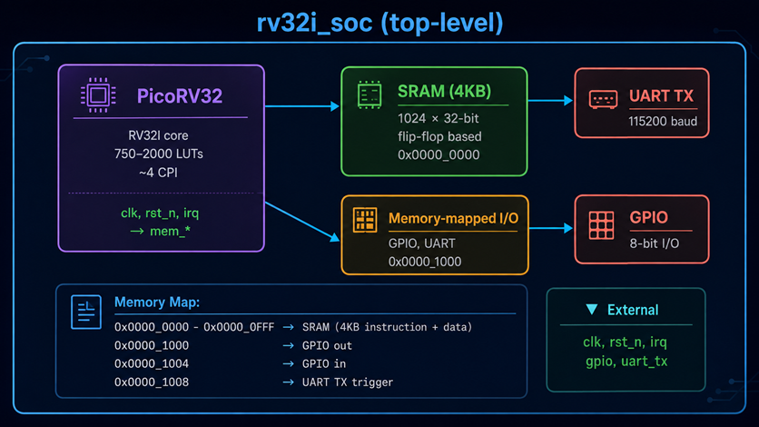

# 🛠️ Project: RV32I Chip

ออกแบบและ Implement RISC-V SoC ด้วย LibreLane + IHP SG13G2 + PicoRV32

4–6 ชั่วโมง · Intermediate · Tape-out-ready GDSII

**Stack:** LibreLane 3.0.3 · IHP SG13G2 (130nm) · PicoRV32 RV32I · Open Source · Apache 2.0

## 🎯 สิ่งที่คุณจะได้

#### 🏗️ RV32I SoC

PicoRV32 core + 4KB SRAM + GPIO + UART TX

#### 📐 Tape-out GDSII

Layout ที่ผ่าน DRC, LVS, Antenna บน SG13G2

#### 📊 Sign-off Reports

Timing, Power, Area, IR-drop ครบทุก corner

#### 📦 MPW-ready

เตรียมส่ง IHP MPW shuttle หรือ Tiny Tapeout

## 🧰 Toolchain

- **LibreLane 3.0.3** — RTL-to-GDSII flow
- **Yosys 0.41+** — Synthesis
- **OpenROAD** — P&R + STA
- **OpenRCX** — Parasitic extraction
- **OpenSTA** — Static timing
- **KLayout** — DRC, XOR, density
- **Magic VLSI** — DRC, LVS
- **Netgen** — LVS
- **IHP SG13G2 PDK** — 130nm SiGe BiCMOS
- **PicoRV32** — RV32I CPU core

## 🏛️ Architecture

    Architecture rv32i_soc (top-level)
   

## 📋 Step-by-step Flow

#### 1 · ติดตั้ง Environment

ติดตั้ง Ubuntu packages, Nix, LibreLane 3.0.3, IHP SG13G2 PDK, RISC-V toolchain

`git clone https://github.com/librelane/librelane.git && cd librelane && nix-shell`

#### 2 · Clone PicoRV32 + Template

ดึง source code ของ PicoRV32 และใช้ IHP SG13G2 LibreLane template

`git clone https://github.com/IHP-GmbH/ihp-sg13g2-librelane-template.git`

#### 3 · ออกแบบ Top-level SoC

เขียน `rv32i_soc.v` ที่รวม PicoRV32 + SRAM wrapper + UART TX + GPIO

กำหนด memory map 4KB SRAM + 4KB I/O

#### 4 · เขียน config.yaml

ตั้งค่า `DESIGN_NAME`, `CLOCK_PORT`, `VERILOG_FILES`, `DIE_AREA`, ฯลฯ

เลือก `SYNTH_STRATEGY: AREA 0`, `FP_CORE_UTIL: 45`

#### 5 · รัน LibreLane Flow

รัน RTL → GDSII แบบ no-human-in-the-loop

`librelane --pdk ihp-sg13g2 flow/librelane/config.yaml`

#### 6 · ตรวจสอบผลลัพธ์

เปิดดู layout ใน OpenROAD/KLayout, ตรวจ WNS/TNS/DRC/LVS/Antenna

`librelane --last-run --flow OpenInKLayout`

#### 7 · Optimize & Debug

ปรับ CLOCK_PERIOD / FP_CORE_UTIL / pinout แล้วรันใหม่

แก้ violations จน DRC = 0, LVS = 0, WNS ≥ 0

#### 8 · Sign-off และ Tape-out

เก็บ final GDS + reports → ส่ง IHP MPW หรือ Tiny Tapeout shuttle

รอ die ~3-4 เดือน

## ⚡ Quick Commands Cheatsheet

### 🔧 Setup

    # Nix
    git clone https://github.com/librelane/librelane.git
    cd librelane && git checkout 3.0.3
    nix-shell
    librelane --smoke-test

    # pip + Docker
    export PDK=ihp-sg13g2
    export PDK_ROOT=~/ttsetup/pdk
    export LIBRELANE_TAG=3.0.3
    pip install librelane==$LIBRELANE_TAG

    # RISC-V toolchain
    git clone https://github.com/YosysHQ/picorv32.git
    cd picorv32 && make -j$(nproc) build-riscv32i-tools

### 🚀 Run Flow

    # Full Classic flow
    librelane --pdk ihp-sg13g2 flow/librelane/config.yaml

    # Chip flow (มี pad ring)
    librelane --pdk ihp-sg13g2 --flow Chip flow/librelane/config.yaml

    # Resume จาก step ที่ fail
    librelane --pdk ihp-sg13g2 config.yaml --from openroad.place

    # Run แค่ synthesis
    librelane --pdk ihp-sg13g2 config.yaml \
        --from yosys.synthesis --to yosys.synthesis

### 👀 Visualization

    # OpenROAD GUI
    librelane --pdk ihp-sg13g2 config.yaml --last-run --flow OpenInOpenROAD

    # KLayout
    librelane --pdk ihp-sg13g2 config.yaml --last-run --flow OpenInKLayout

    # Reports
    cat runs/RUN_*/06-final/cts.min.slack.rpt
    cat runs/RUN_*/06-final/magic.drc.rpt
    cat runs/RUN_*/06-final/netgen.lvs.rpt

### 🛠️ Manual PDK

    git clone --branch dev --recurse-submodules \
        https://github.com/IHP-GmbH/IHP-Open-PDK.git
    cd IHP-Open-PDK
    export PDK_ROOT="$(pwd)"
    librelane --pdk ihp-sg13g2 --pdk-root $PDK_ROOT --manual-pdk config.yaml

## ⚙️ Key Configuration Parameters

| Parameter                       | Default         | คำอธิบาย                                            |
|---------------------------------|-----------------|----------------------------------------------------|
| `DESIGN_NAME`                   | —               | Top-level module name                              |
| `CLOCK_PORT`                    | clk             | ชื่อ clock port                                      |
| `CLOCK_PERIOD`                  | —               | ระยะเวลา clock (ns) — 20 = 50 MHz                  |
| `VERILOG_FILES`                 | —               | List ของ source files                              |
| `FP_CORE_UTIL`                  | 50              | Core utilization (%)                               |
| `PL_TARGET_DENSITY_PCT`         | FP_CORE_UTIL+10 | Placement target density                           |
| `SYNTH_STRATEGY`                | AREA 0          | AREA 0, AREA 1, DELAY 0, DELAY 1, DELAY 2, DELAY 3 |
| `MAX_FANOUT_CONSTRAINT`         | —               | Max fanout ต่อ net                                  |
| `CTS_TARGET_SKEW`               | —               | Clock tree target skew (ns)                        |
| `DIE_AREA`                      | —               | Die area (µm): "0 0 1000 1000"                     |
| `CORE_AREA`                     | —               | Core area (µm)                                     |
| `RUN_HEURISTIC_DIODE_INSERTION` | false           | แก้ปัญหา antenna                                     |

## ✅ Sign-off Checklist

| Metric                     | Target    | ไฟล์ที่ตรวจ              |
|----------------------------|-----------|-----------------------|
| WNS (Worst Negative Slack) | ≥ 0 ns    | `cts.min.slack.rpt`   |
| TNS (Total Negative Slack) | = 0 ns    | `cts.min.slack.rpt`   |
| Clock Skew                 | \< 200 ps | `cts.skew.rpt`        |
| DRC violations (KLayout)   | 0         | `klayout.drc.rpt`     |
| DRC violations (Magic)     | 0         | `magic.drc.rpt`       |
| LVS errors                 | 0         | `netgen.lvs.rpt`      |
| Antenna violations         | 0         | `klayout.antenna.rpt` |
| Core utilization           | \< 70%    | `floorplan.stat`      |
| Metal density (per layer)  | 30–70%    | `klayout.density.rpt` |
| IR drop                    | \< 5% VDD | `ir_drop.rpt`         |

## 🩺 Troubleshooting

| อาการ                        | สาเหตุ                | วิธีแก้                                  |
|------------------------------|----------------------|---------------------------------------|
| PDK not found                | ไม่ได้ตั้ง PDK_ROOT      | `export PDK_ROOT=~/.ciel`             |
| nix-shell: command not found | ไม่ได้ติดตั้ง Nix         | ติดตั้ง Nix ก่อน                          |
| undefined module             | VERILOG_FILES ไม่ครบ  | เช็ค `dir::src/*.v`                    |
| DRC: metal spacing           | Routing congestion   | เพิ่ม DIE_AREA หรือลด FP_CORE_UTIL       |
| STA: setup violation         | Critical path ยาว    | เพิ่ม CLOCK_PERIOD หรือ optimize RTL     |
| LVS pin mismatch             | Pin top module ไม่ครบ | ตรวจ pinout.cfg                       |
| Antenna violation            | Gate oxide risk      | `RUN_HEURISTIC_DIODE_INSERTION: true` |
| PicoRV32 trap (sim)          | PROGADDR_RESET ไม่ตรง | แก้ `PROGADDR_RESET` ให้ตรงกับ firmware  |

## 🗺️ Memory Map (default)

    0x0000_0000  ┌──────────────────────┐
                 │  SRAM (4 KB)         │  instruction + data
                 │  1024 × 32-bit       │
    0x0000_0FFF  ├──────────────────────┤
                 │  reserved            │
    0x0000_1000  ├──────────────────────┤
                 │  0x1000: GPIO out    │  WO, [7:0]
                 │  0x1004: GPIO in     │  RO, [7:0]
                 │  0x1008: UART TX     │  WO, [7:0]  trigger
                 │  0x100C: UART RX     │  RO, [7:0]
    0x0000_1FFF  └──────────────────────┘

## ⚠️ Important Notes

**Preview Status:** IHP Open PDK อยู่ในสถานะ preview เท่านั้น ไม่อนุญาตให้ใช้ผลิตจริง — เหมาะสำหรับการศึกษา, วิจัย, และ MPW shuttle **Windows Users:** ใช้ WSL2 เท่านั้น — LibreLane ไม่รองรับ Windows native **Tip:** Run ทีละ step ตอน debug — เร็วกว่า full run มาก  
`librelane ... --from openroad.floorplan` **Tip:** Verify RV32I binary ด้วย `riscv64-unknown-elf-objdump -d firmware.elf` ก่อนใส่ใน memory

## 📁 Output Structure

    runs/
    └── RUN_<timestamp>/
        ├── 01-yosys-synthesis/      # Synthesis artifacts
        │   ├── synthesis.stat
        │   └── synthesis.v
        ├── 02-floorplan/            # Floorplan
        ├── 03-place/                # Placement
        ├── 04-cts/                  # Clock tree
        ├── 05-route/                # Routing
        ├── 06-final/                # ← Final outputs
        │   ├── final.gds             # 🎯 GDSII (tape-out file)
        │   ├── final.lef             # Library Exchange Format
        │   ├── final.def             # Design Exchange Format
        │   ├── final.sdc             # Timing constraints
        │   ├── final.spef            # Parasitics
        │   ├── final.lib             # Liberty timing
        │   ├── cts.min.slack.rpt     # Timing
        │   ├── magic.drc.rpt         # DRC
        │   ├── klayout.drc.rpt       # DRC
        │   ├── netgen.lvs.rpt        # LVS
        │   ├── klayout.antenna.rpt   # Antenna
        │   └── ir_drop.rpt           # Power
        ├── logs/
        │   └── librelane.log
        └── reports/

## 📚 Resources

#### 📘 ตัวอย่างโปรเจกต์

https://github.com/chumnarn/rv32i-ihp-sg13g2-full-chip

#### 📘 LibreLane Docs

librelane.readthedocs.io

#### 📘 IHP Open PDK

ihp-open-pdk-docs.readthedocs.io

#### 📘 IHP SG13G2 Template

github.com/IHP-GmbH/ihp-sg13g2-librelane-template

#### 📘 PicoRV32

github.com/YosysHQ/picorv32

#### 🎥 FOSSi Webinar

OpenLane 2 & LibreLane Updates

#### 🔧 IIC-OSIC-Tools

Docker image รวมเครื่องมือครบ

#### 💬 FOSSi Discord

ชุมชน open-source silicon

#### 💬 Tiny Tapeout

MPW shuttle service

🛠️ Workshop Handbook: RV32I Chip on LibreLane + IHP SG13G2

Last updated: 2026-07-31 · Open Source · Apache 2.0

Happy Taping Out! 🎉
